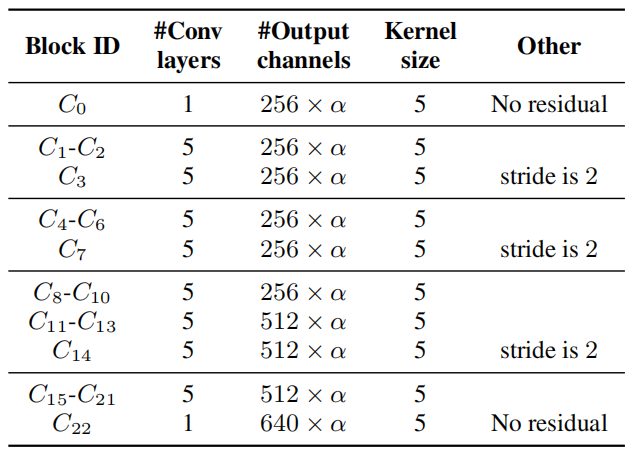
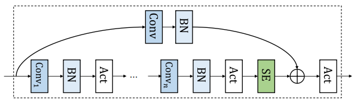
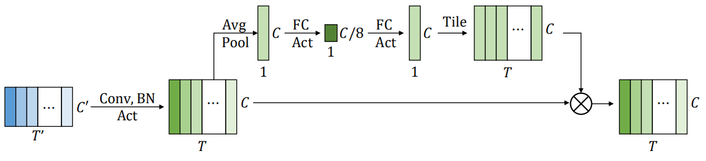
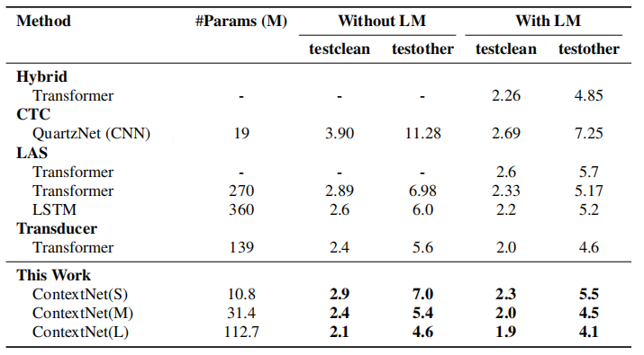
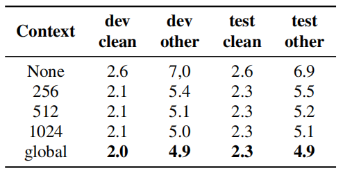
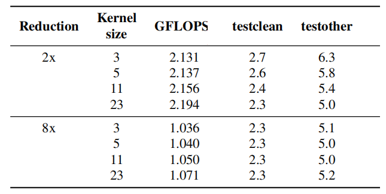
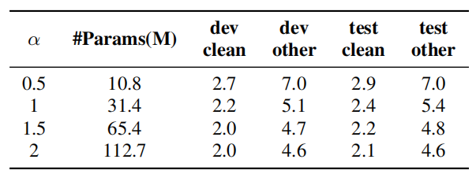

ContextNet is a CNN-RNN transducer model that incorporates global
context information into convolution layers by adding
squeeze-and-excitation modules. ContextNet was proposed by Google in
2020 and published in this paper under the same name: "[ContextNet:
Improving Convolutional Neural Networks for Automatic Speech Recognition
with Global Context](https://arxiv.org/pdf/2005.03191.pdf)". In this
paper, they followed the
[RNN-Transducer](https://anwarvic.github.io/speech-recognition/RNN-T)
framework where they used ContextNet as the encoder and a single layer
LSTM as the decoder.

A major difference between the RNN-based models and a CNN-based models
is the length of the context. In a bidirectional RNN model, a cell in
theory has access to the information of the whole sequence; while in
CNN-based models cover a small window in the time domain based on the
kernel size. Since ContextNet is a fully CNN-model, it uses
squeeze-and-excitation (SE) layers to enhance the global context.

Let the input sequence be $x = \left( x_{1},\ ...x_{T} \right)$. The
ContextNet transforms the original signal $x$ into a high level
representation $h = \left( h_{1},\ ...h_{T'} \right)$, where $T' \leq T$
like so:

$$h = \text{ContextNet}\left( x \right) = C_{K}\left( C_{K - 1}\left( \text{...}C_{1}\left( x \right) \right) \right)$$

Where each $C_{i}$ refers to the $i^{\text{th}}$ convolution block and
$K$ is the total number of layers. In the paper, ContextNet has 23
convolution blocks $\left( C_{0},\ ...C_{22} \right)$. All convolution
blocks have five layers of convolution, except $C_{0}$ and $C_{22}$,
which only have one layer of convolution each as shown below in the
following table:

    

> **Note:**\
α is a hyper-parameter that controls the scaling of our model.
Increasing α when α \> 1 increases the number of channels of the
convolutions, giving the model more representation power with a larger
model size.

Convolution Block
-----------------

As shown in the following figure, a convolution block $C_{i}$ contains a
number of convolutions $Conv()$, each followed by batch normalization
$BN()$ and swish activation $Act()$. A squeeze-and-excitation $SE()$
block operates on the output of the last convolution layer. A skip
connection with projection $Proj()$ is applied on the output of the
squeeze-and-excitation block.

    

Which can be described in the following mathematical formula:

$$C\left( x \right) = \text{Act}\left( \text{SE}\left( f^{m}\left( x \right) \right) + \text{Proj}\left( x \right) \right)$$

$$f\left( x \right) = \text{Act}\left( \text{BN}\left( \text{Conv}\left( x \right) \right) \right)$$

From the previous figure/formula, we can see that the convolution block
in ContextNet consists of the following components:

-   <u><strong>Convolution Function:</strong></u>\
    ContextNet uses [depthwise separable
    convolution](https://anwarvic.github.io/speech-recognition/TDS_Conv),
    because such a design achieves better parameter efficiency without
    impacting accuracy. For simplicity, they used the same kernel size
    on all depthwise convolution layers in the network.

-   <u><strong>Swish Activation:</strong></u>\
    ContextNet uses swish function with $\beta = 1$ defined below; which
    was consistently better than ReLU:

$$A\text{ct}\left( x \right) = x.\sigma\left( \beta x \right) = \frac{x}{1 - e^{- \beta x}}$$

-   <u><strong>Squeeze-and-excitation Layer:</strong></u>\
    SE Layer or squeeze-and-excitation layer was first introduced in
    "[Squeeze-and-Excitation
    Networks](https://arxiv.org/pdf/1709.01507.pdf)" paper published
    in 2017. It got its name because it squeezes a sequence of local
    feature vectors into a single global context vector, broadcasts this
    context back to each local feature vector, and merges the two via
    multiplications as illustrated below:

    

        
    

    -   First, it performs global average pooling on the input
        $x \in \mathbb{R}^{T \times C}$ to form
        $\overline{x} \in \mathbb{R}^{C}$: where $T$ is the total
        number of time-steps in the earlier block and $C$ is the
        number of channels:

    $$\overline{x} = \frac{1}{T}\sum_{t = 1}^{T}x_{t}$$

    -   Then, it transforms $\overline{x}$ into a global channel-wise weight
        $\theta\left( x \right) \in \mathbb{R}^{C}$ using two learnable
        weight matrices: $W_{1} \in \mathbb{R}^{C \times \frac{C}{8}}$ and
        $W_{2} \in \mathbb{R}^{\frac{C}{8} \times C}$, and two learnable
        bias vectors: $b_{1} \in \mathbb{R}^{\frac{C}{8}}$ and
        $b_{2} \in \mathbb{R}^{C}$.

    $$\theta\left( x \right) = \sigma\left( W_{2}\left( \text{Act}\left( W_{1}\overline{x} \right) + b_{1} \right) + b_{2} \right)$$

    -   Finally, it performs an element-wise multiplication (denoted by
        $\circ$) of each time-frame of $x$ using this channel-wise weight
        $\theta\left( x \right)$:

$$\text{SE}\left( x \right) = \theta\left( x \right) \circ x$$

Experiments & Results
---------------------

Experiments were conducted on the Librispeech dataset which consists of
970 hours of labeled speech and an additional text only corpus for
building language model. They used a $25ms$ window with a stride of
$10ms$ to extract 80 dimensional filter-banks as features.

To train ContextNet, they used the Adam optimizer with learning rate
with 15k warm-up steps and a peak learning rate of $0.0025$. An L2
regularization with $10^{- 6}$ weight is also added to all the trainable
weights in the network. For the decoder, they used a single layer LSTM
as decoder with input dimension of 640. Variational noise is introduced
to the decoder as a regularization.

Also, they used
[SpecAugment](https://anwarvic.github.io/speech-recognition/SpecAugment)
as an augmentation method with mask parameter ($F = 27$), and ten time
masks with maximum time-mask ratio ($p_{S} = 0.05$), where the maximum
size of the time mask is set to $p_{S}$ times the length of the
utterance. Time warping was not used.

For language model, they used a 3-layer LSTM with width 4096 trained on
the LibriSpeech language model corpus with the LibriSpeech960h
transcripts added, tokenized with the 1k WPM (WordPiece Model) built
from LibriSpeech 960h. The LM weight $\lambda$ was tuned on the dev-set
via grid search.

The following table shows summarizes the evaluation results as well as
the comparisons with a few previously published systems. In the table,
we can see three different configuration of ContextNet; they all have
the same architecture and only differ in $\alpha$ whose value is
$\left\\{ 0.5,\ 1,\ 2 \right\\}$ for the small, medium and large
ContextNet.

    

The results suggest improvements of ContextNet over previously published
systems. ContextNet(L) outperforms the previous SOTA by 13% relatively
on test-clean and 18% relatively on test-other. Our scaled-down model,
ContextNet(S), also shows an improvement over
[QuartzNet](https://anwarvic.github.io/speech-recognition/QuartzNet),
with or without a language model. Finally, ContextNet(M) only has 31M
parameters and achieves similar WER compared with much larger systems.

Ablation
--------

To validate the effectiveness of different components of the ContextNet
architecture, they performed an ablation study on how these different
components affects the WER on LibriSpeech; where they used ContextNet
with $\alpha = 1.25$ and without SE layers as a baseline.

-   **SE Context:** They invested different context sizes by controlling
    the size of the pooling window. They tried window size of 256, 512
    and 1024 on all convolutional blocks. The results -shown below-
    shows that performance increases as the length of the context window
    increases.

    

-   **Kernel Size and Down-sampling:** They tried different kernel sizes
    in two different configuration (2x: half the ContextNet size, and
    8x: one-eighth the ContextNet size) and the results show that
    down-sampling introduces significant saving in the number of FLOPS.
    Moreover, it actually benefits the accuracy of the model slightly.

    

-   **Model's Width:** They tried different values for which increases
    the width of the model. the following table demonstrates the good
    trade-off between model size and WER of ContextNet.

    

