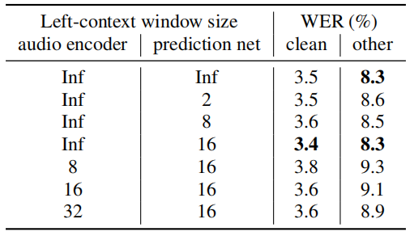

ConvT-Transducer stands for "Conv-Transformer Transducer" which is a
[Transducer](https://anwarvic.github.io/speech-recognition/RNN-T)-based
streamable automatic speech recognition (ASR) system created by Huawei
Noah's Ark Lab in 2020 and published in their paper: [Conv-Transformer
Transducer: Low Latency, Low Frame Rate,
Streamable](https://arxiv.org/pdf/2008.05750.pdf). The original
[Transformer](https://anwarvic.github.io/machine-translation/Transformer)
architecture, with encoder-decoder architecture, is only suitable for
offline ASR as it relies on a bidirectional attention mechanism. To make
the
[Transformer](https://anwarvic.github.io/machine-translation/Transformer)
suitable for streaming ASR, they applied the following modifications:

-   They used a unidirectional Transformer which doesn't require any
    future context.

-   But future context is important to the speech recognition
    performance, that's why they used interleaved convolution layers to
    model these future context.

-   To reduce computation cost, they gradually downsampled the acoustic
    input, also with the use of interleaved convolution layers.

-   They limited the length of history context in self-attention to
    maintain constant computation cost for each decoding step.

> **Note to the Reader:**\
A brush-up on the
[Transducer](https://anwarvic.github.io/speech-recognition/RNN-T)
architecture is much needed before going on with this article.

Architecture
------------

In most of previous works in
[Transducer](https://anwarvic.github.io/speech-recognition/RNN-T)
framework, transcription network (encoder) and prediction network
(decoder) are composed of
[RNN](https://anwarvic.github.io/language-modeling/RNN). However, other
types of networks can be used as well. For example, the
[Conformer](https://anwarvic.github.io/speech-recognition/Conformer')
paper used Conformer as an encoder and a unidirectional LSTM as a
decdoer. Same happens in the
[ContextNet](https://anwarvic.github.io/speech-recognition/ContextNet)
and
[T-T](https://anwarvic.github.io/speech-recognition/Transformer_Transducer)
papers where they used ContextNet and Transformer as encoders
respectively while both used LSTM as a decoder.

In this part, we are going to talk about the three different components
of the Conv-Transformer Transducer:

### Encoder

In the Conv-Transformer Transducer, the audio encoder is composed of
three blocks as shown in the following figure. Each block is composed of
three convolution layers followed by unidirectional Transformer.
Unidirectional Transformer is similar to encoder of the original
Transformer, except that self-attention is masked, preventing the
self-attention from attending to subsequent positions beyond current
position.

    

> **Note:**\
ConvND-BN-RELU denotes N-Dimensional convolution layers followed by
batch normalization and ReLU activation. For convolution layers, $F$
denotes number of filters, $S$ denotes the value of stride, $C$ denotes
number of output channels. For Transformer, $L$ denotes number of
layers, $N$ denotes number of heads, $\text{DH}$ denotes dimension of
each head, $\text{DM}$ denotes input and output dimension of
self-attention layers and feed-forward network (FFN) layers, $\text{DF}$
denotes dimension of intermediate hidden layer in the FFN.

As mentioned earlier, the interleaved convolution layers before
Transformer in each block. are used to model furture context. In this
3-block setting, the size of look-ahead window is $140\ ms$, which is
acceptable in streaming speech recognition. The size of look-ahead
window required by current input frame is illustrated in the following
figure where input and output of each block are represented by
<u><strong>squares</strong></u>, convolution layers are represented by
<u><strong>circles</strong></u>, and skipped activations are represented with
dashed outline.

    

Also, they downsampled the input representation with the convolution
layers stride. For example, the second convolution layer of each block
uses a stride of $2$ along time dimension. With an input frame rate of
$10\ ms$, the frame rate becomes $20\ ms$ in the first block, 40 ms in
the second block, and finally 80 ms in the third block. According to the
paper, this progressive downsampling scheme caused no loss in accuracy.

### Decoder

In the Conv-Transformer Transducer, the prediction network (or decoder) is
illustrated in the following figure. As shown in the figure, it consists of
three blocks:

-   An embedding layer that converts previously predicted non-blank
    labels into vector representations.

-   A linear layer that projects the embedding vectors to match input
    dimension of unidirectional Transformer layers.

-   A unidirectional Transformer.

    

### Joint Network

The last network in any
[Transducer](https://anwarvic.github.io/speech-recognition/RNN-T) model
is the joint network. In this paper, they used a fully-connected
feed-forward neural network with single hidden layer. There are 512
units in the hidden layer, with Rectifified Linear Unit (ReLU) as
activation function. The outputs of audio encoder and prediction network
(decoder) are concatenated and used as input of joint network.

Experiments & Results
---------------------

Experiments were performed with the LibriSpeech dataset. All the
Conv-Transformer Transducer models were trained using NovoGrad as an
optimizer. The learning rate is warmed up from $0$ to $0.01$ in the
first $10k$ steps, then is decayed to $5 \times 10^{- 6}$ in the
following $200k$ steps polynomially. For acoustic features, they used
128-dimensional log-mel filterbank, calculated with $20\ ms$ window and
$10\ ms$ stride. For textual features, they used $4k$ subwords generated
from training transcripts of LibriSpeech using SentencePiece. To avoid
overfitting, they used multiple techiniques:

-   They used additive Gaussian noise.

-   They applied speed perturbation in time domain.

-   They used SpecAugment, but without time-warping (since speed
    perturbation is already used).

-   Transformer layers are regularized with $10\%$ dropout.

The WER scores of this models with other models on LibriSpeech
test-clean and test-other are reported in the following table:

    

As we can see ConvT-T is achieving the lowest WER on both test-clean
and test-other while operating with fewer parameters, smaller
look-ahead window, and lower frame rate; compared to other models
such as TDNN-LSTM model provided by Kaldi, [Transformer
Transducer](https://anwarvic.github.io/speech-recognition/Transformer_Transducer)
(T-T), a hybrid model with Transformer AM.

> **Note:**\
HFR ConvT-T is the same as ConvT-T, the only difference is that it
was trained with half the frame rate. **ConvT-T** was trained on
$80\ ms$ frame rate while **HFR ConvT-T** was trained on $40\ ms$.
This was done by setting the stride to 1 instead of 2 in the second
convolution layer of the third block. As this model requires more
memory, we train the 40-ms model with only half of the original
batch size, but with twice more steps to maintain the same number of
epochs. As shown in Table 2, the performance difference between the
40-ms model and the 80-ms model is insignificant.

Later in the paper, they performed multiple experiments to analyze
effects of varying the number of Transformer layers over different
blocks of various frame rates. The results are shown in following
table:

    

They further evaluated the effects of limiting the amount of history
context (left-context) in self-attention of Transformer layers. The
results are shown in following table:

    

