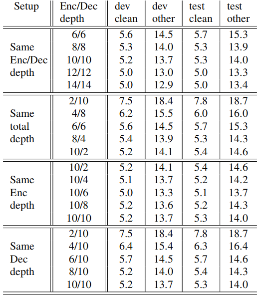

Recently,
[Transformer](https://anwarvic.github.io/machine-translation/Transformer)
architecture has been shown to perform very well for neural machine
translation and many other NLP tasks. There has been recent research
interest in using transformer networks for end-to-end ASR both with CTC
loss (e.g [SAN-CTC](https://arxiv.org/pdf/1901.10055.pdf)) and with
encoder-decoder architecture (e.g
[Speech-Transformer](https://anwarvic.github.io/speech-recognition/Speech_Transformer)).
In this paper "[Transformers with convolutional context for
ASR](https://arxiv.org/pdf/1904.11660)" published in 2019, researchers
from FAIR try to adapt the
[Transformer](https://anwarvic.github.io/machine-translation/Transformer)
architecture to the speech recognition task by replacing the positional
embedding in the architecture with convolution network.

See, positional embedding was added to the Transformer architecture to
model word order in the machine translation task. However, it is not
suitable for audio data and that's why FAIR researchers have proposed to
use 2-D convolutional layers over input speech features in the encoder,
and by 1-D convolutional layers over previously generated outputs in the
decoder. The official code for this paper can be found in the FairSeq
repository:
[fairseq/speech\_recognition](https://github.com/facebookresearch/fairseq/tree/main/examples/speech_recognition).
And the full architecture of the proposed model can be seen in the
following figure:

    

Convolutional Context
---------------------

The encoder architecture to the proposed model is exactly the same as
the
[Transformer](https://anwarvic.github.io/machine-translation/Transformer)'s
encoder. The only difference is the usage of 2D convolutional layers
with layer norms and ReLU instead of the of the positional encodings.
Each convolutional block contains $K$ convolutional layers followed by a
2-D max pooling layer. According to the paper, using a relatively deep
encoder is critical for getting good performance.

For the decoder, they used 1-D convolutions over embeddings of
previously predicted words with its end point at the current time step.
Very similar to the decoder masked attention that makes sure that
self-attention is only running over current and previous time steps to
respect the auto-regression nature of the decoder output generation.

Experiments
-----------

Experiments were performed on the Librispeech dataset. Input speech was
represented as 80-D log mel-filterbank coefficients plus three
fundamental frequency features computed every $10ms$ with a $25ms$
window. For subword tokenization, they used 5k "unigram" subword target
units learned by the [Sentence
Piece](https://github.com/google/sentencepiece) package with full
coverage of all training text data. The standard convolutional
tranformer baseline model used in most experiments has the following
configuration:

-   <u><strong>Encoder:</strong></u>\
    Encoder has two 2-D convolutional blocks, each with
    two conv. layers with kernel size=3, max-pooling kernel=2. The first
    block has 64 feature maps while the second has 128. It has 10
    encoder transformer blocks all with dim=1024, 16 heads, a linear
    layer size=2048 with ReLU activation.

-   <u><strong>Decoder:</strong></u>\
    Decoder has three 1-D convolutional layers each with
    kernel size=3, and no max pooling and the input word embedding
    dim=512. It also has 10 decoder transformer blocks each with
    encoder-side multihead attention.

For regularization, they used a single dropout rate of $15\%$ across
all blocks. For model optimization, they used the AdaDelta algorithm
with fixed learning rate of $1.0$ and gradient clipping at $10.0$.
All experiments were run for $80$ epochs, then results were reported
by averaging the last $30$ checkpoints without any external language
model and with beam size of 5 during inference.

The following table compares the proposed Convolutional Transformer
model to other previously published results on the Librispeech
dataset. Compared to models with no external LM, the proposed model
brings $12\%$ to $16\%$ relative WER reduction on the acoustically
challenging "dev other" and "test other" subsets of Librispeech
which suggests that the convolutional tranformer indeed learns
long-range acoustic characteristics of speech.

    

Ablation Study
--------------

First, they studied the performance of Convolutional Transformer
compared to alternative architectures and positional encoding schemes.
The following table shows the WER on different LibriSpeech sets where:

-   **First row:** shows the Convolutional Transformer baseline model.

-   **Second row:** shows the same model as the "first row" but after
    replacing the 1-D convolutional context in the decoder with
    sinusoidal positional embedding.

-   **Third row:** shows a model where sinusoidal and convolutional
    position embedding were combined.

-   **Fourth row:** shows the baseline model where the encoder has only
    one attention layer.

-   **Fifth row:** shows the baseline model but after increasing the
    number of attention heads to the double.

-   **Sixth row:** shows the baseline model but after Increasing the
    intermediate ReLU layer in each encoder and decoder layer.

    

The table shows that replacing the 1-D convolutional context in the
decoder with sinusoidal positional embedding shows inferior WER
performance. And combining sinusoidal with convolutional embedding
doesn't show any gains which indicates that using convolutional
embedding was just enough. Also, it shows that increasing the
intermediate ReLU layer improves the overall WER.

To better understand these results, they have studied the effects of
different hyperparameter settings on the performance. The following
table shows the effect of different decoder convolutional context
sizes spread over different depths:

    

As shown in the table, the best performance comes from using wider
context that is built over multiple convolutional layers. However,
the decoder is able to get reasonable WER even with a context of
just 3 words as input to the transformer layers. To check the effect
of fixing the encoder depth while changing the decoder depth and
vice versa, they have trained multiple models with different depths
where the total sum of encoder and decoder depths, as well as using
same depth on both sides all the way up to 14 transformer layers.
The following table shows that having a deeper decoder, although not
as critical, showed better overall performance.

    

