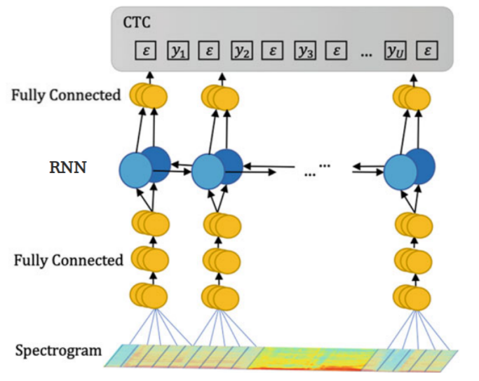

Deep Speech is a well-optimized end-to-end RNN system for speech
recognition created by Baidu Research in 2014 and published in their
paper: [Deep Speech: Scaling up end-to-end speech
recognition](https://arxiv.org/pdf/1412.5567.pdf). Deep Speech is
significantly simpler than traditional speech systems, which rely on
laboriously engineered processing pipelines; these traditional systems
also tend to perform poorly when used in noisy environments.

Acoustic Model
--------------

Deep Speech is an end-to-end system which means that it doesn't need a
phoneme dictionary like traditional systems. It was trained to produce
transcription by predicting a sequence of character probabilities from
spectrogram figures while
[CTC](https://anwarvic.github.io/speech-recognition/CTC) being used as
an objective function:

    

Give a training set
$X = \left\\{ \left( x^{\left( 1 \right)},y^{\left( 1 \right)} \right),\left( x^{\left( 2 \right)},y^{\left( 2 \right)} \right)\text{...} \right\\}$
where each utterance $x^{\left( i \right)}$ is a time-series of length
$T^{\left( i \right)}$ where every time-slice $x_{t}^{\left( i \right)}$
is a vector of audio features extracted from spectrogram frames of size
$t$ along with context of $C \in \left\\{ 5,7,9 \right\\}$ frames on each
side.

    

The Deep Speech architecture is composed of five hidden layers:

-   The first three layers are fully connected layers where $W^{(l)}$
    and $b^{(l)}$ are the learnable weights and bias of layer $l$
    respectively.

$${h_{t}}^{(l)} = g\left( W^{(l)}{h_{t}}^{(l - 1)} + b^{(l)} \right)$$

-   The fourth layer is one bi-directional RNN where $h^{(f)}$ is the
    forward hypothesis and $h^{(b)}$ is the backward hypothesis; both
    are added together to get one hypothesis:

$$h_{t}^{(f)} = g\left( W^{(4)}h_{t}^{(3)} + W_{r}^{(f)}h_{t - 1}^{(f)} + b^{(4)} \right)$$

$$h_{t}^{(b)} = g\left( W^{(4)}h_{t}^{(3)} + W_{r}^{(b)}h_{t - 1}^{(b)} + b^{(4)} \right)$$

$$h_{t}^{(4)} = h_{t}^{(f)} + h_{t}^{(b)}$$

-   The last layer is also a fully connected layer:

$${h_{t}}^{(5)} = g\left( W^{(5)}{h_{t}}^{(4)} + b^{(5)} \right)$$

-   The output layer is a standard Softmax function that yields the
    predicted character probabilities for each time slice $t$ and
    character $k$ in the alphabet:

$$h_{t,k}^{(6)} = {\widehat{y}}_{t,k} = \mathbb{P}\left( c_{t} = k \middle| x \right) = \frac{\exp\left( W_{k}^{(6)}h_{t}^{(5)} + b_{k}^{(6)} \right)}{\sum_{j}^{}{\exp\left( W_{j}^{(6)}h_{t}^{(5)} + b_{j}^{(6)} \right)}}$$

All activation functions used in Deep Speech are Rectified Linear Unit
(ReLU) activation functions clipped at $20$ as shown in the following
formula:

$$g(z) = \min\left( \max\left( 0,\ z \right),\ 20 \right)$$

> **Note:**\
They didn't use LSTM cells instead of RNN cells because the latter is
faster as it requires less computation.

Once we have computed a prediction for
$\mathbb{P}\left( c_{t} \middle| x \right)$, we compute the
[CTC](https://anwarvic.github.io/speech-recognition/CTC) loss
$\mathcal{L}\left( \widehat{y},\ y \right)$ to measure the error in
prediction. Remember that the goal of Deep Speech is to convert an input
sequence $x$ into a sequence of character probabilities for the
transcription $y$, with
${\widehat{y}}_{t,} = \mathbb{P}\left( c_{t} \middle| x \right)$, where
$c_{t} \in \left\{ a,b,\ \text{...}\ z,space,\ apostrophe,\ blank \right\}$.

Language Model
--------------

One of the exciting components of the Deep Speech work is that the RNN
model can learn a light character-level language model during the
training procedure, producing "readable" transcripts even without a
language model. The errors that appear tend to be phonetic misspellings
of words, such as "Bostin" instead of "Boston" or "arther" instead of
"are there".

In practice, these misspellings are hard to avoid. Therefore, a
character N-gram language model was integrated to the Deep Speech
system. So, we need to find the sequence of characters
$c = \left\\{ c_{1},\ c_{2}\text{...} \right\\}$ that is most probable
according to both the acoustic output
$\mathbb{P}\left( c \middle| x \right)$ and the character N-gram
language model output $\mathbb{P}_{\text{lm}}(c)$:

$$Q(c) = log\left( \mathbb{P}\left( c \middle| x \right) \right) + \alpha\ \log\left( \mathbb{P}_{\text{lm}}(c) \right) + \beta\ word\_ count(c)$$

Where both $\alpha$ and $\beta$ are tunable parameters that control the
trade-off between the acoustic model (Deep Speech) and the language
model. In the paper, they maximize this objective using a highly
optimized beam search algorithm, with a typical beam size
$\in \left\lbrack 1000,8000 \right\rbrack$.

> **Note:**\
In the paper, they used a 5-gram language model trained on 220 million
phrases of the [Common Crawl](https://commoncrawl.org), selected such
that at least 95% of the characters of each phrase are in the alphabet.
Only the most common 495,000 words are kept, the rest remapped to an
UNKNOWN token.

Training Date
-------------

To train the Deep Speech model, they have collected an extensive dataset
consisting of 5000 hours of read speech from 9600 speakers combined with
some publicly data as shown in the following table:

    

And ensure that the "Lombard Effect" (speakers actively change the pitch
or inflections of their voice to overcome noise around them) is
represented in their training data (Baidu), they played loud background
noise through headphones worn by a person as they record an utterance.

Also to improve the model's performance in noisy environments, they
expanded the training data by creating synthetic data. For example, if
we have a speech audio track $x^{\left( i \right)}$ and a "noise" audio
track $\xi^{\left( i \right)}$, then we can simulate an audio captured
in a noisy environment by adding them together
${\widehat{x}}^{\left( i \right)} = x^{\left( i \right)} + \xi^{\left( i \right)}$.
And to ensure a good match between synthetic data and real data, they
rejected any candidate noise clips where the average power in each
frequency band differed significantly from the average power observed in
real noisy recordings.

> **Notes:**
>
> - For this approach to work well, we need many hours of unique noise
    tracks spanning roughly to the same length as the clean speech. We
    can't use less than that since it may become possible for the
    acoustic model to memorize the noise tracks. To overcome this, they
    used multiple short noise tracks and treated them as separate
    sources of noise before superimposing all of them:
    ${\widehat{x}}^{\left( i \right)} = x^{\left( i \right)} + \xi_{1}^{\left( i \right)} + \xi_{2}^{\left( i \right)} + ...$
>
> - The noise environments included were the following: a background
    radio or TV; washing dishes in a sink; a crowded cafeteria; a
    restaurant; and inside a car driving in the rain.

Experiments
-----------

To train Deep Speech, they used NAG as Gradient descent optimizer with
momentum factor = 0.99. For regularization, they used 5%-10% dropout
rate all layers except the recurrent one. In the paper, they performed
two sets of experiments.

-   First, to compare Deep Speech with earlier models, they trained two
    versions of Deep Speech: **Deep Speech SWB** which was trained on
    just Switchboard dataset and **Deep Speech SWB + FSH** which was
    trained on Switchboard and Fisher datasets. And tested them on
    Switchboard, CallHome and Full set. The following table shows that
    Deep Speech achieves state-of-the-art performance.

    

-   Second, To evaluate Deep Speech on noisy environment, they
    constructed their own evaluation set of 100 noisy and 100 noise-free
    utterances from 10 speakers. They trained Deep Speech on all
    available data; and compared it to several commercial speech systems
    such as: [wit.ai](https:://wit.ai), Google Speech API, Bing Speech,
    and Apple Dictation. The following table shows that Deep Speech
    performs way better than other commercial systems:

    

