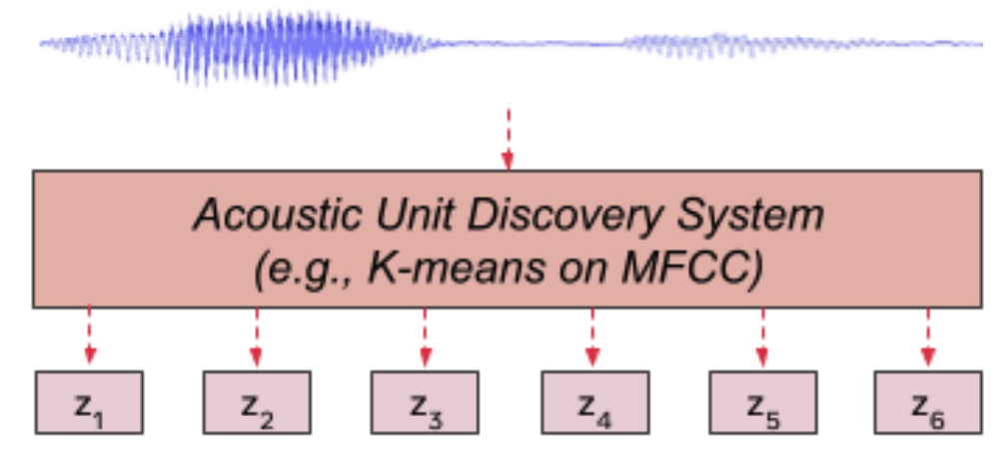

HuBERT stands for "Hidden-unit BERT" which is an ASR system trained
using a novel self-supervised learning scheme that made HuBERT either
matches or improves upon the state-of-the-art [wav2vec
2.0](https://anwarvic.github.io/speech-recognition/wav2vec_2)
performance. HuBERT was proposed by FAIR in 2021 and published in this
paper under the same name: "[HuBERT: Self-Supervised Speech
Representation Learning by Masked Prediction of Hidden
Units](https://arxiv.org/pdf/2106.07447.pdf)". The official code for
HuBERT can be found as part of Fairseq framework on GitHub:
[fairseq/hubert]( https:/github.com/pytorch/fairseq/tree/master/examples/hubert).

In the "[A nonparametric Bayesian Approach to Acoustic Model
Discovery](http://aclanthology.lst.uni-saarland.de/P12-1005.pdf)" paper,
researchers have found out that the hidden units of simple clustering
algorithms such as k-means exhibit non-trivial correlation with the acoustic
units. So, the idea of this paper is to pre-train HuBERT to be as good as
k-means at clustering acoustic units before further fine-tune it on speech
recognition tasks.

    

The self-supervised training scheme (seen in the previous figure)
consists of two parts:

-   <u><strong>Acoustic Unit Discovery System:</strong></u>\
    An ensemble of k-mean models forming hidden units by clustering
    acoustic units. Let
    $X = \left\lbrack x_{1},\ ...x_{T} \right\rbrack$ denote a speech
    utterance of $T$ frames. The discovered hidden units are denoted
    with
    $h\left( X \right) = Z = \left\lbrack z_{1},\ ...z_{T} \right\rbrack$
    where $z_{t} \in \left\lbrack C \right\rbrack$ is a $C$-class
    categorical variable and $h$ is the cluster model.

-   <u><strong>HuBERT:</strong></u>\
    Which is going to be discussed next.

HuBERT Model
------------

HuBERT follows the same architecture as [wav2vec
2.0](https://anwarvic.github.io/speech-recognition/wav2vec_2) with two
different parts:

-   <u><strong>CNN Encoder:</strong></u>\
    The convolutional waveform encoder generates a feature sequence at a
    $20ms$ framerate for audio sampled at 16kHz (CNN encoder
    down-sampling factor is 320x). The audio encoded features are then
    randomly masked as described in Section II-B.

-   <u><strong>BERT:</strong></u>\
    The encoded features from the CNN Encoder get masked and sent to
    this model which can be considered as an acoustic
    [BERT](https://anwarvic.github.io/language-modeling/BERT). Regarding
    masking, they used the same strategy used for
    [SpanBERT](https://anwarvic.github.io/language-modeling/SpanBERT)
    where $p\%$ of the timesteps are randomly selected as start indices,
    and spans of $l$ steps are masked. And then BERT learns to predict
    the latent features of the unmasked and the masked input equally.

    

In the paper, they considered three different configurations for
HuBERT: BASE, LARGE, and X-LARGE as shown in the following figure.
The first two follow the architectures of [wav2vec
2.0](https://anwarvic.github.io/speech-recognition/wav2vec_2) BASE
and LARGE closely. The X-LARGE architecture expands the model size
to about 1 billion parameters, similar to the size of the
[Conformer](https://anwarvic.github.io/speech-recognition/Conformer)
XXL model. Notice that the waveform encoder is identical for all the
three configurations

    

Pre-training
------------

Let $X = \left\lbrack x_{1},\ ...x_{T} \right\rbrack$ denote a speech
utterance of $T$ frames. And let $M$ denote the set of indices to be
masked for sequence $X$, and $\widetilde{X}$ denote a corrupted version
of $X$ where $x_{t}$ is masked $t \in M$. HuBERT (denoted with $f$)
takes as input the masked sequence $\widetilde{X}$ and outputs a feature
sequence $\left\lbrack o_{1},...\ o_{T} \right\rbrack$.

On the other hand, the Acoustic Unit Discovery System (denoted with $h$)
takes $X$ as an input and outputs hidden units
$h\left( X \right) = Z = \left\lbrack z_{1},\ ...z_{T} \right\rbrack$
where $z_{t} \in \left\lbrack C \right\rbrack$ is a $C$-class
categorical variable (also called "code-word"). To get better results,
an ensemble of $n$ clustering models with different number of clusters
are used: $h^{\left( i \right)}$ where
$i \in \left\\{ 1,\ ...n \right\\}$.

During pre-training, they were trying to minimize the cross-entropy loss
computed over masked and unmasked timesteps as $\mathcal{L}_{m}$ 
and $\mathcal{L}_{u}$ respectively. The final loss is computed as
a weighted sum of the two terms:

$$\mathcal{L} = \alpha\mathcal{L}_{m} + \left( 1 - \alpha \right)\mathcal{L}_{u}$$

$$\mathcal{L}_{m}\left( f;X,M,\left\{ Z^{\left( 1 \right)},\ ...Z^{\left( n \right)} \right\} \right) = \sum_{t \in M}^{}{\sum_{i \in n}^{}{\log\ p_{f}^{\left( i \right)}\left( z_{t}^{\left( i \right)} \middle| \widetilde{X},t \right)}}$$

$$\mathcal{L}_{u}\left( f;X,M,\left\{ Z^{\left( 1 \right)},\ ...Z^{\left( n \right)} \right\} \right) = \sum_{t \notin M}^{}{\sum_{i \in n}^{}{\log\ p_{f}^{\left( i \right)}\left( z_{t}^{\left( i \right)} \middle| \widetilde{X},t \right)}}$$

$$p_{f}^{\left( i \right)}\left( c \middle| \widetilde{X},t \right) = \frac{\exp\left( \text{sim}\left( A^{\left( i \right)}o_{t},\ e_{c} \right)/\tau \right)}{\sum_{c' = 1}^{C}{\exp\left( \text{sim}\left( A^{\left( i \right)}o_{t},\ e_{c'} \right)/\tau \right)}}$$

Where $A$ is the projection matrix appended at the end of HuBERT during
pre-training; a different projection matrix is used for different
cluster model. $e_{c}$ is the embedding for code-word $c$,
$\text{sim}\left( ., . \right)$ computes the cosine similarity between
two vectors, and $\tau$ scales the logit, which is set to $0.1$.

For pre-training, they used the full 960 hours of LibriSpeech audio. To
generate labels for the first iteration of HuBERT pre-training, they ran
k-means clustering with 100 clusters on 39-dimensional MFCC features. In
further iterations, k-means clusters were increased to 500 to generate
better targets.

HuBERT-BASE model was pre-trained for two iterations on the 960 hours of
LibriSpeech audio on 32 GPUs, with a batch size of at most 87.5 seconds
of audio per GPU. The first iteration is trained for 250k steps, while
the second iteration is trained for 400k steps. HuBERT-LARGE and X-LARGE
were pre-trained for one iteration on 60,000 hours of Libri-light audio
on 128 and 256 GPUs, respectively, for 400k steps. The batch sizes are
reduced to 56.25 and 22.5 seconds of audio per GPU due to memory
constraints.

> **Note:**\
After pre-training and during ASR fine-tuning, the projection layer(s)
is removed and replaced with a randomly initialized softmax layer. And
[CTC](https://anwarvic.github.io/speech-recognition/CTC) is used as a
loss function for ASR fine-tuning of the whole model weights except the
convolutional audio encoder, which remains frozen. The target vocabulary
includes 26 English characters, a space token, an apostrophe, and a
special CTC blank symbol.

Experiments
-----------

For all HuBERT configurations, mask span is set to $l = 10$, and
$p = 8\%$ of the waveform were randomly masked. Adam optimizer was used
with $\beta = \left( 0.9,\ 0.98 \right)$, and the learning rate ramps up
linearly from $0$ to the peak learning rate for the first $8\%$ of the
training steps, and then decays linearly back to $0$. The peak learning
rates are $5e^{- 4}$ for HuBERT-BASE, $1.5e^{- 3}$ for HuBERT-LARGE, and
$3e^{- 3}$ for HuBERT X-LARGE.

For decoding, they used wav2letter++ beam search decoder for language
model-fused decoding, which optimizes the following formula where $Y$ is
the predicted text, $\left| Y \right|$ is the length of the predicted
text, and $w_{1}$ and $w_{2}$ denote the language model weight and word
score hyper-parameters which were searched using
[Ax](https://github.com/facebook/Ax) toolkit.

The following table shows pre-trained models which were fine-tuned on
ultra-low resource setup (10 minutes of labeled data). It shows that
HuBERT-BASE and HuBERT-LARGE can achieve lower WER than the
state-of-the-art wav2vec 2.0 BASE and Large respectively.

    

Similar here, the superiority of HuBERT-BASE and HuBERT-LARGE over
wav2vec 2.0 persists across other low-resource setups with different
amounts of fine-tuning, (1-hour and 10-hour) as shown in the following
table:

    

The fine-tuning on 100-hour of labeled data is the only exception to the
rule where HuBERT-LARGE was 0.1% WER higher than wav2vec 2.0 LARGE on
test-clean, and HuBERT-BASE was 0.1% WER higher than wav2vec 2.0 BASE as
shown in the following table:

    

From all four previous tables, we can say that increasing the amount of
labeled data and increasing the model size improve performance. HuBERT
X-LARGE achieves state-of-the-art results over all test sets;
demonstrating the scalability of the self-supervised pre-training method
used with HuBERT.

When fine-tuning HuBERT on all 960 hours of Librispeech, it outperforms
the state-of-the-art supervised and self-training methods and is on par
with the pre-training results. In contrast, it lags behind with
pre-training + self-training; as shown in the following table:

    

