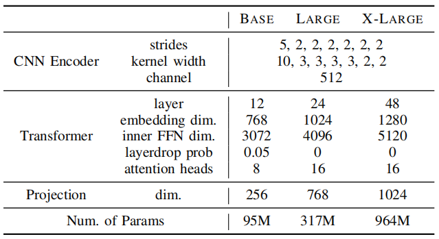

HuBERT stands for "Hidden-unit BERT", which is a
[BERT](https://anwarvic.github.io/language-modeling/BERT)-like model
trained for speech-related tasks. HuBERT utilizes a novel
self-supervised learning method that made its performance either matches
or improves upon the state-of-the-art [wav2vec
2.0](https://anwarvic.github.io/speech-recognition/wav2vec_2)
performance. HuBERT was proposed by FAIR in 2021 and published in this
paper under the same name: "[HuBERT: Self-Supervised Speech
Representation Learning by Masked Prediction of Hidden
Units](https://arxiv.org/pdf/2106.07447.pdf)". The official code for
HuBERT can be found as part of Fairseq framework on GitHub:
[fairseq/hubert]( https:/github.com/pytorch/fairseq/tree/master/examples/hubert).

In the "[A nonparametric Bayesian Approach to Acoustic Model
Discovery](http://aclanthology.lst.uni-saarland.de/P12-1005.pdf)" paper,
researchers have found out that the hidden units of simple clustering
algorithms such as k-means exhibit non-trivial correlation with the
acoustic units. So, the main idea of HuBERT is to pre-train it to be as
good as k-means at clustering acoustic units before further fine-tune it
on speech recognition tasks to learn both acoustic and language features
from input speech.

## Pre-training

HuBERT pre-training is very similar to BERT where you mask some of the
input tokens and train the model to retrieve these missing/masked
tokens. One key challenge for HuBERT is that speech is continuous,
unlike text which is discrete. To overcome this challenge, <u><strong>Acoustic
Unit Discover System</strong></u> was used (as shown in the following
figure) to cluster continuous input speech into discrete units (or
codebooks) that can be masked while pre-training:

    

> **Note:**\
HuBERT pre-training is very similar to
[DiscreteBERT](https://anwarvic.github.io/speech-recognition/Acoustic_BERT)
where both models predict discrete targets of masked regions. However,
there are two crucial differences:
>
> - Instead of taking quantized units as input, HuBERT takes raw
    waveforms as input to pas as much information as possible to the
    Transformer layers.
>
> - Instead of using quantized units from
    [vq-wav2vec](https://anwarvic.github.io/speech-recognition/vq-wav2vec)
    during pre-training, HuBERT uses simple k-means targets which
    achieves better performance.

### Acoustic Unit Discovery System

Let $X = \left\lbrack x_{1},\ ...x_{T} \right\rbrack$ denote a speech
utterance of $T$ frames, the acoustic unit discovery system uses a
clustering algorithm (e.g k-means) on this input features $X$ to cluster
them into a predefined number of clusters $C$. The discovered hidden
units are denoted with $Z = \left\lbrack z_{1},\ ...z_{T} \right\rbrack$
where $z_{t} \in \lbrack C\rbrack$ as shown in the following figure:

    

In the paper, they used the `MiniBatchKMeans` algorithm implemented in the
[scikit-learn](https://scikit-learn.org) package for clustering. And to
improve the clustering quality, they tried two different methods:

-   <u><strong>Cluster Ensembles:</strong></u>\
    An ensemble of clusters can provide complementary
    information to facilitate representation learning. For example, an
    ensemble of k-means models with different codebook sizes can create
    targets of different classes (vowel/consonant).

-   <u><strong>Iterative Refinement of Cluster Assignments:</strong></u>\
    A new generation of clusters can be created using the
    pre-trained model from the earlier generation.

A comparison between these two techniques will be shown later.

### HuBERT Model

HuBERT follows the same architecture as [wav2vec
2.0](https://anwarvic.github.io/speech-recognition/wav2vec_2) with two
different parts:

-   <u><strong>CNN Encoder:</strong></u>\
    The convolutional waveform encoder generates a feature sequence at a
    $20ms$ framerate for audio sampled at $16kHz$ (CNN encoder
    down-sampling factor is $320x$). The audio encoded features are then
    randomly masked.

-   <u><strong>BERT:</strong></u>\
    The encoded features from the CNN Encoder get masked and sent to
    this model which can be considered as an acoustic
    [BERT](https://anwarvic.github.io/language-modeling/BERT). Regarding
    masking, they used the same strategy used for
    [SpanBERT](https://anwarvic.github.io/language-modeling/SpanBERT)
    where $p\%$ of the timesteps are randomly selected as start indices,
    and spans of $l$ steps are masked. And then BERT learns to predict
    the latent features of the unmasked and the masked input equally.

    

In the paper, they considered three different configurations for
HuBERT: BASE, LARGE, and X-LARGE as shown in the following table.
The first two follow the architectures of [wav2vec
2.0](https://anwarvic.github.io/speech-recognition/wav2vec_2) BASE
and LARGE, while the X-LARGE architecture expands the model size to
about 1 billion parameters, similar to the size of the
[Conformer](https://anwarvic.github.io/speech-recognition/Conformer)
XXL model.

    

> **Note:**\
The waveform encoder is identical for all the three configurations.

### Objective 

HuBERT is pre-trained to minimize the cross-entropy loss computed over
masked and unmasked timesteps as $\mathcal{L}_m$ and $\mathcal{L}_u$
respectively. The final loss is computed as a weighted sum of the two
terms with a hyper-parameter $\alpha$:

$$\mathcal{L} = \alpha\mathcal{L}_{m} + (1 - \alpha)\mathcal{L}_{u}$$

$$\mathcal{L}_{m}(f;X,M,Z) = \sum_{t \in M}^{}{\sum_{i \in n}^{}{\log\ p_{f}\left( z_{t} \middle| \widetilde{X},t \right)}}$$

$$\mathcal{L}_{u}(f;X,M,Z) = \sum_{t \notin M}^{}{\sum_{i \in n}^{}{\log\ p_{f}\left( z_{t} \middle| \widetilde{X},t \right)}}$$

$$p_{f}\left( c \middle| \widetilde{X},t \right) = \frac{\exp\left( sim\left( Ao_{t},\ e_{c} \right)/\tau \right)}{\sum_{c' = 1}^{C}{\exp\left( sim\left( Ao_{t},\ e_{c'} \right)/\tau \right)}}$$

Where $A$ is the projection matrix appended at the end of HuBERT during
pre-training; a different projection matrix is used for different
cluster model. $e_{c}$ is the embedding for code-word $c$, $sim(.,\ .)$
computes the cosine similarity between two vectors, and $\tau$ scales
the logit, which is set to $0.1$.

> **Note:**\
After pre-training and during fine-tuning, the projection layer(s) is
removed and replaced with a randomly initialized Softmax layer. And
[CTC](https://anwarvic.github.io/speech-recognition/CTC) is used as a
loss function for ASR fine-tuning of the whole model weights except the
convolutional audio encoder, which remains frozen. The target vocabulary
includes $26$ English characters, a space token, an apostrophe, and a
special CTC blank symbol.

## Experiments

HuBERT-BASE model was pre-trained for two iterations on the $960$ hours
of LibriSpeech audio, with a batch size of at most $87.5$ seconds. The
first iteration is trained for $250k$ steps on $39$-dimensional MFCC
features with k-means clustering of $100$ clusters. The second iteration
is trained for $400k$ steps on $768$-dimensionalfeatures extracted from
the pre-trained HuBERT resulted from the first iteration.

HuBERT-LARGE and X-LARGE were pre-trained for one iteration on $60,000$
hours of Libri-light audio for $400K$ steps. The batch sizes were
reduced to $56.25$ and $22.5$ seconds due to memory constraints.

For all HuBERT configurations, mask span was set to $l = 10$, and
$p = 8\%$ of the waveform were randomly masked. Adam optimizer was used
with $\beta = (0.9,\ 0.98)$, and the learning rate ramps up linearly
from $0$ to the peak learning rate for the first $8\%$ of the training
steps, and then decays linearly back to $0$. The peak learning rates
were $5e^{- 4}$ for BASE, $1.5e^{- 3}$ for LARGE, and $3e^{- 3}$ for
X-LARGE.

For decoding, they used
[wav2letter++](https://github.com/flashlight/wav2letter) beam search
decoder for language model-fused decoding, which optimizes the following
formula where $Y$ is the predicted text, $|Y|$ is the length of the
predicted text, and $w_{1}$ and $w_{2}$ denote the language model weight
and word score hyper-parameters which were searched using
[Ax](https://github.com/facebook/Ax) toolkit:

$$\log{p_{CTC}\left( Y \middle| X \right)} + w_{1}\log{p_{LM}(Y)} + w_{2}|Y|$$

## ASR Results

The following table shows pre-trained models which were fine-tuned on
ultra-low resource setup ($10$-minutes of labeled data). It shows that
HuBERT-BASE and HuBERT-LARGE can achieve lower WER than the
state-of-the-art [wav2vec
2.0](https://anwarvic.github.io/speech-recognition/wav2vec_2) BASE and
Large respectively.

    

Similar here, the superiority of HuBERT-BASE and HuBERT-LARGE over
[wav2vec 2.0](https://anwarvic.github.io/speech-recognition/wav2vec_2)
persists across other low-resource setups with different amounts of
fine-tuning, ($1$-hour and $10$-hour) as shown in the following table:

    

The fine-tuning on $100$-hour of labeled data is the only exception to
the rule where HuBERT-LARGE was $0.1\%$ WER higher than [wav2vec
2.0](https://anwarvic.github.io/speech-recognition/wav2vec_2) LARGE on
test-clean, and HuBERT-BASE was $0.1\%$ WER higher than [wav2vec
2.0](https://anwarvic.github.io/speech-recognition/wav2vec_2) BASE as
shown in the following table:

    

From all four previous tables, we can say that increasing the amount of
labeled data and increasing the model size improve performance. HuBERT
X-LARGE achieves state-of-the-art results over all test sets;
demonstrating the scalability of the self-supervised pre-training method
used with HuBERT.

When fine-tuning HuBERT on all $960$ hours of Librispeech, it
outperforms the state-of-the-art supervised and self-training methods
and is on par with the pre-training results. In contrast, it lags behind
with pre-training + self-training; as shown in the following table:

    

## Clustering Analysis

In this part, we are going to discuss how they analyzed the clustering
capabilities of HuBERT. Given aligned frame-level phonetic labels
$\left\lbrack y_{1},\ ...y_{T} \right\rbrack$ and k-means labels
$\left\lbrack z_{1},\ ...z_{T} \right\rbrack$, the joint distribution
$p_{yz}(i,j)$ can be estimated by counting the occurrences where
$y_{t} = i$ and $z_{t} = j$ divided over the total length $T$ as shown
in the following formula:

$$p_{yz}(i,j) = \frac{\sum_{t = 1}^{T}\left\lbrack y_{t} = i\ \& z_{t} = j\  \right\rbrack}{T}$$

And the marginal probabilities can be computed as the following:

$$p_{z}(j) = \sum_{i}^{}{p_{yz}(i,j)},\ \ \ \ \ \ \ p_{y}(i) = \sum_{j}^{}{p_{yz}(i,j)}$$

These three formula are going to be used to calculate the following
metrics:

-   <u><strong>Clustering Stability:</strong></u>\
    It happens when the clusters assigned don't change by
    increasing the amount of data used. To measure the clustering
    stability, authors proposed a novel metric called "phone-normalized
    mutual information" that measures the clustering quality, where
    higher PNMI means higher quality. If the quality doesn't change by
    changing the input data, this means clustering stability. PNMI can
    be measured using the following formula:

$$PNMI = \frac{\sum_{i}^{}{\sum_{j}^{}{p_{yz}(i,j).\log\frac{p_{yz}(i,j)}{p_{y}(i)p_{z}(j)}}}}{\sum_{i}^{}{p_{y}(i).\log{p_{y}(i)}}}$$

-   <u><strong>Phone Purity:</strong></u>\
    It refers to the frame-level phone accuracy, the higher the value
    the better the clustering is. For example, when a certain phone is
    aligned with multiple clusters, this means that this phone in not
    pure since it represents many clusters. To measure the phone purity,
    authors proposed the following formula:

$$phn\ pur = \frac{\max_{i}{p_{yz}(i,j)}}{p_{z}(j)}$$

-   <u><strong>Cluster purity:</strong></u>\
    It is very similar to phone purity. It refers to the frame-level
    cluster accuracy, the higher the value the better the clustering is.
    To measure the cluster purity, authors proposed the following
    formula:

$$cls\ pur = \frac{\max_{j}{p_{yz}(i,j)}}{p_{y}(i)}$$

## Ablation

In the paper, authors decided to ablate some of the hyper-parameter
choices to better understand its effect. First, they started by
analyzing the clustering stability, then they checked the best layers
for feature extractions, and finally they checked the impact of some of
the hyper-parameters.

### Clustering Stability

To measure the clustering stability, they considered two different
setups:

-   **MFCC:** Uses $39$-dimensional MFCC features.

-   **Base-it1-L6:** Uses $768$-dimensional features resulted from the
    $6$-th transformer layer of the first iteration HuBERT-BASE model.

For k-means clustering, they used $100$ and $500$ clusters fitted on
$1$-hour, $10$-hour, $100$-hour set from LibriSpeech. PNMI results
are reported in the following table after $10$ trials:

    

Results show that the k-means clustering is reasonably stable given
the small standard deviations across different hyper-parameters and
features. Also, the PNMI score is much higher when clustering on
HuBERT features than clustering on MFCC features indicating that
iterative refinement significantly improves the clustering quality.

 

### Clustering Quality Across Layers

Next, they studied how each layer of the HuBERT model from each
iteration performs when used for clustering to generate features for
pre-training. The two $12$-layers BASE HuBERT models from the first two
iterations are considered, which are referred to as **BASE-it1** and
**BASE-it2**.

BASE-it1 was pre-trained on features extracted from MFCC, while BASE-it2
was pre-trained on features BASE-it1. For each case, they used three
cluster sizes ($K = \left\\{ 100,500,1000 \right\\}$) on a $100$-hour
subset randomly sampled from the LibriSpeech training data. The
clustering quality (measures in cluster purity, phone purity, and PNMI)
can be shown in the following figure:

    

From the past results, we can conclude the following:

-   BASE-it2 features are better than the BASE-it1 on phone purity and
    PNMI, but slightly worse on cluster purity.

-   BASE-it2 model features generally improve over layers.

-   BASE-it1 has the best features in the middle layers around the
    $6$-th layer. Interestingly, the quality of the last few layers
    degrades dramatically for BASE-it1, potentially because it is
    trained on features of worse quality, and therefore the last few
    layers learn to mimic their bad label behavior.

 

### Masking-Weight Impact

To measure the impact of the masking weight hyper-parameter $\alpha$ on
pre-training, they pre-trained models for $100k$ steps and fine-tuned
them on the $10$-hour libri-light split using different masking weights.
$\alpha = 1$ means predicting masking frames, $\alpha = 0$ means
predicting unmasekd frames, and finally $\alpha = 0.5$ means predicting
both masked and unmasked frames equally. WER scores on the "dev-other"
set decoded with the n-gram language model using fixed decoding
hyper-parameters are reported in the following table:

    

Results show that when learning from bad cluster assignments, computing
loss only from the masked regions achieves the best performance, while
the inclusion of unmasked loss results in significantly higher WERs.
However, as the clustering quality improves, the model would suffer less
when computing losses on the unmasked frames.

 

### Masking Probability Impact

To measure the best value for masking probability, they tried different
values where the masking probability $p = 8\%$ had the lower Word Error
Rate as shown in the following figure:

    

