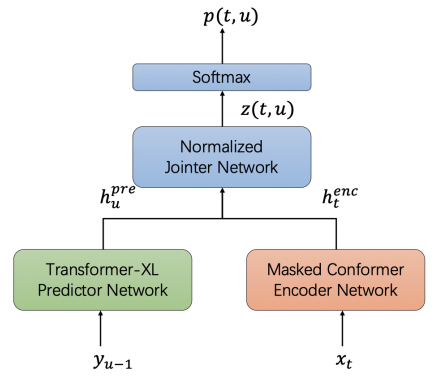
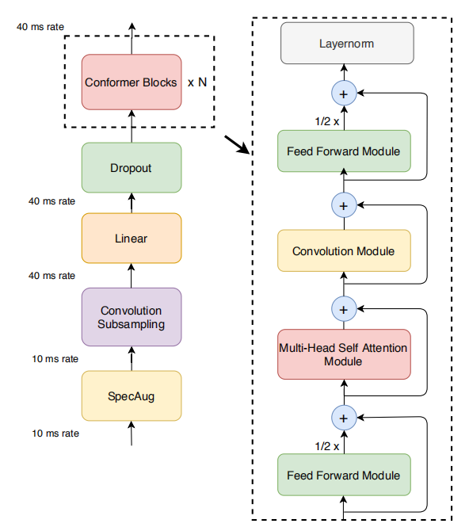
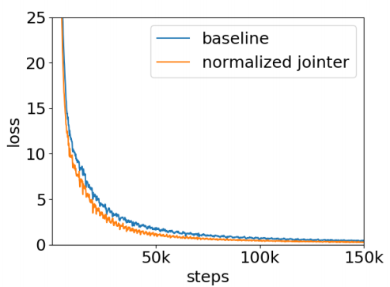
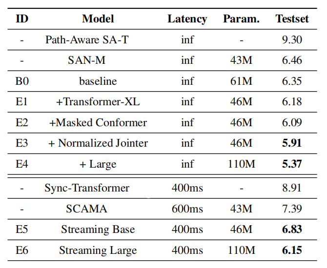

Improved RNN-T or Improved Recurrent Neural Network Transducer is an
improved version of the
[RNN-Transducer](https://anwarvic.github.io/speech-recognition/RNN-T)
where a normalized jointer network is introduced to improve performance.
This improved version was proposed by Bytedance AI Lab in 2020 and
published in this paper: [Improving RNN Transducer with Normalized
Jointer Network](https://arxiv.org/pdf/2011.01576.pdf). To further
improve the performance of the
[RNN-T](https://anwarvic.github.io/speech-recognition/RNN-T) system,
they used a masked
[Conformer](https://anwarvic.github.io/speech-recognition/Conformer)
model as the encoder network and the
[Transformer-XL](https://anwarvic.github.io/language-modeling/Transformer-XL)
as the predictor network.

    

They introduced this normalized jointer network is because they observed
a huge gradient variance during
[RNN-T](https://anwarvic.github.io/speech-recognition/RNN-T) training
such that the gradient variance is amplified for $U$ (transcription
length) times on the encoder-side, and was amplified for $T$ (acoustic
length) times on the predictor side. This makes the predictor and
encoder hard to be optimized. To address the issue, they proposed the
normalized jointer network which applies normalization for gradients at
both encoder and predictor by a factor of $U$ and $T$ respectively.

Masked Conformer Encoder
------------------------

Recall that the encoder of the RNN-T model works as the
<u><strong>acoustic</strong></u> model where usually the input to encoder
network is mel-fbank features $X = \left\\{ x_{1},\ ...x_{T} \right\\}$,
and the encoder network converts the mel-fbank features $X$ to the
high-level representations
$H^{\text{enc}} = \left\\{ h_{1}^{\text{enc}},\ ...h_{T}^{\text{enc}} \right\\}$.
The encoder network used in this paper is a masked
[Conformer](https://anwarvic.github.io/speech-recognition/Conformer)
model.

Recall that the
[Conformer](https://anwarvic.github.io/speech-recognition/Conformer)
major component is a stack of conformer blocks, each of which is a
series of multi-headed self attention, depth-wise convolution and
feed-forward layers as shown in the following figure:

    

Where the multi-head self-attention module is the same multi-head
self-attention attention mechanism introduced in the
[Transformer](https://anwarvic.github.io/machine-translation/Transformer)
model which can be shown in the following equation:

$$\text{Attention}\left( Q,\ K,\ V \right) = softmax\left( \frac{QK^{\intercal}}{\sqrt{d}} \right)V$$

In this paper, they modified the self-attention mechanism by adding mask
$M$ to the self-attention part, and normalized by other words. The
self-attention output at index $i$ can be calculated using the following
equation:

$$\text{out}_{i} = \sum_{j}^{}\left( \frac{\exp\left( \frac{Q_{i}.K_{j}}{\sqrt{d}} \right).M_{\text{ij}}}{\sum_{k}^{}{\exp\left( \frac{Q_{i}.K_{k}}{\sqrt{d}} \right).M_{\text{ik}}}}.V_{j} \right)$$

This mask mechanism introduced in conformer has two advantages:

-   First, adding mask to self-attention in conformer helps the
    convergence, especially when the training utterance is very long.

-   Second, with the mask introduced in self-attention, it is quite easy
    to change a non-streaming RNN-T system to a streaming fashion by
    masking out the right context of self attention part.

Transformer-XL Predictor
------------------------

Recall that the predictor/decoder network of the RNN-T model works as
the <u><strong>language</strong></u> model where usually the input to
predictor network is the non-blank tokens
$Y = \left\\{ y_{1},\ ...y_{U} \right\\}$, and the predictor network
converts them to the high-level representations
$H^{\text{pre}} = \left\\{ h_{1}^{\text{pre}},\ ...h_{T}^{\text{pre}} \right\\}$.
The decoder network used in this paper is a
[Transformer-XL](https://anwarvic.github.io/language-modeling/Transformer-XL)
model.

The transformer-XL contains a segment-level recurrence mechanism, which
maintains an extra-long context. Meanwhile, transformer-XL proposed a
novel positional encoding scheme that adapts the sinusoid formulation in
the relative positional embedding. It helps the model generalize to a
longer length during evaluation.

Normalized Jointer
------------------

The jointer network combines the high representation from encoder
$H^{\text{enc}}$ and predictor network $H^{\text{pre}}$ using a
fully-connected network like so:

$$z\left( t,\ u \right) = \text{FC}\left( \tanh\left( h_{t}^{\text{enc}} + h_{u}^{\text{pre}} \right) \right)$$

To understand how this equation affects the gradients during
backpropagation, let's write it with respect to each variable alone:

$$z\left( t,\ : \right) = \text{FC}\left( \tanh\left( h_{t}^{\text{enc}} + h_{:}^{\text{pre}} \right) \right)$$

$$z\left( :,\ u \right) = \text{FC}\left( \tanh\left( h_{:}^{\text{enc}} + h_{u}^{\text{pre}} \right) \right)$$

In the backward progress during backpropagation, gradient of
$dh_t^{\text{enc}}$ and $dh_u^{\text{pre}}$ will have the
following relationship with jointer network's gradient
$dz\left( t,\ u \right)$:

$${dh}_{t}^{\text{enc}} = \sum_{u = 1}^{U}{dz\left( t,\ u \right)},\ \ \ \ \ \ \ {dh}_{u}^{\text{pre}} = \sum_{t = 1}^{T}{dz\left( t,\ u \right)}$$

And usually in speech recognition task, $U$ is much bigger than $T$
which will cause unhealthy optimization of parameters. To overcome this
problem, they simply divided $dh_t^{\text{enc}}$ by $U$ and divided
$dh_u^{\text{pre}}$ by $T$ as shown below:

$${dh}_{t}^{\text{enc}} = \frac{1}{U}\sum_{u = 1}^{U}{dz\left( t,\ u \right)},\ \ \ \ \ \ \ {dh}_{u}^{\text{pre}} = \frac{1}{T}\sum_{t = 1}^{T}{dz\left( t,\ u \right)}$$

With this simple modification to the gradient from RNN-T's jointer
network to encoder and predictor network, the gradient norm of RNN-T's
training becomes more stable. And the validation loss decreases faster
and lower as illustrated in the following figure:

    

With all three proposed improvements, they achieved SOTA in the Chinese
AIShell-1 dataset with $6.15\%$ and $5.37\%$ CER for streaming and
non-streaming recognition respectively.

    

