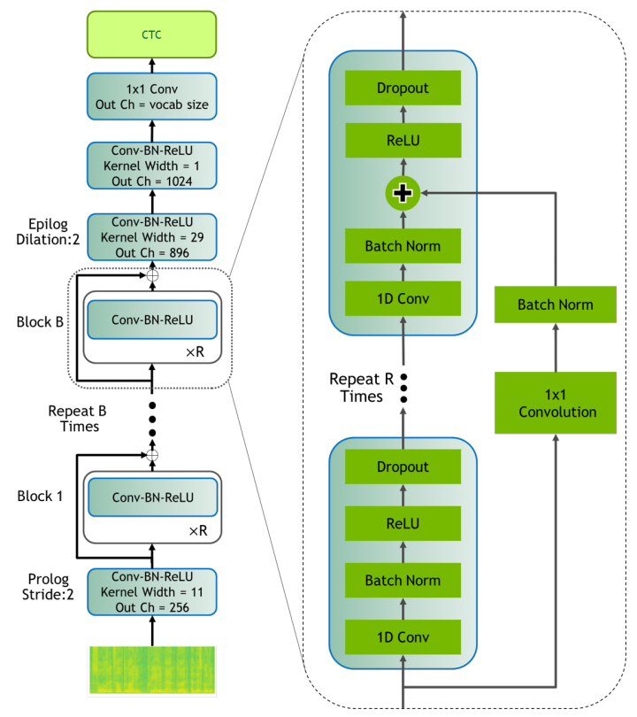
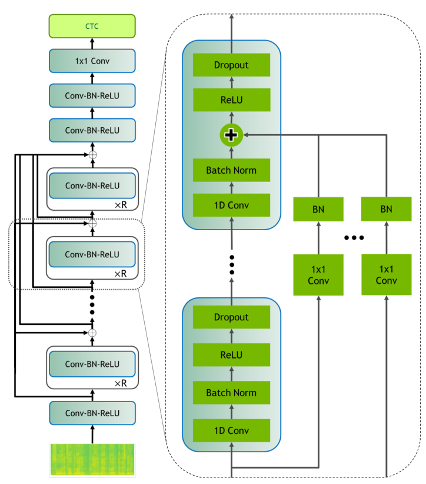
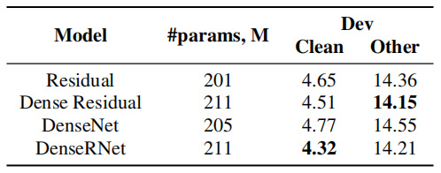
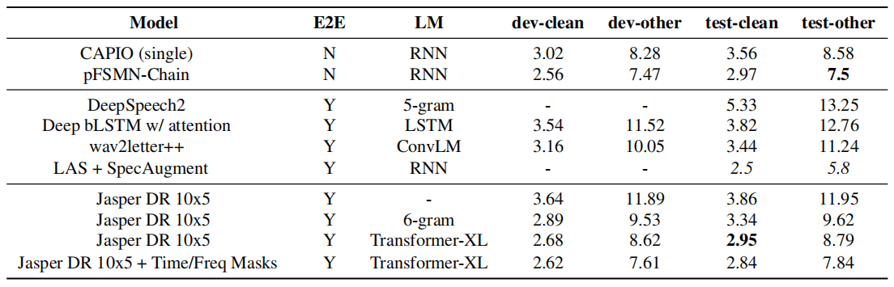
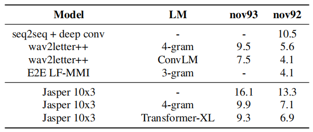
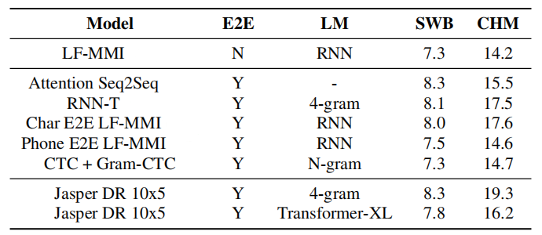

Jasper is an End-to-End convolutional neural ASR system that uses a
stack of 1D convolutions, batch normalization, ReLU, dropout, and
residual connections trained with [CTC
](https://anwarvic.github.io/speech-recognition/CTC) loss to obtain
state-of-the-art results on LibriSpeech dataset.
Jasper was proposed by Nvidia in 2019 and published in this
paper under the same name: "[Jasper: An End-to-End Convolutional Neural
Acoustic Model](https://arxiv.org/pdf/1904.03288.pdf)". The official
code can be found on Nvidia official GitHub Repository:
[Japser](https://github.com/NVIDIA/DeepLearningExamples/blob/master/PyTorch/SpeechRecognition/Jasper/README.md).

Jasper is a very deep convolutional model. The largest version of Jasper
uses 54 convolutional layers (333M parameters), while smaller versions
uses around 34 convolutional layers (201M parameters). To improve
training on such large models, they proposed a new layer-wise optimizer
called NovoGrad.

Next, we are going to talk about the two versions of Jasper that they
proposed in the paper and they are: <u><strong>Jasper BxR</strong></u> and <u><strong>Jasper
Dense Residual</strong></u>.

Jasper BxR
----------

Jasper BxR model has B blocks, each with R sub-blocks. Each sub-block applies
the following operations in order as shown in the following figure:
a 1D-convolution, batch norm, ReLU, and dropout. All sub-blocks in a block have
the same number of output channels.

    

Each block input is connected directly into the last sub-block via a
residual connection which is first projected through a $1 \times 1$
convolution to account for different numbers of input and output
channels, then through a batch norm layer. The output of this batch norm
layer is added to the output of the batch norm layer in the last
sub-block. The result of this sum is passed through the activation
function and dropout to produce the output of the current block.

Jasper Dense Residual
---------------------

Jasper Dense Residual follows a residual connection topology called
**Dense Residual (DR)** where the output of a convolution block is added
to the inputs of all the following blocks.

    

This is very similar to other architectures such as DenseNet and
DenseRNet that concatenate the outputs of different layers. However,
Jasper Dense Residual adds them together the same way that residuals are
added in ResNet. According to the following table which measures the WER
on LibriSpeech dataset, Desne Residual is as effective as earlier
methods:

    

> **Note:**\
As you have probably guessed, the difference between Jasper BxR and
Jasper DR is how the residual connection is formed.

NovoGrad
--------

NovoGrad is an optimizer similar to Adam, except that its second moments
are computed per layer instead of per weight. Compared to Adam, it
reduces memory consumption and found to be more numerically stable.

At each step $t$, NovoGrad computes the stochastic gradient $g_{t}^{l}$
following the regular forward-backward pass. Then the second-order
moment $v_{t}^{l}$ is computed for each layer $l$:

$$v_{t}^{l} = \beta_{2}.v_{t - 1}^{l} + \left( 1 - \beta_{2} \right).\left\| g_{t}^{l} \right\|^{2}$$

The second-order moment $v_{t}^{l}$ is used to re-scale gradients
$g_{t}^{l}$ before calculating the first-order moment $m_{t}^{l}$:

$$m_{t}^{l} = \beta_{1}.m_{t - 1}^{l} + \frac{g_{t}^{l}}{\sqrt{v_{t}^{l} + \epsilon}}$$

If L2-regularization is used, a weight decay $\text{d.}w_{t}$ is added
to the re-scaled gradient like so:

$$m_{t}^{l} = \beta_{1}.m_{t - 1}^{l} + \frac{g_{t}^{l}}{\sqrt{v_{t}^{l} + \epsilon}} + \text{d.}w_{t}$$

Finally, new weights are computed using the learning rate $\alpha_{t}$:

$$w_{t + 1} = w_{t} - \alpha_{t}.m_{t}$$

Experiments
-----------

Jasper uses mel-filter bank features calculated from $20ms$ windows with
a $10ms$ overlap, and outputs a probability distribution over characters
per frame. For decoding, they used two languages modeling options:
statistical N-gram and neural
[Transformer-XL](https://anwarvic.github.io/language-modeling/Transformer-XL).
They evaluated different sizes of Jasper across a number of datasets in
various domains, like:

-   <u><strong>LibriSpeech:</strong></u>\
    They trained Jasper DR 10x5 our NovoGrad optimizer for 400 epochs.
    As shown in the following table, Japser achieved SOTA performance on
    the test-clean subset and SOTA among end-to-end speech recognition
    models on test-other.

    

-   <u><strong>Wall Street Journal (WSJ):</strong></u>\
    They trained a smaller Jasper 10x3 model using the SGD with momentum
    optimizer for 400 epochs on a combined WSJ dataset (80 hours). As
    shown in the following table, Jasper 10x3 with Transformer-XL
    achieves the competitive results:

    

-   <u><strong>Hub5 Year 2000 (Hub5'00):</strong></u>\
    They trained Jasper DR 10x5 using SGD optimizer with momentum for 50
    epochs. As shown in the following table, Jasper obtained good
    results for SWB. However, there is work to be done to improve WER on
    harder tasks such as CHM:

    

