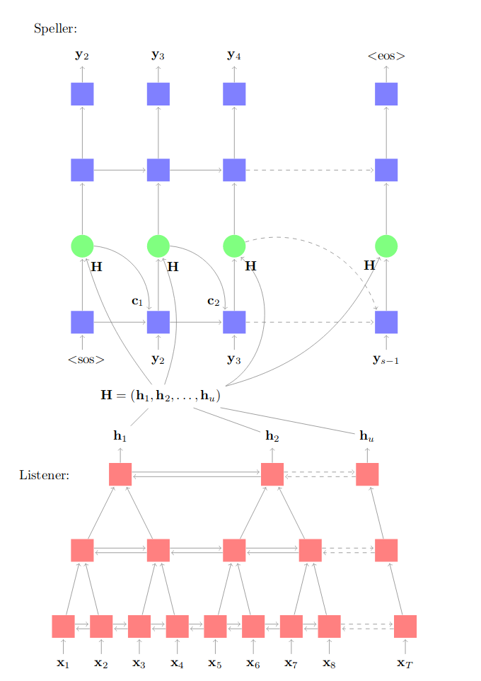
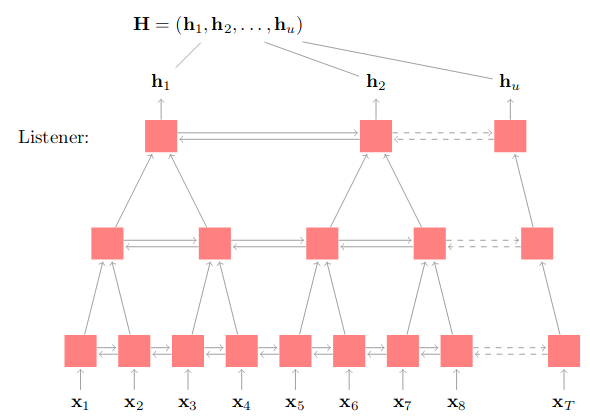
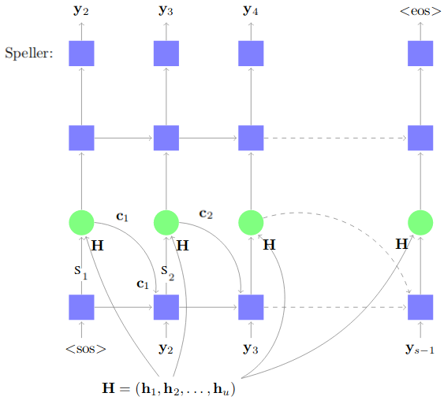

LAS stands for "Listen, Attend and Spell". It's a model created by
Google Brain in 2015 and published in this paper: [Listen, Attend and
Spell](https://arxiv.org/pdf/1508.01211.pdf). It's an encoder-decoder
system where the encoder (the listener at the bottom) is a pyramid-like
shape of Bi-LSTM to encode the filter bank spectra features of the audio
frames. And the decoder (the speller on the top) is an attention-based
LSTM layers to predict characters.

    

As you can see, this architecture doesn't use CTC. The authors of the
papers said that CTC assumes that the label outputs are conditionally
independent of each other; whereas LAS doesn't make that assumption.

One drawback for seq-to-seq models is that they tend to be more
difficult to train than CTC and slower during inference. As the decoder
cannot predict until the attention mechanism has weighed all of the
previous hidden states for each new time step.

In the following section, we will formally describe LAS which accepts
acoustic features as inputs and emits English characters as outputs. Let
$x = (x_{1},...\ x_{T}\ )$ be our input sequence of filter bank spectra
features, and let
$y = (\left\langle \text{sos} \right\rangle,\ y_{1},\ .\ .\ .\ ,\ y_{S},\left\langle \text{eos} \right\rangle)$,
where the used available vocabulary is
$y_{i} \in \ \{ a,\ b,\ c,\  \cdot \  \cdot \  \cdot \ ,\ z,\ 0,\  \cdot \  \cdot \  \cdot \ ,9\ ,\left\langle \text{space} \right\rangle,\left\langle , \right\rangle,\left\langle ' \right\rangle,\left\langle \text{unk} \right\rangle\}$.

Listener
--------

The Listener (encoder) composes of pyramid layers of bidirectional LSTM.
The encoder follows a pyramid-like shape to reduce the input by a factor
of two each layer. This allows us to form a dense representation for
hundreds or thousands of audio frames. Also, it allows helps us to
explore the context gradually and hierarchically.

In the paper, they used 3 Bi-LSTMs layers to reduce the audio time-steps
by $2^{3} = 8$ times. This allows the attention mechanism to extract the
relevant information from a smaller number of times steps.

    

In the pyramid Bi-LSTM, the output at the $i^{th}$ time step from the $j^{th}$
layer depends on the concatenated outputs of the previous layer
$(j-1)^{th}$ at two consecutive steps (2i) and (2i+1). So, the output
formula is as follows:

$$h_{i}^{j} = \text{BLSTM}\left( h_{i - 1}^{j},\ \left\lbrack h_{2i}^{j - 1},\ h_{2i + 1}^{j - 1} \right\rbrack \right)$$

Attend & Speller
----------------

The Attend and Speller (decoder) composes of attention-based LSTM
transducer.

    

At each time step, $i$, we compute the scalar energy $e_{i,u}$ which
depends on the decoder state $s_{i}$ and the output from the listener .
We can do that by:

-   Passing the decoder state to an MLP to get a non-linear representation of it:

$$\varnothing(s_{i})$$

-   Passing the listener output to a different MLP to get a non-linear
    representation of it:

$$\varphi(h_{u})$$

-   Perform a dot product between these two representations to get the
    scalar energy:

$$e_{i,\ u} = \ \varnothing\left( s_{i} \right).\varphi\left( h_{u} \right)$$

Now, we can calculate the context vector $c_{i}$ by applying a weighted
sum over the listener output using the softmax of the energy:

$$\alpha_{i,\ u} = \frac{\exp\left( e_{i,u} \right)}{\sum_{u}^{}{\exp\left( e_{i,u} \right)}}$$

$$c_{i} = \sum_{u}^{}{\alpha_{i,u}h_{u}}$$

Now, we can use this context vector $c_{i - 1}$ along with the decoder
state $s_{i - 1}$ and the previous output $y_{i - 1}$ to get the next
decoder state:

$$s_{i} = \text{LSTM}\left( s_{i - 1},\ y_{i - 1},\ c_{i - 1} \right)$$

At every output step, the transducer produces a probability distribution
over the next character conditioned on all the characters seen
previously.
