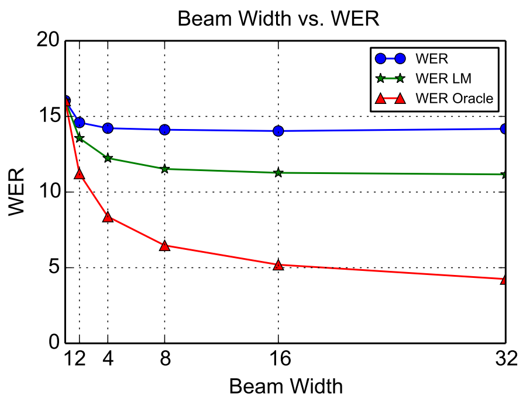
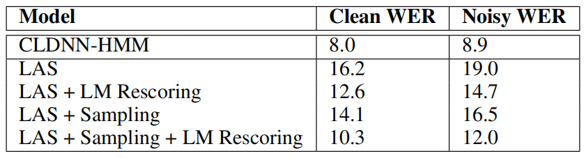
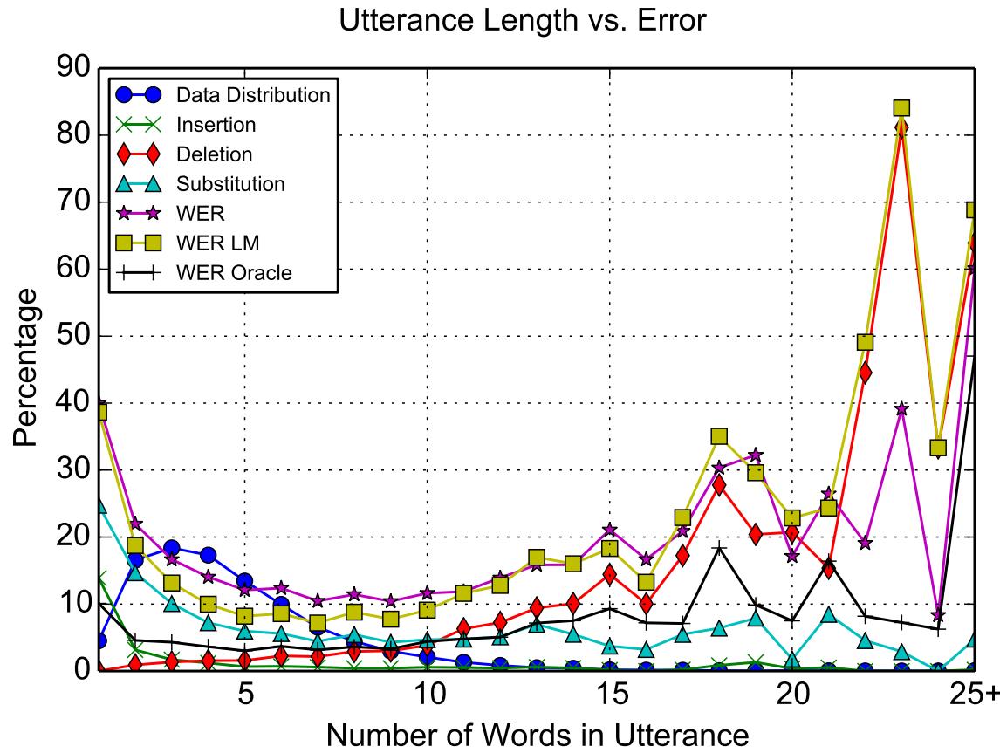

LAS stands for "Listen, Attend and Spell" which is a acoustic model that
learns to transcribe an audio sequence signal to a word sequence, one
character at a time. LAS was created by Google Brain in 2015 and
published in this paper under the same name: [Listen, Attend and
Spell](https://arxiv.org/pdf/1508.01211.pdf).

LAS is an encoder-decoder network where the encoder (the listener) is a
pyramid-like shape of Bi-LSTM network which encodes the low level speech
features into high level features. And the decoder (the speller) is an
attention-based LSTM network that converts these higher level features
into characters with the help of the attention mechanism.

    

> **Note:**\
As you can see, this architecture doesn't use
[CTC](https://anwarvic.github.io/speech-recognition/CTC) as a loss
function. And that's because CTC assumes that the output characters are
independent on each other which is untrue as we know. LAS doesn't make
that assumption. On the other hand, seq2seq models like LAS are slower
as the decoder works in auto-regressive manner.

Let $x = \left( x_{1},...\ x_{T} \right)$ be the input audio features
and let
$y = \left( \left\langle \text{sos} \right\rangle,\ y_{1}, \text{...}, y_{S},\left\langle \text{eos} \right\rangle \right)$
be our transcription where
$y_{i} \in \ \left\\{ a,\ b,\ c, \text{...}, z, 0, \text{...}, 9, \left\langle \text{space} \right\rangle,\left\langle , \right\rangle,\left\langle ' \right\rangle,\left\langle \text{unk} \right\rangle \right\\}$,
LAS tries to model each character $y_{i}$ as a conditional distribution
over the input signal $x$ and the previous characters $y_{< i}$ like so:

$$P\left( y \middle| x \right) = \prod_{i}^{}P\left( y_{i} \middle| x,\ y_{< i} \right)$$

LAS does that by using the two sub-modules explained earlier: the
listener which encodes the original signal $x$ into a high level
representation $h$; while the speller consumes this representation $h$
and produces a probability distribution over character sequences:

$$h = \text{Listen}\left( x \right)$$

$$P\left( y \middle| x \right) = \text{AttendAndSpell}\left( h,\ y \right)$$

Listener
--------

The Listener (encoder) composes of pyramid layers of bidirectional LSTM
(pBi-LSTM). The encoder follows a pyramid-like shape to reduce the input
by a factor of two each layer. This allows forming a dense
representation for hundreds or thousands of audio frames. In the paper,
they tried a standard BLSTM for the listener and it converged slowly and
produced bad results, even after a month of training time.

In the paper, they used 3 Bi-LSTMs layers which reduces the audio
time-steps by $2^{3} = 8$ times. This allows the attention mechanism to
extract the relevant information from a smaller number of times steps.

    

In the pyramid Bi-LSTM (pBi-LSTM), the output at the $i^{th}$ time step
from the $j^{th}$ layer depends on the concatenated outputs of the previous
layer $(j-1)^{th}$ at two consecutive time steps: (2i) and (2i+1). So, the
output formula is as follows:

$$h_{i}^{j} = \text{BLSTM}\left( h_{i - 1}^{j},\ \left\lbrack h_{2i}^{j - 1},\ h_{2i + 1}^{j - 1} \right\rbrack \right)$$

The results from the listener is a matrix
$H = \left( h_{1},\ h_{2},\ ...h_{u} \right)$ representing the
high-level features of the input audio.

> **Note:**\
Since we are using three pyramid-like Bi-LSTM layers that reduce the
input length by two, $u$ is expected to be close to $T/8$ where u is the
length of the output features while T is the length of the input
features.

Speller
-------

The speller is two attention-based unidirectional LSTM layers with an
MLP layer at the end. At each time step $i$, the speller produces a
probability distribution as a function of the decoder state $s_{i}$ and
decoder context $c_{i}$ by following these steps:

    

-   Pass the decoder state to an MLP to get a non-linear representation
    of it:

$$\varnothing\left( s_{i} \right)$$

-   Pass the $j^{th}$ listener output $h_{j} \in H$ to a different MLP to
    get a non-linear representation of it:

$$\varphi(h_{j})$$

-   Perform a dot product between these two representations to get the
    scalar energy between the current decoder state and all $j^{th}$
    listener output $h_{j} \in H$:

$$e_{i,j} = \ \varnothing\left( s_{i} \right).\varphi\left( h_{j} \right)$$

-   Convert the scalar energy $e_{i,j}$ into a probability distribution
    (attention) using a softmax function:

$$\alpha_{i,j} = \frac{\exp\left( e_{i,j} \right)}{\sum_{k = 1}^{u}{\exp\left( e_{i,k} \right)}}$$

-   Create the context vector $c_{i}$ by linearly blending the listener
    features $h_{j}$ at different time steps using the calculated
    attention $\alpha_{i,j}$:

$$c_{i} = \sum_{j = 1}^{u}{\alpha_{i,j}h_{j}}$$

-   Calculate the decoder state $s_{i}$ by using the RNN network;
    knowing that it is a function of the previous state $s_{i - 1}$, the
    previously emitted character $y_{i - 1}$ and context $y_{i - 1}$ as
    shown in the following formula:

$$s_{i} = \text{LSTM}\left( s_{i - 1},\ y_{i - 1},\ c_{i - 1} \right)$$

-   Finally, predict the output character $y_{i}$ which is a function of
    the current decoder state $s_{i}$ and the current context $c_{i}$.
    This can be done using MLP network with Softmax activation function:

$$P\left( {\widehat{y}}_{i} \middle| x,\ {\widehat{y}}_{< i} \right) = \text{MLP}\left( \left\lbrack s_{i};c_{i} \right\rbrack \right)$$

Decoding
--------

Decoding was performed with a simple left-to-right beam search
algorithm. At each time-step, each partial hypothesis in the beam is
expanded with every possible character and only the $\beta$ most likely
beams are kept. When the $\left\langle \text{eos} \right\rangle$ token
is encountered, it is removed from the beam and added to the set of
complete hypothesis.

These beams were scores using LAS along with a language model. In the
paper, they found out that LAS has a small bias for shorter utterances.
To overcome this, they normalized the probabilities by the number of
characters $\left| y \right|_c$ in the hypothesis and combine
it with a language model probability
$P_{\text{LM}}\left( y \right)$ as shown below:

$$s\left( y \middle| x \right) = \frac{\log\text{\ P}\left( y \middle| x \right)}{\left| y \right|_{c}} + \lambda\log\ P_{\text{LM}}\left( y \right)$$

Where $\lambda$ is hyper-parameter to tune the language model weight.

In the paper, they investigated the correlation between the performance
of the model and the width of beam search, with and without the language
model. The following figure shows the effect of the decode beam width
$\beta$ on the Word Error Rate (WER) for the clean test set.

    

As we can see, there is consistent WER improvements by increasing the
beam width up to 16. After which, there is no significant benefits.

Experiments
-----------

LAS was trained using a dataset with approximately three million Google
voice search utterances (representing 2000 hours of data). Approximately
10 hours of utterances were randomly selected as a held-out validation
set. A separate set of 22K utterances representing approximately 16
hours of data were used as the test data.

Data augmentation was performed using a room simulator, adding different
types of noise and reverberations; the noise sources were obtained from
YouTube and environmental recordings of daily events. This increased the
amount of audio data by 20 times.

The text was normalized by converting all characters to lower case. The
punctuations: space, comma, period and apostrophe were kept, while all
other tokens were converted to the unknown
$\left\langle \text{unk} \right\rangle$ token. All utterances were
padded with the start-of-sentence
$\left\langle \text{sos} \right\rangle$ and the end-of-sentence
$\left\langle \text{eos} \right\rangle$ tokens.

Regarding acoustic inputs to the listener, 40-dimensional log-mel filter
bank features were computed every $10ms$. For the Listener module, they
used 3 layers of 512 pBLSTM nodes (i.e., 256 nodes per direction). For
the Speller module, they used 2 layers of 512 LSTM nodes. The weights
were initialized with a uniform distribution
$\mathcal{U}\left( - 1,1 \right)$.

Asynchronous Stochastic Gradient Descent (ASGD) was used as an optimzier
for training with a learning rate of $0.2$ with a geometric decay of
$0.98$ per $3M$ utterances. In order to further speed up training, the
sequences were grouped into buckets based on their frame length. They
used a batch size of 32 utterances. The model was trained until results
on the validation set stopped improving. This took approximately two
weeks.

The following table shows LAS performance on the n the clean and noisy
test set collected earlier. These scores were obtained using a beam
width of 32 and LM scoring was done with $\lambda = 0.008$:

    

> **Note:**\
During training, LAS is conditioned on the correct previous characters
but during testing mistakes made by the model corrupt future
predictions. The "Sampling" from previous character distribution with a
probability of $10\%$ was used to improve performance.

They further investigated the performance of LAS as a function of the
number of words in the utterance. As seen in the following figure, LAS
did poorly on longer utterances which is expected due to limited number
of long training utterances in the data distribution. The surprising
matter is that the model performed quite poorly on short utterances
(e.g., 2 words or less).

    

