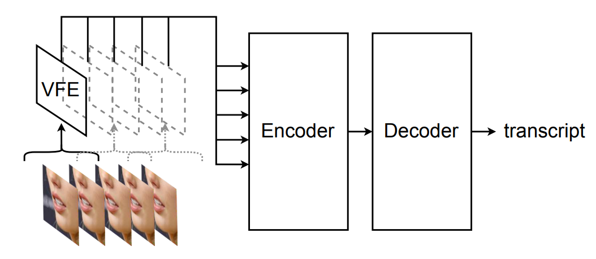
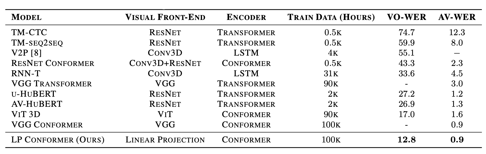
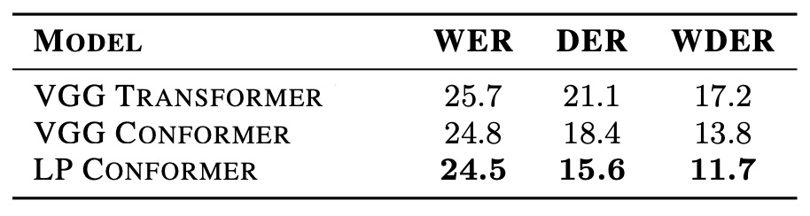
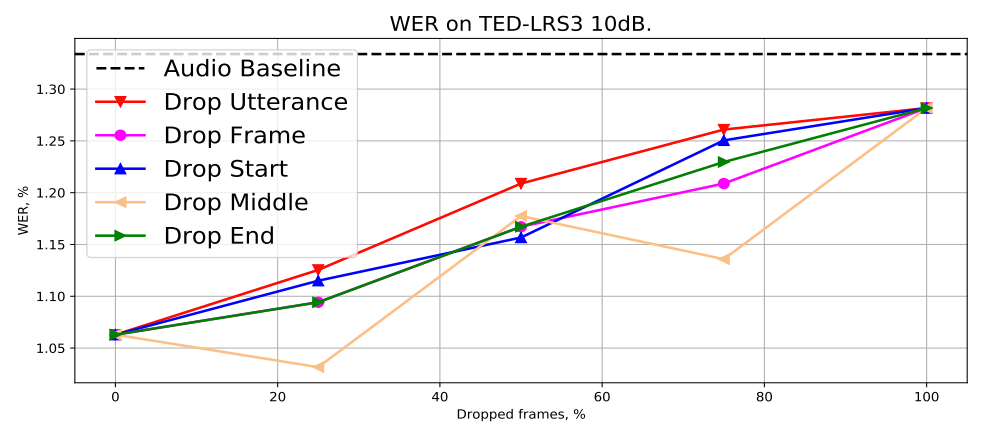

LP Conformer stands for "Linear Projection Conformer" which is a visual
speech recognition (VSR) model that is able to read lip movements and
transform them into text.This model was proposed by Google in 2023 and
published in this paper: "[Conformers Are All You Need For Visual Speech
Recognition](https://arxiv.org/pdf/2302.10915.pdf)". An illustration of
the model can be seen in the following figure:

    

As shown in the previous figure, this model consists of three main
components:

-   <u><strong>Visual Front-End:</strong></u>\
    This part is responsible of convert the sequence of input video
    frames into a sequence of features. In the paper, they tried
    different architectures for that:

    -   **VGG:** Since the VGG network is originally introduced for
        image classification which takes 2D inputs, they had to adapt
        it to 3D inputs by decomposing the 3D convolutions into
        separate 2D spatial convolutions for all layers and 1D
        temporal convolutions at the last layer.

    -   **Conv3D:** They used the same VGG network. However, they
        replaced the 2D convolutions with 3D convolutions.

    -   **ViT:** They used Vision transformers (ViT) which, similar to
        VGG, were originally introduced for image classification. They
        used $6$-layer ViT with 3D patches.

    -   **LP:** They used the embarrassingly simple linear layer. To
        further speed up this computation, they down-sampled the video
        frames from $128 \times 128 \times 3$ image to
        $64 \times 64 \times 3$ for VSR, and $32 \times 32 \times 3$
        for AVSR which makes the linear projection $12288 \times 512$
        and $3072 \times 512$ respectively.

-   <u><strong>Encoder:</strong></u>\
    The encoder processes the visual features produced by the Visual
    Front-End (VFE). In the paper, they have tried two different
    architectures:

    -   **Transformer:**
        The [Transformer](https://anwarvic.github.io/machine-translation/Transformer)
        was originally introduced for machine translation. For VSR, it
        is applied on the visual features produced by the front-end.
        For our audio-visual

    -   **Conformer:**
        [Conformers](https://anwarvic.github.io/speech-recognition/Conformer)
        are convolution-augmented transformers that were initially
        introduced for audio-only speech recognition.

-   <u><strong>Decoder:</strong></u>\
    A decoder was used only for the visual speech recognition (VSR)
    task. They used a
    [RNN-T](https://anwarvic.github.io/speech-recognition/RNN-T)
    architecture with a $9$-layer
    [LSTM](https://anwarvic.github.io/language-modeling/RNN/#LSTM%20Cell)
    with cell size $2048$ and embedding dimension $128$.

## Data

To train all variants of the model, audio-visual datasets were used. The
visual data was pre-processed by running the
[MediaPipe](https://google.github.io/mediapipe) face detector to
extract $128 \times 128$ RGB mouth tracks. The audio data was
pre-processed by extracting 80-dimensional log-mel filter-bank
coefficients extracted from a $25ms$ Hann window with a stride of
$10ms$; every three frames are stacked to yield a $240$-dimensional
frame every $30ms$. The text transcripts are tokenized at the character
level. In the paper, they used the following three audio-visual
datasets:

-   <u><strong>TED-LRS3</strong></u>:\
    [TED-LRS3](https://mmai.io/datasets/lip_reading) contains over $400$
    hours of TED and TEDx videos in segments of $6$ seconds, covering
    more than $5,000$ different speakers.

-   <u><strong>YT:</strong></u>\
    They mined public YouTube videos for audio-visual speech with high
    confidence transcripts by matching the user-uploaded captions with
    the result of a pre-trained audio-only speech recognition system.
    Then, an audio-visual synchronization classifier is used to filter
    out cases where the found face is a still image or contains a dubbed
    voice. This dataset contains $100k$ hours of transcribed video
    segments that are up to $15$ seconds long.

-   <u><strong>MEET360:</strong></u>\
    MEET360 is a simulated audio-visual dataset that was collected
    internally. Volunteers were asked to conduct 20-minute meetings in a
    conference room, and recorded by a 360-degree GoPro camera. The
    resultant spherical video is then projected to a hi-res 2D video,
    and transcribed by human annotators. The 2D video is segmented by
    the ground-truth non-speaking regions to yield clips averaging $25$
    seconds, totaling $11$ hours of video. Unlike TED-LRS3 and YT where
    a single video track is associated with each audio track, there are
    multiple video tracks associated with each audio track in MEET360.

> **Note:**\
The first two datasets (LRS3 and YT) were used with visual speech
recognition task, while the last dataset (MEET360) were used with
audio-visual speech diarization.

## Experiments & Results

For experiments with visual-only inputs, each frame was down-sampled to
$64 \times 64$, and they used $16$-layer full-context
[Conformer](https://anwarvic.github.io/speech-recognition/Conformer)
encoder with model dimension $1024$. For experiments with audio-visual
inputs, each frame is down-sampled to $32 \times 32$, then processed by
two [Conformer](https://anwarvic.github.io/speech-recognition/Conformer)
layers before being concatenated to the acoustic features. The
concatenated features are then passed to a $15$-layer full-context
[Conformer](https://anwarvic.github.io/speech-recognition/Conformer)
encoder with model dimension $512$. For all experiments, no external LM
was used.

### VSR

To test the model on visual speech recognition task, they pre-trained
the model on YT dataset, and fine-tuned it on TED-LRS3. For the decoder,
They used a [RNN-T](https://anwarvic.github.io/speech-recognition/RNN-T)
architecture with a $9$-layer
[LSTM](https://anwarvic.github.io/language-modeling/RNN) with cell size
$2048$ and embedding dimension $128$. The model was trained for $300k$
steps using a global batch size of $16$ and the Adam optimizer with a
$3k$-step warmup and a peak learning rate of $5e^{- 4}$ that is
cosine-annealed to $5e^{- 5}$. Results reported in the following table
are obtained using beam size of $8$ where VO-WER stands for "Visual-Only
Word Error Rate" and AV-WER stands for "Audio-Visual Word Error Rate":

    

From the previous table, we can see that LP Conformer significantly
outperforms prior work, achieving $12.8\%$ WER, which is a $25\%$
improvement over the previous state-of-the-art ViT Conformer at $17.0\%$
WER.

> **Note:**\
Given huge amount of training data, this result convincingly
demonstrates that sophisticated visual front-ends like residual
networks, 3D convolutional neural networks, or vision transformers are
not necessary for visual speech recognition. <u><strong>Again, only given huge
amount of training data</strong></u>.

### Audio-Visual Diarization

Audio-visual diarization is the task where the model determines who is
the speaker in a given utterance and when did he/she spoke by using the
audio-visual information available. To measure diarization performance,
they used two metrics:

-   **Diarization Error Rate (DER):** which is the percentage duration
    of audio that was mislabeled over the total duration according to
    the following formula; where "false alarm" is the duration that were
    mislabeled as speech, "miss detection" is the duration of speech
    that were missed, and "confusion" is the duration that were assigned
    to the wrong speaker.

$$DER = \frac{false\ alarm + missed\ detection + confusion}{total}$$

-   **Word Diarization Error Rate (WDER):** which is the percentage of
    words that are mislabeled with the wrong speaker according to the
    following formula; where $C_{IS}$, $S_{IS}$, and $I_{IS}$ are the
    correct, substituted, and inserted words with incorrect speaker
    labeling, and $C + S + I$ is the total number of hypothesis words.

$$WDER = \frac{C_{IS} + S_{IS} + I_{IS}}{C + S + I}$$

The following table compares the LP Conformer against the VGG
Transformer (VGG front-end with a Transformer encoder) and the VGG
Conformer (VGG front-end with a Conformer encoder). They found that the
LP Conformer performed the best for both speech recognition and
diarization. Also, LP Conformer was trained about $20\%$ faster than the
VGG Conformer, while using less memory.

    

### Robustness to Missing Video

Robustness to missing video is an essential feature for audio-visual
speech recognition (AVSR) systems, because the visual modality can often
be missing. To test out robustness to missing video, they used
[TED-LRS3](https://mmai.io/datasets/lip_reading) for evaluation after
adding $10dB$ noise to the audio. They tried different setups:

-   Audio Baseline: audio-only model, no visual modality were used.

-   Drop utterance: each video was dropped following Bernoulli
    distribution.

-   Drop Frame: each frame was dropped following Bernoulli distribution.

-   Drop Start: contiguous frames dropped from the start.

-   Drop Middle: contiguous frames dropped from the middle.

-   Drop End: contiguous frames dropped from the end.

All models were pre-trained on YT dataset and fine-tuned on TED-LRS3
dataset. Results show that LP Conformer is robust to all types of
missing video which is illustrated in the following figure where we
can see that performance deteriorates as the percentage of frames
dropped increases, but is never worse than that of the equivalent
audio-only model.

    

