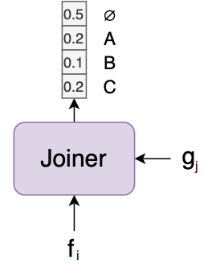
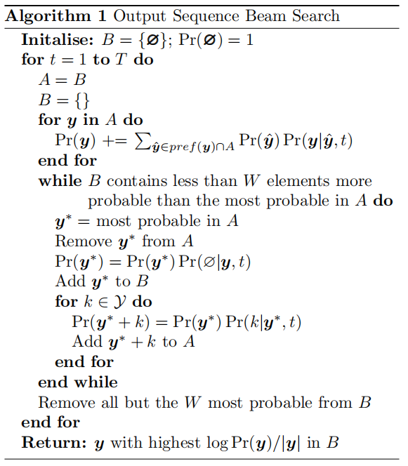

RNN-T stands for "Recurrent Neural Network Transducer" which is a promising
architecture for general-purpose sequence such as audio transcription built
using [RNN](https://anwarvic.github.io/language-modeling/RNN)s. RNN-T was
proposed by Alex Graves at the University of Toronto back in 2012 and
published under the name: [Sequence Transduction with Recurrent Neural
Networks](https://arxiv.org/pdf/1211.3711.pdf). This paper introduces an
end-to-end, probabilistic sequence transduction system, based entirely
on RNNs, that is in principle able to transform any input sequence into
any finite, discrete output sequence.

    

Let $x = \left( x_{1},\ x_{2},\ ...x_{m} \right)$ be a length $m$ input
sequence of arbitrary length belonging to the set $X$, and let
$y = \left( y_{1},\ y_{2},\ ...y_{n} \right)$ be a length $n$ input
sequence of arbitrary length belonging to the set $Y$. RNN-T model tries to
define the following conditional distribution; where $a$ refers to the
alignments between the input and output sequences:

$$Pr\left( y \middle| x \right) = \sum_{}^{}{\Pr\left( a \middle| x \right)}$$

Both the inputs vectors $x_{i}$ and the output vectors $y_{j}$ are
represented by fixed-length real-valued vectors where $x_{i}$ would
typically be a vector of MFC coefficients and $y_{j}$ would be a
one-hot vector encoding a particular phoneme or null $\varnothing$.

As shown in the past figure, RNN-T consists of three networks to determine the
past conditional distribution:

-   <u><strong>Transcription Network</strong></u> $F$:\
    This RNN network acts like an acoustic model as it scans the input sequence
    $x$ and outputs the transcription (feature) vector sequence:

$$f = \left( f_{1},\ f_{2},\ ...f_{n} \right)$$

-   <u><strong>Prediction Network</strong></u> $G$:\
    This RNN network acts like a language model as it scans the output sequence
    $y$ and outputs the prediction vector sequence:

$$g = \left( g_{1},\ g_{2},\ ...g_{n} \right)$$

-   <u><strong>Joint Network</strong></u>:\
    This network is a simple feed-forward network that combines the
    transcription vector $f_i$ and the prediction vector $g_j$.

$$ y = Softmax(W[f_i, g_j] + b) $$

Transcription Network
---------------------

The transcription network $F$ is a bidirectional RNN that scans the
input sequence $x$ forwards and backwards with two separate hidden
layers, both of which feed forward to a single output layer.
Bidirectional RNNs are preferred because each output vector depends on
the whole input sequence (rather than on the previous inputs only, as is
the case with normal RNNs).

    

Given a length $m$ input sequence
$\left( x_{1}, x_{2}, ...x_{m} \right)$, the transcription network $F$
computes the forward hidden sequence
$\left( {\overrightarrow{h}}_1, {\overrightarrow{h}}_2, ...{\overrightarrow{h}}_m \right)$,
the backward hidden sequence
$\left( {\overleftarrow{h}}_1, {\overleftarrow{h}}_2, ...{\overleftarrow{h}}_m \right)$,
and the transcription sequence $\left( f_1, f_2, ...f_m \right)$
by first iterating over the backward and forward layer:

$${\overleftarrow{h}}_{t} = H\left( W_{i\overleftarrow{h}}i_{t} + W_{h\overleftarrow{h}}{\overleftarrow{h}}_{t + 1} + b_{\overleftarrow{h}} \right)$$

$${\overrightarrow{h}}_{t} = H\left( W_{i\overrightarrow{h}}i_{t} + W_{h\overrightarrow{h}}{\overrightarrow{h}}_{t - 1} + b_{\overrightarrow{h}} \right)$$

Where $W_{i}$, $W_{h}$, and $b_{h}$ are learnable weights for input and
hidden layer and hidden bias respectively. Then, it combines the
backward and forward vectors to generate output layers:

$$o_{t} = W_{\overrightarrow{h}}{\overrightarrow{h}}_{t} + W_{\overleftarrow{h}}{\overleftarrow{h}}_{t} + b_{o}$$

> **Note:**\
In this paper, the $H$ function refers to the type of RNN cell used
which is "LSTM".

Prediction Network
------------------

The prediction network $G$ is a recurrent neural network consisting of
an input layer, a single hidden layer, and an output layer. The inputs
to this network are phonemes encoded as one-hot vectors while the output
are the prediction vectors.

    

Given a length $n$ phoneme sequence
$\left( y_{1},\ y_{2},\ ...y_{n} \right)$, the prediction network $G$
computes the hidden sequence $\left( h_{1},\ h_{2},\ ...h_{n} \right)$
and the prediction sequence $\left( g_{1},\ g_{2},\ ...g_{n} \right)$ by
using the following equations:

$$h_{t} = H\left( W_{ih}y_{t} + W_{hh}h_{t - 1} + b_{h} \right)$$

$$g_{t} = W_{ho}h_{t} + b_{o}$$

Where $W_{ih}$ is the input-hidden weight matrix, $W_{hh}$ is the
hidden-hidden weight matrix, $W_{ho}$ is the hidden-output weight
matrix, $b_{h}$ and $b_{o}$ are the bias terms, and $H$ is the LSTM cell
functions.

Joint Network
-------------
As said ealier, the Joint network (Joiner) is a simple feed-forward network
that combines the transcription vector $f_i$ and the prediction vector $g_j$
and results in the output vector whose size is $K + 1$ where $K$ is the unique
characters in the data/language plus the null character ($\varnothing$).

    

The output from the Joint Network will be the output vector. We can apply
$Softmax()$ over that vector to get the most probable character for that
time-step or we can use these soft labels and decode it in a smarter way as
we are going to see next.

Output Distribution
-------------------

Now, given the transcription vector $f_{i}$, where $1 \leq i \leq m$,
the prediction vector $g_{t}$, where $0 \leq j \leq n$, and a set of
labels $K$, we define the output density function as:

$$h\left( k,\ i,\ j \right) = \exp\left( f_{i}^{k} + g_{j}^{k} \right)$$

Where superscript $k$ denotes the $k^{\text{th}}$ element of the
vectors. The density can be normalised to yield the following
conditional output distribution:

$$pr\left( k \middle| i,\ j \right) = \frac{h\left( k,\ i,\ j \right)}{\sum_{k' \in K}^{}{h\left( k',\ i,\ j \right)}}$$

The probability $pr\left( k \middle| i,\ j \right)$ describes the
transition probabilities in the lattice shown in the following figure.
In the following figure, the horizontal arrow leaving node
$\left( i,j \right)$ represents the probability outputting nothing
$\varnothing\left( i,j \right)$; the vertical arrow represents the
probability of outputting the element $j + 1$ of $y$. The black nodes at
the bottom represent the null state before any outputs have been
emitted.

    

The set of all possible paths from the bottom left to the terminal node
in the top right corresponds to the complete set of alignments between
audio $x$ and transcription $y$. Each alignment probability is the
product of the transition probabilities of the arrows they pass through.
To obtain the best alignment (shown in red), the Forward-Backward
algorithm is used.

The Forward-Backward Algorithm defines two probabilities

-   **The forward probability**
    $\mathbf{\alpha}\left( \mathbf{i,j} \right)$**:** As the probability
    of outputting $y_{\left\lbrack 1:j \right\rbrack}$ during
    $f_{\left\lbrack 1:i \right\rbrack}$ where the forward variables can
    be calculated recursively using the following formula with the
    initial condition that $\alpha\left( 1,0 \right) = 1$:

$$\alpha\left( i,j \right) = \alpha\left( i - 1,j \right)\varnothing\left( i - 1,j \right) + \alpha\left( i,j - 1 \right)y\left( i,j - 1 \right)$$

-   **The backward probability**
    $\mathbf{\beta}\left( \mathbf{i,j} \right)$**:** As the probability
    of outputting $y_{\left\lbrack j + 1:n \right\rbrack}$ during
    $f_{\left\lbrack i:m \right\rbrack}$ where the backward variables
    can be calculated recursively using the following formula with the
    initial condition that
    $\beta\left( 1,0 \right) = \varnothing\left( m,n \right)$:

$$\beta\left( i,j \right) = \beta\left( i + 1,j \right)\varnothing\left( i - 1,j \right) + \beta\left( i,j + 1 \right)y\left( i,j \right)$$

From the definition of the forward and backward probabilities, we can
find the best alignment by following their product
$\alpha\left( i,j \right)\beta\left( i,j \right)$ at any point
$\left( i,j \right)$ in the output lattice using a beam search (defined
in the following algorithm):

    

Experiments
-----------

To evaluate the potential of the RNN transducer, they applied it to the
task of phoneme recognition on the
[TIMIT](https://catalog.ldc.upenn.edu/LDC93s1) speech corpus. The core
training and test sets of TIMIT contain respectively $3696$ and $192$
phonetically transcribed utterances. They defined a validation set by
randomly selecting $184$ sequences from the training set. Regarding
phonemes, they used the reduced set of $39$ phoneme targets.

Regarding the audio features, they created input sequences of length
$26$ normalized to have mean zero and standard deviation one using
standard speech preprocessing. For preprocessing, Hamming windows of
$25ms$ length at $10ms$ intervals were used.

Regarding the prediction network, they used one hidden layer of LSTM
cells of size $128$. Regarding the transcription network, they use two
hidden layers of LSTM cells of size $128$. This gave a total of
$261,328$ weights in the RNN transducer. As we can see in the following
table, the phoneme error rate of the transducer is among the lowest
recorded on TIMIT:

    

