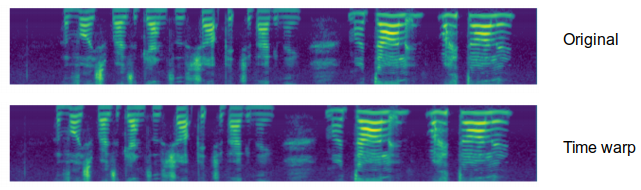
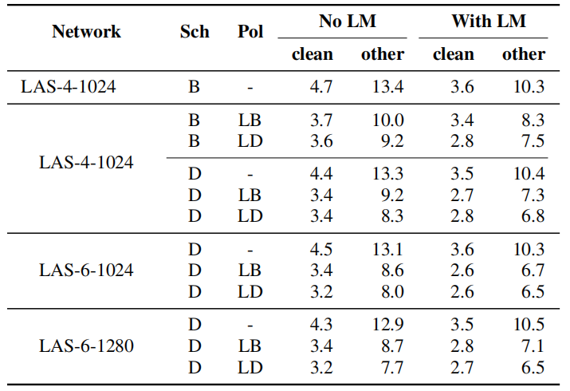

SpecAugment stands for "Spectrogram Augmentation" which is an
augmentation scheme for automatic speech recognition that acts directly
on the spectrogram of input utterances. This scheme has shown to be
highly effective in enhancing the performance of end-to-end ASR systems.
SpecAugment was proposed by Google in 2019 and published in this paper
under the same name: "[SpecAugment: A simple data augmentation method
for Automatic Speech
Recognition](https://arxiv.org/pdf/1904.08779.pdf)". The unofficial code
for this paper can be found in this GitHub repository:
[SpecAugment](https://github.com/DemisEom/SpecAugment).

Augmentation Policy
-------------------

SpecAugment is simple and computationally cheap to be applied as it
directly acts on the spectrogram as if it were an image. SpecAugment
consists of three kinds of deformations applied on the log
mel-spectrogram with $\tau$ time steps and $v$ mel frequency channels;
represented as an image where the time axis is horizontal and the
frequency axis is vertical:

-   <u><strong>Time warping:</strong></u>\
    Motivated by the idea that audio features need to be robust
    to deformations in the time direction. Given a log mel spectrogram
    with $\tau$ time steps and a warp parameter $W$, the signal is
    warped if it was shifted to the left or the right by a distance $w$
    sampled from a uniform distribution from $0$ to $W$. Time warping
    can be done using sparse_image_warp function of TensorFlow.

    

-   <u><strong>Frequency Masking:</strong></u>\
    Motivated by the idea that audio features need to be robust to
    partial loss of frequency information. Frequency masking is applied
    so that $f$ consecutive mel frequency channels
    $\left\lbrack f_{0},\left. \ f_{0} + f \right) \right.\ $ are
    masked, where $f$ is first chosen from a uniform distribution from
    $0$ to the frequency mask parameter $F$, and $f_{0}$ is chosen from
    $\left\lbrack 0,\left. \ v - f \right) \right.\ $ where $\nu$ is the
    number of mel frequency channels.

    

-   <u><strong>Time Masking:</strong></u>\
    Motivated by the idea that audio features need to be robust to
    partial loss of time information. Time masking is applied so that
    $t$ consecutive time steps
    $\left\lbrack t_{0},\left. \ t_{0} + t \right) \right.\ $ are
    masked, where $t$ is first chosen from a uniform distribution from
    $0$ to the time mask parameter $T$, and $t_{0}$ is chosen from
    $\left\lbrack 0,\left. \ \tau - t \right) \right.\ $ where $\tau$ is
    the spectrogram time steps.

    

In the paper, they tried different hand-crafted configuration for
SpecAugment where multiple frequency and time masks were applied.
These configurations are: LibriSpeech basic (LB), LibriSpeech double
(LD), Switchboard mild (SM) and Switchboard strong (SS) whose
parameters are summarized in the following table:

    

> **Note:**\
The following figure shows SpecAugment configurations applied to a
spectrogram different from the one shown earlier:

    

Learning Rate Schedules
-----------------------

The learning rate schedule turns out to be an important factor in
determining the performance of ASR networks, especially so when
augmentation is present. In this paper, they suggested three different
learning rate schedules.

Each schedule is parameters by three parameters:
$\left( s_{r},\ s_{\text{noise}},\ s_{i},\ s_{f} \right)$ and follows
this pattern: increase the learning rate sharply for $s_{r}$ steps →
hold it constant for $s_{i}$ → exponentially decay it until it reaches
$\frac{1}{100}$ of its maximum value in $s_{f}$ steps. Additionally,
weight noise is added at step $s_{\text{noise}}$ till the end.

The three learning rate schedules proposed by this paper are:

-   (B)asic:

$$\left( s_{r},\ s_{\text{noise}},\ s_{i},\ s_{f} \right) = \left( 0.5k,\ 10k,\ 20k,\ 80k \right)$$

-   (D)ouble:

$$\left( s_{r},\ s_{\text{noise}},\ s_{i},\ s_{f} \right) = \left( 1k,\ 20k,\ 40k,\ 160k \right)$$

-   (L)ong:

$$\left( s_{r},\ s_{\text{noise}},\ s_{i},\ s_{f} \right) = \left( 1k,\ 20k,\ 140k,\ 320k \right)$$

LibriSpeech Experiments
-----------------------

For LibriSpeech training, they used 80-dimensional filter banks with
delta and delta-delta acceleration, and a 16k word piece model. To
improve the ASR decoding performance, they used a two-layer RNN with
embedding dimension 1024 for the Language Modeling, which is trained on
the LibriSpeech LM corpus.

All experiments done in this paper used
[LAS](https://anwarvic.github.io/speech-recognition/LAS) architecture
with three different sizes: LAS-4-1024, LAS-6-1024 and LAS-6-1280. All
were trained on LibriSpeech 960h with peak learning rate of $0.001$ and
batch size of $512$ with a combination of augmentation policies (None,
LB, LD) and training schedules (B/D) as shown in the following table:

    

From this table, we can see that augmentation consistently improves the
performance of the trained network, and that the benefit of a larger
network and a longer learning rate schedule is more apparent with
harsher augmentation.

The following table shows the largest network, LAS-6-1280, but with
(L)ong learning rate scheduling and (LD) policy to train the network to
maximize performance on Librispeech. State of the art performance is
achieved by this model even without a language model:

    

Switchboard Experiments
-----------------------

For Switchboard 300h, they used the Kaldi "s5c" recipe to process the
data, but they adapted the recipe to use 80-dimensional filter banks
with delta and delta-delta acceleration. We use a 1k WordPiece Model to
tokenize the output, constructed using the combined vocabulary of the
Switchboard and Fisher transcripts. They trained LAS-4-1024 with
policies (None, SM, SS) and schedule (B)asic with a peak learning rate
of 0.001 and total batch size to 512 as Librispeech experiments and the
results are shown in the following table:

    

As with LibriSpeech, they trained LAS-6-1280 on the Switchboard 300h
training set with schedule (L)ong to get state of the art performance as
shown in the following table:

    

