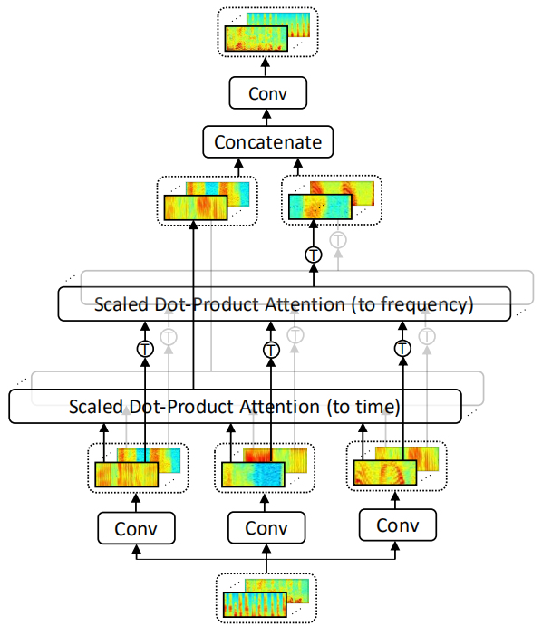

Speech Transformer is an end-to-end
Automatic Speech Recognition (ASR) system that adapts the
[Transformer](https://anwarvic.github.io/machine-translation/Transformer)
architecture to the speech recognition task which can be trained faster
and with more efficiency than sequence to sequence models such as
[RNN-Transducer](https://anwarvic.github.io/speech-recognition/RNN-T).
Speech Transformer was proposed by the Chinese Academy of Sciences in
2018 and published in this paper under the same name:
"[Speech-Transformer: A No-Recurrence Sequence-To-Sequence
Model](https://ieeexplore.ieee.org/document/8462506)".

    

The Speech-Transformer aims at transforming the speech feature sequence
(2d spectrogram) to character sequence. As shown in the previous figure,
Speech-Transformer is the same as the standard
[Transformer](https://anwarvic.github.io/machine-translation/Transformer)
with a few differences as shown below:

1.  Instead of encoder word embedding, the Speech-Transformer uses two
    $3 \times 3$ CNN layers with stride $2$ for both time and frequency
    dimensions of the input spectrogram with a ReLU activation. And
    instead of decoder word embedding, it uses character-level
    embedding.

2.  An optional stack of $M$ additional modules to extract more
    expressive representations. In the paper, they tried three different
    modules: <u><strong>ResCNN</strong></u> and
    <u><strong>ResCNNLSTM</strong></u> proposed in "Very deep convolutional
    networks for end-to-end speech recognition" paper, and they proposed a
    novel <u><strong>2D-Attention module</strong></u>.

    

3.  Next, a linear transformation is performed on the flattened feature
    map outputs to obtain the vectors of dimension $d_{m}$, which will
    be summed with a positional encoding.

    There are changes that the speech-transformer has over the standard
    transformer. In the next part, we are going to talk about the novel
    2D-Attention module.

2D-Attention
------------

Unlike text sequence, speech sequence is often represented as a 2D
spectrogram with both time and frequency axes. Therefore, attending to
both time and frequency axes may be beneficial to the model. Motivated
by this, they proposed a 2D-Attention mechanism as shown in the
following figure.

    

-   Firstly, it performs three convolutional networks on the n-channels
    spectrogram input $I$ to extract the representations of $Q$, $K$ and
    $V$ independently, where the output channels of each convolution
    network are $c$. For input-channel $i$, the calculations will be:

$$Q = W_{i}^{Q}*I,\ \ \ \ \ K = W_{i}^{K}*I,\ \ \ \ \ V = W_{i}^{V}*I$$

-   Then, it introduces two types of scaled dot-product attention to
    capture temporal and spectral dependencies respectively. For
    input-channel i, the calculations will be:

$$\text{channel}_{i}^{t} = \text{Attention}\left( Q,\ K,\ V \right)$$

$$\text{channel}_{i}^{f} = \text{Attention}\left( Q^{\intercal},\ K^{\intercal},\ V^{\intercal} \right)^{\intercal}$$

-   Finally, the outputs of 2D-Attention are concatenated and fed into
    another convolution network to obtain the final n-channels outputs.

$$\text{2D-Attention}\left( I \right) = W^{O}*\text{concat}\left\lbrack \text{channel}_{1}^{t},\ ...\ \text{channel}_{c}^{t},\ \text{channel}_{1}^{f},\ ...\ \text{channel}_{c}^{f} \right\rbrack$$

Where \* is the convolution operator,
$\left( W_{i}^{Q},W_{i}^{K},W_{i}^{V} \right)$ represent the filters
applied on $I$ to obtain the queries, keys, values of channel $i$,
respectively. $W^{O}$ represents the filters applied on the $2c$
concatenated channels to obtain the final n-channels outputs.

> **Note:**\
Remember that the scaled dot-product attention mechanism is defined as:
>
> $$\text{Attention}\left( Q,\ K,\ V \right) = \text{softmax}\left( \frac{QK^{T}}{\sqrt{d_{k}}} \right)V$$

Experiments
-----------

All experiments of Speech-Transformer used Wall Street Journal (WSJ)
dataset. The model was trained on si284, validated on dev93 and tested
on eval92 set. The input acoustic features were 80-dimensional filter
banks extracted with a hop size of $10ms$ and a window size of $25ms$,
extended with temporal first and second order differences and
per-speaker mean subtraction and variance normalization. The output
alphabet consisted of 31 classes, 26 lowercase letters, apostrophe,
period, space, noise marker and end-of-sequence tokens.

In the training stage, the samples were batched together by approximate
feature sequence length and each training batch contained 20000-frames
features. All the convolutional networks had 64 output channels and each
of them was followed by a batch normalization layer for faster
convergence. The model was trained using the same hyper-parameters as
the standard
[Transformer](https://anwarvic.github.io/machine-translation/Transformer)
model except that $d_{\text{model}} = 256$ and $h = 4$. To prevent
over-fitting, they used the neighborhood smoothing scheme, and the
probability of correct label was set to $0.8$.

The following table shows the performance of different variations of
speech-transformer. These results were obtained by averaged the last 10
checkpoints using beam size of 10 and length penalty $\alpha = 1.0$.

    

We can see that the speech-transformer with more encoder blocks achieves
better performance. This is could be because deeper encoder can extract
a more discriminated representation of acoustic information.

The past experiment were done without the use of the optional module at
the encoder. In the following table, they tried three different modules
with the base model. Additionally, they tried the standard attention
(1D-Attention module). The following table shows the WER results
averaged over two runs:

    

It can be observed that the 2D-Attention module obtains the best
performance when applied to the base model. This can be explained by the
fact that the 2D-Attention module can jointly capture the temporal and
spectral relations.

The following table shows the character-based WSJ results without extra
language models. The big speech-transformer achieves the WER of 10.92%
and converges after training 1.2 days on 1 NVIDIA K80, which is a
comparable performance with most of the published models while consuming
a significantly small fraction of training costs:

    

