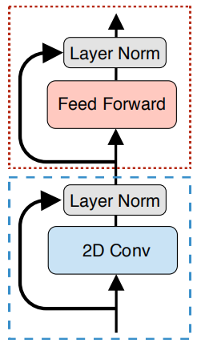
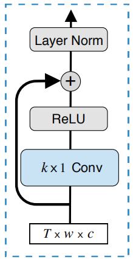
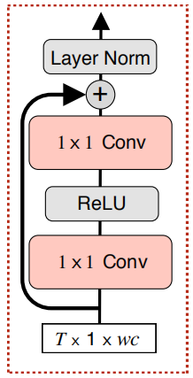
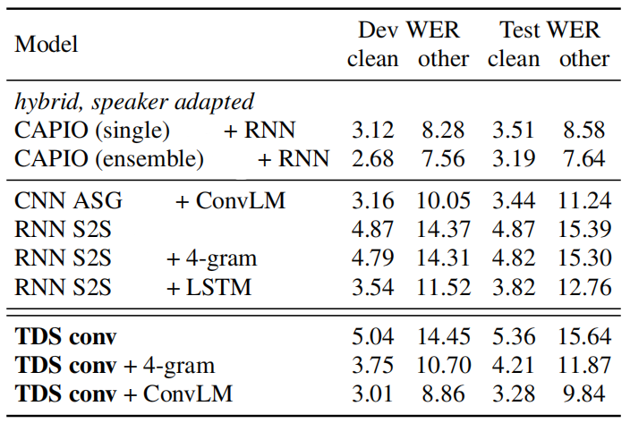
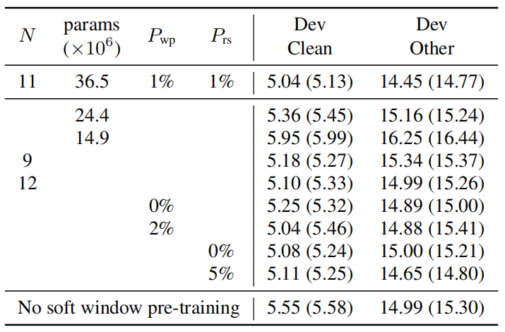

Time-Depth Separable (TDS) Convolution is a fully convolutional encoder
architecture accompanied by a simple and efficient decoder. This encoder
was proposed by Facebook AI Research in 2019 and published in this
paper: [Sequence-to-Sequence Speech Recognition with Time-Depth
Separable Convolutions](https://arxiv.org/pdf/1904.02619.pdf). The
unofficial implementation for this encoder can be found in the following
GitHub repository:
[tds.py](https://github.com/hirofumi0810/neural_sp/blob/master/neural_sp/models/seq2seq/encoders/tds.py).

The key to this model is the time-depth separable convolution block
structure which dramatically reduces the number of parameters in the
model while keeping the receptive field large. TDS convolution is much
more efficient than
[RNN](https://anwarvic.github.io/language-modeling/RNN) baseline due to
the parallel nature of its computation.

Given an input utterance $X = \left\lbrack x_{1},...x_{T} \right\rbrack$
and an output transcription
$Y = \left\lbrack y_{1},\ ...y_{U} \right\rbrack$, the model encodes $X$
into a hidden representation and then decodes the hidden representation
into a sequence of predictions for each output token. The encoder is
given by:

$$\text{encoder}\left( x \right) = \begin{bmatrix}
K \\
V \\
\end{bmatrix}$$

Where $K = \left\lbrack k_{1},\ ...k_{T} \right\rbrack$ are the keys and
$V = \left\lbrack v_{1},\ ...v_{T} \right\rbrack$ are the values ; and
they are the same size as the input. And, the decoder is given by:

$$Q_{u} = g\left( y_{u - 1},\ Q_{u - 1} \right)$$

$$S_{u} = \text{Attend}\left( Q_{u},\ K,\ V \right)$$

$$P\left( y_{u} \middle| X,\ y_{< u} \right) = h\left( S_{u},\ Q_{u} \right)$$

Where $g()$ is an RNN which encodes the previous token and query vector
$Q_{u - 1}$ to produce the next query vector. The attention mechanism
$Attend()$ produces a summary vector $S_{u}$, and $h()$ computes a
distribution over the output tokens given the query vector $Q_{u}$ and
the summary vector $S_{u}$.

In the next part, we are going to discuss the TDS convolution found in
the encoder. Then, we are going to discuss the decoder:

TDS Convolution
---------------

Experiments have shown that time-depth
separable (TDS) convolution block generalizes much better than other
deep convolutional architectures. TDS convolution blocks operates on an
input of shape $T \times w \times c$ where $T$ is the number of
time-steps, $w$ is the input width, and $c$ is the number channels.

    

As shown in the following figure, TDS convolution blocks can be divided
into two sub-blocks:

-   <u><strong>2D Conv:</strong></u>\
    The block starts with a layer of 2D convolution with kernels size of
    $k \times 1$. The total number of parameters in this layer is
    $kc^{2}$ which can be made small by keeping $c$ small. Then, the 2D
    convolution layer is followed by a ReLU activation function for
    non-linearity. Finally, a residual connection is used before
    applying layer normalization. This block produces an output of shape
    $T \times w \times c$ which can be reshaped into
    $T \times 1 \times wc$ to be passed to the next sub-block.

    

-   <u><strong>Feed-forward:</strong></u>\
    The block starts with an input of $T \times 1 \times wc$. Applying a
    fully-connected layer can be seen as a sequence of two $1 \times 1$
    convolutions (i.e. linear layers) with a ReLU non-linearity in
    between. Then, a residual connections and layer normalization are
    applied as shown in the following figure.

    

Efficient Decoder
-----------------

The decoder is sequential in nature since to compute the next output
requires the previous prediction. In the paper, they created an
efficient decoder by using the following techniques:

-   **[CuDNN](https://developer.nvidia.com/cudnn) implementation:**
    CuDNN stands for "CUDA Deep Neural Network" which is GPU-accelerated
    library created by Nvidia.

-   **Random sampling:** When decoding, the previous prediction has a
    probability of $P_{\text{rs}}$ to be replaced by a randomly sampled
    token. This prohibits the decoder to form a sequential dependency on
    previous predictions.

-   **Inner-product key-value attention:** Which is much more efficient
    than a neural attention. For a single example, the $attend()$
    function is given by:

$$S_{u} = \text{Attend}\left( Q_{u},\ K,\ V \right) = \text{V.}\text{softmax}\left( \frac{1}{\sqrt{d}}K^{T}Q_{u} \right)$$

-   **Soft-attention Window Pre-training:** This attention is used only
    for the first few epochs and then switch it off. The idea is to
    dampen the model attention to features far from the desired window
    $W \in \mathbb{R}^{T \times U}$; this dampening effect is
    controlled by the a hyper-parameter $\sigma$.Now, the $attend()$
    function becomes:

$$S_{u} = \text{V.}\text{softmax}\left( \frac{1}{\sqrt{d}}K^{T}Q_{u} - \frac{1}{2\sigma^{2}}W \right)$$

Stable Beam Search
------------------

In the paper, they are using open-vocabulary language models when
decoding which optimizes the following objective:

$$P = \log\left( P_{\text{asr}}\left( Y \middle| X \right) \right) + \alpha\log\left( P_{\text{lm}}\left( Y \middle| X \right) \right) + \beta\left| Y \right|$$

Where $\left| Y \right|$ is the number of tokens in the transcription Y,
$\alpha$ is hyper-parameters referring to the LM weight, and $\beta$ is
the token insertion term. Beam search decoders are known to be unstable
sometimes exhibiting worse performance with an increasing beam size. To
overcome this, they proposed two techniques to stabilize the beam
search:

-   <u><strong>Hard Attention Limit:</strong></u>\
    They didn't allow the beam search to propose any hypotheses which
    attend more than $t_{\max}$ frames away from the previous
    attention peak. In practice, they found $t_{\max}$ can be tuned
    once for a given data set.

-   <u><strong>End-of-sentence Threshold:</strong></u>\
    In order to bias the search away from short
    transcriptions, they only considered end-of-sentence (EOS)
    proposals when the score is greater than a specified factor
    $\gamma$ of the best candidate score. Like the hard attention
    limit, $\gamma$ can be tuned once for a given data set. The score
    is given by:

$$\text{log}P_{u}\left( \left\langle \text{eos} \right\rangle \middle| y_{< u} \right) > \gamma.\max_{c}{\text{log}P_{u}\left( c \middle| y_{< u} \right)\ }$$

Experiments
-----------

Experiments were performed on the full 960-hour LibriSpeech corpus. They
trained a model with an encoder that has two 10-channel, three
14-channel and six 18-channel TDS blocks. Kernel sizes were all
$21 \times 1$. The encoder produced 1024-dimensional output. The decoder
is a one-layer GRU with 512 hidden units. All weights were initialized
from a uniform distribution
$\mathcal{U}\left( - \sqrt{\frac{4}{f_{\text{in}}}},\ \sqrt{\frac{4}{f_{\text{in}}}} \right)$.

For language models, they used 10k word pieces computed from the
SentencePiece toolkit as vocabulary. They tried two language models on
the 800M-word text-only data set: a 4-gram trained with Kenser-key
Smoothing method and the a convolutional LM (ConvLM)

Input features were 80-dimensional mel-scale filter banks computed every
$10ms$ with a $25ms$ window. All models were trained on 8 V100 GPUs with
a batch size of 16 per GPU. They used synchronous SGD optimzier with a
learning rate of $0.05$, decayed by a factor of $0.5$ every $40$ epochs.
For regualirztion, they used gradient norm clipping of 15, $20\%$
dropout, $5\%$ label smoothing, and $1\%$ random sampling. Also, the
model was pre-trained for three epochs with the soft window and
$\sigma = 4$.

The following table show results using beam size of 80 while
$t_{\max} = 30$, and $\gamma = 1.5$. The LM weight and token insertion
terms are cross-validated with each dev set and LM combination. As you
can see, TDS conv model achieves a state-of-the-art for end-to-end
systems.

    

As an ablation study, they started varying the number of TDS blocks, the
number of parameters, the word piece sampling probability and the amount
of random sampling. For each setting, they trained three models and
reported the best and the average WER in the following table:

    

