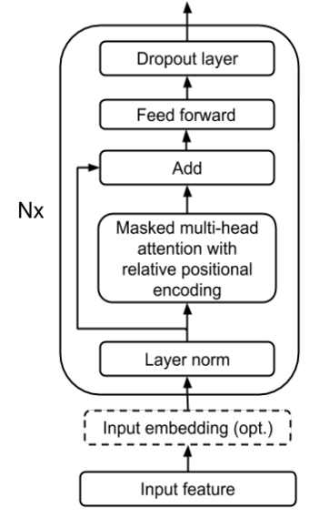
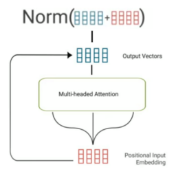
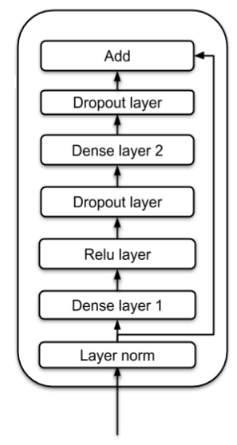
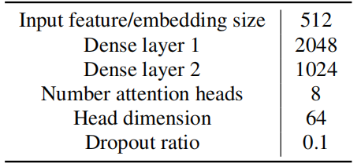
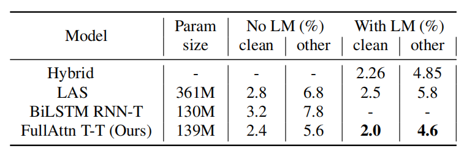
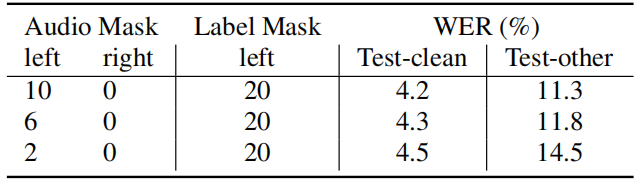
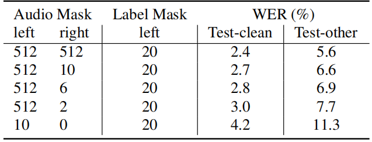
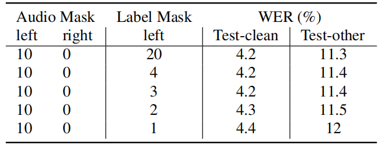
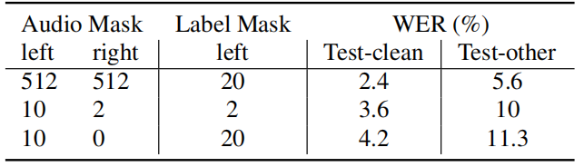

Transformer Transducer is an end-to-end
speech recognition model with Transformer encoders that is able to
encode both audio and label sequences independently. It is similar to
the Recurrent Neural Network Transducer
([RNN-T](https://anwarvic.github.io/speech-recognition/RNN-T)) model.
The only difference is this model
[Transformer](https://anwarvic.github.io/machine-translation/Transformer)
encoder instead of RNNs for information encoding. Transformer Transducer
was proposed by Google Research in 2019 and published in this paper
"[Transformer Transducer: A Streamable Speech Recognition
Model](https://arxiv.org/pdf/2002.02562.pdf)". The unofficial code for
this paper can be found in this GitHub repository:
[Transformer-Transducer](https://github.com/upskyy/Transformer-Transducer).

    

As shown in the previous figure, The Transformer Transducer is composed
of a stack of multiple identical layers. Each layer has two sub-layers:

-   A multi-headed attention layer.

-   A feed-forward layer.

Multi-headed Attention
----------------------

The multi-headed attention layer first
applies LayerNorm, then projects the input to Query, Key, and Value for
all the heads. The attention mechanism is applied separately for
different attention heads. The weight-averaged Values for all heads are
concatenated and passed to a dense layer. Then, a residual connection is
used on the normalized input and the output of the dense layer to form
the final output of the multi-headed attention sublayer:

$$x^{+} = LayerNorm\left( x \right) + AttentionLayer\left( \text{LayerNorm}\left( x \right) \right)$$

    

Also, a dropout on the output of the dense layer is applied to prevent
overfitting.

Feed-forward
------------

As shown in the following figure, the
feed-forward sub-layer applies $\text{LayerNorm}$ on the input first,
then applies two dense layers. They used $\text{ReLU}$ as the activation
for the first dense layer. Again, dropout to both dense layers for
regularization, and a residual connection of normalized input and the
output of the second dense layer:

    

$$x^{+} = \text{LayerNorm}\left( x \right) + \text{FFN}\left( \text{LayerNorm}\left( x \right) \right)$$

Experiments
-----------

To evaluate this model, they used the publicly available LibriSpeech
corpus which consists of 970 hours. The 10M word tokens of the text
transcripts and 800M additional text only dataset were used to train a
language model.

Regarding audio features, they extracted 128-channel logmel energy
values from a $32ms$ window, stacked every 4 frames, and sub-sampled
every 3 frames, to produce a 512-dimensional acoustic feature vector
with a stride of $30ms$.
[SpecAugment](https://anwarvic.github.io/speech-recognition/SpecAugment)
as a feature augmentation technique was applied during model training to
prevent overfitting and to improve generalization, with only frequency
masking $\left( F = 50,\ mF = 2 \right)$ and time masking
$\left( T = 30,\ mT = 10 \right)$.

The Transformer Transducer was trained using a learning rate schedule
that is ramped up linearly from $0$ to $2.5e^{- 4}$ during first 4K
steps, and then held constant till 30K steps and then decays
exponentially to $2.5e^{- 6}$ till 200K steps. During training, they
added a Gaussian noise of $\left( µ = 0,\ \sigma = 0.01 \right)$ to
model weights starting at 10K steps. Transformer Transducer was trained
to output grapheme units under the same loss function as
[RNN-T](https://anwarvic.github.io/speech-recognition/RNN-T). The full
set of hyper-parameters used in the following experiments can be found
in the following table:

    

They first compared the performance of Transformer Transducer (T-T)
models with full attention on audio to an
[RNN-T](https://anwarvic.github.io/speech-recognition/RNN-T) model using
a bidirectional LSTM audio encoder and with
[LAS](https://anwarvic.github.io/speech-recognition/LAS) as shown in the
following table which shows that the T-T model significantly outperforms
the RNN-T baseline despite the fact that T-T was trained much faster (≈
1 day) than the RNN-T model (≈ 3.5 days), with a similar number of
parameters:

    

Next, they trained the model with limited attention windows over audio
and text, with a view to building online streaming speech recognition
systems with low latency. So, they constrained the T-T to attend to only
a fixed window of the left of the current frame by masking the attention
scores outside the window of the current frame. The following table
shows the performance when masking N states to the left or right of the
current frame. As expected, using more audio history gives better
performance (lower WER):

    

> **Note:**\
A full attention T-T model has a window of (left = 512, right = 512).

Similarly, they explored the use of limited right context to allow the
model to see some future audio frames. The following table shows that
with right context of 6 frames per layer, the performance is around 16%
worse than full attention model:

    

In addition, they evaluated the performance when masking the label
instead of the audio features. The following table shows that
constraining each layer to only use three previous label states yields
the similar accuracy with the model using 20 states per layer. It shows
very limited left context for label encoder is good enough for T-T
model:

    

Finally, the following table reports the results when using a limited
left context of 10 frames, which reduces the time complexity for
one-step inference to a constant, with look-ahead to future frames:

    

