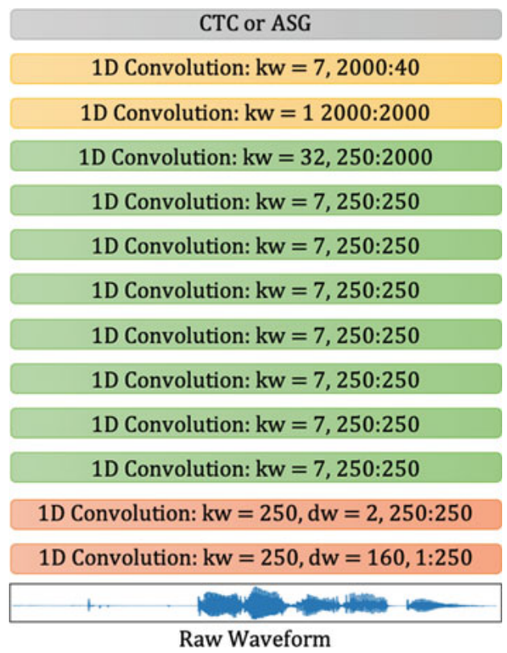
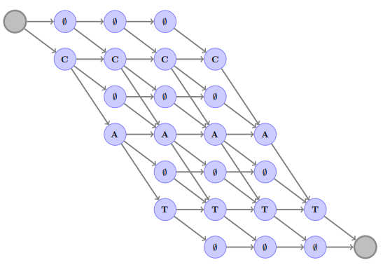
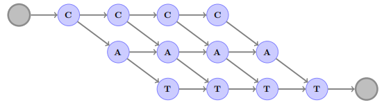
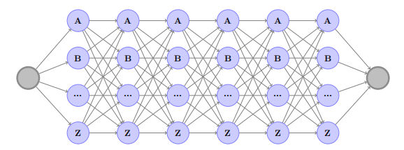
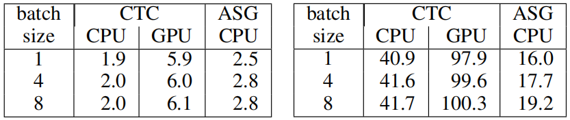
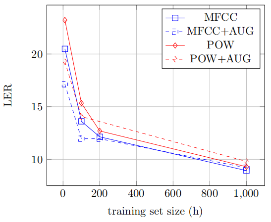
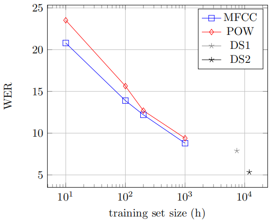
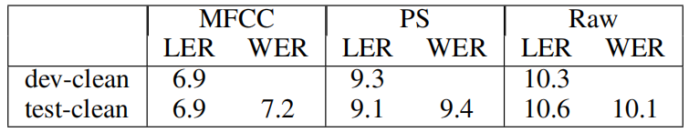

Wav2Letter is an end-to-end model for speech recognition that combines a
convolutional networks with graph decoding. Wav2letter was trained on
speech signal to transcribe letters/characters, hence the name
"wav-to-letter". Wav2letter was created by Facebook in 2016 and
published in this paper: [Wav2Letter: an End-to-End ConvNet-based Speech
Recognition System](https://arxiv.org/pdf/1609.03193.pdf). The official
code for this paper can be found in Flashlight's official GitHub
repository: [wav2letter++](https://github.com/flashlight/wav2letter).

Wav2Letter is a fully 1D convolutional network that has no pooling
blocks. Instead, Wav2Letter leverages striding convolutions. The
following figure shows the full architecture of Wav2Letter where
$\text{kw}$ is the kernel width, $\text{dw}$ is the kernel stride, and
the ratio is the number of input dimensions to the number of output
dimensions:

    

> **Note:**\
Wav2Letter accepts three types of inputs: <u><strong>raw waveform</strong></u>,
<u><strong>power spectrum</strong></u> and <u><strong>MFCC features</strong></u>. The previous
figure is when the input is "raw waveform". In case of either power
spectrum or MFCC features, the first layer of the architecture is
removed.

Given $\left( x_{t} \right)\_{t = 1,2,...T_{x}}$ an input sequence
with $T_{x}$ frames of $d_{x}$ dimensional vectors,
a convolution with kernel width $\text{kw}$, stride
$\text{dw}$ and $d_{y}$ frame size, bias of
$b_{i} \in \mathbb{R}^{d_{y}}$ and weights of
$w \in \mathbb{R}^{d_{y} \times d_{x} \times \text{kw}}$, it
computes the following:

$$y_{t}^{i} = b_{i} + \sum_{j = 1}^{d_{x}}{\sum_{k = 1}^{\text{kw}}{w_{i,j,k}\ x_{\text{dw} \times (t - 1) + k}^{j}}},\ \ \forall 1 \leq i \leq d_{y}$$

After that in the paper, they used an activation function of either
HardTanh or ReLU which both lead to similar results:

$$HardTanh(z) = \left\{ \begin{matrix}
1\ \ \ \ \ \ if\ x\  > \ 1 \\
 - 1\ \ \ \ \ if\ x\  < - 1 \\
\ \ \text{x}\ \ \ \ \ \ \text{otherwise} \\
\end{matrix} \right.$$

$$ReLU(z) = max(0, z)$$

Finally, the last layer of our convolutional network outputs one score
per letter in the letter dictionary of $30$ characters: the standard
English alphabet plus the apostrophe, silence, and two special
"repetition" graphemes which encode the duplication (once or twice) of
the previous letter. Compared to
[Deep Speech 2](https://anwarvic.github.io/speech-recognition/Deep_Speech_2)
model, wav2letter has a simpler architecture with 23 millions of parameters while
[Deep Speech 2](https://anwarvic.github.io/speech-recognition/Deep_Speech_2)
has around 100 millions of parameters.

ASG Criterion
-------------

ASG stands for "**A**utomatic **S**e**g**mentation Criterion" which is an
alternative loss function to the
[CTC](https://anwarvic.github.io/speech-recognition/CTC) criterion.
Before getting into ASG, let's first recap how
[CTC](https://anwarvic.github.io/speech-recognition/CTC) works, CTC
assumes that the acoustic model outputs probability scores (normalized)
for each audio frame. And to detect the separation between two identical
consecutive letters in a transcription, a "blank" character $\phi$ was
introduced. The following graph shows all the acceptable sequences of
"cat" word.

    

At each time step $t$, each node of the graph is assigned with the
corresponding log-probability $f_{t}$ by the acoustic model. CTC aims at
maximizing the "overall" graph $\mathbb{G}$ score by minimizing
following score:

$$C\text{TC}\left( \theta,T \right) = - \underset{\pi \in \mathbb{G}}{\text{logadd}}{\sum_{t = 1}^{T}{f_{\pi_{t}}\left( x \right)}}$$

$$\text{logadd}\left( a,b \right) = \exp\left( \log\left( a \right) + \log\left( b \right) \right)$$

ASG is an alternative to CTC with three main differences:

-   <u><strong>No blank labels:</strong></u>\
    If we removed this character, we will have a simpler
    vocabulary. And modeling letter repetitions can be easily replaced
    by repetition character like "hel2o" instead of "hello". For
    example, the following graph shows all the acceptable sequences of
    "cat" which is way simpler than the one used with CTC:

    

-   <u><strong>No normalized scores on the nodes</strong></u>\
    In the case of CTC, the output of the acoustic model is a log-likelihood
    probability which is normalized per frame. Normalizing the scores on the
    frame-level causes "label bias".

-   <u><strong>Global normalization instead of frame-level normalization</strong></u>\
    So, it considers the full fully connected graph of all possible letters
    shown below:

    

Putting all these changes together means that the ASG tries to
minimize the following score where $g_{\pi_{i} \rightarrow j}()$ is
a transition score model to jump from letter $i$ to letter $j$:

$$\text{ASG}\left( \theta,T \right) = - \underset{\pi \in \mathbb{G}_{\text{ASG}}}{\text{logadd}}{\sum_{t = 1}^{T}\left( f_{\pi_{t}}\left( x \right) + g_{\pi_{t - 1} \rightarrow \pi_{t}}\left( x \right) \right)} + \underset{\pi \in \mathbb{G}_{\text{full}}}{\text{logadd}}{\sum_{t = 1}^{T}\left( f_{\pi_{t}}\left( x \right) + g_{\pi_{t - 1} \rightarrow \pi_{t}}\left( x \right) \right)}$$

And the decoder they build in the paper attempts to maximize the
following:

$$\underset{\pi \in \mathbb{G}_{\text{ASG}}}{\text{logadd}}{\sum_{t = 1}^{T}\left( f_{\pi_{t}}\left( x \right) + g_{\pi_{t - 1} \rightarrow \pi_{t}}\left( x \right) \right)} + \alpha\log\left( P_{\text{lm}}\left( \theta \right) \right) + \beta\left| \theta \right|$$

Where $P_{\text{lm}}\left( \theta \right)$ is the probability of the
language model (KenLM) given a transcription $\theta$, $\alpha$ and
$\beta$ are two hyper-parameters which control the weight of the
language model and the word insertion penalty respectively.

Experiments
-----------

They evaluated the model on the LibriSpeech benchmark (about 1000h of
audio files) for training and validating our models. They used the
original $16\ KHz$ sampling rate. The MFCC features were computed with
13 coefficients with a $25ms$ sliding window and $10ms$ stride. The
power features were 257 components computed with the same sliding
window/stride. All features are normalized
$\left( \mu = 0,\ \sigma = 1 \right)$ per input sequence. All results
reported below was obtained using the model fine-tuned to get the
highest validation score with 4-gram KenLM model.

The following table shows the decoding speed in milliseconds of ASG and
CTC on short sequences (input frames: 150, letter dictionary: 28,
transcription size: 40) on the left side; and longer sequences (input
frames: 700, letter dictionary: 28, transcription size: 200):

    

They also investigated the impact of the input feature on the
performance, as well as the effect of a simple data augmentation
procedure, where shifts were introduced in the input frames, as well as
stretching. The following figure shows both type of features (MFCC and
power) perform similarly; and the augmentation helps for small training
set size. However, with enough training data, the effect of data
augmentation vanishes:

    

They also compared Wav2Letter with [Deep
Speech](https://anwarvic.github.io/speech-recognition/Deep_Speech) and
[Deep Speech
2](https://anwarvic.github.io/speech-recognition/Deep_Speech_2) with
different training sizes. The following figure reports that the WER with
respect to the available training data size. As shown below, Wav2Letter
performs very well against the two models despite being trained on less
data:

    

Finally, the best scores for Wav2Letter on Librispeech for each type of
features is reported in the following table:

    

