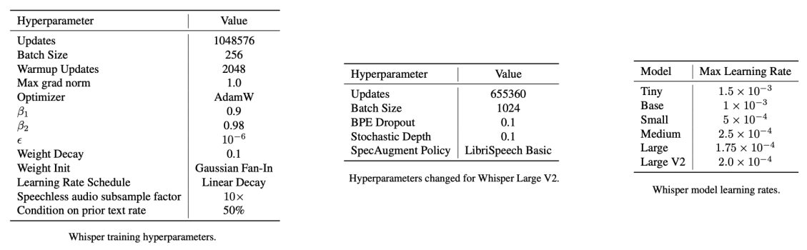

Whisper stands for "**W**eb-scale **S**upervised **P**retraining for
**S**peech **R**ecognition" (I know, it should've been "WSPSR"). Whisper
is a speech model trained in a supervised setup on 680,000 hours of
labeled audio data to handle different speech-related tasks such as
"transcription", "translation", "VAD", and "alignment". Whisper was
proposed by OpenAI in September 2022 and published in this paper
"[Robust Speech Recognition via Large-Scale Weak
Supervision](https://arxiv.org/pdf/2212.04356.pdf)". The official code
for Whisper can be found on OpenAI's official GitHub repository:
[openai/whisper](https://github.com/openai/whisper). The following
figure shows the architecture of Whisper:

    

## Data

Following the trend of leveraging web-scale text from the internet for
training machine learning systems, whisper was trained to utilize the
raw text of transcripts without any text normalization step. However,
using raw text comes with its own challenges such as:

-   Many of these audio-related texts were machine-generated originally.
    To overcome that, they developed many heuristics to remove
    machine-generated transcripts from the training dataset; such that
    any text with all lower case or upper case are most likely have been
    generated by another ASR model. Same happens with text with few to
    no punctuations.

-   Different textual data on the internet uses different encodings. To
    overcome this, they performed the following steps to normalize
    English texts to a standarized form:

    

-   During early development and evaluation, they observed that Whisper
    had a tendency to transcribe incorrect guesses for the speakers'
    names. This happens because many transcripts in the pre-training
    dataset include the name of the person who is speaking even though
    it was never mentioned in the audio. To avoid this, they fine-tuned
    Whisper models briefly on the subset of transcripts that do not
    include speaker annotations which removes this behavior.

For language detection, they used an internal audio language detector
along with
[Compact Language Detector 2(CLD2)](https://github.com/CLD2Owners/cld2)
to ensure a higher quality of detecting the spoken language.
If the two didn't match, they don't include the (audio, transcript)
pair as a speech recognition training example in the dataset.
However, if the transcript language is English, then they added these
pairs to the dataset as X→en speech translation training examples.

Finally, they broke audio files into 30-second segments paired with the
subset of the transcript that occurs within that time segment. All audio
was re-sampled to $16,000$ Hz, and an $80$-channel logmagnitude Mel
spectrogram representation is computed on $25ms$ windows with a stride
of $10ms$. All audio were used for training, including segments where
there is no speech (though with sub-sampled probability) and use these
segments as training data for voice activity detection. The full data
consists of $680,000$ hours including $117,000$ hours of multilingual
speech in $96$ languages, and $125,000$ hours of x→en translation and
the rest is 438,000 hours of English speech.

    

## Model

As shown in the previous graph, Whisper is an encoder-decoder
[Transformer](https://anwarvic.github.io/machine-translation/Transformer)
where the encoder and decoder have the same width and number of
transformer blocks. To make it more efficient, they made the following
changes to the original architecture:

-   To handle audio log-mel spectrogram, they added a small network to
    the encoder; consisting of two convolution layers of kernel width
    ($kw = 3$) and a stride $s = (1,2)$ respectively, and
    a GELU activation function.

-   They used pre-activation residual blocks; similar to this
    [paper](https://arxiv.org/pdf/1904.10509.pdf).

-   They added a layer normalization to the encoder output.

-   The decoder uses learned position embeddings and tied input-output
    token representations; similar to this
    [paper](https://arxiv.org/pdf/1608.05859.pdf).

-   To handle multiple speech-related tasks, the decoder uses different
    prompts as shown in the following graph. The decoder's prompt always
    consists of three things: special tokens (yellow box), text tokens
    (blue box), and timestamp tokens (green box).

    

So, let's see the prompt used for different tasks:

-   Speech Recognition (en):

    

-   Speech Translation (es→en):

    

-   VAD, Voice Activity Detection:

    

-   Timestamp-predictions; i.e Speech Alignment or Diarization:

    
    

In order to study the scaling properties of Whisper, they trained
various sizes according to the following table:

    

> **Note:**\
Following the release of the paper, the authors announced a
"large-v2" model trained for $2.5x$ more epochs with regularization
and no architecture changes. This\
large-v2" model surpasses the performance of the large model.

## Training Details

In the paper, they trained Whisper with data parallelism across
accelerators using FP16 with dynamic loss scaling and activation
check-pointing. All Whisper models were trained with AdamW and gradient
norm clipping with a linear learning rate decay to zero after a warmup
over the first $2048$ updates. A batch size of $256$ tokens was used,
and the models are trained for $220$ updates (around 2-3 epochs over the
dataset). Regarding the text tokenizer, they used the same byte-level
BPE text tokenizer used in
[GPT2](https://anwarvic.github.io/language-modeling/GPT-2) for the
English-only models and refit the vocabulary (with keeping the same
size) for the multilingual models.The following table summarizes the
full training hyper-parameters:

    

> **Note:**\
Due to only training for a few epochs, over-fitting is not a large
concern here. That's why they didn't use any data augmentation or
regularization. However, Whisper "large-v2" was trained with
regularization methods such as Stochastic Depth, and BPE Dropout and
augmentation methods such as
[SpecAugment](https://anwarvic.github.io/speech-recognition/SpecAugment).

## Experiments & Results

Since Whisper was trained on a the biggest audio dataset out there, they
evaluated Whisper models in a zero-shot setting without using any of the
training data for each of these datasets. Also, since Whisper supports
different tasks, they evaluated it separately on each of them as shown
below:

> **Important Note:**\
All results reported in the paper were obtained after applying their own
text normalizer on all models (the baselines & Whisper).

### English Speech Recognition

To evaluate Whisper models on English speech recognition task, they used
the following datasets: [LibriSpeech](https://www.openslr.org/12)
("test-clean" & "test-other"), [TED-LIUM 3](https://www.openslr.org/51),
[Common Voice 5.1](https://commonvoice.mozilla.org/en/datasets), [Artie
bias corpus](https://github.com/artie-inc/artie-bias-corpus),
[CallHome](https://catalog.ldc.upenn.edu/LDC2002S09),
[Switchboard](https://catalog.ldc.upenn.edu/LDC2002T43),
[WSJ](https://catalog.ldc.upenn.edu/LDC93S6B),
[CORAAL](https://oraal.uoregon.edu/coraal), CHiME-6 (synchronized
version of
[CHiME-5](https://spandh.dcs.shef.ac.uk/chime_challenge/CHiME5/download.html)),
and the [AMI
corpus](https://groups.inf.ed.ac.uk/ami/corpus/overview.shtml). A
detailed comparison between Whisper and [Wav2vec
2.0](https://anwarvic.github.io/speech-recognition/wav2vec_2) is shown
in the following table:

    

Although both models perform within $0.1\%$ of each other on
LibriSpeech, a zero-shot Whisper model performs much better on other
datasets than expected for its LibriSpeech performance and makes
$55.2\%$ less errors on average.

If you are curious about how other sizes
are performing compared to different ASR baselines and human
performance, the following figure summarizes the "effective robustness"
in a very smart way; "Effective Robustness" measures the performance
difference between an in-distribution dataset (x-axis) and
out-of-distribution datasets (y-axis).

    

As you can see from the figure, <u><strong>the smallest Whisper model is roughly
competitive with the best supervised LibriSpeech model when evaluated on
other datasets</strong></u>.

### Long-form English Transcription

As mentioned earlier, Whisper was trained on 30-second audio chunks and
cannot consume longer audio inputs at once. This presents challenges in
real-world applications which often require transcribing minutes or
hours-long audio. To use Whisper on long-audio utterances, they
developed a strategy that relies on accurate prediction of the timestamp
tokens to determine the amount to shift the model's 30-second audio
context window. The full details about this strategy will be described
shortly. To evaluate Whisper on this task, they used several datasets
which can be summarized in the following list:

-   [TED-LIUM 3](https://www.openslr.org/51): They used the 11
    full-length TED talks from the test split of TED-LIUM Release 3.

-   [Meanwhile](https://github.com/openai/whisper/blob/main/data/meanwhile.json):
    This dataset consists of 64 segments from The Late Show with Stephen
    Colbert.

-   Rev16: They used the following 16 episodes {3, 4, 9, 10, 11, 14, 17,
    18, 20, 21, 23, 24, 26, 27, 29, and 32} of [Rev.AI's Podcast
    Transcription
    Benchmark](https://www.rev.ai/blog/podcast-transcription-benchmark-part-1/).
    They chose these episodes because their transcripts are
    well-aligned.

-   Kincaid46: The dataset consists of 46 audio files and the
    corresponding transcripts compiled in the blog article [¡Which
    automatic transcription service is the most accurate -
    2018¿](https://medium.com/descript/which-automatic-transcription-service-is-the-most-accurate-2018-2e859b23ed19)
    by [Jason Kincaid](https://twitter.com/jasonkincaid).

-   [Earnings-21](https://github.com/revdotcom/speech-datasets/tree/main/earnings21)
    and
    [Earnings-22](https://github.com/revdotcom/speech-datasets/tree/main/earnings22).

-   [CORAAL](CORAAL): They used the 231 full-length interviews and
    transcripts.

In the paper, they compared the performance with open-source models
as well as 4 commercial ASR services. The results are summarized in
the following figure showing the distribution of word error rates
from Whisper and the 4 commercial ASR services,

    

The results show that Whisper performs better than the compared
models on most datasets, especially on the
[Meanwhile](https://github.com/openai/whisper/blob/main/data/meanwhile.json)
dataset which is heavy with uncommon words. The following table
shows different Whisper sizes in comparison with prior work on the
long-form seven datasets:

    

As mentioned earlier, Whisper is trained on 30-second audio utterances.
To use Whisper to work on long-audio utterances, they developed a
strategy by doing the following steps:

-   First, they used beam search with $bs = 5$.

-   Then, they used the model's log probability as the score function,
    to control the temperature sampling. They started with temperature
    and increased the temperature by $0.2$ up to $1.0$ when either the
    average log probability over the generated tokens is lower than
    $- 1$ or the generated text has a gzip compression rate higher than
    $2.4$ (which gives an indication of repetition).

-   Finally, to avoid a failure mode where the model ignores the first
    few words in the input, they constrained the initial timestamp token
    to be between $0.0$ and $1.0$ second.

-   Also, they noticed that providing the transcribed text from the
    preceding window as previous-text conditioning when the applied
    temperature is below $0.5$ further improves the performance.

-   In case of no-speech, they found out that using the \<\|nospeech\|\>
    token alone is not sufficient. Combining it with the average
    log-probability threshold of $- 1$ makes the voice activity
    detection of Whisper more reliable.

The following table shows that adding each of the interventions
above incrementally reduces the WER overall, but not evenly across
the dataset.

    

### Non-English Speech Recognition

In order to compare Whisper models with prior work such as
[XLS-R](https://anwarvic.github.io/speech-recognition/XLS-R),
[mSLAM](https://anwarvic.github.io/speech-translation/mSLAM), and
[Maestro](https://anwarvic.github.io/speech-translation/Maestro), they
reported the performance on [Mutlilingual LibriSpeech
(MLS)](https://www.openslr.org/94) and
[VoxPopuli](https://github.com/facebookresearch/voxpopuli) in the
following table:

    

From the past table, we can see that Whisper significantly
under-performs prior work. The authors in the paper think that this
under-performance of Whisper models could be due to zero-shot evaluation
of Whisper. However, these two benchmarks are narrow since they only
include 15 languages, almost all of which are in the Indo-European
language family and many of which are high-resource languages.

### Speech Translation

To study the translation capabilities of Whisper, they measured its
performance on the x→en subset of [CoVOST
2](https://huggingface.co/datasets/covost2) and they compared it with
[XLS-R](https://anwarvic.github.io/speech-recognition/XLS-R),
[mSLAM](https://anwarvic.github.io/speech-translation/mSLAM), and
[Maestro](https://anwarvic.github.io/speech-translation/Maestro) and
reported the results in the following table which shows that Whisper
achieves a new state of the art of $29.1$ BLEU zero-shot without using
any of the training data

    

For an additional analysis on an even wider set of languages, they
re-purposed
[Fleurs](https://huggingface.co/datasets/google/fleurs/blob/main/fleurs.py)
dataset, which is a speech recognition dataset, as a translation
dataset. They did that by using the English transcripts as reference
translations since the same sentences are transcribed for every
language. The following figure shows the correlation between the amount
of translation training data per language and the resulting zero-shot
BLEU score. From the figure, you can see a clear trend of improvement
with increasing training data,

    

### Language Identification

To evaluate language identification (LID) task, they used the
[Fleurs](https://huggingface.co/datasets/google/fleurs/blob/main/fleurs.py)
dataset as well. They compared Whisper with prior supervised work and
results are reported in the following table where you can see that
Whisper under-performs the supervised state-of-the-art model
([mSLAM](https://anwarvic.github.io/speech-translation/mSLAM))
by$\ 13.6\%$. However, Whisper is heavily disadvantaged since the
Whisper dataset contains no data for 20 of the 102 languages in Fleurs.
On the $82$ overlapping languages, Whisper achieves $80.3\%$ accuracy.

    

### Noise Robustness

In the paper, they tested Whisper against noise and $14$
LibriSpeech-trained models by measuring the WER when either white noise
or pub noise from the [Audio Degradation
Toolbox](https://code.soundsoftware.ac.uk/projects/audio-degradation-toolbox/files)
was added to the audio. The following figure shows how the ASR
performance degrades as the additive noise becomes more intensive:

    

From the figure, we can see that there are many models that outperform
Whisper, which is unsurprising given those models are trained primarily
on LibriSpeech, but all models quickly degrade as the noise becomes more
intensive, performing worse than the Whisper model under additive pub
noise of SNR $- 10$ dB. This showcases Whisper's robustness to noise,
especially under more natural distribution shifts like the pub noise.

## Ablation Study

In the paper, they performed some ablations to measure the effect of
different aspects of Whisper models such as "model size", "dataset
scale", and "multitask and multilingual setup":

-   <u><strong>Model Size:</strong></u>\
    As shown in the following figure, with the exception of English
    speech recognition, performance continues to increase with model
    size across multilingual speech recognition, speech translation, and
    language identification. The diminishing returns for English speech
    recognition could be due to saturation effects from approaching
    human-level performance.

    

-   <u><strong>Dataset Scaling:</strong></u>\
    To study this, they trained a series of medium-sized models on
    sub-sampled versions of the dataset which are $0.5\%$, $1\%$, $2\%$,
    $4\%$, and $8\%$ of the full dataset size and compared their
    performance with the same medium-sized model trained on the whole
    dataset. Early stopping based on the validation loss was used to
    select model checkpoints for each dataset size. Results are reported
    in the following table which show that the models' performance
    improves with increasing dataset size.

    

-   <u><strong>Multilingual & Multitask Transfer:</strong></u>\
    A potential concern with jointly training a single model on many
    tasks and languages is the possibility of negative transfer. To
    investigate that, they compared the performance of models trained on
    just English speech recognition and multilingual & multitask setup
    and measured their performance English speech recognition task. To
    make the comparison fair, they adjusted for the amount of FLOPs
    spent training on the task of English speech recognition as only
    $65\%$ of compute is spent on this task in a joint training setup.
    Results are visualized in the following figure which show that
    <u><strong>for small models trained with moderate amounts of compute, there
    is indeed negative transfer between tasks and languages. However,
    multitask and multilingual models scale better and for our larger
    models demonstrating positive transfer from other
    tasks.</strong></u>

    

