XLS-R stands for "Cross-Lingual Speech Representation" which is a
large-scale version of
[XLSR](https://anwarvic.github.io/speech-recognition/XLSR) for not only
cross-lingual speech recognition task but also for speech translation
and speech classification tasks. XLS-R was pre-trained on nearly half a
million hours of publicly available speech audio in 128 languages. XLS-R
was proposed by Facebook AI in 2021 and published in this paper:
"[XLS-R: Self-Supervised Cross-Lingual Speech Representation Learning At
Scale](https://arxiv.org/pdf/2006.13979)". The official code of this
paper can be found as a part of FairSeq's official GitHub repository:
[fairseq/xlsr](https://github.com/facebookresearch/fairseq/tree/main/examples/wav2vec/xlsr).

    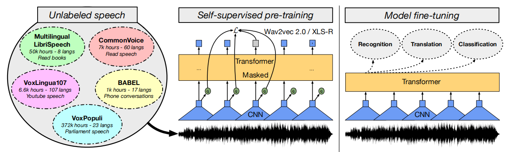

In NLP, language models are trained on very large datasets, spanning
billions of documents from public datasets such as CC100 or mC4 to fit
models with billions of parameters. XLS-R was an attempt to apply the
same in speech. XLS-R is a large-scale model with up to 2 billion
parameters pre-trained on 436K hours of unannotated speech data
leveraging the new publicly available
[VoxPopuli](https://github.com/facebookresearch/voxpopuli) data
comprising 372K hours of unannotated speech along with
[MLS](https://www.openslr.org/94/) corpus,
[CommonVoice](https://commonvoice.mozilla.org/en/languages),
[BABEL](https://catalog.ldc.upenn.edu/byyear), and
[VoxLingua107](http://bark.phon.ioc.ee/voxlingua107/) to cover 128
different languages from various regions of the world. The distribution
of the data used is shown of the following figure:

    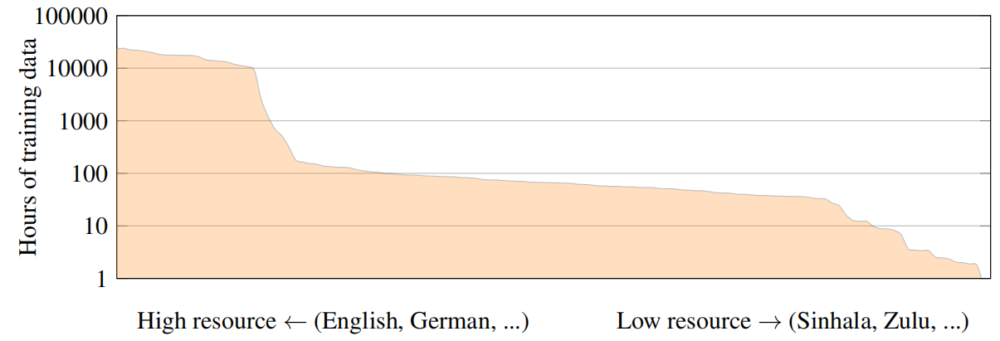

> **Note:**\
XLS-R name was inspired by
[XLM-R](https://anwarvic.github.io/cross-lingual-lm/XLM-R) in NLP.

In the paper, they experimented with different architectures with
between 0.3 billion parameters to 2 billion parameters as shown in the
following table:

    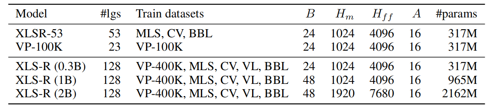

Speech Translation
------------------

To build speech translation models using XLS-R models, they stacked a
decoder on top of XLS-R which is a
[Transformer](https://anwarvic.github.io/machine-translation/Transformer)
network with $12$ layers, embedding size $1024$, $16$ attention heads
and feed forward network dimension $4096$. The decoder network was
initialized with weights from multilingually fine-tuned
[mBART](https://anwarvic.github.io/multilingual-nmt/mBART) and uses the
same vocabulary with $250K$ subwords. The total size of the decoder
network is $459M$ parameters. Then, they multilingually fine-tuned XLS-R
models to translate speech audio in one language into another language
with text as output using either one of the following two directions:

-   <u><strong>X → En:</strong></u>\
    Fine-tuning was done where English (en) is the target
    language, and X could be one of 21 languages which are Spanish (es),
    French (fr), Italian (it), Dutch (nl), Portuguese (pt), Arabic (ar),
    Catalan (ca), Welsh (cy), German (de), Estonian (et), Persian (fa),
    Indonesian (id), Japanese (ja), Latvian (lv), Mongolian (mn),
    Slovenian (sl), Swedish (sv), Tamil (ta), Turkish (tr), Chinese
    (zh):

    

        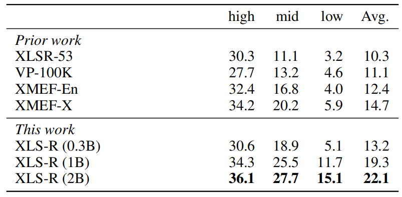
    

    The previous table shows that XLS-R (2B), improving over the
    previous best result by 7.4 BLEU scores on average over all 21
    directions. A more detailed results can be seen down below:

    

        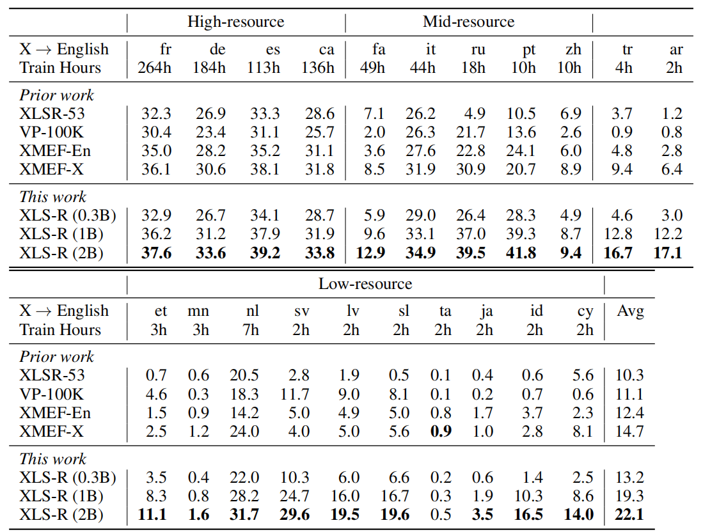
    

-   <u><strong>En → X:</strong></u>\
    Fine-tuning was done where English (en) is the source
    language, and X could be one of 15 languages which are Arabic (ar),
    Catalan (ca), Welsh (cy), German (de), Estonian (et), Persian (fa),
    Indonesian (id), Japanese (ja), Latvian (lv), Mongolian (mn),
    Slovenian (sl), Swedish (sv), Tamil (ta), Turkish (tr), Chinese (zh)
    which are the same as the other direction except: Spanish (es),
    French (fr), Italian (it), Dutch (nl), Portuguese (pt).

    

        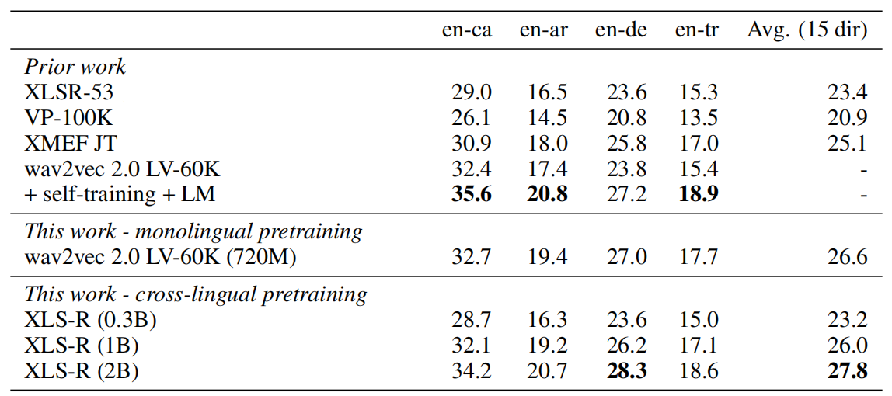
    

    The previous table shows that
    [XLSR-53](https://anwarvic.github.io/speech-recognition/XLSR) now
    performs similarly to XLS-R (0.3B) while for X → English XLS-R
    (0.3B) performed much better. This is likely because English data
    dominates the training corpus of XLSR-53 which is not the case for
    XLS-R. Both XLS-R (1B) and XLS-R (2B) outperform XMEF JT showing
    that larger capacity results in better performance. A more detailed
    results can be seen in the following table:

    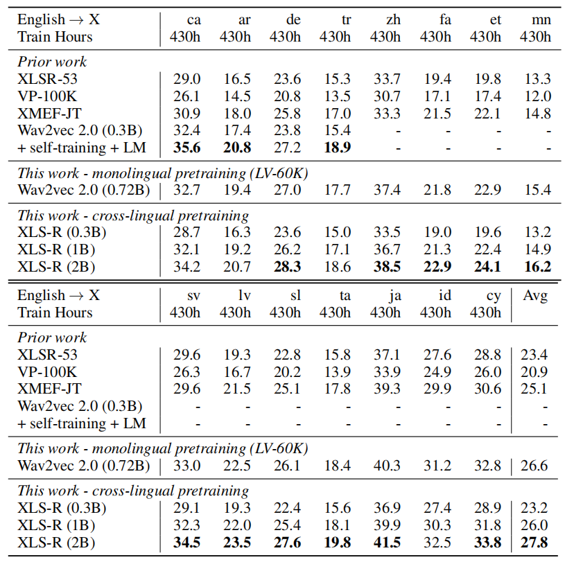

As an ablation study, they compared between multilingual fine-tuning
& bilingual fine-tuning. Multilingually fine-tuned models are
trained on labeled data from either 21 X → En directions or 15 En →
X directions. Bilingually fine-tuned models are trained on a single
pair. The following table shows the average BLEU score which
indicates that multilingual fine-tuning is particularly effective
for X → English directions.

    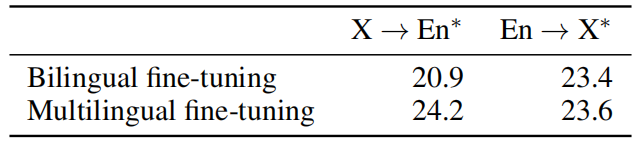

Next, they analyzed the impact of initializing the decoder network
with [mBART](https://anwarvic.github.io/multilingual-nmt/mBART) and
the following table shows that
[mBART](https://anwarvic.github.io/multilingual-nmt/mBART)
initialization has little impact on English → X but it leads to
large improvements for X → English, especially on mid- and
low-resource language directions.

    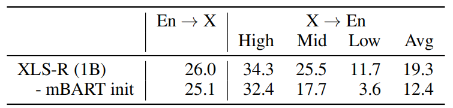

Speech Recognition
------------------

In the paper, they experimented fine-tuned XLS-R models on four
different speech recognition benchmarks covering 26 languages; which
are:

-   <u><strong>BABEL:</strong></u>\
    BABEL consists of the hardest speech recognition
    setting among the four benchmarks where languages are low-resource,
    the speech is very noisy and corresponds to natural telephone
    conversation. As shown in the following table, XLS-R (0.3B)
    outperforms the equally sized XLSR-53, which was the previous state
    of the art on all languages by an average of 1.4 WER. Using
    additional capacity, XLS-R (1B) outperforms XLS-R (0.3B) by 2.5 WER
    on average and XLS-R (2B) improves over XLS-R (1B) by 0.8 BLEU on
    average showing that additional capacity can further improve
    performance:

    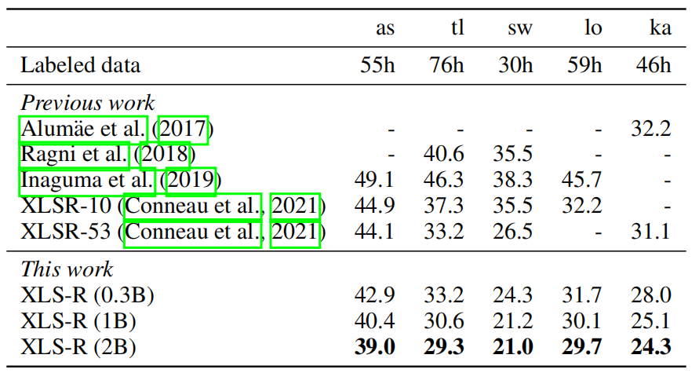

-   <u><strong>CommonVoice:</strong></u>\
    CommonVoice is an easier task than BABEL because it is read-speech.
    However, in the paper they used a reduced labeled data to be
    comparable with
    [mCPC](https://anwarvic.github.io/speech-recognition/mCPC) setup
    which introduces a different challenge. The following table shows
    that the additional training data of XLS-R (0.3) compared to
    [XLSR-53](https://anwarvic.github.io/speech-recognition/XLSR)
    results in better performance of 1.1PER (Phoneme Error Rate) on
    average. As we increase the capacity, we get better performance:

    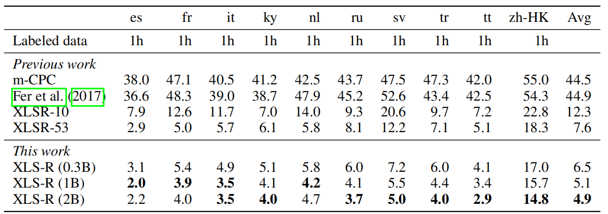

-   <u><strong>MLS:</strong></u>\
    Multilingual LibriSpeech (MLS) is a common benchmark for evaluating
    multilingual speech recognition on eight European languages. They
    only considered ten hours of labeled data for each language to be
    comparable with earlier work. The following table shows that XLS-R
    (0.3B) can outperform
    [XLSR-53](https://anwarvic.github.io/speech-recognition/XLSR) on
    average by 1 WER at equal capacity and that additional model
    capacity results in an improvement of 2.9 WER on average for XLS-R
    (1B).

    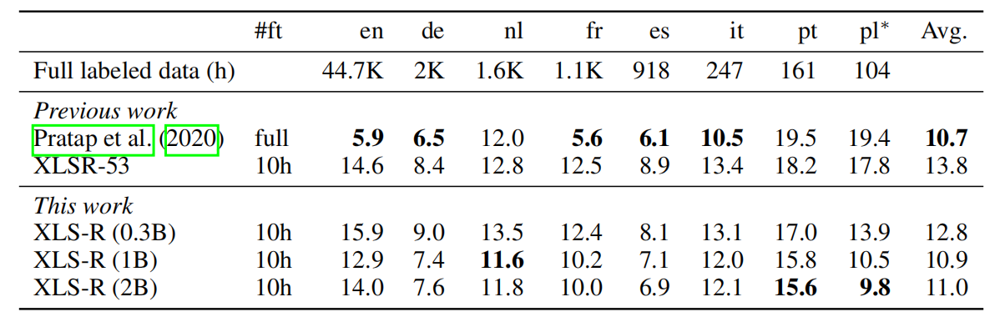

-   <u><strong>VoxPopuli:</strong></u>\
    The VoxPopuli corpus provides about 1.8K hours of labeled speech
    data in 14 languages, ranging from 543 hours for English to 35 hours
    for Slovakian, as well as about 400K hours of unlabeled speech. This
    dataset is representative of a setting where a lot of unannotated
    data in the same domain as the labeled data is available.

    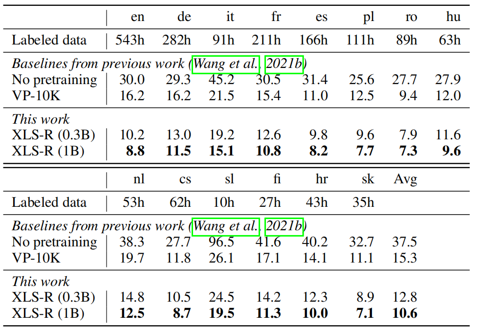

Finally if you are curious of how XLS-R is going to performed when
compared to [wav2vec
2.0](https://anwarvic.github.io/speech-recognition/wav2vec_2) on
English, then have a look at the following table where the
researchers fine-tuned XLS-R models on 10min, 1h, 10h of annotated
data. As shown below, with the same capacity and same fine-tuning
procedure, the English [wav2vec
2.0](https://anwarvic.github.io/speech-recognition/wav2vec_2)
significantly outperforms the XLS-R (0.3B) in all data regimes,
showing the capacity dilution and interference problem of our
multilingual model. However, when increasing the capacity, the model
is able to catch up with the monolingual results.

    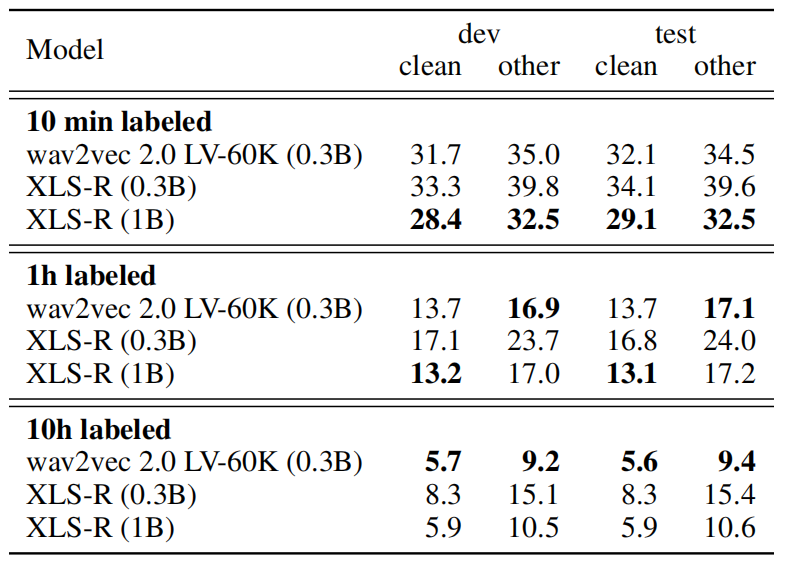

Speech Classification
---------------------

Finally, they evaluated XLS-R on language identification and speaker
identification tasks. For these tasks, they used only XLS-R (0.3B) since
these tasks require less capacity given the lower complexity of the
tasks compared to the structured prediction problems of speech
recognition and speech translation.

-   <u><strong>Language Identification:</strong></u>\
    For language identification, they used VoxLingua107 which provides
    data for 107 different languages. They fine-tuned the model on the
    official train set, and report results on the development set,
    comprising 33 languages. The following table shows that XLS-R (0.3B)
    outperforms previous work:

    

-   <u><strong>Speaker Identification:</strong></u>\
    They also considered speaker identification task on VoxCeleb1 where
    they fine-tuned XLS-R (0.3B) to distinguish between a fixed set of
    speakers given an utterance. The following table shows that XLS-R
    also performs very well for speaker identification, even though
    utterances are mostly in English:

    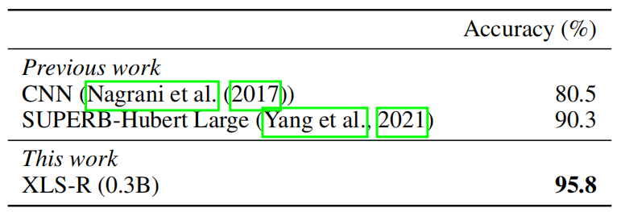

