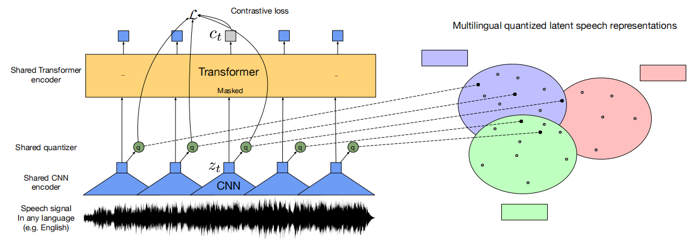
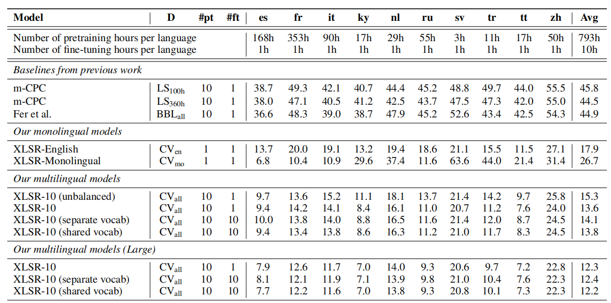
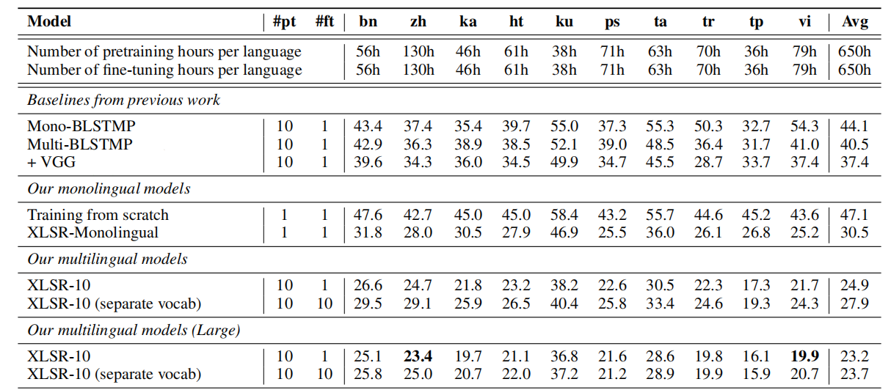
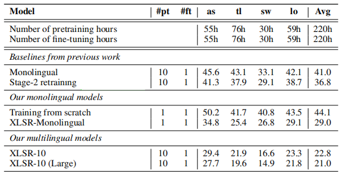
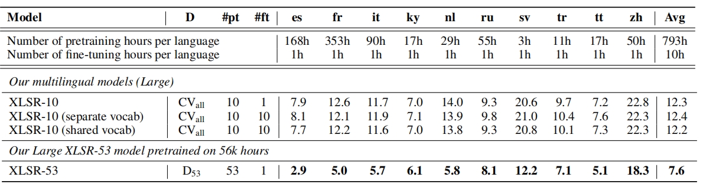
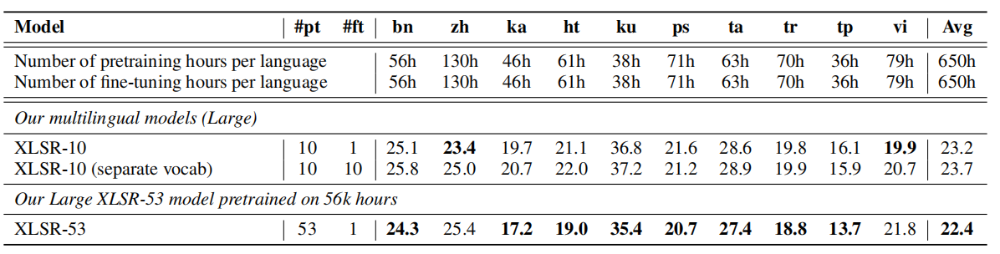
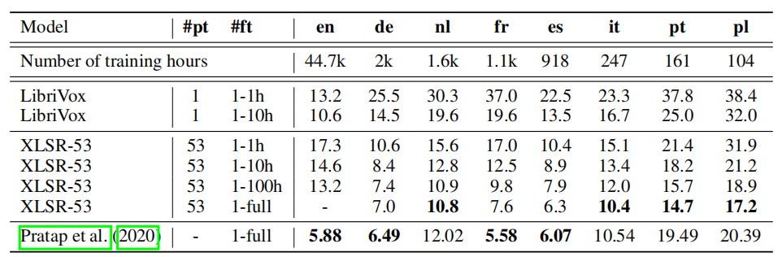

XLSR stands for "Cross-Lingual Speech Representation" which is a
large-scale multilingual speech recognition model based on [wav2vec
2.0](https://anwarvic.github.io/speech-recognition/wav2vec_2) that was
pre-trained on raw waveform files from 53 languages to perform speech
recognition task in unsupervised manner. XLSR was proposed by Facebook
AI Research in 2020 and published in their paper: "[Unsupervised
Cross-Lingual Representation Learning for Speech
Recognition](https://arxiv.org/pdf/2006.13979)". The official code of
this paper can be found as a part of FairSeq's official GitHub
repository:
[fairseq/wav2vec](https://github.com/facebookresearch/fairseq/tree/main/examples/wav2vec).

As we can see from the following figure, XLSR has the same architecture
as [wav2vec
2.0](https://anwarvic.github.io/speech-recognition/wav2vec_2), the only
difference is that XLSR was trained on multiple languages unlike
[wav2vec 2.0](https://anwarvic.github.io/speech-recognition/wav2vec_2)
which was trained only on English. The quantization in XLSR produces
**[multilingual]{.underline}** quantized speech units whose embeddings
are then used as targets for a
[Transformer](https://anwarvic.github.io/machine-translation/Transformer)
trained by contrastive learning. The model learns to share discrete
tokens across languages, creating bridges among these languages.

    

> **Note to Reader:**\
Reading the [wav2vec
2.0](https://anwarvic.github.io/speech-recognition/wav2vec_2) post is
much needed before going on reading this post.

Datasets
--------

To train XLSR models, they used three different multilingual speech
datasets:

-   [CommonVoice](https://commonvoice.mozilla.org/en/languages): is a
    multilingual corpus of read speech comprising more than two thousand
    hours of speech data in 38 languages.

-   [BABEL](https://catalog.ldc.upenn.edu/byyear): is a multilingual
    corpus of conversational telephone speech which includes 14 Asian
    and African languages.

-   [MLS](https://www.openslr.org/94/): The Multilingual LibriSpeech
    dataset is a large corpus derived from read audio books of Librivox
    and consists of 8 languages.

Pre-trained Models
------------------

During pre-training, they pre-trained two different configurations of
the XLSR model; both have the same architecture but with different
Transformer settings as seen in the following table. During fine-tuning,
a classifier representing the output vocabulary of the respective
downstream task is built on top of the model and trained on the labeled
data with a [CTC](https://anwarvic.github.io/speech-recognition/CTC)
loss.

  ----------- ------- ----------- ------------------- ------- --------- --------------------
              $$N$$   $$d_{m}$$   $$d_{\text{ff}}$$   $$h$$   dropout   Learning rate peak
  **Base**    12      768         3072                8       0.1       $$1e^{- 5}$$
  **Large**   24      1024        4096                16      0.1       $$1e^{- 3}$$
  ----------- ------- ----------- ------------------- ------- --------- --------------------

<table>
    <thead>
        <tr>
            <th></th>
            <th>BASE</th>
            <th>LARGE</th>
        </tr>
    </thead>
    <tr>
        <td><strong>$$N%%</strong></td>
        <td>12</td>
        <td>24</td>
    </tr>
    <tr>
        <td><strong>$$d_{m}$$</strong></td>
        <td>768</td>
        <td>1024</td>
    </tr>
    <tr>
        <td><strong>$$d_{\text{ff}}$$</strong></td>
        <td>3072</td>
        <td>4096</td>
    </tr>
    <tr>
        <td><strong>$$h$$</strong></td>
        <td>8</td>
        <td>12</td>
    </tr>
    <tr>
        <td><strong>dropout</strong></td>
        <td>0.1</td>
        <td>0.1</td>
    </tr>
    <tr>
        <td><strong>Learning rate peak</strong></td>
        <td>$$1e^{- 5}$$</td>
        <td>$$1e^{- 3}$$</td>
    </tr>
</table>

The following is a list of all pre-trained models in the paper:

-   **XLSR-English:** It is an XLSR-base model pre-trained on only
    English audio data.

-   **10x XLSR-Monolingual:** They are 10 different XLSR-base models,
    each is pre-trained on audio data from one language. These languages
    are: Spanish (es), French (fr), Italian (it), Kyrgyz (ky), Dutch
    (du), Russian (ru), Swedish (sv), Turkish (tr), Tatar (tt) and
    Chinese (zh).

-   **XLSR-10:** It is a multilingual XLSR-base and large model
    pre-trained on 10 different languages. These languages are: Spanish
    (es), French (fr), Italian (it), Kyrgyz (ky), Dutch (du), Russian
    (ru), Swedish (sv), Turkish (tr), Tatar (tt) and Chinese (zh).

-   **XLSR-53:** It is a XLSR-large model pre-trained on 56,000 hour
    audio data from 53 different languages.

Experiments & Results
---------------------

In the first experiment, they tried to compare between XLSR-Monolingual
and XLSR-10 pre-trained models fine-tuned individually on
[CommonVoice](https://commonvoice.mozilla.org/en/languages). As we can
see from the following table, XLSR-10 (base) obtains $13.6$ PER (Phoneme
Error Rate) on average which is a relative PER reduction of $49\%$
compared to XLSR-Monolingual. XLSR-10 (large) obtains 12.2 PER on
average which is PER reduction of $72\%$ relative to
[mCPC](https://anwarvic.github.io/speech-recognition/mCPC):

    

Same experiment was applied on different languages from
[BABEL](https://catalog.ldc.upenn.edu/byyear) dataset, and similar
results were found. XLSR-10 (base) improves over XLSR-Monolingual by
$18\%$ relative CER (Character Error Rate). XLSR-10 (large) XLSR-10
Large reduces CER by $38\%$ relative to multi-BLSTMP+VGG baseline:

    

These results show that **[the approach used to train XLSR is very
effective for learning generic cross-lingual representations in an
unsupervised way]{.underline}**. Also, it shows that cross-lingual
transfer are **[particularly effective on low-resource
languages]{.underline}** such as Swedish (sv) and Turkish (tr).

To better assess the cross-lingual transfer of the learned
representations, they decided to evaluate the XLSR-10 model trained on
[BABEL](https://catalog.ldc.upenn.edu/byyear) dataset using four
languages not seen during pre-training. They fine-tuned this model on
each language, and compare it to monolingual models pretrained
specifically on these languages. The following table shows that XLSR-10
still outperforms XLSR-Monolingual.

    

This further suggests that **[the learned representations capture
generic features of the speech signal which transfer to many
languages]{.underline}**.

XLSR-53
-------

When we fine-tune the pretrained model on each language individually,
then we end up with a different model for each language. On the other
hand, multilingual speech recognition aims to build a single model for
all languages that performs as well or better than individual
monolingual models. In the paper, they have trained an XLSR-large model
on 53 different languages using 56,000 hour audio data. XLSR-53
outperformed all other pre-trained models on all languages as shown in
the following two tables (the first table for
[CommonVoice](https://commonvoice.mozilla.org/en/languages) dataset, and
the other for [BABEL](https://catalog.ldc.upenn.edu/byyear) dataset):

    

    

On the [MLS](https://www.openslr.org/94/) dataset, they fine-tuned
XLSR-53 on 1h, 10h, 100h and full data to evaluate the few-shot
capability of the model. As shown from the WER reported in the following
table, XLSR-53 signicantly outperforms the LibriVox [wav2vec
2.0](https://anwarvic.github.io/speech-recognition/wav2vec_2) model on
all languages except English and by significant margin:

    

