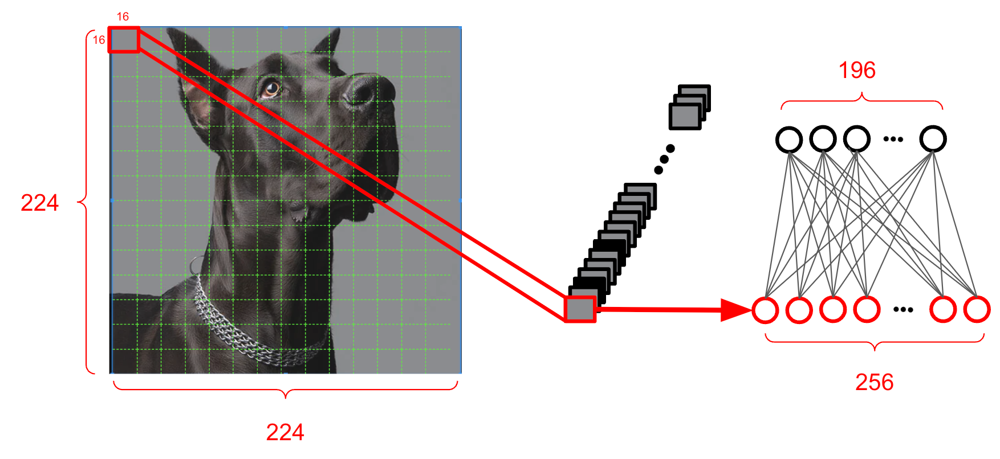

data2vec is a framework proposed by Meta in 2022 that uses
self-supervised learning on "speech, text, and image" modalities to
create a single framework that works for all three. So, instead of using
[word2vec](https://anwarvic.github.io/word-embedding/word2vec),
[wav2vec](https://anwarvic.github.io/speech-recognition/wav2vec), or
image2vec, we can use data2vec instead. This work could be a step closer
to models that understand the world better through multiple modalities.
data2vec was published in this paper: [data2vec: A General Framework for
Self-supervised Learning in Speech, Vision and
Language](https://arxiv.org/pdf/2202.03555.pdf). The official code for
data2vec can be found as part of Fairseq framework on GitHub:
[fairseq/data2vec](https://github.com/facebookresearch/fairseq/tree/main/examples/data2vec).

The core idea behind data2vec is instead of predicting modality-specific
targets (e.g speech-units, sub-words, or visual tokens), data2vec is
trained to predict contextualized latent representations (layers'
weights) which removes the dependence on modality-specific targets in
the learning task. In the next part, we are going to see how data2vec
made this possible.

## Feature Encoding

Given an input data of different modalities (images, audio, and text),
data2vec first uses modality-specific encoders to encode these inputs.
The following are the different encoders used per modality:

-   <u><strong>Computer Vision:</strong></u>\
    They used the [ViT](https://arxiv.org/pdf/2010.11929.pdf) (Vision
    Transformer) strategy of taking $224 \times 224$ images as input and
    treats them as a sequence of fourteen $16 \times 16$ patches. Then,
    each patch is linearly transformed and a sequence of $196$
    representations.

    

-   <u><strong>Speech Processing:</strong></u>\
    They used the "feature encoder" module of the Wav2Vec
    [2.0](https://anwarvic.github.io/speech-recognition/wav2vec_2) model
    which consists of $7$ temporal convolutions with $512$ channels,
    strides $\lbrack 5,2,2,2,2,2,2\rbrack$ and kernel widths
    $\lbrack 10,3,3,3,3,2,2\rbrack$. This results in an encoder output
    frequency of $50\ Hz$ with a stride of about $20ms$ between each
    sample, and a receptive field of $400$ input samples or $25ms$ of
    audio. The raw waveform input to the encoder is normalized
    $(\mu = 0,\ \sigma = 1)$.

    

-   <u><strong>NLP:</strong></u>\
    They used the word embeddings layer of
    [RoBERTa](https://anwarvic.github.io/language-modeling/RoBERTa),
    which is Meta's re-implementation of
    [BERT](https://anwarvic.github.io/language-modeling/BERT) after
    tokenized the input textual data using a byte-pair encoding (BPE) of
    $50K$ tokens.

## Pre-Training

Now that all three different modalities have been encoded into
encodings, the next step is to train data2vec model using these
encodings as input; which is done in two modes simultaneously (at the
same time) as shown in the following figure:

    

1.  <u><strong>Teacher Mode:</strong></u>\
    data2vec model uses the input encodings (without masking) to produce
    latent representations.

2.  <u><strong>Student Mode:</strong></u>\
    The same data2vec model uses masked encodings, produced using
    different masking strategy depending on the modality, and tries to
    restore the same latent representations formed in the top-K layers
    of the teacher mode.

> **Notes:**\
In this paper, they used the standard
[Transformer](https://anwarvic.github.io/machine-translation/Transformer)-encoder
architecture as the data2vec model. However alternative architectures may be
equally applicable.

### Teacher Mode

In this part, we are going to discuss the data2vec training in the
teacher mode. In this mode as shown in the following figure, the
data2vec model is trained from scratch using unmasked encodings to
predict these input encodings.

    

In this mode, the data2vec model works as an AutoEncoder. However, the
encodings in data2vec are parameterized by Exponentially Moving Average
(EMA) according to the following equation:

$$\theta_{t} \leftarrow \tau\theta_{t} + (1 - \tau)\theta_{s}$$

Where $\theta_{t}$ and $\theta_{s}$ are the model weights in the
teacher-mode and student-mode respectively, $\tau$ is a scheduler that
linearly increases over time from a starting value $\tau_{0}$ to a final
value $\tau_{e}$ over $\tau_{n}$ updates. After which, the value is kept
the same for the remainder of training. This leads to the teacher being
updated more frequently at the beginning of training, when the model is
random, and less frequently later in training, when good parameters have
already been learned.

During training in teacher mode, data2vec constructs training targets
for the student mode. More formally, given a data2vec network $f_{t}$ of
$L$ total layers, the layer's output at time-step $t$ (denoted as
$a_{t}^{l}$) is the last residual connection. The training targets are
constructed using the top $K$ layers according to the following steps:

1.  For every layer $l$, the top $K$ layers are nomralized at every
    time-step $t$ to obtain ${\widehat{a}}_{t}^{l}$.

2.  Then, all outputs of the top $K$ layers are averaged together:

    $$y_{t} = \frac{1}{K}\sum_{l = L - K + 1}^{L}{\widehat{a}}_{t}^{l}$$

3.  Finally, given an input $x$ and training targets $y_{t}$, a smooth
    L1 loss is used to train data2vec in student mode where $\beta$
    controls the transition from a squared loss to an L1 loss, depending
    on the size of the gap between the teacher's prediction $y_{t}$ and
    the student prediction $f_{t}(x)$ at time-step $t$. The advantage of
    this loss is that it is less sensitive to outliers:

$$\mathcal{L}\left( y_{t},\ f_{t}(x) \right) = \left\{ \begin{matrix}
\begin{matrix}
\frac{1}{2}\frac{\left( y_{t} - f_{t}(x) \right)^{2}}{\beta} & \left| y_{t} - f_{t}(x) \right| \leq \beta \\
\end{matrix} \\
\begin{matrix}
\left| y_{t} - f_{t}(x) \right| - \frac{1}{2}\beta & otherwise \\
\end{matrix} \\
\end{matrix} \right. $$

> **Notes:**
>
> -  For speech representations, they used instance normalization without
    any learned parameters, while for NLP and vision they used
    parameter-less layer normalization.
>
> - The targets resulted from the teacher mode are "contextualized
    targets" since it incorporates information about the entire input
    instead of part of the input as it happens with wav2vec.

### Student Mode

Now that we are familiar with how training happens in the teacher mode
along with how the training targets are created. Let's see how data2vec
model is trained in the student mode.

    

As shown in the previous figure, the first thing that happens is masking
the input encodings which differs based on the input data modality. The
following are the different masking strategies used in the student mode
depending on the input modality:

-   <u><strong>Computer Vision:</strong></u>\
    They followed the [BEiT paper](https://arxiv.org/pdf/2106.08254.pdf)
    by masking blocks of multiple adjacent patches. Different to the
    previous work, they found it's better to mask $60\%$ of the patches
    instead of $40\%$.

-   <u><strong>Speech Processing:</strong></u>\
    The masking strategy is also identical to Wav2Vec
    [2.0](https://anwarvic.github.io/speech-recognition/wav2vec_2) as
    they sample $p = 0.065$ of all time-steps to be starting indices and
    mask the subsequent $10$ time-steps. This results in approximately
    $49\%$ of all time-steps to be masked for a typical training
    sequence.

-   <u><strong>NLP:</strong></u>\
    They used [BERT](https://anwarvic.github.io/language-modeling/BERT)
    masking strategy to mask $15\%$ of uniformly selected tokens; such
    as that $80\%$ are replaced by a learned mask token, $10\%$ are left
    unchanged and $10\%$ are replaced by randomly selected vocabulary
    token. They also explored using [wav2vec
    2.0](https://anwarvic.github.io/speech-recognition/wav2vec_2)
    strategy of masking spans of four tokens.

After masking the data encodings, the model is trained to predict
the training targets constructed in the teacher mode.

> **Note:**\
After pretraining, they use data2vec as the encoder and fine-tune it
on labeled data and train it to minimize a cross-entropy (CE)
criterion.

## Experiments & Results

The main architecture for data2vec is the
[Transformer](https://anwarvic.github.io/machine-translation/Transformer)
architecture. In the paper, they created two different sizes of
data2vec: data2vec Base and data2vec Large, containing parameters as
shown in the following table; and they trained data2vec on a
modality-specific task as we are going to see next.

<table>
    <thead>
        <tr>
            <th></th>
            <th>$$L$$</th>
            <th>$$d_{m}$$</th>
            <th>$$d_{\text{ff}}$$</th>
            <th>$$h$$</th>
        </tr>
    </thead>
    <tr>
        <td><strong>Base</strong></td>
        <td>12</td>
        <td>768</td>
        <td>3072</td>
        <td>12</td>
    </tr>
    <tr>
        <td><strong>Large</strong></td>
        <td>6</td>
        <td>1024</td>
        <td>4096</td>
        <td>16</td>
    </tr>
</table>

### Computer Vision

They pre-trained the two sizes of data2vec on images from ImageNet-1K
training set according to the hyper-parameters shown in the following
table; for optimization, they used Adam optimizer with consine schedule
with a single cycle where they warm up the learning rate. Also, they use
a constant value $\tau$ of with no schedule.

<table>
    <thead>
        <tr>
            <th></th>
            <th>$$\beta$$</th>
            <th>$$bs$$</th>
            <th>$$K$$</th>
            <th>$$\tau$$</th>
            <th>$${lr}_{start}$$</th>
            <th>$${lr}_{end}$$</th>
            <th>warmup epochs</th>
            <th>train epochs</th>
        </tr>
    </thead>
    <tr>
        <td><strong>Base</strong></td>
        <td>2</td>
        <td>2048</td>
        <td>6</td>
        <td>0.9998</td>
        <td>0.002</td>
        <td>0.001</td>
        <td>40</td>
        <td>800</td>
    </tr>
    <tr>
        <td><strong>Large</strong></td>
        <td>2</td>
        <td>8192</td>
        <td>6</td>
        <td>0.9998</td>
        <td>0.002</td>
        <td>0.001</td>
        <td>80</td>
        <td>1600</td>
    </tr>
</table>

After pre-training, they fine-tuned the resulting model for image
classification task using the labeled data of the same benchmark. To do
so, they average-pooled the output of the last layer and input it to a
softmax-normalized classifier. Fine-tuning was done according to the
following hyper-parameters:

<table>
    <thead>
        <tr>
            <th></th>
            <th>$$lr$$</th>
            <th>warmup epochs</th>
            <th>finetuning epochs</th>
        </tr>
    </thead>
    <tr>
        <td><strong>Base</strong></td>
        <td>0.004</td>
        <td>20</td>
        <td>100</td>
    </tr>
    <tr>
        <td><strong>Large</strong></td>
        <td>0.004</td>
        <td>5</td>
        <td>50</td>
    </tr>
</table>

Following standard practice, models were evaluated in terms of top-1
accuracy on the validation set. The following table shows that data2vec
outperforms prior work with both base and large sizes in the single
model; and large size in the multiple models.

    

### Speech Processing

They pre-trained the two sizes of data2vec on the 960 hours
[LibriSpeech](https://www.openslr.org/12), which contains speech from
audiobooks in English, according to the hyper-parameters shown in the
following table:

<table>
    <thead>
        <tr>
            <th></th>
            <th>$$bs$$</th>
            <th>$$K$$</th>
            <th>$$\tau_0$$</th>
            <th>$$\tau_e$$</th>
            <th>$$\tau_n$$</th>
            <th>train updates</th>
        </tr>
    </thead>
    <tr>
        <td><strong>Base / Large</strong></td>
        <td>63 mins</td>
        <td>8</td>
        <td>0.999</td>
        <td>0.9999</td>
        <td>30k</td>
        <td>400k</td>
    </tr>
</table>

For optimization, they used Adam optimizer with a peak learning rate of
$5 \times 10^{- 4}$ with a tri-stage scheduler which linearly warms up
the learning rate over the first $3\%$ of updates and holds it for
$90\%$ and then linearly decays it over the remaining $7\%$. The
following table shows the results on librispeech test-other when
fine-tuning pre-trained models on the libri-light low-resource labeled
data. As you can see, improvements can be seen when adding more and more
labeled data across both data2vec sizes surpassing other models such as
[wav2vec 2.0](https://anwarvic.github.io/speech-recognition/wav2vec_2),
[HuBERT](https://anwarvic.github.io/speech-recognition/HuBERT), and
[WavLM](https://anwarvic.github.io/speech-recognition/WavLM).

    

To further validate these results, they also used the AudioSet benchmark
where they used the same pre-training hyper-parameters as before while
increasing $K$ to $12$ and training for fewer steps ($200k$) with bigger
batch size ($94.5\ mins$). Also, they applied DeepNorm and layer
normalization to stabilize pre-training. Finetuning was done on the
balanced subset for $13k$ steps and a batch size of $21.3\ mins$.
Results are shown in the following table which shows that data2vec can
outperform comparable setups that uses the same pre-training and
fine-tuning data:

    

### NLP

They pre-trained data2vec on the same pretraining setup of
[BERT](https://anwarvic.github.io/language-modeling/BERT) on the Books
Corpus and English Wikipedia data using Adam optimizer with a tri-stage
learning scheduler according to the following hyper-parameters:

<table>
    <thead>
        <tr>
            <th></th>
            <th>$$bs$$</th>
            <th>$$K$$</th>
            <th>$$\beta$$</th>
            <th>$$\tau_0$$</th>
            <th>$$\tau_e$$</th>
            <th>$$\tau_n$$</th>
            <th>train updates</th>
        </tr>
    </thead>
    <tr>
        <td><strong>Base</strong></td>
        <td>256</td>
        <td>10</td>
        <td>4</td>
        <td>0.999</td>
        <td>0.9999</td>
        <td>100k</td>
        <td>1M</td>
    </tr>
</table>

After pre-training, they fine-tuned the result model on the GLUE
benchmarks separately on the labeled data provided by each task. The
average accuracy on the development sets over fine fine-tuning runs are
reported below:

    

The previous table shows that data2vec outperforms
[RoBERTa](https://anwarvic.github.io/language-modeling/RoBERTa) baseline
and its performance is improved once using the [wav2vec
2.0](https://anwarvic.github.io/speech-recognition/wav2vec_2) masking
that spans four tokens.

## Ablation

To examine the impact of different components about data2vec, authors
have performed multiple ablation studies as we are going to see next:

-   <u><strong>Top-K layers:</strong></u>\
    They measured the performance across all three modalities when
    average the top-K layers of the teacher mode that are used to create
    the training targets for the student model. For faster training,
    they used the data2vec base model. Results are shown in the
    following figure where we can see that "speech" needs more averaging
    deeper layers unlike "NLP" and "Vision".

    

-   <u><strong>Masked Ratio:</strong></u>\
    They measures the effect of masked ratio on the performance. So,
    they masked all but a fraction of the data when constructing the
    target representations in the teacher for pre-training and report
    downstream performance for speech and vision.

    

