data2vec 2.0 is the subsequent version of
[data2vec](https://anwarvic.github.io/speech-recognition/data2vec) which
improves the compute efficiency by using efficient data encoding, fast
convolutional decoder, and different masked versions of each sample.
data2vec 2.0 was proposed by Meta in late 2022 and published in this
paper: [Efficient Self-supervised Learning with Contextualized Target
Representations for Vision, Speech and
Language](https://arxiv.org/pdf/2212.07525.pdf). The official code for
data2vec 2.0 can be found as part of Fairseq framework on GitHub:
[fairseq/data2vec](https://github.com/facebookresearch/fairseq/tree/main/examples/data2vec).

## data2vec Recap

Since the core structure of data2vec 2.0 is built on
[data2vec](https://anwarvic.github.io/speech-recognition/data2vec), then
let's recap how
[data2vec](https://anwarvic.github.io/speech-recognition/data2vec)
worked and what the main components of its architecture and how its
training procedure looked like.
[data2vec](https://anwarvic.github.io/speech-recognition/data2vec) is a
framework that uses self-supervised learning on "speech, text, and
image" modalities to create a single multi-modal that works for all
three. So, instead of using
[word2vec](https://anwarvic.github.io/word-embedding/word2vec),
[wav2vec](https://anwarvic.github.io/speech-recognition/wav2vec), or
image2vec, we can use
[data2vec](https://anwarvic.github.io/speech-recognition/data2vec)
instead.

The main architecture for data2vec is the
[Transformer](https://anwarvic.github.io/machine-translation/Transformer)
architecture; and it is trained in two modes as shown in the following
figure:

    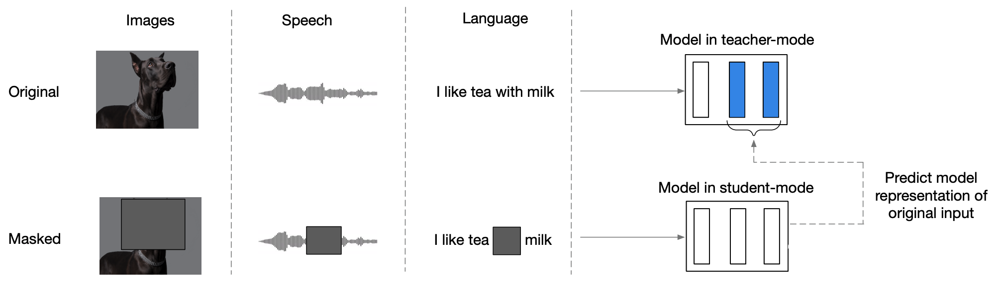

1.  <u><strong>Teacher Mode:</strong></u>\
    [data2vec](https://anwarvic.github.io/speech-recognition/data2vec)
    model uses the modality-specific features encoders to produce
    feature encoders for the input data (without masking) which can be
    used by the
    [data2vec](https://anwarvic.github.io/speech-recognition/data2vec)
    model to produce latent representations.

2.  <u><strong>Student Mode:</strong></u>\
    The same
    [data2vec](https://anwarvic.github.io/speech-recognition/data2vec)
    model uses masked encodings, produced using different masking
    strategy depending on the modality, and tries to restore the same
    latent representations formed in the top-K layers of the teacher
    mode.

## data2vec vs data2vec 2.0

data2vec 2.0 is a more efficient version of
[data2vec](https://anwarvic.github.io/speech-recognition/data2vec) where
it achieves 2-16x faster performance at similar accuracy on image
classification, speech recognition, and natural language understanding.
The main differences between data2vec 2.0 and its former version
([data2vec](https://anwarvic.github.io/speech-recognition/data2vec)) can
be summarized as the following:

-   <u><strong>Learning Objectives:</strong></u>\
    For the sake of simplicity, data2vec 2.0 uses L2 loss function on
    the target representation from the teacher model $y_{t}$ and the
    student network's predictions $f_{t}(x)$ instead of the smoothed L1
    loss function used with
    [data2vec](https://anwarvic.github.io/speech-recognition/data2vec) :

$$\mathcal{L}\left( y_{t},\ f_{t}(x) \right) = \left( y_{t} - f_{t}(x) \right)^{2}$$

-   <u><strong>Optimized Masking:</strong></u>\
    To improve efficiency, they only encoded the unmasked time-steps of
    a training example and replaced the masked portions with a random
    Gaussian noise.

    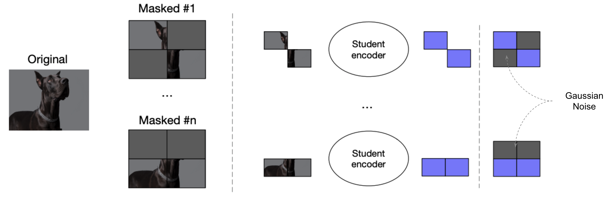

-   <u><strong>Convolutional Decoder:</strong></u>\
    In data2vec 2.0, they added a lightweight decoder consisting of $D$
    convolutions, each followed by layer normalization, a $GELU$
    activation function, and a residual connection. For speech and text,
    they used 1-D convolutions; and for images, they used 2-D
    convolutions. The number of layers and kernel sizes are tuned for
    each modality.

    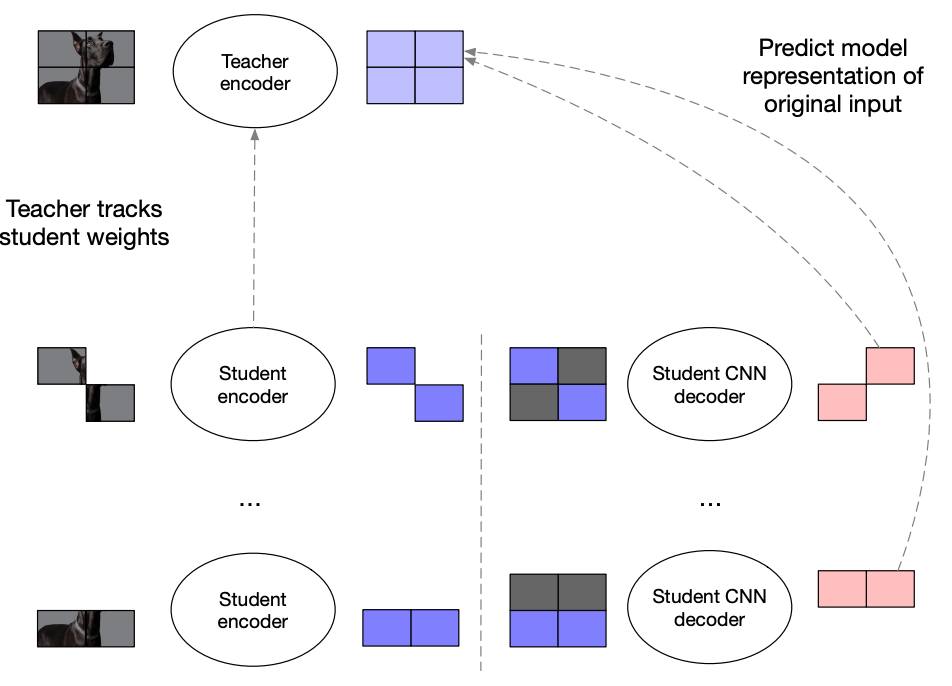

-   <u><strong>Multi-task Training:</strong></u>\
    [data2vec](https://anwarvic.github.io/speech-recognition/data2vec)
    teacher-student setup was processing each sample twice: once to
    obtain targets (in teacher mode), and once to obtain masked
    predictions (in student mode). To amortize the cost of obtaining
    targets in teacher model, they created $M$ different masked versions
    of the same training sample. As $M$ grows, the computational
    overhead of computing target representations becomes negligible.

    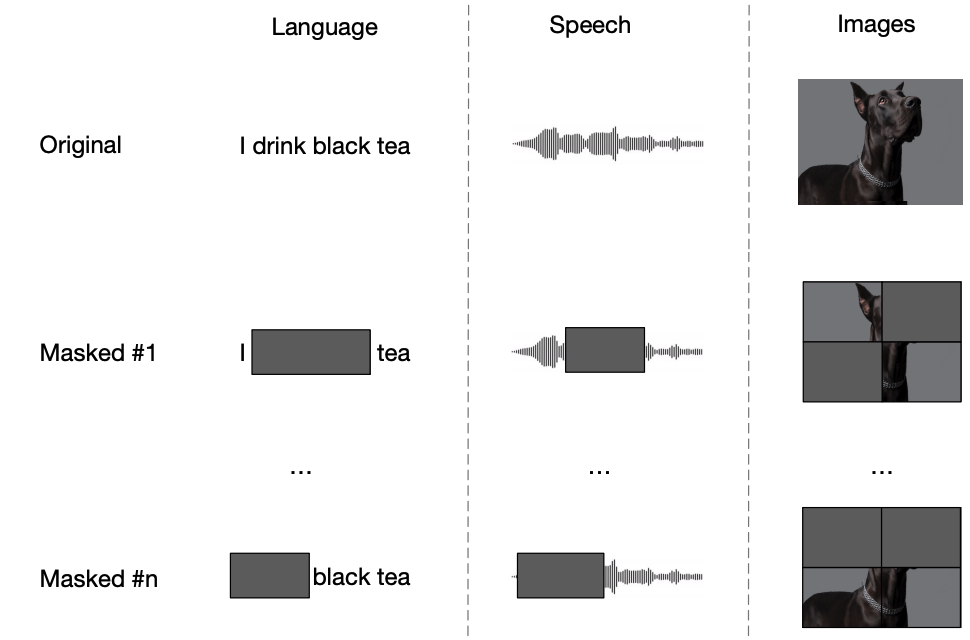

-   <u><strong>Inverse Block Masking:</strong></u>\
    Given a block/batch of size $T \times B$ (for text & speech) or
    $T \times B \times B$ (for image) with $T$ time-steps and $B$ batch
    size. Instead of choosing which time-steps to mask as
    [data2vec](https://anwarvic.github.io/speech-recognition/data2vec),
    they first sample a few time-steps according to the following
    equation; then they expand it symmetrically till the full width of
    the batch knowing that $R$ is the mask ratio that controls the
    percentage of masking and $A$ is the adjust value.

$$T \times \frac{(1 - R) + A}{B}$$

## Experiments & Results

In this section, we are going to discuss the different experiments they
performed in the paper. These experiments cover the three input
modalities (image, speech and text) and different datasets, allowing
them to evaluate the model\'s performance under various conditions.

### Efficiency

As a first experiment, they compared the efficiency of data2vec 2.0
pre-training to the older version
[data2vec](https://anwarvic.github.io/speech-recognition/data2vec) for
computer vision, speech processing and NLP; and MAE (Masked Encoders)
for computer vision. The pre-training speed is measured in terms of wall
clock hours. The following figure shows that data2vec 2.0 provides a far
better speed and accuracy trade-off than
[data2vec](https://anwarvic.github.io/speech-recognition/data2vec) in
all three modalities: $16.4 \times$ speedup on the image modality,
$10.6 \times$ speedup on the speech modality, and $2 \times$ speed on
text modality:

    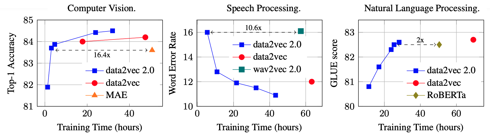

### Computer Vision

Next, they compared data2vec 2.0 for the image modality. The following
table shows that data2vec 2.0 improves over single models using no
external data while training for far fewer epochs. Compared to
[data2vec](https://anwarvic.github.io/speech-recognition/data2vec), it
achieves slightly higher accuracy at far fewer epochs.

    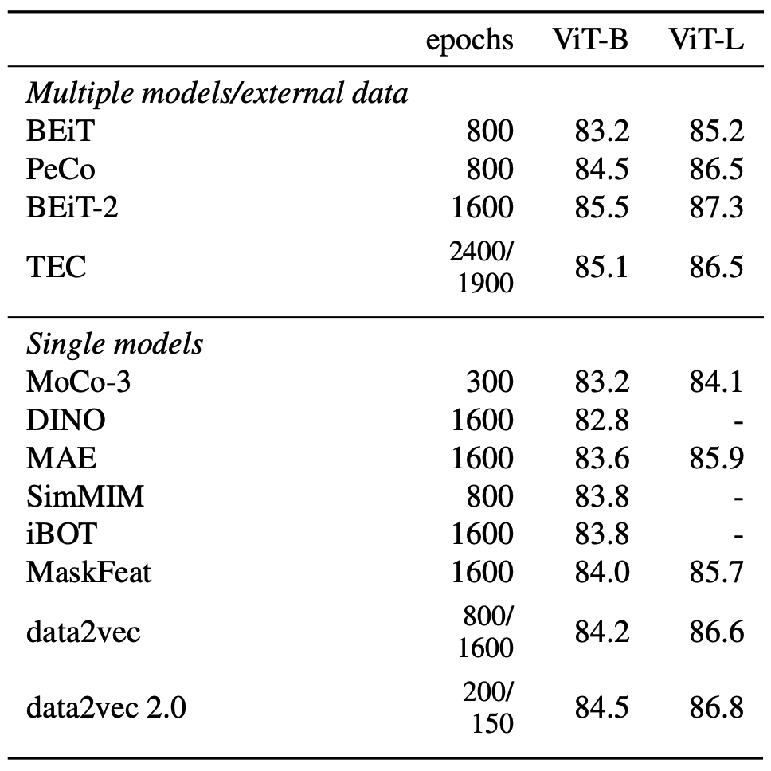

### Speech Processing

They used the same setup as
[data2vec](https://anwarvic.github.io/speech-recognition/data2vec) where
they pretrained the model on Librispeech and Librilight. For more
details about the different hyper-parameters they used while
pre-training, check out the following table:

    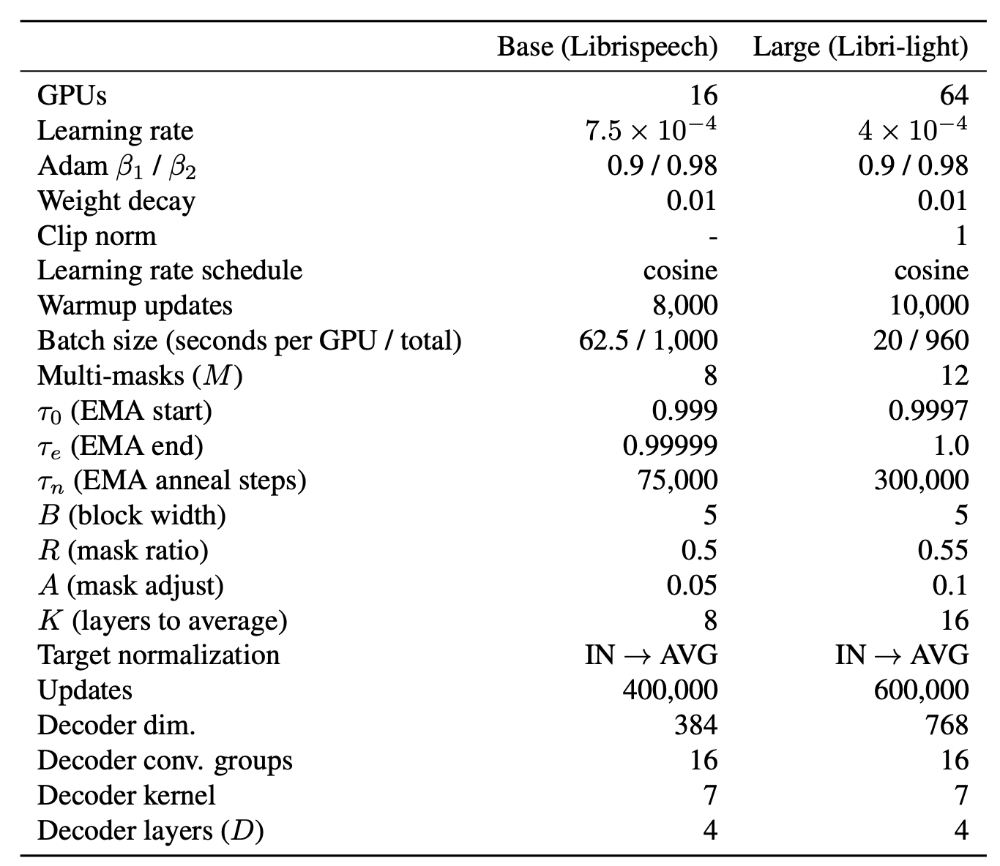

The results are reported in the following table which show that data2vec
2.0 improves in most settings over prior art in less training time:

    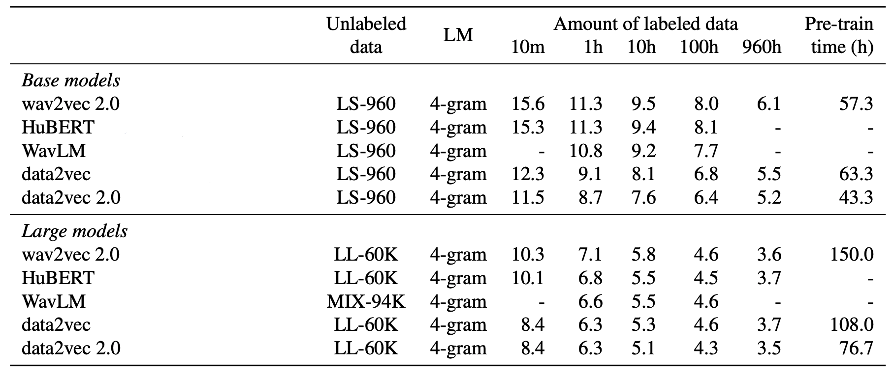

### NLP

For NLP, they used the same setup as
[data2vec](https://anwarvic.github.io/speech-recognition/data2vec) &
[BERT](https://anwarvic.github.io/language-modeling/BERT) where they
pre-trained the model on the Books Corpus and English Wikipedia data
using Adam optimizer with a tri-stage learning scheduler according to
the following hyper-parameters:

    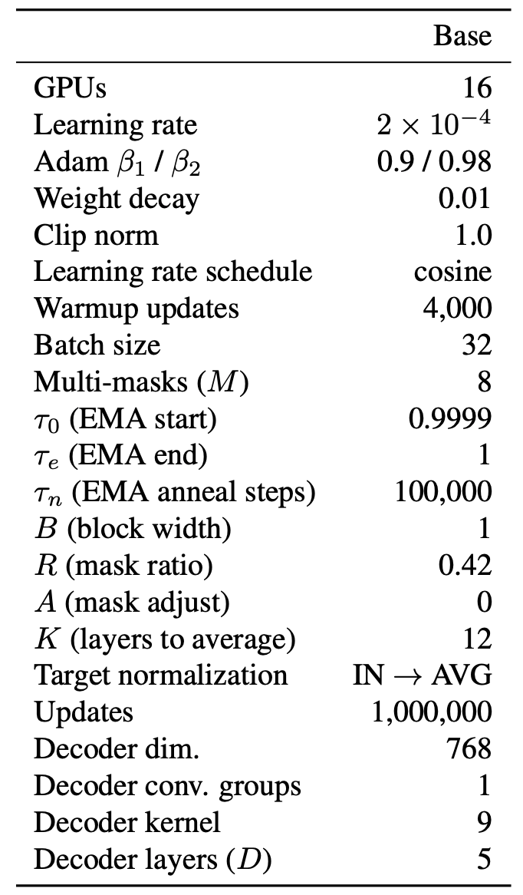

The results are reported below show that data2vec 2.0 achieves
comparable average GLUE performance to
[RoBERTa](https://anwarvic.github.io/language-modeling/RoBERTa) baseline
in $1.8 \times$ the speed and $7.8$ fewer epochs. Compared to
[data2vec](https://anwarvic.github.io/speech-recognition/data2vec) ,
there is a $2.5 \times$ speed-up. Note that data2vec 2.0 uses a much
higher masking rate of$\ 42\%$ compared to $15\%$ for
[BERT](https://anwarvic.github.io/language-modeling/BERT)
/[RoBERTa](https://anwarvic.github.io/language-modeling/RoBERTa):

    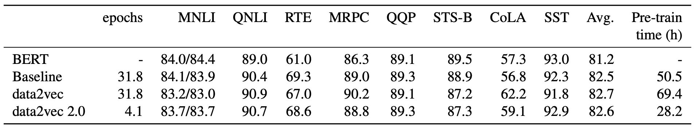

## Ablation

To examine the impact of different components about data2vec 2.0,
authors have performed multiple ablation studies as we are going to see
next:

-   <u><strong>Mutli-mask training:</strong></u>\
    They analyzed the effect of multi-masking for different block/batch
    sizes. The following figure shows that considering multiple masks
    per training sample can drastically improve accuracy. For example,
    for $bsz = 64$, increasing the number of masks to $16$ instead of
    $2$ increases the accuracy by $5.2\%$. This effect decreases with
    larger batch sizes though.

    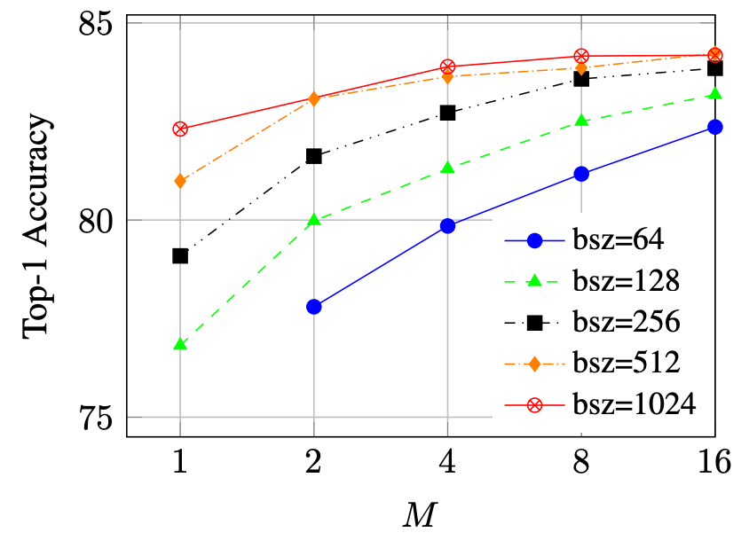

-   <u><strong>Inverse Block Masking size:</strong></u>\
    Next, they analyzed the effect of changing the block size $B$. The
    results are reported in following table:

    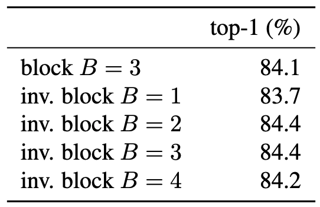

