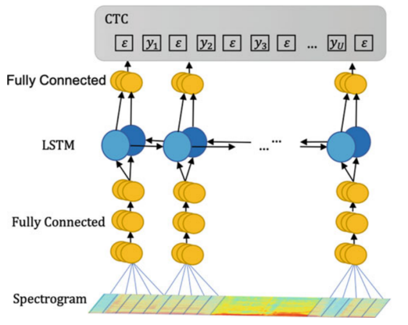
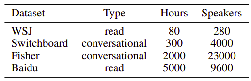

# Deep Speech
Deep Speech is a model created by Baidu in December 2014 and published
in their paper: [Deep Speech: Scaling up end-to-end speech
recognition](https://arxiv.org/pdf/1412.5567.pdf). The Deep Speech
architecture was trained to predict a sequence of character
probabilities from spectrogram.

    

The input of this model is a spectrogram frame of size $t$ along with
context of C frames on each side. C could be 5, 7, 9 frames on each
side. And the activation functions used for this network is a clipped
ReLU at 20.

$$g(z) = \min\left( \max\left( 0,\ z \right),\ 20 \right)$$

The actual architecture is composed of five hidden layers:

-   The first three layers are fully connected layers with clipped ReLU
    activation functions at 20. $W^{(l)}$ and $b^{(l)}$ are the
    weights and bias of layer $l$ respectively.

$${h_{t}}^{(l)} = g\left( W^{(l)}{h_{t}}^{(l - 1)} + b^{(l)} \right)$$

-   The fourth layer is just one bi-directional RNN. They didn't use
    LSTM as RNNs are faster. $h^{(f)}$ is the forward hypothesis
    function and $h^{(b)}$ is the backward hypothesis function:

$$h_{t}^{(f)} = g\left( W^{(4)}h_{t}^{(3)} + W_{r}^{(f)}h_{t - 1}^{(f)} + b^{(4)} \right)$$

$$h_{t}^{(b)} = g\left( W^{(4)}h_{t}^{(3)} + W_{r}^{(b)}h_{t - 1}^{(b)} + b^{(4)} \right)$$

$$h_{t}^{(4)} = h_{t}^{(f)} + h_{t}^{(b)}$$

-   The last layer is also a fully connected layer:

$${h_{t}}^{(5)} = g\left( W^{(5)}{h_{t}}^{(4)} + b^{(5)} \right)$$

-   The output layer is a standard Softmax function that yields the
    predicted character probabilities for each time slice (t) and
    character k in the alphabet:

$$h_{t,k}^{(6)} = {\widehat{y}}_{t,k} = \mathbb{P}\left( c_{t} = k \middle| x \right) = \frac{\exp\left( W_{k}^{(6)}h_{t}^{(5)} + b_{k}^{(6)} \right)}{\sum_{j}^{}{\exp\left( W_{j}^{(6)}h_{t}^{(5)} + b_{j}^{(6)} \right)}}$$

Model Details
-------------

The following are the details that were used to train the deep speech
model:

-   The model uses CTC loss.

-   The model uses NAG as Gradient descent optimizer with momentum factor = 0.99.

-   The model uses 5%-10% dropout rate for regularization in all layers
    except the recurrent one.

-   The model was trained using around 7000 hours from 37000 different
    speakers divided according to the following table:

    

The following are the details that were used for inference:

-   The model uses a beam search algorithm with a typical beam size in
    the range 1000-8000.

-   The model uses jittering (technique adapted from computer vision)
    with audio spectrogram. Inputs are translated by 5ms (half the
    context) forward and backward. And each jittered version is fed
    through the network average the results.

-   The model uses n-gram language model trained from 220 million
    utterances with vocabulary of 495,000 words.

-   The following formula is used to get the best sequence of words
    where $x$ is the context, $c$ is the characters sequence, $\alpha$
    and $\beta$ are tunable parameters that controls the trade-off
    between the acoustic model, the language model.

$$Q(c) = log\left( \mathbb{P}\left( c \middle| x \right) \right) + \alpha\ \log\left( \mathbb{P}_{\text{lm}}(c) \right) + \beta\ word\_ count(c)$$

One of the exciting components of the Deep Speech work is that the RNN
model can learn a light character-level language model during the
training procedure, producing "readable" transcripts even without a
language model. The errors that appear tend to be phonetic misspellings
of words, such as "bostin" instead of "boston".
