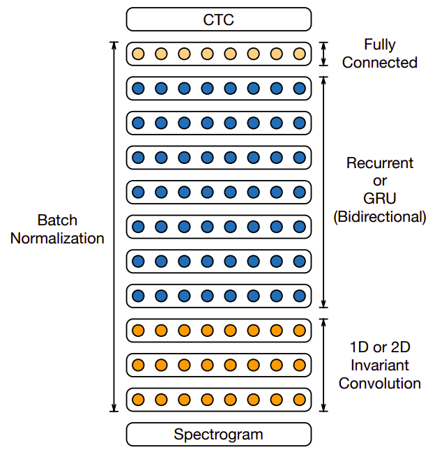
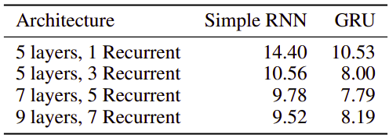
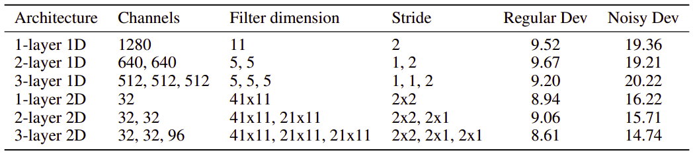
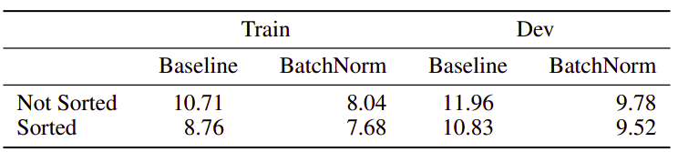

Deep Speech 2 is a model created by Baidu in December 2015 (exactly one
year after Deep Speech) and published in their paper: [Deep Speech 2:
End-to-End Speech Recognition in English and
Mandarin](https://arxiv.org/pdf/1512.02595.pdf). This paper is
considered a follow-on the Deep Speech paper, the authors extended the
original architecture to make it bigger while achieving 7× speedup and
43.4% relative improvement in WER. Also, the authors incorporating the
convolution layers as shown in the following figure:

    

The input of this model is a spectrogram frame of size $t$ along with
context of C frames on each side. C could be 5, 7, 9 frames on each
side. And the activation functions used for this network is a clipped
ReLU at 20.

$$g(z) = min\left( \max\left( 0,\ z \right),\ 20 \right)$$

The optimal architecture of Deep Speech 2 is composed of 11hidden
layers:

-   The first three layers are convolutional layers + Batch
    Normalization where $h_{t,\ i}^{l}$ is the hidden representation
    at layer $l$ and time-frame $t$ of the $i^{th}$ filter. $w_{i}^{l}$
    is the weights of the $i^{th}$ fitler at layer $l$. $\circ$ denotes
    an element-wise product and $c$ is the context window size:

$$h_{t,\ i}^{l} = g\left( w_{i}^{l} \circ h_{t - c:t + c}^{l - 1} \right)$$

-   The next seven layers are bidirectional RNN layers + Batch
    Normalization where is $\overrightarrow{h_{t}^{l}}$ the forward
    path and $\overleftarrow{h_{t}^{l}}$ is the backward path at
    time-frame $t$ at layer $l$. Wl is the input-hidden weight matrix,
    $\overrightarrow{U^{l}}$ is the forward recurrent weight matrix,
    $\overleftarrow{U^{l}}$ is the backward recurrent weight matrix,
    and $b^{l}$ is a bias term:

$$\overrightarrow{h_{t}^{l}} = g\left( W^{l}h_{t}^{l - 1} + \overrightarrow{U^{l}}\ {\overrightarrow{h}}_{t - 1}^{l} + b^{l} \right)$$

$$\overleftarrow{h_{t}^{l}} = g\left( W^{l}h_{t}^{l - 1} + \overleftarrow{U^{l}}\ {\overleftarrow{h}}_{t - 1}^{l} + b^{l}\  \right)$$

$$h_{t}^{l} = \overrightarrow{h_{t}^{l}} + \overleftarrow{h_{t}^{l}}$$

-   The last layer is just a fully connected layer).

$$h_{t}^{l} = g\left( W^{l}h_{t}^{l - 1} + b^{l} \right)$$

-   The output layer is a standard Softmax function that yields the
    predicted character probabilities for each time slice (t) and
    character k in the alphabet:

$$h_{t,k}^{(11)} = p\left( c_{t} = k \middle| x \right) = \frac{\exp\left( W_{k}^{(11)}h_{t}^{(10)} \right)}{\sum_{j}^{}{\exp\left( W_{j}^{(11)}h_{t}^{(10)} \right)}}$$

Researchers of Deep Speech 2 explored many different architectures;
varying the number of recurrent layers from 1 to 7 with both RNN and GRU
architecture while using just one 1D convolutional layer; and the
following table shows the effect on WER:

    

They also tried varying the number of convolutional layers between 1 and
3 with both RNN and GRU while using 7 layers of RNN cells; and the
following table shows the effect on WER:

    

And the optimal architecture for English transcription was the one
introduced earlier.

Model Details
-------------

The following are the details that were used to train the deep speech 2
model:

-   The model uses a vocabulary of (a, b, c, \..., z, space, apostrophe,
    blank) for English. They have added the apostrophe as well as a
    space symbol to denote word boundaries.

-   The model uses CTC loss.

-   The model uses synchronous SGD as an optimizer.

-   The model uses <u><strong>SortaGrad</strong></u> which is a technique to batch
    utterances based on the length, so longer utterances will be in
    the same batch. Then, in the first epoch, we iterate over the
    training data in increasing order of the length of utterances in
    the minibatch. After the first epoch, training reverts back to a
    random order over minibatches. The following table shows the
    effect of that technique over the WER:

    

-   The model was trained using around 11,940 hours. They, even,
    augmented the training data by adding noise to 40% of the
    utterances randomly.

    The following are the details that were used for inference:

-   The model uses a beam search algorithm with a typical beam size in
    the range 500 for English and 200 for Mandarin.

-   The model uses 5-gram language model smoothed using Kneser-Ney
    method and it was trained on 400,000 words from 250 million lines
    of text collected from the Common Crawl Repository.

-   The following formula is used to get the best sequence of words
    where $x$ is the context, $c$ is the characters sequence, $\alpha$
    and $\beta$ are tunable parameters that controls the trade-off
    between the acoustic model, the language model.

$$Q(c) = log\left( \mathbb{P}\left( c \middle| x \right) \right) + \alpha\ \log\left( \mathbb{P}_{\text{lm}}(c) \right) + \beta\ word\_ count(c)$$
