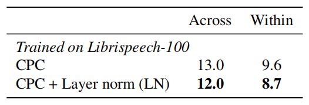
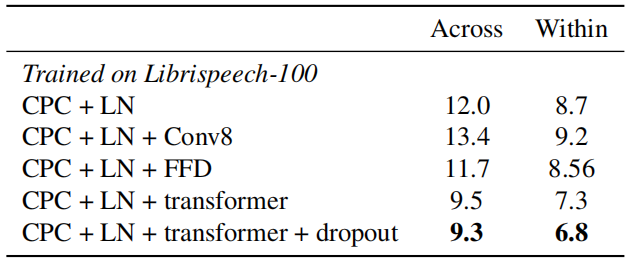
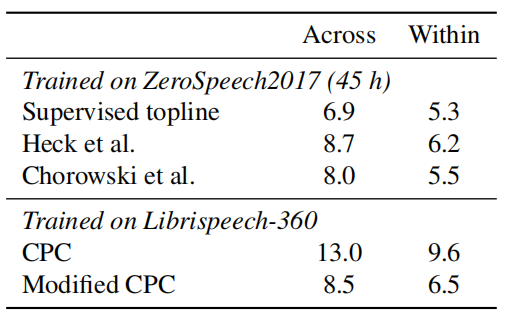
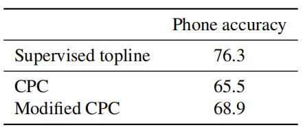
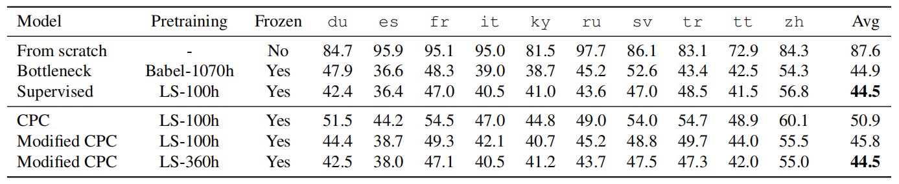
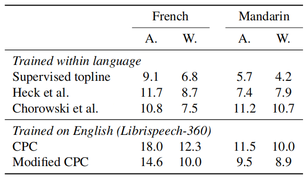

CPC stands for "Contrastive Predictive Coding" which is a learning
approach created by Deep Mind in 2018 and published in this paper
"[Representation Learning with Contrastive Predictive
Coding](https://arxiv.org/pdf/1807.03748)" to extract useful
representations from data in an unsupervised way. Researchers from
Facebook AI Research have modified the CPC method and explored how to it
to pre-train speech models using unlabeled audio data directly from raw
waveform in their paper [Unsupervised Pretraining Transfers Well Across
Languages](https://arxiv.org/pdf/2002.02848) published in 2020.

As the paper's name suggests, the researchers were also interested to
see if the modified version of CPC method can be leveraged in a
cross-lingual setting to improve the quality for low resource languages.
The official code for the CPC Audio paper can be found in Facebook
Research's official GitHub repository:
[facebookresearch/CPC\_audio](https://github.com/facebookresearch/CPC_audio).

> **Note:**\
mCPC stands for "modified CPC".

CPC
---

In this part, we are going to recap the CPC method proposed by Deep Mind
in the "[Representation Learning with Contrastive Predictive
Coding](https://arxiv.org/pdf/1807.03748)" paper. Given an audio
sequence $X$ splitted in $T$ discrete time steps, the input signal
$x_{t}$ at time step $t$ is encoded by a encoder $\text{Enc}$ to a
latent representations. Then, these latent representations are processed
by a decoder $\text{Dec}$ to form phoneme representation $z_{t}$:

$$z_{t} = \text{Dec}\left( \text{Enc}\left( x_{1} \right),\ \text{Enc}\left( x_{2} \right),\ ...\text{Enc}\left( x_{T} \right) \right)$$

In the original paper, the encoder was a 5-layer convolutional network
($k = \left( 10,8,4,4,4 \right)$, $s = \left( 5,4,2,2,2 \right)$) and
the decoder was a 1-layer [Gated Recurrent
Units](https://anwarvic.github.io/language-modeling/RNN) (GRU). The
encoder also has a down-sampling factor of $160$, meaning that for a
$16kHz$ input, each feature encodes $10ms$ of audio.

Given this phoneme embedding $z_{t}$, the CPC task is to predict the
next $K$ future representations, i.e.,
$\text{Enc}\left( x_{t + k} \right)$ for
$k \in \left\\{ 1,\ ...K \right\\}$ and it tries to push away
representations from a random subset $N_{t}$ of negative examples.
Overall, the loss function at a time step $t$ is thus:

$$\mathcal{L}_{t} = - \frac{1}{K}\sum_{k = 1}^{K}{\log\left\lbrack \frac{\exp\left( {\text{Enc}\left( x_{t + k} \right)}^{\intercal}A_{k}z_{t} \right)}{\sum_{n \in N_{t}}^{}{\exp\left( {\text{Enc}\left( n \right)}^{\intercal}A_{k}z_{t} \right)}} \right\rbrack}$$

Where $A_{k}$ is a linear classifier, which means we need to use $K$
different linear classifiers. There are many ways to sample the
"distant" windows. The original paper did that by sampling negative
utterance within the same speaker.

Modified CPC
------------

In this part, we are going to talk the modifications that the authors
did to the CPC method in this paper:

-   They replaced batch normalization with layer normalization. The
    reason is the presence of batch normalization between the layers of
    the encoder leaks information between past and future windows. This
    makes the task very trivial. The following table shows a simple
    comparison between the two normalization methods:

    

-   They replaced the $K$ linear classifiers with $K$ one-layer
    transformer networks which has access to the whole sequence
    $\left\\{ z_{1},\ ...z_{T} \right\\}$, the linear layer is too simple.
    The following table shows a simple comparison of the model's
    performance:

    

-   They reduced the dimension of the convolutional layers from $512$ to
    $256$. It didn't impact performance while reducing memory footprint.

-   Lastly, they used an LSTM decoder instead of a GRU, it slightly
    improved the performance.

Experiments
-----------

<u><strong>Models in this paper were pre-trained using the modified CTC method,
then fine-tuned on the phoneme representation task, then evaluated the
resulting models on two tasks: the phoneme separability task and the
phone classification task.</strong></u>

Pre-training was done either on the LibirSpeech 100h split, LibriSpeech
360h split, or the Babel-1070h dataset. After pre-trining which was done
on English, the whole model is frozen and a linear classifier is
fine-tuned for the targeted language. Fine-tuning was done using the
Common Voice dataset (either 1 or 5 hours) as it comes in many
languages. To obtain phoneme transcription of each audio sample, they
used the open-source tool:
[phonemizer](https://gitlab.cognitive-ml.fr/mbernard/phonemizer) on the
corresponding text scripts.

Evaluation was done using the Zerospeech2017 dataset which is made to
measure phoneme separability of unsupervised models in different
languages. The ABX score measures the discriminability between phonemes
by estimating the probability speech segments to be closer to one
another if they encode the same phoneme than if they don't. The lower
ABX is better.

Results
-------

The following table shows a comparison between the original CPC with the
modified CPC on the phoneme separability task. Interestingly, CPC does
not perform well on this metric but our modified version is on par with
the state of the art.

    

The modified CPC surpasses the CPC on phoneme classification task
performed on the LibriSpeech 100h set, and even matches unsupervised
approaches dedicated to phoneme separability as shown in the following
table:

    

Another set of experiments were performed considering the phoneme
classification task across languages on the Common Voice dataset. The
following table shows the phone error rate (PER) for the linear
classifiers trained on top of the pre-trained model and fine-tuned for
just 1 hour long.

    

As the table shows, the model trained from scratch thus performs poorly
while pre-trained models significantly improve the performance in all
languages, even without any finetuning.

In the following experiment, they compare the quality of the pre-trained
features on English against other unsupervised methods on the
Zerospeech2017 in two sets: Across- ("A.") and within-speakers ("W.").
The following table shows the ABX score which shows that <u><strong>
unsupervised pre-trained features generalize well across languages</strong></u>.

    

