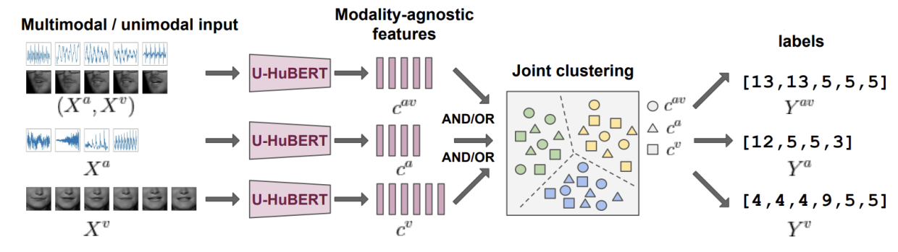
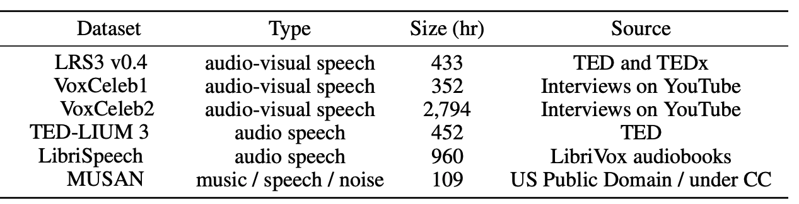

u-HuBERT stands for "**U**nified **H**idden **U**nit **BERT**" which is
a unified self-supervised pre-training framework that can leverage
unlabeled speech data of many different modalities for pre-training,
including both uni-modal and multi-modal speech. u-HuBERT was proposed
by Meta AI in 2022 and published in this paper: "[A Single
Self-Supervised Model for Many Speech Modalities Enables Zero-Shot
Modality Transfer](https://arxiv.org/pdf/2207.07036.pdf)" by the same
author who introduced
[HuBERT](https://anwarvic.github.io/speech-recognition/HuBERT) and
[AV-HuBERT](https://anwarvic.github.io/speech-recognition/AV-HuBERT_for_AVSR).

## u-HuBERT Vs AV-HuBERT

Architecture-wise, u-HuBERT has the same architecture as
[AV-HuBERT](https://anwarvic.github.io/speech-recognition/AV-HuBERT_for_AVSR)
which consists of a set of modality-specific feature extractors. The
video encoder is a modified ResNet-18 model that takes image frames of
$88 \times 88$ pixels sampled at $25$ frame-per-second and produce a
sequence of $512$ dimensional embeddings at the same frame rate. The
audio encoder is filter bank features sampled at $100Hz$, stacked every
$4$ frames to match the video frame rate ($25\ fps$). Both audio and
video representations are concatenated together frame-by-frame and
linearly projects them to the embedding dimension of the shared
Transformer. The shared Transformer has $24$ layers, with $16$ heads,
embedding dimension $1024$, and FFN dimension $4096$, using the pre-norm
residual connection setup:

    

Unlike
[AV-HuBERT](https://anwarvic.github.io/speech-recognition/AV-HuBERT_for_AVSR)
which was pre-trained using multi-modal (i.e audio-visual) data,
<u><strong>u-HuBERT is pre-trained using both audio-only and multi-modal speech
data forming modality-agnostic features</strong></u>. To encourage the
modality-agnosticism even more, the modality dropout (which was used in
the audio-visual fusion block in
[AV-HuBERT](https://anwarvic.github.io/speech-recognition/AV-HuBERT_for_AVSR))
is extended and applied to data by randomly dropping a subset of the
modalities, effectively creating multiple copies of the data with the
same target but different input modalities.

    

## Pre-training

In this paper, u-HuBERT pre-training was performed on three different
datasets; the first two datasets are audio-visual and were used with
[AV-HuBERT](https://anwarvic.github.io/speech-recognition/AV-HuBERT_for_AVSR),
while the last one is an audio-only dataset. These three datasets are:

-   **LRS3:** Lib-Reading Sentences 3 with $433$ hours of English
    audio-visual speech.

-   **VC2-En:** VoxCeleb2-En with $1,326$ hours of English YouTube
    audio-visual speech filtered from VoxCeleb2.

-   **TED-LIUM 3:** with $452$ hours of English audio collected from TED
    talks.

    

[AV-HuBERT](https://anwarvic.github.io/speech-recognition/AV-HuBERT_for_AVSR)
was pre-trained for five iterations; the first iteration was done
using audio-only features, and the following four iterations were
done using audio-visual features extracted from the pre-trained
model in the previous iteration. To pre-train u-HuBERT, the
pre-trained
[AV-HuBERT](https://anwarvic.github.io/speech-recognition/AV-HuBERT_for_AVSR)
at iteration 4 was used as a feature extractor on the audio-only
data. Then, u-HuBERT were pre-trained on the combined data
(audio-visual data + audio-only data) for $1M$ updates using the
Adam optimizer and a learning rate of $0.002$. Gradient norm is
clipped at $1.0$ to stabilize training. Modality dropout with a
probability of $0.25$ was applied. To improve noise robustness, they
applied online noise augmentation where each utterance is corrupted
with additive noise at $0dB$ sampled from MUSAN dataset with a
probability of $0.25$.

After pre-training is done, the model should return modal-agnostic
representations. To make sure that's the case, they extracted audio,
visual, and audio-visual features from LRS3 validation utterances
and run t-SNE algorithm and the results are shown below:

    

It is visually evident that the audio, visual, audio-visual features
have very similar distributions when using modality dropout (top
row), contrary to those from the model without modality dropout
(bottom row).

## Fine-tuning

Once the model is pre-trained, they removed the cluster prediction head
(the linear layer on top of transformer) and added a downstream
task-specific prediction head. The pre-trained model can be fine-tuned
on labeled multi-modal speech, uni-modal speech, or speech with mixed
modalities. More importantly, the modalities included in the fine-tuning
data do not necessarily cover the modalities seen during pre-training,
yet the fine-tuned model can still handle the downstream task on all
pre-trained modalities, which they referred to as <u><strong>zero-shot modality
generalization</strong></u>.

### Speech Recognition

LRS3 "trainval" and "pretrain" were used for fine-tuning. Noise
augmentation was done similar to the pre-training. A $9$-layer randomly
initialized Transformer decoder with $8$ attention heads and
$1024$/$409\ $embedding/FFN dimensions is appended to the pre-trained
u-HuBERT, and the entire model is fine-tuned with a cross-entropy loss
predicting the next text token given the input and the previous text
tokens. Text is represented as unigram-based subword units with a
vocabulary size of $1,000$. The whole list of hyper-parameters as shown
in the following table:

    

The following table compares fine-tuning from scratch, as well as from
pre-trained models with and without modality dropout, using labeled
audio, visual, or audio-visual speech, and highlights the results of
zero-shot modality transfer in 
purple shades. Also, it shows the speech recognition WER
results on LRS3 test, where:

-   **PT:** pre-trained model (on LRS3 and VC-2).

-   **PT mod-drop-p:** modality dropout is applied in pre-training

-   **Ft mod-drop-p:** modality dropout is applied in fine-tuning.

-   **FT mod:** denotes the type of labeled data used for fine-tuning,
    AV stands for "Audio-Visual", A for "Audio", and V for "video".

    

From the past table, we can see the following:

-   Models without pre-training are significantly worse.

-   Modality dropout is important for pre-training and fine-tuning,
    especially when evaluating on uni-modal data (i.e audio-only or
    video-only).

-   Applying modality dropout during fine-tuning leads to consistent
    improvement on noisy AV test set. This is likely because
    occasionally dropping the audio stream encourages the model to rely
    more on the visual input which improves noise robustness.

-   Applying modality dropout during pre-training leads to consistent
    improvement on zero-shot cases, i.e models pre-trained on
    audio-visual data and fine-tuned on either audio-only or video-only
    data.

In another experiment, they fine-tuned the model on LibriSpeech
dataset, which is an audio-only dataset from reading audio books
that is out-of-domain relative to the pre-training data (which were
mainly TV talks). The following table shows the performance
degradation compared to fine-tuning on in-domain LRS3 data, the
model still performs decently on zero-shot transfer scenarios.

    

In comparison to other state-of-the-art models LRS3 test set, the
following table shows that u-HuBERT performance is on par or better
than the best other models. Furthermore, compared to AV-HuBERT,
u-HuBERT can be pre-trained on additional unimodal data to yield
even better performance.

    

> **Note:**\
In the past table, u-HuBERT is the only model that can be fine-tuned
on any modality (audio or video). All other models are
modal-specific.

### Spanish Speech Translation

To simulate speech translation setting, they translated the English
transcriptions of LRS3 "trainval" set into Spanish using a trained
machine translation model creating paired (English audio, English video,
Spanish text) data. They used the same decoder for speech translation as
for speech recognition, where a $9$-layer randomly initialized
[Transformer](https://anwarvic.github.io/machine-translation/Transformer)
is appended to the pre-trained u-HuBERT encoder to decode English
audio-visual data into Spanish text.

Unigram-based sentencepiece units with a vocabulary of 1,000 were sued
as decoding output units. The overall fine-tuning and decoding paradigms
remain same as speech recognition. A detailed list of the
hyper-parameters used can be found in the following table:

    

The performance of u-HuBERT on speech translation can be seen in the
following table; where you can see that u-HuBERT pre-training not only
greatly improves translation quality, but also shows strong performance
in zero-shot modality transfer. Within u-HuBERT, modality dropout is an
essential component for acquiring such capacity.

    

## Ablation

In the paper, authors decided to ablate some of the hyper-parameter
choices. For faster experimentation, they used the base model and
pre-trained it on the LRS3 dataset and fine-tuned the model on the
"trainval" set. The following is a summarization of the different
experimentation.

### Modality Dropout Ratio

To better understand the impact of pre-training modality dropout
configurations on zero-shot modality transfer, they pre-trained a BASE
model for $200K$ updates and then fine-tuned on "trainval" set. Four
modality dropout configurations were considered, represented by the
probability of using both streams ($p_{av}$), audio stream ($p_{a}$) and
video stream ($p_{v}$). Results are summarized in the following table:

    

From the past table, we can deduce that <u><strong>when fine-tuning on
audio-visual or audio-only data, setting the</strong></u>
$\mathbf{p}_{\mathbf{v}}$ <u><strong>higher leads to slightly worse performance
on audio-visual and audio-only test sets. In contrast, it leads to
slightly better performance when fine-tuning on visual-only
data</strong></u>.

### Pre-training with Additional Audio-only Data

They pre-trained the BASE model on audio-visual + audio-only data for
different numbers of updates, namely $(100,\ 200,\ 400,\ 600)K$ updates.
The baseline (PT on AV) was pre-trained on audio-visual LRS3 only, while
the proposed model (PT on AV+A) was pre-trained on the same audio-visual
data as the baseline plus the VC2-En audio data. Results are shown
below:

    

The previous figure shows that <u><strong>adding audio-only data consistently
improves the ASR performance at all number of updates</strong></u>. In
contrast, the performance of "PT on AV+A" lags behind "PT on AV" on
audio-visual and visual speech recognition when a model is trained for
fewer than $400K$ updates.

Nevertheless, <u><strong>when a model is trained for longer
(</strong></u>$\mathbf{600K}$ <u><strong>updates), mixed-modal pre-training
outperforms the baseline on all three tasks.</strong></u> The
observation suggests that u-HuBERT can benefit from training on more
data and continue improving with more updates, while the performance of
the baseline saturates earlier due to the lack of data.

### AV Dropout Vs A-only Dropout

The following table shows the impact of fine-tuning modality dropout vs
the audio-only dropout on the model's performance on the speech
recognition task. <u><strong>From the table, we can see that increasing the
dropout doesn't change the performance by much</strong></u>.

    

### Number of Frozen Layers 

Next, they studied the impact of freezing the first few layers of
u-HuBERT $L_{frz}$ when fine-tuning. Setting this effectively treats the
first $L_{frz} = (0,\ 6,\ 12,\ 18,\ 24)$ layers as fixed feature
extractor, while the following layers are considered pre-trained and
jointly optimized with the added prediction head during fine-tuning.

    

> **Note:**\
$L_{frz} = 24$ means the whole encoder is frozen and the 9-layer decoder
is the only part that is being fine-tuned.

### Number of Frozen Steps

Next, they studied the impact of freezing u-HuBERT for the the first few
updates $N_{frz}$ when fine-tuning. These tried
$N_{frz} = (0,\ 15,\ 30,\ 45,\ 60)K$ updates and the results are
reported in the following table:

    

We can observe similar trends as those when varying the number of layers
to freeze: not freezing at all leads worse performance on all input
modalities. <u><strong>Freezing for</strong></u> $\mathbf{30K}$ <u><strong>updates out
of</strong></u> $\mathbf{60K}$ <u><strong>total updates leads to good balance
for all modalities</strong></u>.

### Learning Rates

The following table shows the impact of different learning rates on
u-HuBERT performance:

    

### Layer's Ability for Feature Extraction

Finally, To better understand how u-HuBERT learns modality-agnostic
features, they experimented the clustering quality of different layers
per modality of a pre-trained u-HuBERT model. They reported the Phone
Normalized Mutual Information (PNMI) reported in
[HuBERT](https://anwarvic.github.io/speech-recognition/HuBERT) of
layer-wise clusters per modality quantized by audio-only ($C^{a}$ ),
video-only ($C^{v}$), audiovisual ($C^{av}$) and all-combined
($\cup_{m}C^{m}$) codebook, respectively:

    

To the model pre-trained with modality-dropout (left-side), <u><strong>the
features of its intermediate layers become more agnostic to modality as
the layer goes deeper</strong></u>, shown from the diminishing gap
between its cross-modality and modality-specific performance in later
layers. Furthermore, <u><strong>the final layer is best suited to achieve a
unified model that generalizes across modalities.</strong></u>
