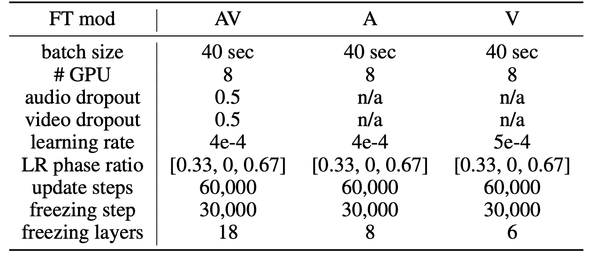
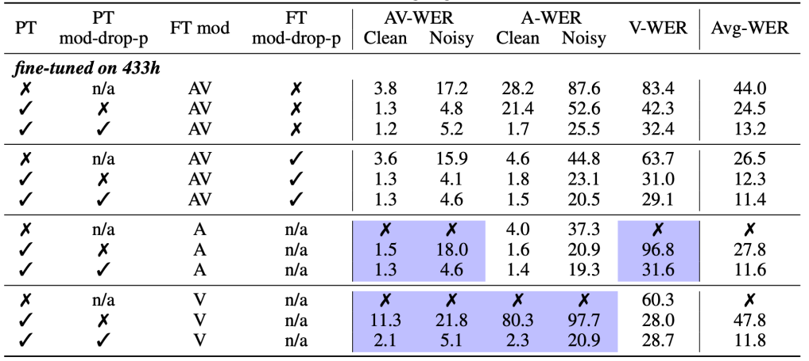

u-HuBERT stands for "**U**nified **H**idden **U**nit **BERT**" which is
a unified self-supervised pre-training framework that can leverage
unlabeled speech data of many different modalities for pre-training,
including both uni-modal and multi-modal speech. u-HuBERT was proposed
by Meta AI in 2022 and published in this paper: "[A Single
Self-Supervised Model for Many Speech Modalities Enables Zero-Shot
Modality Transfer](https://arxiv.org/pdf/2207.07036.pdf)" by the same
author who introduced
[HuBERT](https://anwarvic.github.io/speech-recognition/HuBERT) and
[AV-HuBERT](https://anwarvic.github.io/speech-recognition/AV-HuBERT_for_AVSR).

> **Note to Reader:**\
u-HuBERT is a genralization of AV-HuBERT. So, reviewing the
[AV-HuBERT](https://anwarvic.github.io/speech-recognition/AV-HuBERT_for_AVSR)
post is very important before reading this post.

## u-HuBERT Vs AV-HuBERT

Architecture-wise, u-HuBERT has the same architecture as
[AV-HuBERT](https://anwarvic.github.io/speech-recognition/AV-HuBERT_for_AVSR)
which consists of a set of modality-specific feature extractors (i.e
Audio Encoder and Image Encoder), a shared transformer-encoder as the
backbone of the architecture as shown in the following figure:

    

Unlike
[AV-HuBERT](https://anwarvic.github.io/speech-recognition/AV-HuBERT_for_AVSR)
which was pre-trained only using multi-modal (i.e audio-visual) data,
<u><strong>u-HuBERT is pre-trained using both uni-modal and multi-modal speech
data forming modality-agnostic features</strong></u>. To encourage the
modality-Agnosticism even more, the modality dropout -which was used in
the audio-visual fusion block in AV-HuBERT- is extended and applied to
data by randomly dropping a subset of the modalities, effectively
creating multiple copies of the data with the same target but different
input modalities.

    

## Pre-training

In this paper, u-HuBERT pre-training was performed on three different
datasets: two of them were audio-visual and one audio-only; which are:

-   **LRS3:** Lib-Reading Sentences 3 with $433$ hours of English
    audio-visual speech.

-   **VC2-En:** VoxCeleb2-En with $1,326$ hours of English YouTube
    audio-visual speech filtered from VoxCeleb2.

-   **TED-LIUM 3:** with $452$ hours of English audio collected from TED
    talks.

To directly compare with the noise-augmented
[AV-HuBERT-LARGE](https://github.com/facebookresearch/av_hubert/blob/main/avhubert/conf/pretrain/noise_large_vox_iter5.yaml)
model trained on LRS3 and VC2-En, the same feature extractor (fourth
iteration BASE model) and the same codebook were used to generate
pseudo labels for multi-modal LRS3 and VC2-En and uni-modal TED-LIUM3.
Then, they pre-trained u-HuBERT on the combined data for $1M$
updates using the Adam optimizer and a learning rate of $0.002$.
Gradient norm is clipped at $1.0$ to stabilize training.

When pre-training on multi-modal data, audio and video were dropped
with a probability of $0.25$ and $0.25$, respectively. To improve
noise robustness, they applied online noise augmentation where each
utterance is corrupted with additive noise at $0dB$ sampled from
[MUSAN](https://www.openslr.org/17) dataset with a probability of $0.25$.

Given uni-modal and multi-modal speech data, pre-training is done as
shown in the following steps:

-   In the first iteration, because a modality-agnostic feature
    extractor is not available yet, they clustered the anchor modality
    features using k-means to produce targets for uni-modal and
    multi-modal speech that contain the anchor modality. The anchor
    modaility could be the visual modality or the acoustic modality.

-   In the consecutive iterations, the model can be used to extract
    modality-agnostic features for all uni-modal and multi-modal data.

After pre-training is done, the model should return modal-agnostic
representations. To make sure that's the case, they extracted audio,
visual, and audio-visual features from LRS3 validation utterances
and run t-SNE algorithm and the results are shown below:

    

It is visually evident that the audio, visual, audio-visual features
have very similar distributions when using modality dropout (top
row), contrary to those from the model without modality dropout
(bottom row).

## Fine-tuning

Once the model is pre-trained, they removed the cluster prediction head
(the linear layer on top of transformer) and added a downstream
task-specific prediction head. The pre-trained model can be fine-tuned
on labeled multi-modal speech, uni-modal speech, or speech with mixed
modalities. More importantly, the modalities included in the fine-tuning
data do not necessarily cover the modalities seen during pre-training,
yet the fine-tuned model can still handle the downstream task on all
pre-trained modalities, which they referred to as
<u><strong>zero-shot modality generalization</strong></u>.

### Speech Recognition

LRS3 "trainval" and "pretrain" were used for fine-tuning. Noise
augmentation was done similar to the pre-training. A 9-layer randomly
initialized Transformer decoder with 8 attention heads and 1024/409
embedding/FFN dimensions is appended to the pre-trained u-HuBERT, and
the entire model is fine-tuned with a cross-entropy loss predicting the
next text token given the input and the previous text tokens. Text is
represented as unigram-based subword units with a vocabulary size of
$1,000$. The whole list of hyper-parmaeters as shown in the following
table:

    

The following table shows the speech recognition results on LRS3 test,
where

-   **PT:** pre-trained model (on LRS3 and VC-2).

-   **PT mod-drop-p:** modality dropout is applied in pre-training

-   **Ft mod-drop-p:** modality dropout is applied in fine-tuning.

-   **FT mod:** denotes the type of labeled data used for fine-tuning.

-   Zero-shot scenarios are highlighted with purple shades.

    

And from the past table, we can see the following:

-   Models without pre-training are significantly worse.

-   When fine-tuning on audio-visual data without modality dropout,
    performance drops significantly on uni-modal data if pre-training
    modality dropout is not applied.

In another experimented, they fine-tuned the model on LibriSpeech
dataset, which is an audio-only dataset from reading audio books
that is out-of-domain relative to the pre-training data. The
following table Despite the degradation compared to fine-tuning on
in-domain LRS3 data, the model still performs decently on zero-shot
transfer scenarios.

    

In comparison to other state-of-the-art models LRS3 test set, the
following table shows that u-HuBERT performance is on par or better
than the best other models. Furthermore, compared to AV-HuBERT,
u-HuBERT can be pre-trained on additional unimodal data to yield
even better performance.

    

> **Note:**\
In the past table, u-HuBERT is the only model that can be fine-tuned
on any modality (audio or image). All other models are
modal-specific.

### Speaker Verification

TO BE CONTINUED.
