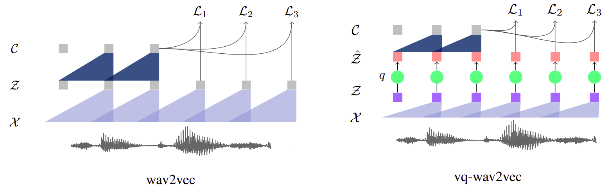
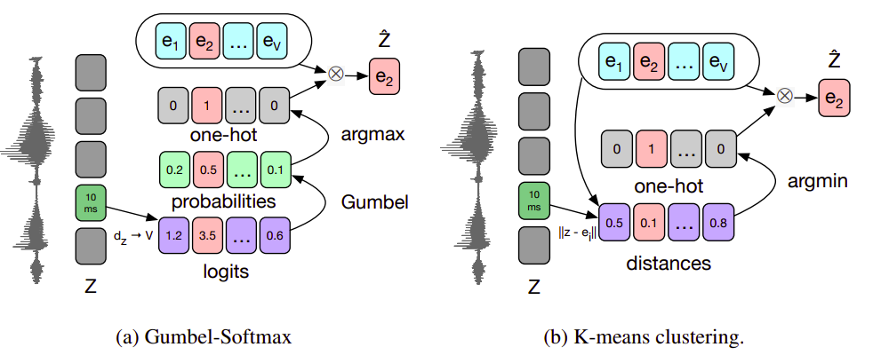
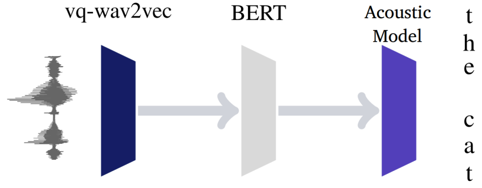

vq-wav2vec stands for "vector-quantized wav2vec" which is a model
created by Facebook AI Research in 2020 and published in this paper:
[vq-wav2vec: Self-Supervised Learning of Discrete Speech
Representations](https://arxiv.org/pdf/1910.05453.pdf). As we can see,
the title is pretty vague, so let's clear it out:

-   **vq**: As I said, it stands for "vector-quantized". These are the
    discrete vectors that will be learnt in this model.

-   **wav2vec**: is a reference to the earlier paper by the same lab.

-   **Self-supervised**: Self-supervised learning is when the data is
    actually the label. That's why it's called "self-supervised". In
    this context, we are learning a new representation for the audio
    data using the audio data themselves as labels.

-   Discrete Speech representations: It's a reference to the VQs.

    vq-wav2vec learns vector quantized (VQ) representations of audio
    data using a future time-step prediction task. They follow the same
    architectural choices as <u>wav2vec</u> with the only difference of
    using a new quantization module to build discrete speech
    representations (VQs):

    

We first map 30ms segments of raw speech to a dense feature
representation $\mathcal{Z}$ at a stride of 10ms using the encoder
network. Next, the quantizer ($q$) turns these dense representations
into discrete indices which are mapped to a reconstruction
$\widehat{\mathcal{Z}}$ of the original representation
$\mathcal{Z}$. We feed $\widehat{\mathcal{Z}}$ into the loss
function and optimize the same context prediction task as wav2vec.

As we can see, the quantization module is the only new module here.
So, let's talk about it in more details:

Quantization
------------

The quantization module replaces the original representation
$\mathcal{Z}$ by $\widehat{\mathcal{Z}} = e_{i}$ from a fixed size
<u><strong>codebook</strong></u> $e \in R^{V \times d}$ which contains $V$
representations of size $d$. This step can be done either by using
Gumbel-Softmax or K-Means:

    

### Gumbel-Softmax

The Gumbel-Softmax is a differentiable approximation of the argmax for
computing one-hot representations. Given the dense representation
$\mathcal{Z}$, we get the codebook by following these steps:

-   Apply a linear layer followed by a ReLU, followed by another linear
    which outputs logits $l \in R^{V}$ as shown in the following
    formula:

$$l = g\left( \text{ReLU}\left( f\left( \mathcal{Z} \right) \right) \right)$$

-   Then, we get the probability out of these logits $p \in R^{V}$. The
    following formula shows the probability for choosing the j^th^
    variable where $u$ is a vector of uniform sampled values from
    $\mathcal{U}\left( 0,\ 1 \right)$ and $\mathcal{t}$ is the
    temperature which is a non-negative hyper-parameter:

$$p_{j} = \frac{\frac{\exp\left( l_{j} + v_{j} \right)}{\mathcal{t}}}{\sum_{k = 1}^{V}\left( \frac{\exp\left( l_{k} + v_{k} \right)}{\mathcal{t}} \right)}$$

$$v = - \log\left( - \log\left( u \right) \right)$$

-   Now, we choose the codebook entry $e_{i}$ that corresponds to the
    maximum probability:

$$i = \text{argma}x_{j}\left( p_{i} \right)$$

$$\widehat{z} = e_{i}$$

### K-Means

We choose the codebook variable $e_{i}$ by finding the closest variable
to the input features $\mathcal{Z}$ in terms of the Euclidean distance.
This can be done by following these steps:

-   Calculate the Euclidean distance between the codebook variables and
    the dense representation $\mathcal{Z}$:

$$\left\| z - e_{j} \right\|_{2}^{2} = \sqrt{\sum_{i = 1}^{n}\left( z_{i} - e_{\text{ji}} \right)^{2}}$$

-   Then, choose the index with the lowest distance:

$$i = \text{argmi}n_{j}\left( \left\| z - e_{j} \right\|_{2}^{2} \right)$$

$$\widehat{z} = e_{i}$$

When using K-means to perform vector quantization, then we need to add
another term to the loss function:

$$\mathcal{L} = \sum_{k = 1}^{K}\left( \mathcal{L}_{k}^{wav2vec} \right) + \left( \left\| \text{sg}\left( z \right) - \widehat{z} \right\|^{2} + \gamma.\left\| \text{sg}\left( z \right) - \widehat{z} \right\|^{2} \right)$$

Where:

-   $\mathcal{L}_{k}^{wav2vec}$ is the same loss function used in the
    wav2vec paper for step-size $k$.

-   sg stands for the stop-gradient operator where:

    $sg\left( x \right) \equiv x$
    $\frac{d}{\text{dx}}\text{sg}\left( x \right) = 0$

-   $\gamma$ is a trainable hyper-parameter

BERT & Acoustic Model
---------------------

Once we trained a vq-wav2vec model we can discretize audio data and make
it applicable to algorithms that require discrete inputs. One
possibility is to use the discretized training data and apply BERT
pre-training where the task is to predict masked input tokens based on
an encoding of the surrounding context.

Once the BERT model is trained, we can use it to build representations
and feed them into an acoustic model to improve speech recognition. We
follow recent advances in BERT training which only use the masked input
token prediction.

    

Since each of the discretized tokens represents around 10 ms of audio it
is likely too easy to predict a single masked input token. We therefore
change BERT training by masking spans of consecutive discretized speech
tokens.

To mask the input sequence, we randomly sample p = 0.05 of all tokens to
be a starting index, without replacement, and mask M = 10 consecutive
tokens from every sampled index; spans may overlap. This makes the
masked token prediction harder which improves the accuracy over masking
individual tokens.

Regarding the acoustic model, they used the same acoustic model as the
[wav2letter](https://arxiv.org/pdf/1609.03193.pdf) paper with 4-ngram Language
Model.
