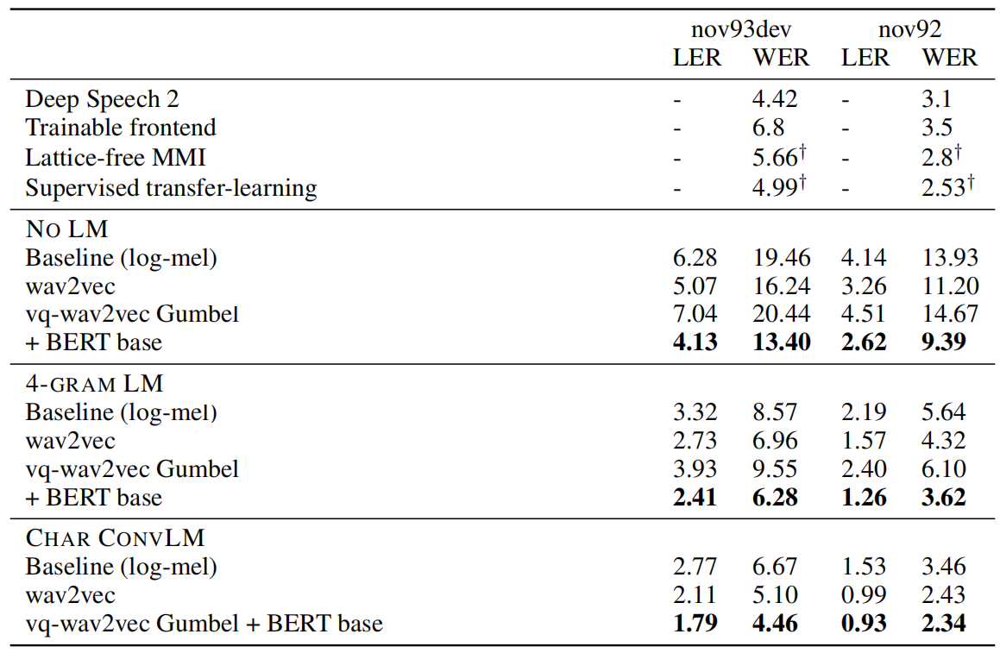
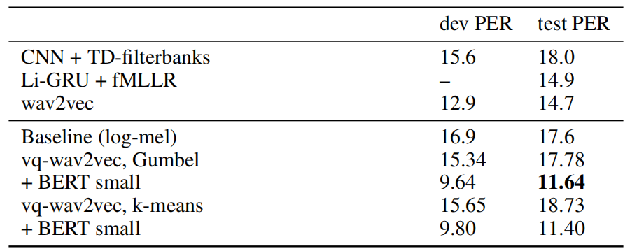
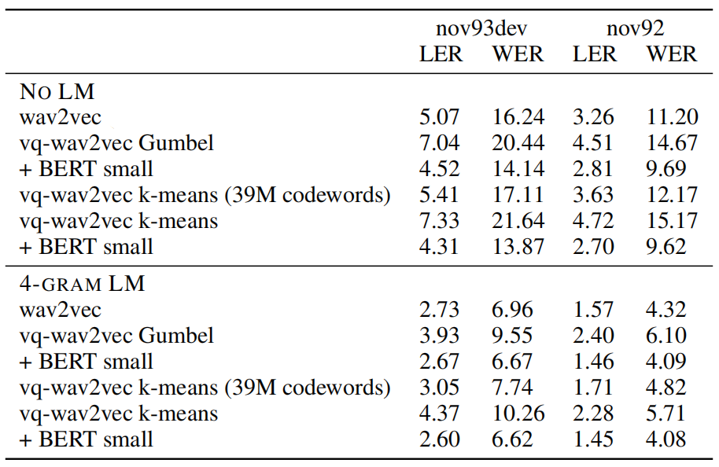
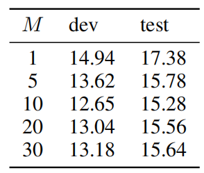
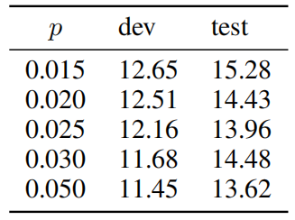

vq-wav2vec stands for "vector-quantized wav2vec" which is a quantized
version of the
[wav2vec](https://anwarvic.github.io/speech-recognition/wav2vec) model
that learns <u><strong>discrete</strong></u> representations of audio segments.
vq-wav2vec was created by Facebook AI Research in 2019 and published in
this paper: [vq-wav2vec: Self-Supervised Learning of Discrete Speech
Representations](https://arxiv.org/pdf/1910.05453.pdf). The official
code for this paper can be found in Facebook's
[fairseq](https://github.com/pytorch/fairseq) framework.

Same as
[wav2vec](https://anwarvic.github.io/speech-recognition/wav2vec),
vq-wav2vec is a fully convolutional neural network that that takes raw
audio (wav) as input $\mathcal{X}$ and computes a general representation
(vector) that can be input to speech recognition (acoustic) systems. The
only difference is that vq-wav2vec uses a new <u><strong>quantization
module</strong></u> $q$ to build discrete speech representations:

    

They first map $30ms$ segments of raw speech to a dense feature
representation $\mathcal{Z}$ at a stride of 1$0ms$ using the encoder
network. Next, the quantization module $q$ turns these dense
representations into discrete indices which are mapped to a
reconstruction $\widehat{\mathcal{Z}}$ of the original representation
$\mathcal{Z}$. They feed $\widehat{\mathcal{Z}}$ into the
[wav2vec](https://anwarvic.github.io/speech-recognition/wav2vec) loss
function and optimize the same context prediction task as
[wav2vec](https://anwarvic.github.io/speech-recognition/wav2vec).

Quantization Module
-------------------

The quantization module replaces the original continuous representation
$\mathcal{Z}$ by a fixed-size discrete representation
$\widehat{\mathcal{Z}} = e_{i}$ where <u><strong>code-book</strong></u>
$e \in \mathbb{R}^{V \times d}$ contains $V$ representations of size $d$.
This step can be done either by using
Gumbel-Softmax or K-Means:

    

### Gumbel-Softmax

The Gumbel-Softmax is a differentiable approximation of the $argmax()$
for computing one-hot representations. Given the dense representation
$\mathcal{Z}$, we get the codebook by following these steps:

-   Apply a linear layer $f$ followed by a ReLU, followed by another linear
    layer $h$ which outputs logits $l \in \mathbb{R}^{V}$ as shown in the
    following formula:

$$l = g\left( \text{ReLU}\left( f\left( \mathcal{Z} \right) \right) \right)$$

-   Then, we get the probability out of these logits
    $p \in \mathbb{R}^{V}$. The following formula shows the
    probability for choosing the $j^\text{th}$ variable where $u$ is a vector
    of uniform sampled values from $\mathcal{U}\left( 0,\ 1 \right)$
    and $\mathcal{t}$ is the temperature which is a non-negative
    hyper-parameter:

$$p_{j} = \frac{\frac{\exp\left( l_{j} + v_{j} \right)}{\mathcal{t}}}{\sum_{k = 1}^{V}\left( \frac{\exp\left( l_{k} + v_{k} \right)}{\mathcal{t}} \right)},\ \ \ \ \ \ v = - \log\left( - \log\left( u \right) \right)$$

-   Now, we choose the code-book entry $e_{i}$ that corresponds to the
    maximum probability:

$$i = \underset{j}{\arg\max}p_{j},\ \ \ \ \ \widehat{z} = e_{i}$$

> **Note:**\
In the paper, they used two groups $G = 2$ with $V = 320$ producing
$G \cdot V = 640$ logits. Also, the temperature $\mathcal{t}$ was
linearly annealed from $2$ to $0.5$ over the first $70\%$ of updates and
then kept constant at $0.5$.

### K-Means

We choose the code-book variable $e_{i}$ by finding the closest variable
to the input features $\mathcal{Z}$ in terms of the Euclidean distance.
This can be done by following these steps:

-   Calculate the Euclidean distance between the codebook variables and
    the dense representation $\mathcal{Z}$:

$$\left\| z - e_{j} \right\|_{2}^{2} = \sqrt{\sum_{i = 1}^{n}\left( z_{i} - e_{\text{ji}} \right)^{2}}$$

-   Then, choose the index with the lowest distance:

$$i = \underset{j}{\text{argm}\text{in}}\left( \left\| z - e_{j} \right\|_{2}^{2} \right),\ \ \ \ \widehat{z} = e_{i}$$

When using K-means to perform vector quantization, then we need to add
another term to the loss function:

$$\mathcal{L} = \sum_{k = 1}^{K}\left( \mathcal{L}_{k}^{wav2vec} \right) + \left( \left\| \text{sg}\left( z \right) - \widehat{z} \right\|^{2} + \gamma.\left\| \text{sg}\left( z \right) - \widehat{z} \right\|^{2} \right)$$

Where:

-   $\mathcal{L}_{k}^{wav2vec}$ is the same loss function used in the
    wav2vec paper for step-size $k$.

-   $sg()$ stands for the stop-gradient operator where:

    $sg\left( x \right) \equiv x$
    $\frac{d}{\text{dx}}\text{sg}\left( x \right) = 0$

-   $\gamma$ is a trainable hyper-parameter. In the paper, they set
    $\gamma = 0.25$.

> **Note:**\
In the paper, they used two groups $G = 2$ with $V = 320$ producing
$G \cdot V = 640$ logits.

BERT & Acoustic Model
---------------------

Once vq-wav2vec is trained, we can discretize audio data and make it
applicable to algorithms that require discrete inputs such as
[BERT](https://anwarvic.github.io/language-modeling/BERT) which can be
pre-trained to predict masked input tokens. After pre-training
[BERT](https://anwarvic.github.io/language-modeling/BERT), its
representations can be fed into an acoustic model to improve speech
recognition. The whole pipeline is illustrated below:

    

Since each of the discretized tokens represents around $10ms$ of audio,
it is likely too easy for
[BERT](https://anwarvic.github.io/language-modeling/BERT) to predict a
single masked input token. That's why in the paper, they suggested
masking spans of consecutive discretized speech tokens. They randomly
sampled $p = 5\%$ of all tokens to be a starting index, without
replacement, and mask $M = 10$ consecutive tokens from every sampled
index; knowing that spans may overlap. This makes the masked token
prediction harder which improves the accuracy over masking individual
tokens.

Regarding the acoustic model, they used the same acoustic model as the
[wav2letter](\l) paper with 4-ngram Language Model.

Experiments & Results
---------------------

In the following experiments, vq-wav2vec was pre-trained on the full
960h of Librispeech training data using the wav2vec loss for 400k
updates, predicting $K = 8$ steps into the future and sample 10
negatives from the same audio example. Training is warmed up for 500
steps where the learning rate is increased from $1 \times 10^{- 7}$ to
$5 \times 10^{- 3}$, and then annealed to $1 \times 10^{- 6}$ using a
cosine schedule. The batch size was set to 10, and they cropped a random
section of 150k frames for each example (approximately 9.3 seconds for
16kHz sampling rate)

The vq-wav2vec architecture has an encoder network of 8 layers with 512
channels each, kernel sizes $\left( 10,8,4,4,4,1,1,1 \right)$ and
strides $\left( 5,4,2,2,2,1,1,1 \right)$, yielding a total stride of
160. Also, it has a context network composed of 12 layers, with 512
channels, stride 1, and kernel sizes starting at 2 and increasing by 1
for every subsequent layer. The total number of parameters for
vq-wav2vec is $34 \times 10^{6}$.

Also, they pre-trained BERT-base and BERT-small -difference shown below-
on the full 960h of LibriSpeech training text data. The learning rate is
warmed up over the first 10,000 updates to a peak value of
$1 \times 10^{- 5}$, and then linearly decayed over a total of 250k
updates. They used a batch size of 3072 tokens.

<table>
    <thead>
        <tr>
            <th></th>
            <th>BERT SMALL</th>
            <th>BERT BASE</th>
        </tr>
    </thead>
    <tr>
        <td><strong>Transformer Blocks</strong></td>
        <td>12</td>
        <td>12</td>
    </tr>
    <tr>
        <td><strong>Model Dimension</strong></td>
        <td>512</td>
        <td>768</td>
    </tr>
    <tr>
        <td><strong>Feed-Forward hidden neurons</strong></td>
        <td>2048</td>
        <td>3072</td>
    </tr>
    <tr>
        <td><strong>Attention Heads</strong></td>
        <td>8</td>
        <td>12</td>
    </tr>
    <tr>
        <td><strong>Input Tokens</strong></td>
        <td>512</td>
        <td>512</td>
    </tr>
</table>

Then, they evaluated the whole pipeline on two benchmarks: TIMIT which a
5h dataset with phoneme labels, and Wall Street Journal or WSJ which is
a 81h dataset for speech recognition.

The following table shows the WSJ accuracy on the development (nov93dev)
and test set (nov92) in terms of letter error rate (LER) and word error
rate (WER) without language modeling (No LM), a 4-gram LM and a
character convolutional LM. The results show that vq-wav2vec together
with BERT training achieves a new state of the art.

    

And the following table shows the TIMIT phoneme recognition in terms of
phoneme error rate (PER). As we can see, vq-wav2vec + BERT-small achieve
a new state of the art.

    

Next, they compared Gumbel-Softmax to k-means for vector quantization.
The following table shows that Gumbel-Softmax and k-means clustering
perform relatively comparably: <u><strong>in the no language model setup without
BERT, Gumbel-Softmax is more accurate than k-means but these differences
disappear with BERT</strong></u>:

    

Next, they performed an ablation study while changing critical parts in
the model. The following table shows that masking entire spans of tokens
performs significantly better than individual tokens (M = 1) on TIMIT:

    

Furthermore, they tried different masking probability while pre-training
BERT on discretized audio data. The following table shows that BERT is
fairly robust to masking large parts of the input:

    

