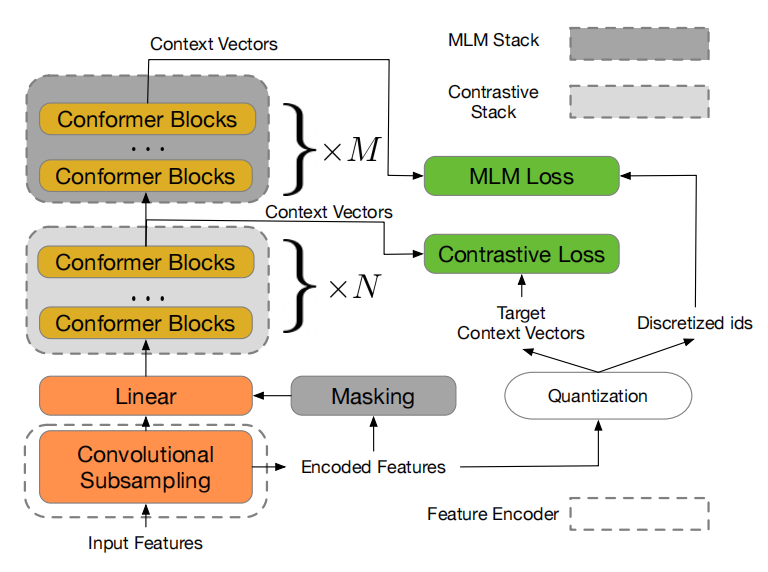
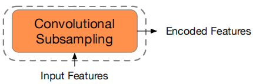
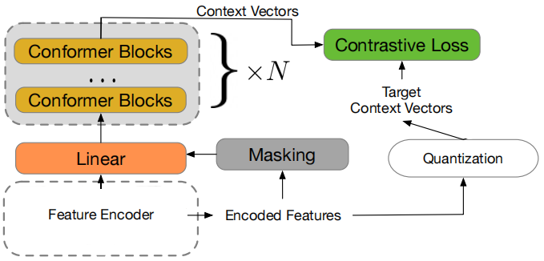
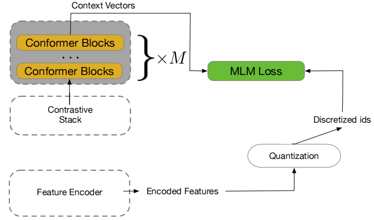
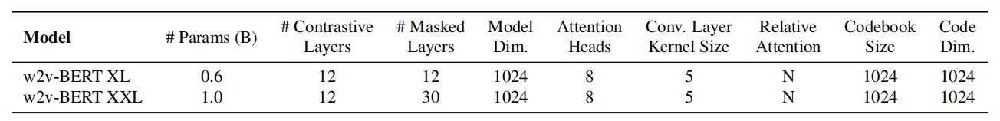
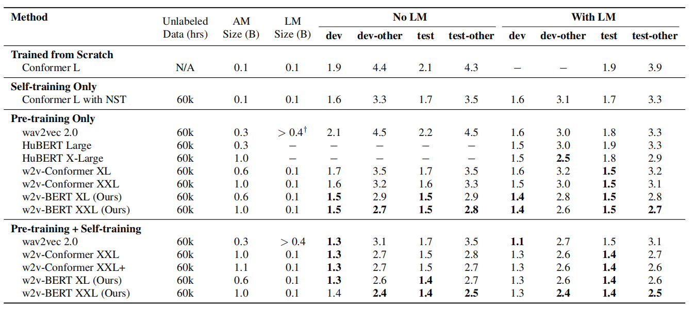

w2v-BERT combines the core methodologies of self-supervised pre-training
of speech embodied in the [wav2vec
2.0](https://anwarvic.github.io/speech-recognition/wav2vec_2) model and
self-supervised pre-training of language emobdied in
[BERT](https://anwarvic.github.io/language-modeling/BERT). w2v-BERT was
proposed by Google Brain in 2021 and published in this paper "[w2v-BERT:
Combining Contrastive Learning and Masked Language Modeling for
Self-Supervised Speech
Pre-Training](https://arxiv.org/pdf/2108.06209.pdf)". The w2v-BERT
pre-training framework is illustrated down blow:

    

The idea of w2v-BERT is learn contextualized speech representations by
using the contrastive task defined earlier in [wav2vec
2.0](https://anwarvic.github.io/speech-recognition/wav2vec_2) to obtain
an inventory of a finite set of discretized speech units, and then use
them as tokens in a masked prediction task similar to the masked
language modeling (MLM) proposed in
[BERT](https://anwarvic.github.io/language-modeling/BERT).

From the past figure, we can see that w2v-BERT consists of three main
components:

-   <u><strong>Feature Encoder:</strong></u>\
    The feature encoder acts as a convolutional sub-sampling block that
    consists of two 2D-convolution layers, both with strides
    $\left( 2,2 \right)$, resulting in a 4x reduction in the acoustic
    input's sequence length. Given, for example, a log-mel spectrogram
    as input, the feature encoder extracts latent speech representations
    that will be taken as input by the subsequent contrastive module.

    

-   <u><strong>Contrastive Module:</strong></u>\
    The goal of the contrastive module is to discretize the feature
    encoder output into a finite set of representative speech units;
    that's why the output of the feature encoder follows two different
    paths:

    -   **First path:** It is masked, then fed into the linear
        projection layer followed by the stack of
        [conformer](https://anwarvic.github.io/speech-recognition/Conformer)
        blocks to produce context vectors.

    -   **Second Path:** It is passed to the quantization mechanism
        without masking to yield quantized vectors and their assigned
        token IDs.

    -   The quantized vectors are used in conjunction with the context
        vectors that correspond to the masked positions to solve the
        contrastive task defined in [wav2vec
        2.0](https://anwarvic.github.io/speech-recognition/wav2vec_2);
        the assigned token IDs will be later used by the subsequent
        masked prediction module as prediction target.

    

-   <u><strong>Masked Prediction Module:</strong></u>\
    The masked prediction module is a stack of
    [conformer](https://anwarvic.github.io/speech-recognition/Conformer)
    blocks (identical to the one used with the contrastive module) which
    directly takes in the context vectors produced by the contrastive
    module and extracts high-level contextualized speech
    representations.

    

Pre-training & Fine-tuning
--------------------------

During pre-training only unlabeled speech data is used to train w2v-BERT
to solve two self-supervised tasks at the same time weighted by two
different hyper-parameters $\beta$ and $\gamma$ which were set to $1$ in
the paper:

$$\mathcal{L} = \beta.\mathcal{L}_{c} + \gamma.\mathcal{L}_{m}$$

-   <u><strong>Contrastive Loss $\mathcal{L}_{\mathbf{c}}$:</strong></u>\
    For a context vector $c_t$ corresponding to a masked time step
    $t$, the model is asked to identify its true quantized vector
    $q_t$ from a set of $K$ distractors
    $\left\\{ {\widetilde{q}}_1,\ {\widetilde{q}}_2,\ ...{\widetilde{q}}_K \right\\}$
    that are also quantized vectors uniformly sampled from other masked
    time steps of the same utterance. This loss is denoted as
    $\mathcal{L}_w$, and further augment it with a codebook diversity
    loss $\mathcal{L}_d$ to encourage a uniform usage of codes
    weighted by a hyper-parameter $\alpha$. Therefore, the final
    contrastive loss is defined as:

$$\mathcal{L}_{c} = \mathcal{L}_{w} + \alpha\mathcal{L}_{d}$$

-   <u><strong>Mask Prediction Loss $\mathcal{L}_{\mathbf{m}}$:</strong></u>\
    This is the cross entropy loss for the predicting masked context
    vectors. They randomly sample the starting positions to be masked
    with a probability of $0.065$ and mask the subsequent 10 time steps
    knowing that the masked spans may overlap.

During fine-tuning, a labeled data was used to train an
[RNN-T](https://anwarvic.github.io/speech-recognition/RNN-T) model
where the encoder is a pre-trained w2v-BERT model, the decoder is a
two-layer LSTM with a hidden dimension of $640$, and the joint
network is a linear layer with Swish activation and batch
normalization.

Experiments & Results
---------------------

For pre-training, they use the Libri-Light unlab-60k subset, which
contains about 60,000 hours of unannotated speech audio. For
fine-tuning, they used the LibriSpeech 960hr subset. 80-dimensional
log-mel filter bank coefficients werre used as acoustic inputs to the
model. For transcript tokenization, they use da 1024-token WordPiece
model that is constructed from the transcripts of the LibriSpeech
training set. In the paper, they pre-trained two versions of w2v-BERT
named **w2v-BERT XL** and **w2v-BERT XXL**. These two variants share the
same model configuration that is summarized in the following table, and
their only difference is the number of conformer blocks.

    

For **w2v-BERT XL**, they trained it with a batch size of $2048$ using
the Adam optimizer with a transformer learning rate schedule. The peak
learning rate is $2e^{- 3}$ and the warm-up steps are $25k$. For
**w2v-BERT-XXL**, they trained it with the Adafactor optimizer with
$\beta_{1} = 0.9$ and $\beta_{2} = 0.98$, with the learning rate
schedule remaining the same. For both **w2v-BERT XL** and
**w2v-BERT-XXL**, they were pre-trained for $400k$ steps, and then
fine-tuned on the supervised data with a batch size of $256$.

In addition to self-supervised pre-training, in the fine-tuning stage
they also employed a number of practical techniques that further improve
models' performance on ASR, like
[SpecAugment](https://anwarvic.github.io/speech-recognition/SpecAugment)
for data augmentation, [Noisy Student
Training](https://anwarvic.github.io/speech-recognition/Combined_SSL)
for self-training, and [language model
fusion](https://anwarvic.github.io/machine-translation/Fusion) for
decoding.

In the following table, results on the four LibriSpeech evaluation sets
using the 960hr subset as the supervised data are represented. From the
following table, we can see that:

-   Without self-training and LM, w2v-BERT already either outperforms or
    matches other models with LM.

-   Contrastive learning combined with masked language modeling is more
    effective than contrastive learning alone.

    

