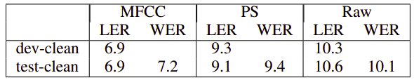

Wav2Letter is a model created by Facebook in 2016 and published in this
paper: [Wav2Letter: an End-to-End ConvNet-based Speech Recognition
System](https://arxiv.org/pdf/1609.03193.pdf). Wav2Letter is a fully 1D
convolutional network that achieved significant increases in speed with
the capability of producing real-time decoding. There are no pooling
blocks in this architecture, instead they used striding convolution.

The following figure shows the full architecture where $\text{kw}$ is
the kernel width, $\text{dw}$ is the kernel stride, and the ratio is the
number of input dimensions to the number of output dimensions:

    

The input to this architecture could be one of three things:

-   The raw wavform of the audio signal.

-   The 13 MFCC features of the audio signal.

-   The power spectrum of the audio signal.

    And the following is a small comparison between the results based on
    each input:

    

Given $\left( x_{t} \right)\_{t = 1,2,...T_{x}}$ an input sequence
with $T_{x}$ frames of $d_{x}$ dimensional vectors,
a convolution with kernel width $\text{kw}$, stride
$\text{dw}$ and $d_{y}$ frame size, bias of
$b_{i} \in \mathbb{R}^{d_{y}}$ and weights of
$w \in \mathbb{R}^{d_{y} \times d_{x} \times \text{kw}}$, it
computes the following:

$$y_{t}^{i} = b_{i} + \sum_{j = 1}^{d_{x}}{\sum_{k = 1}^{\text{kw}}{w_{i,j,k}\ x_{\text{dw} \times (t - 1) + k}^{j}}},\ \ \forall 1 \leq i \leq d_{y}$$

After that in the paper, they used an activation function of either
HardTanh or ReLU which both lead to similar results:

$$HardTanh(z) = \left\{ \begin{matrix}
1\ \ \ \ \ \ if\ x\  > \ 1 \\
 - 1\ \ \ \ \ if\ x\  < - 1 \\
\ \ \text{x}\ \ \ \ \ \ \text{otherwise} \\
\end{matrix} \right.$$

$$ReLU(z) = max(0,\ z)$$

The authors of this paper also explored a novel sequence loss function
called the ASG as a replacement to the CTC.

ASG
---

ASG stands for "Automatic Segmentation Criterion" which is an
alternative loss function to the CTC where there are three main
differences:

-   <u><strong>No blank labels:</strong></u> \
    If we removed this character, we will have a simpler
    vocabulary. And modeling letter repetitions can be easily replaced
    by repetition character like "hel2o" instead of "hello".

-   No normalized scores on the nodes.

-   Global normalization instead of frame-level normalization.

You need to check this
[link](https://towardsdatascience.com/better-faster-speech-recognition-with-wav2letters-auto-segmentation-criterion-765efd55449),
please!

TO BE CONTINUED\...
