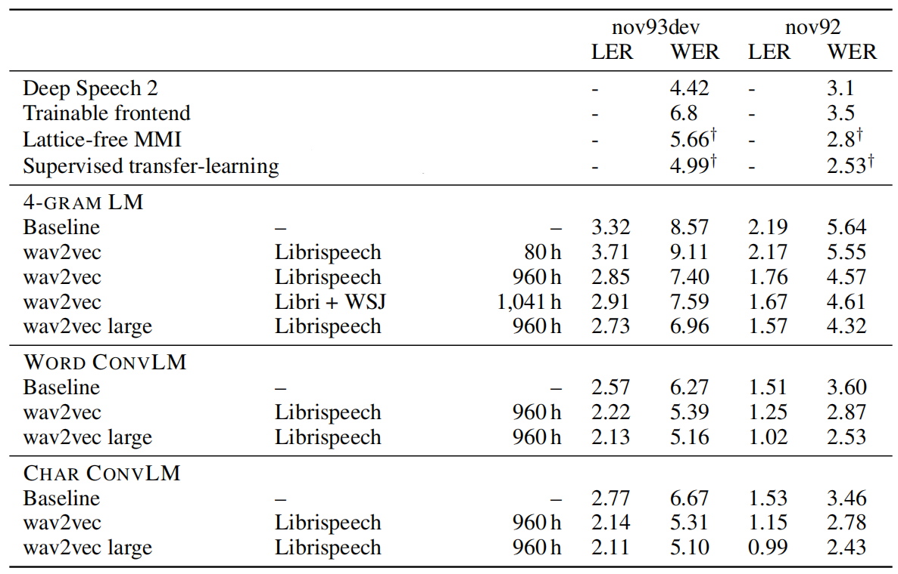
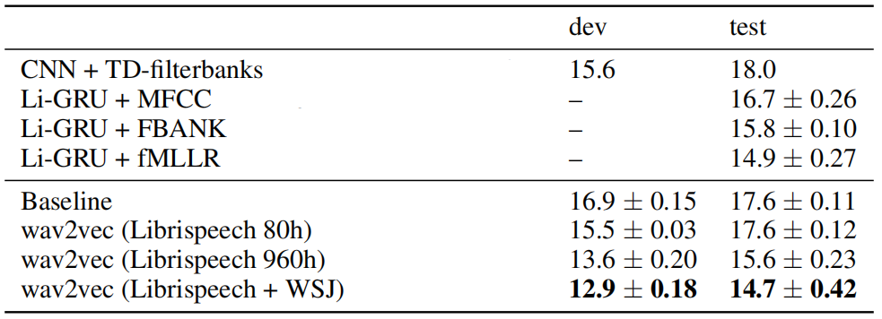
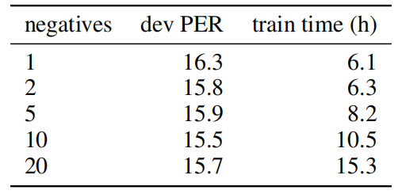
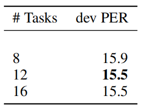
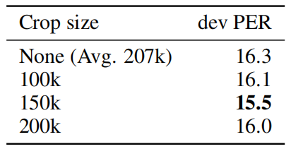

Wav2Vec is a fully convolutional neural network that that takes raw
audio (wav) as input and computes a general representation (vector) that
can be input to a speech recognition system. In other words, it's a
model the converts wav to vectors; hence the name. Wav2vec was created
by Facebook AI Research in 2019 and published in this paper: [Wav2Vec:
Unsupervised Pre-Training For Speech
Recognition](https://arxiv.org/pdf/1904.05862.pdf). The official code
for this paper can be found as part of
[Fairseq](https://github.com/pytorch/fairseq) framework.

As the paper's name suggests, unsupervised pre-training is used to the
model's performance on speech recognition. According to the paper, the
speech recognition task is performed in two steps; each step will be
processed by a certain model:

-   <u><strong>Pre-training model (wav2vec):</strong></u>\
    **A model that takes a raw audio data as input and returns some
    feature vectors as an output. We call these feature vectors,
    "contextualized representations".

-   <u><strong>Acoustic model:</strong></u>\
    A model that takes these vectors as input and return a sequence
    of characters as output.

wav2vec: Pre-training Model
---------------------------

Pre-training is the fact of training the model on a task where lots of
data are available, saving the weights, and later fine-tune it another
task where there is limited data. Wav2vec is the model that is
pre-trained to extract contextualized vectors from raw wav files. The
following figure shows the proposed wav2vec model.

    

As shown in the previous figure, wav2vec consists of two networks:

-   <u><strong>Encoder Network:</strong></u>\
    A five-layer CNN model that embeds the audio signal $\mathcal{X}$
    in a latent space $\mathcal{Z}$. The encoder layers have kernel
    sizes $\left( 10,\ 8,\ 4,\ 4,\ 4 \right)$ milliseconds and strides
    $\left( 5,\ 4,\ 2,\ 2,\ 2 \right)$ milliseconds. The encoder
    network encodes a $30ms$ frame of $16\ kHz$ audio sample
    $x_{i} \in \mathcal{X}$ with $10ms$ stride, and outputs a feature
    representation $z_{i} \in \mathcal{Z}$.

-   <u><strong>Context Network:</strong></u>\
    A nine-layer CNN model with kernel size of $3$ and a stride of
    $1$. The context network combines $v$ time-steps of the encoder's
    output $\mathcal{Z} = \left\\{ z_{i}\text{...}z_{i - v} \right\\}$
    to get a contextualized representations $c_{i} \in \mathcal{C}$.
    The total receptive field of the context network is about $210ms$.

> **Note:**\
The layers in both the encoder and context networks consist of a
causal convolution with 512 channels, a group normalization layer
and a ReLU non-linearity.

In this paper, they pre-trained wav2vec on the "noise contrastive
binary classification" task where the model tries to distinguish
between future true contextualized vector and some other false
contextualized vectors called <u><strong>distractors</strong></u>. Formally, they
trained wav2vec to distinguish a sample $z_{i + k}$ that is $k$
steps in the future from distractor samples $\widetilde{z}$ drawn
uniformly from the the input sequence, by minimizing the contrastive
loss for each step $k = \left\\{ 1,\ ...K \right\\}$:

$$\mathcal{L} = \sum_{k = 1}^{K}\mathcal{L}_{k}$$

$$\mathcal{L}_{k} = - \sum_{i = 1}^{T - k}\left( \log \left( \sigma\left( {z_{i + k}}^{\intercal} . h_{k}\left( c_{i} \right) \right) \right) + \sum_{j = 1}^{\lambda} \left( \log \left( \sigma\left( - {\widetilde{z}_j}^{\intercal} . h_{k}\left( c_{i} \right) \right) \right) \right) \right)$$

Where:

-   $T$ is the sequence length.

-   $k$ is the step size. In the paper, they chose $K = 12$.

-   $\sigma\left( x \right)$ is the sigmoid function; defined as:

$$\sigma\left( x \right) = \frac{1}{1 + e^{- x}}$$

-   $z_{i + k}\ $is the true sample while $\widetilde{z}$ is the false
    sample (distractor).

-   $h_{k}\left( c_{i} \right)$ is a step-specific affine transformation
    of the context vector $c_{i}$.

$$h_{k}\left( c_{i} \right) = W_{k}c_{i} + b_{k}$$

-   $\sigma\left( {z_{i + k}}^{\intercal}.h_{k}\left( c_{i} \right) \right)$
    is the probability of $z_{i + k}$ being a true label.

-   $\sigma\left( - {\widetilde{z}}^{\intercal}.h_{k}\left( c_{i} \right) \right)$
    is the probability of $\widetilde{z}$ being a true label; note the
    negative sign at the beginning.

-   $\lambda$ is set to be equal to the number of negative samples
    (distractors). In the paper, they used $\lambda = 10$.

After training wav2vec, the contextualized vectors $c_{i}$ produced
by the context network are used as input to the acoustic model
instead of the log-mel filterbank features.

> **Note:**\
For training on larger datasets, they used a model variant ("wav2vec
large") with increased capacity, using two additional linear
transformations in the encoder and a considerably larger context
network comprised of twelve layers with increasing kernel sizes $(2,3,\text{...},13)$. They also used skip (residual) connections.

Acoustic Model
--------------

In the paper, they used the
[Wav2Letter](https://anwarvic.github.io/speech-recognition/Wav2Letter)
architecture implemented in the
[wav2letter++](https://github.com/flashlight/wav2letter) toolkit as the
acoustic models. For the TIMIT dataset, they created a character-based
wav2letter++ setup which uses seven consecutive blocks of convolutions
(kernel size 5 with 1,000 channels), followed by a PReLU non-linearity
and a dropout rate of $0.7$. The final representation is projected to a
39-dimensional phoneme probability. The model is trained using the Auto
Segmentation Criterion using SGD with 0.9 momentum and learning rate of
$0.12$, and trained for 1,000 epochs with a batch size of 16 audio
sequences.

For the WSJ benchmark, they created a 17 layer model with gated
convolutions wav2letter++ setup which predicts probabilities for 31
graphemes, including the standard English alphabet, the apostrophe and
period, a silence token (\|) used as a word boundary, and two repetition
characters (e.g. the word "ann" is transcribed as "an1"). This acoustic
model was trained using plain SGD with learning rate $5.6$ as well as
gradient clipping, and trained for 1,000 epochs with a total batch size
of 64 audio sequences.

Experiments & Results
---------------------

For pre-training, they used either the full 81 hours of the WSJ corpus,
an 80 hour subset of clean Librispeech, the full 960 hour Librispeech
training set or a combination of all of them. For phoneme recognition,
they used TIMIT corpora which consists of just over three hours. For
speech recognition, they used either Wall Street Journal (WSJ) which
consists of 81 hours of transcribed audio data or Librispeech which
contains a total of 960 hours of clean and noisy speech.

Pre-trained models were implemented in PyTorch in the
[Fairseq](https://github.com/pytorch/fairseq) toolkit using Adam
optimizer with a cosine learning rate schedule annealed over 40k update
steps for both WSJ and the clean Librispeech training datasets or over
400k steps for full Librispeech. They started with a learning rate of
$1 \times 10^{- 7}$, and then gradually warm it up for $500$ updates up
to $5 \times 10^{- 3}$ and then decay it following the cosine curve up
to $1 \times 10^{- 6}$.

When training acoustic models, they used early stopping and choose
models based on validation WER after evaluating checkpoints with a
4-gram language model. The baseline acoustic model was trained on 80
log-mel filterbank coefficients for a $25ms$ sliding window with stride
$10ms$.

The following table shows different models' performance on WSJ test set
(nov92) and validation set (nov93dev) in terms of both Label Error Rate
(LER) and Word Error Rate (WER). † indicates results with phoneme-based
models:

    

The past table shows that pre-training on unlabeled audio data can
improve over the best character-based approach ([Deep Speech
2](https://anwarvic.github.io/speech-recognition/Deep_Speech_2)) by 0.67
WER on nov92. On the other hand, wav2vec performs as well as the best
phoneme-based model (Lattice-free MMI). And wav2vec large outperforms it
by 0.37 WER.

Later in the paper, they wanted to measure the impact of pre-trained
representations with less transcribed data. So, they trained acoustic
models with different amounts of labeled training data and measure
accuracy with pre-trained representations and without it by using
log-mel filterbanks instead. The following table shows that
<u><strong>pre-training on more data leads to better
performance.</strong></u>

    

Ablations
---------

In this section, we are going to talk about some of the design choices
they made for wav2vec. All of the following results were obtained by
wav2vec model pre-trained on the 80 hour subset of clean Librispeech and
evaluated on TIMIT benchmark.

-   They tested the effect of increasing the number of negative samples
    and they found out that it only helps up to ten samples. This
    happens because the training signal from the positive samples
    decreases as the number of negative samples increases.

    

-   They tested the effect of predicting more steps ahead in the future
    and they found out that predicting more than 12 does not result in
    better performance and increasing the number of steps increases
    training time.

    

-   Finally, they analyzed the effect of data augmentation through
    cropping audio sequences to a pre-defined maximum length. The
    following table shows that a crop size of 150k frames results in the
    best performance. Not restricting the maximum length (None) gives an
    average sequence length of about 207k frames and results in the
    worst accuracy. This is most likely because the setting provides the
    least amount of data augmentation.

    

