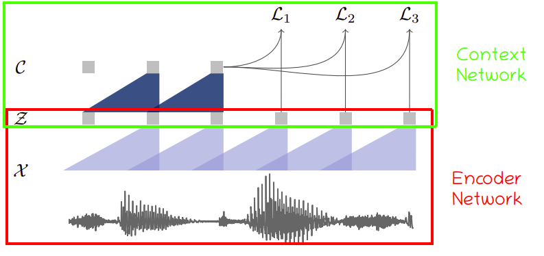

# wav2vec
Wav2Vec is a model created by Facebook AI Research in 2019 and published
in this paper: [Wav2Vec: Unsupervised Pre-Training For Speech
Recognition](https://arxiv.org/pdf/1904.05862.pdf).
<u><strong>Pre-training</strong></u> is the fact of training a first neural network
on a task where lots of data are available, saving the weights, and
creating a second neural network by initializing the weights as the ones
saved from the first one. This can supposedly improve the performance on
the new task with limited data.

The idea behind this paper is to perform the speech recognition task in
two steps each step will be processed by a certain model:

-   **Pre-training model (wav2vec):**\
    A model that takes a raw audio data as input and returns some
    features as an output. We call these feature vectors,
    "contextualized representations". Hence the name "wav2vec".

-   **Acoustic model:**\
    A model that takes these vectors as input and return text as output.

This is very important because if the model was able to do well,
then it will be a game changing since this model can be used with
unlabeled audio data which is so much easier to collect.

Pre-training Model
------------------

The way this model is trained is by trying to distinguish between true
contextualized vector and some other false contextualized vectors called
<u><strong>distractors</strong></u>.

wav2vec, is a convolutional neural network (CNN) that takes raw audio as
input and computes a general representation that can be input to a
speech recognition system. The objective is a contrastive loss that
requires distinguishing a true future audio sample from negatives.

    

Our model takes about 10-30 ms of 16 kHz of audio raw audio signal as
input and then applies two networks:

-   **The encoder network**\
    It's a five-layer CNN model that embeds the audio signal
    $\mathcal{X}$ in a latent space $\mathcal{Z}$. The encoder layers
    have kernel sizes (10, 8, 4, 4, 4) milliseconds and strides (5, 4,
    2, 2, 2) milliseconds. The output of the encoder is a low
    frequency feature representation $z_{i} \in \mathcal{Z}$ which
    encodes and the striding results in representations $z_{i}$ every
    10ms.

-   **The context network**\
    It's a nine-layer CNN model with kernel size of 3 and a stride
    of 1. It combines v time-steps of the encoder's output
    $\mathcal{Z} = z_{i}\text{...}z_{i + v}$ to get a contextualized
    representations $c_{i} \in \mathcal{C}$.

The layers in both the encoder and context networks consist of a
causal convolution with 512 channels, a group normalization layer
and a ReLU non-linearity.

**Note:**\
For training on larger datasets, they used a model variant ("wav2vec
large") with increased capacity, using two additional linear
transformations in the encoder and a considerably larger context
network comprised of twelve layers with increasing kernel sizes (2,
3, . . . , 13). They also used skip connections.

Then, we need to perform an affine transformation over the context
network output:

$$h_{k}\left( c_{i} \right) = W_{k}c_{i} + b_{k}$$

Now, the loss function for this model is:

$$\mathcal{L} = \sum_{k = 1}^{K}\mathcal{L}_{k}$$

$$\mathcal{L}_{k} = - \sum_{i = 1}^{T - k}\left( \log\left( \sigma\left( z_{i + k}.h_{k}\left( c_{i} \right) \right) \right) + \lambda\mathbb{E}\left\lbrack \log\left( \sigma\left( - \widetilde{z}.h_{k}\left( c_{i} \right) \right) \right) \right\rbrack \right)$$

Where:

-   $T$ is the sequence length.

-   $k$ is the step size, while $K$ is all pre-defined step sizes.

-   $\sigma\left( x \right)$ is the sigmoid function.

-   $z_{i + k}\ $is the true sample while $\widetilde{z}$ is the false
    sample (distractor).

-   $\sigma\left( z_{i + k}.h_{k}\left( c_{i} \right) \right)$ is the
    probability of $z_{i + k}$ being the true label.

-   $\sigma\left( - \widetilde{z}.h_{k}\left( c_{i} \right) \right)$ is
    the probability of $\widetilde{z}$ being the distractor.

-   $\lambda$ is set to be equal to the number of negative samples.

After training, we input the representations $c_{i}$ produced by the
context network to the acoustic model instead of log-mel filterbank
features.

Acoustic Model
--------------

In the paper, they used the
[wav2letter++](https://github.com/flashlight/wav2letter) toolkit for
training and evaluation of acoustic models. They created a
character-based wav2letter++ setup which uses seven consecutive blocks
of convolutions (kernel size 5 with 1,000 channels), followed by a PReLU
non-linearity and a dropout rate of 0.7. The final representation is
projected to a 39-dimensional phoneme probability. The model is trained
using the Auto Segmentation Criterion using SGD with momentum.
