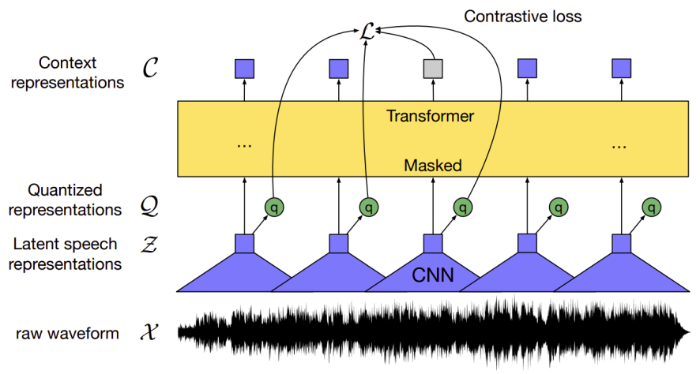
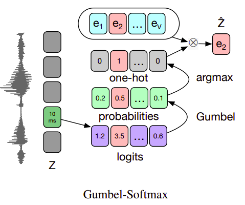
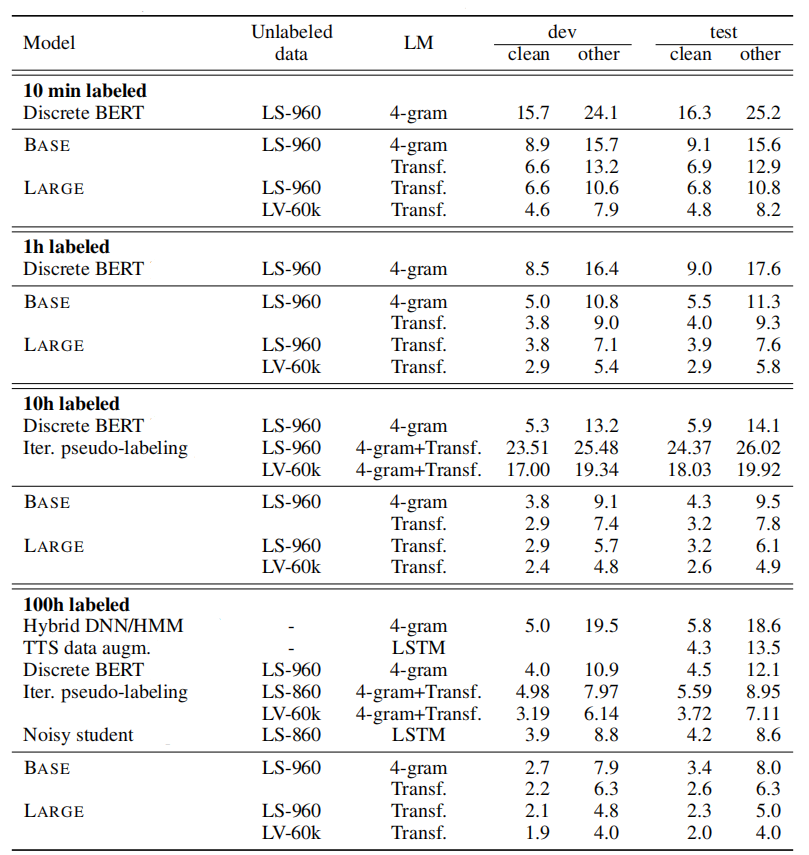
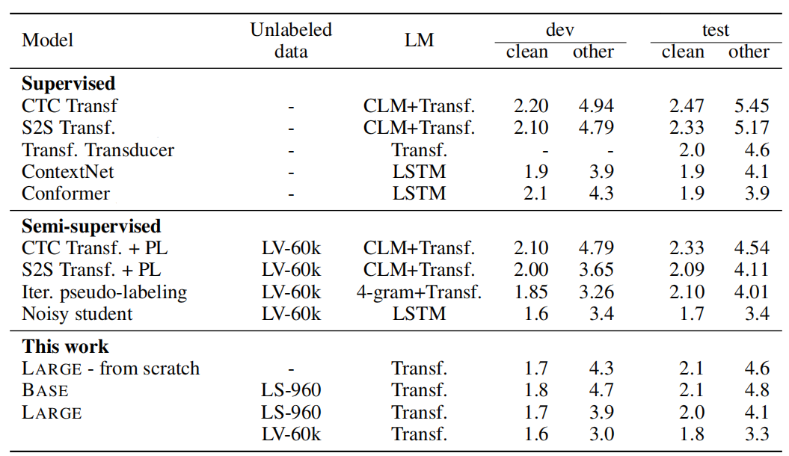
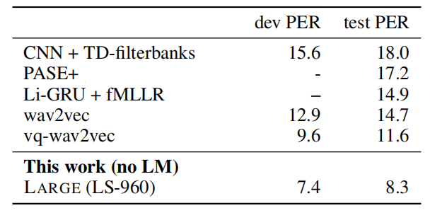

Wav2Vec 2.0 is a self-supervised end-to-end ASR model pre-trained on raw
audio data via masking spans of latent speech representations, similar
to MLM used with
[BERT](https://anwarvic.github.io/language-modeling/BERT). Wav2vec was
created by Facebook AI Research in 2021 and published in this paper:
[wav2vec 2.0: A Framework for Self-Supervised Learning of Speech
Representations](https://arxiv.org/pdf/2006.11477.pdf). The official
code for this paper can be found as part of the fairseq framework on
GitHub:
[fairseq/wav2vec2.0]( https:/github.com/pytorch/fairseq/tree/master/examples/wav2vec2).

Learning purely from labeled examples does not resemble language
acquisition in humans: infants learn language by listening to adults
around them even before they learn to write. Wav2vec 2.0 (illustrated in
the following graph) tries to mimic this idea by pre-training on
unlabeled audio data first using contrastive loss, then fine-tuning on
speech recognition task using labeled data with a
[CTC](https://anwarvic.github.io/speech-recognition/CTC) loss.

    

Architecture
------------

Inspired by the
[wav2vec](https://anwarvic.github.io/speech-recognition/wav2vec)
architecture and the end-to-end setup of the
[vq-wav2vec](https://anwarvic.github.io/speech-recognition/vq-wav2vec)
paper, the authors further explored a novel model architecture that
consists of the following modules; which outperforms
[vq-wav2vec](https://anwarvic.github.io/speech-recognition/vq-wav2vec)
performance while using 10 times less labeled data:

-   **Feature Encoder**: Takes raw audio
    $\mathcal{X} = x_{1},\ x_{2},\ ...\ x_{T}$ and outputs latent
    speech representation $\mathcal{Z} = z_{1},\ z_{2},\ ...z_{T}$ for
    $T$ time-steps.

-   **Transformer**: Takes continuous latent representations
    $\mathcal{Z} = z_{1},\ z_{2},\ ...z_{T}$ and outputs context
    representations $\mathcal{C} = c_{1},\ c_{2},\ ...c_{T}$.

-   **Quantization Module**: Takes latent representations
    $\mathcal{Z} = z_{1},\ z_{2},\ ...z_{T}$ and outputs quantized
    vectors $\mathcal{Q} = q_{1},\ q_{2},\ ...q_{T}$.

> **Note:**\
As said before, wav2vec 2.0 is inspired by
[wav2vec](https://anwarvic.github.io/speech-recognition/wav2vec) and
[vq-wav2vec](https://anwarvic.github.io/speech-recognition/vq-wav2vec).
However, it has the following few differences:
>
> - wav2vec 2.0 builds context representations over continuous speech
    representations while
    [vq-wav2vec](https://anwarvic.github.io/speech-recognition/vq-wav2vec)
    uses discrete speech representations.
>
> - wav2vec 2.0 uses transformers as the context network unlike . in
    their architecture whose self-attention captures dependencies over
    the entire sequence of latent representations end-to-end which is
    different from wav2vec.

Now, let's talk in a little bit more details about the wav2vec 2.0
architecture.

### Feature Encoder

As said earlier, the feature encoder takes normalized raw audio
$\mathcal{X} = x_{1},\ x_{2},\ ...\ x_{T}$ and outputs latent speech
representation $\mathcal{Z} = z_{1},\ z_{2},\ ...z_{T}$ for $T$
time-steps. The raw waveform input to the encoder is normalized to zero
mean and unit variance.

The feature encoder consists of seven layers of temporal convolution
with strides $\left( 5,2,2,2,2,2,2 \right)$ and kernel widths
$\left( 10,3,3,3,3,2,2 \right)$. Each layer has $512$ channels followed
by a layer normalization and a GELU activation function. The stride
determines the number of time-steps $T$ returns from the encoder to the
Transformer. This results in an encoder with a receptive field of of
$25ms$ of audio.

### Context Transformers

The output of the feature encoder is fed to a context network which
follows the
[Transformer](https://anwarvic.github.io/machine-translation/Transformers)-encoder
architecture. The original architecture of transformer encoder has a
positional embedding layer. In this architecture, they used a
convolution layer whose kernel size is $128$ and $16$ channels acting as
positional embedding. Then, they followed the output of the convolution
by a GELU and layer normalization.

In the paper, they experimented with two model configurations:

-   <u><strong>BASE:</strong></u>\
    It contains 12 transformer blocks, model dimension $768$,
    inner dimension (FFN) $3,072\ $and $8$ attention heads and dropout
    of $0.05$. We optimize with Adam, warming up the learning rate for
    the first $8\%$ of updates to a peak of $5 \times 10^{- 4}$ and
    then linearly decay it.

-   <u><strong>LARGE:</strong></u>\
    It contains $24$ transformer blocks with model dimension
    1,024, inner dimension 4,096 and 16 attention heads and dropout of
    0.2. We optimize with Adam, warming up the learning rate for the
    first $8\%$ of updates to a peak of $3 \times 10^{- 4}$ and then
    linearly decay it.

### Quantization Module

For self-supervised training, they discretized the output of the feature
encoder $\mathcal{Z}$ to a finite set of speech representations
$\mathcal{Q}$ using Gumbel-Softmax dot quantization introduced
previously in the
[vq-wav2vec](https://anwarvic.github.io/speech-recognition/vq-wav2vec)
paper.

    

Pre-training & Fine-tuning
--------------------------

To pre-train wav2vec 2.0, they randomly selected a certain proportion
$p = 0.065$ of all time steps to be starting indices and then masked the
subsequent $M = 10$ consecutive time steps of the feature encoder
outputs $\mathcal{Z}$ before feeding them to the context network
(transformer). And the objective is to identify the correct quantized
latent audio representation $q_{t}$ in a set of $K$ distractors for each
masked time step. The loss function for pre-training can be described in
the following formula:

$$\mathcal{L} = \mathcal{L}_{m} + \alpha\mathcal{L}_{d}$$

As we can see, the loss function consists of two terms with a
hyper-parameter $\alpha$ to determine the weight of each term:

-   <u><strong>Contrastive Loss $\mathcal{L}_{m}$:</strong></u>\
    Given context network output $c_{t}$ centered over masked time
    step $t$, the model needs to identify the true quantized latent
    speech representation $q_{t}$ in a set of $K + 1$ quantized
    candidate representations $\widetilde{q} \in \mathcal{Q}_t$
    which includes $q_t$ and $K$ other distractors uniformly sampled
    from other masked time steps of the same utterance, $sim$ is the
    cosine similarity and $\mathfrak{t}$ is the temperature which is a
    non-negative number.

$$\mathcal{L}_{m} = - log\left( \frac{\exp\left( \frac{\text{sim}\left( c_{t},q_{t} \right)}{\mathfrak{t}} \right)}{\sum_{\widetilde{q}\sim\mathcal{Q}}^{}{\exp\left( \frac{\text{sim}\left( c_{t},q_{t} \right)}{\mathfrak{t}} \right)}} \right),\ \ \ \ \ \ sim\left( a,b \right) = \frac{a^{T}\text{.b}}{\left\| a \right\|.\left\| b \right\|}$$

-   <u><strong>Diversity Loss $\mathcal{L}_{d}$:</strong></u>\
    The diversity loss is designed to increase the use of the
    quantized codebook representations by encouraging the equal use of
    the $V$ entries in each of the $G$ codebooks:

$$\mathcal{L}_{d} = \frac{1}{\text{GV}}\sum_{g = 1}^{G}{\sum_{j = 1}^{V}{p_{g,j}.\log\left( p_{g,j} \right)}}$$

> **Note:**\
In the paper, they used $\alpha = 0.1$, $\mathfrak{t} = 0.1$, and
$K = 100$.

Then, wav2vec 2.0 is fine-tuned for speech recognition by adding a
randomly initialized linear projection on top of the context network
into $C = 29$ classes representing the English 26 characters plus
period, apostrophe and a word boundary token. Models are optimized by
minimizing a [CTC](https://anwarvic.github.io/speech-recognition/CTC)
loss.

Labeled audio data was augmented using a modified version of
[SpecAugment](https://anwarvic.github.io/speech-recognition/SpecAugment)
that only masks time-steps and channels. This data augmentation delays
overfitting and significantly improves the final error rates.

Experiments & Results
---------------------

In the experiments, they considered two types of language models (LM): a
4-gram model and a Transformer trained on the Librispeech LM corpus. The
Transformer LM contains 20 blocks, model dimension 1,280, inner
dimension 6,144 and 16 attention heads. Test performance is measured
with beam 1,500 for the 4-gram LM and beam 500 for the Transformer LM.

For pre-training, they used either the 960h of Librispeech corpus
without transcriptions (LS-960) or the 60,000h audio data from LibriVox
(LV-60k) which was 53.2k hours after preprocessing. For fine-tuning,
they used two different settings of labeled data:

1.  **Low-resource setup:** They used three different datasets of 10
    min, 1 hour, 10 hours and 100 hours of Libri-light for this setup to
    have a sense of how the model is going to perform in low resource
    settings.

    

        
    

2.  **High-resource Setup:** They used the 960 hours of transcribed
    Librispeech to assess the effectiveness of our approach in a high
    resource setup. The following table shows that wav2vec achieves
    amazing results.

    

Next, they evaluated the model on TIMIT phoneme recognition by
fine-tuning the pre-trained models on the labeled TIMIT training
data for the 10 hour subset of Libri-light wihtout using a language
model. The following table shows that this approach can achieve a
new state of the art on this dataset.

    

