FastSpeech is a novel non-autoregressive Text-to-Speech (TTS) model
based on the
[Transformer](https://anwarvic.github.io/machine-translation/Transformer)
architecture. It takes a text (phoneme) sequence as input and generates
mel-spectrograms non-autoregressively, later a vocoder is used to
convert the spectrogram to audio waveforms. FastSpeech was proposed by
Microsoft in 2019 and published in this paper under the same name:
"[FastSpeech: Fast, Robust and Controllable Text to
Speech](https://arxiv.org/pdf/1905.09263.pdf)". The official synthesized
speech samples resulted from FastSpeech can be found in this
[website](https://speechresearch.github.io/fastspeech/). The unofficial
PyTorch implementation of FastSpeech can be found in this GitHub
repository: [FastSpeech](https://github.com/xcmyz/FastSpeech).

    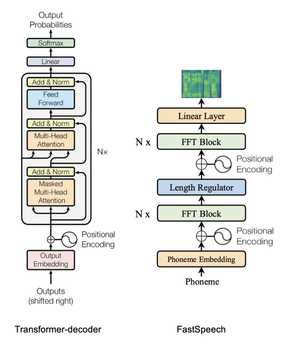

## Architecture

Since a mel-spectrogram sequence is much longer than its corresponding
phoneme sequence, FastSpeech adopts a Length Regulator that up-samples
the phoneme sequence according to the phoneme duration (i.e., the number
of mel-spectrograms that each phoneme corresponds to) to match the
length of the mel-spectrogram sequence. The Length Regulator is built on
a phoneme duration predictor, which predicts the duration of each
phoneme. The whole architecture of FastSpeech is shown below:

    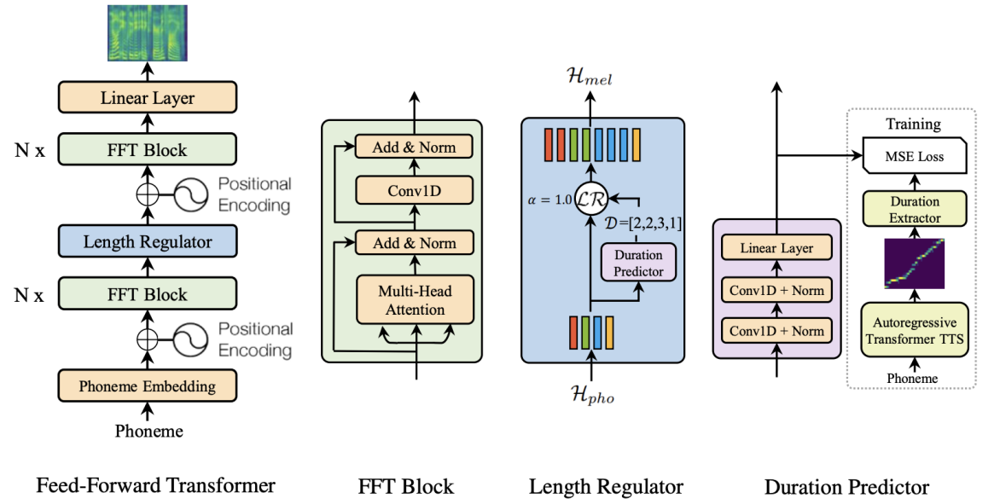

From the previous figure, we can see that FastSpeech consists of three
main components: <u><strong>Feed-forward Transformer</strong></u>, <u><strong>Duration
Predictor</strong></u>, and <u><strong>Length Regulator</strong></u>. In the
next part, we are going to talk about each component in more details.

### Feed-forward Transformer

Feed-Forward Transformer, highlighted in red box in the following
figure, stacks multiple FFT blocks for phoneme to mel-spectrogram
transformation, with $N$ blocks on the phoneme side, and $N$ blocks on
the mel-spectrogram side, with a Length Regulator (which will be
described in the next subsection) in between to bridge the length gap
between the phoneme and mel-spectrogram sequence.

    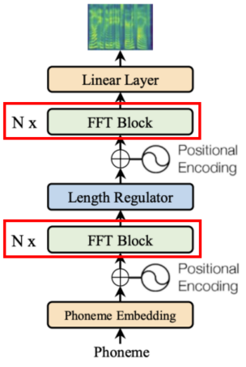

Each FFT block, as shown below, consists
of <u><strong>multi-head self-attention mechanism</strong></u> to extract the
cross-position information and 2-layer <u><strong>1D convolutional
network</strong></u> with ReLU activation instead of the dense network
in [Transformer](https://anwarvic.github.io/machine-translation/Transformer).
The motivation is that the adjacent hidden states are more closely
related in the character/phoneme and mel-spectrogram sequence in speech
tasks. Similar to
[Transformer](https://anwarvic.github.io/machine-translation/Transformer),
residual connections, layer normalization, and dropout are added after
the self-attention network and 1D convolutional network respectively.

    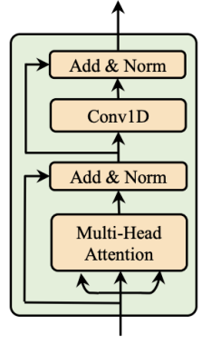

> **Note:**\
The Feed-forward Transformer on the phoneme side is usually referred to
as the "Encoder" while the one on the mel-spectrogram side is referred
to as the "Decoder".

### Length Regulator

The Length Regulator is used to solve the problem of length mismatch
between the phoneme and spectrogram sequence in the Feed-Forward
Transformer. As said earlier, the mel-spectrogram sequence is expected
to be way longer then the phoneme sequence. And to solve this problem,
the Length Regulator expands the hidden state of the phoneme sequence so
it equals the length of the mel-spectrogram sequence.

    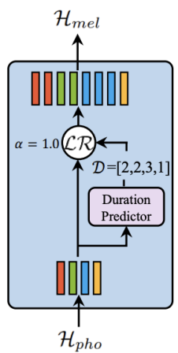

More formally, given phoneme sequence hidden states as
$H_{pho} = \left\lbrack h_{1},\ h_{2},...h_{n} \right\rbrack$, where $n$
is the length of the phoneme sequence. And the phoneme duration (how
many mel-spectrogram frames for each phoneme) sequence as
$D = \left\lbrack d_{1},\ d_{2},...d_{n} \right\rbrack$, where
$\sum_{i = 1}^{n}d_{i} = m$ and $m$ is the length of the mel-spectrogram
sequence and $m \gg n$. The Length Regulator $LR$ expands $H_{pho}$ to
become $H_{mel}$ according to the following formula where $\alpha$ is a
hyper-parameter:

$$H_{mel} = LR\left( H_{pho},\ D,\ \alpha \right)$$

For example, given
$H_{pho} = \left\lbrack h_{1},\ h_{2},\ h_{3},\ h_{4} \right\rbrack$ and
$D = \lbrack 2,\ 2,\ 3,\ 1\rbrack$, the expanded sequence $H_{mel}$
becomes
$\left\lbrack h_{1},\ h_{1},\ h_{2},\ h_{2},\ h_{3},\ h_{3},\ h_{3},\ h_{4} \right\rbrack$.
As you can see, phoneme $h_{1}$ was repeated twice since the duration
predictor predicted $2$, same happens for phoneme $h_{2}$ \...etc. Now,
the phoneme sequence (whose previous length was $n$) is equal to the
mel-spectrogram sequence with a length of $m$.

In the previous case, $\alpha = 1$ which is the normal speed. When
$\alpha = 1.3$ (slow speed) or $\alpha = 0.5$ (fast speed), the duration
sequences become
$D_{\alpha = 1.3} = \lbrack 2.6,\ 2.6,\ 3.9,\ 1.3\rbrack \approx \lbrack 3,\ 3,\ 4,\ 1\rbrack$
and
$D_{\alpha = 0.5} = \lbrack 1,\ 1,\ 1.5,\ 0.5\rbrack \approx \lbrack 1,\ 1,\ 2,\ 1\rbrack$,
respectively. As you might predicted, the Length Regulator $LR$ can
easily adjust voice speed by lengthening or shortening the phoneme
duration.

> **Note:**\
The Length Regulator $LR$ can also control the break between words by
adjusting the duration of the space characters in the sentence, so as to
adjust part of prosody of the synthesized speech

At this point, we discussed how the Length Regulator $LR$ uses phoneme
duration $D$ to regularize the sequence length difference. In the next
part, we are going to talk about how to predict $D$ in the first place.

### Duration Predictor

In the paper, they refer to the phoneme duration $D$ as the number of
mel-spectrogram frames that maps to each phoneme. So,
$D = \lbrack 2,\ 2,\ 3,\ 1\rbrack$ means that the first and second
phonemes map to two mel-spectrogram frames each, and the third phoneme
maps to three frames while the last phoneme maps to just one frame. As
you have seen earlier, this sequence is very important to the Length
Regulator. Here, we are going to discuss how eht authors predicted this
$D$ sequence.

Duration Predictor module, as shown in the following figure, consists of
a 2-layer 1D convolutional network with ReLU activation, each followed
by the layer normalization and the dropout layer, and an extra linear
layer to output a scalar, which is exactly the predicted phoneme
duration.

    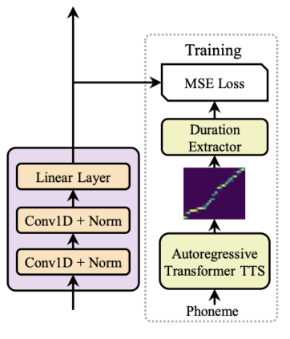

The Duration Predictor is only used in the inference phase. During the
training phase, the ground-truth phoneme duration are extracted from an
autoregressive teacher TTS model, as shown in the previous figure. The
following is the detailed steps:

-   First, they train an auto-regressive teacher TTS model. In the
    paper, they used [Transformer
    TTS](https://anwarvic.github.io/speech-synthesis/Transformer_TTS)
    model.

-   For each training sequence pair, they extract the decoder-to-encoder
    attention alignments from the trained teacher model. Since there are
    multiple attention alignments (one for each head), they compute a
    focus rate $F$ (defined below) for each head and choose the one with
    the highest focus.

$$F = \frac{1}{S}\sum_{s = 1}^{S}{\max_{1 \leq t \leq T}a_{s,t}}$$

&emsp;&emsp;&emsp; Where $S$ and $T$ are the lengths of the ground-truth
spectrograms and phonemes, as, $a_{s,t}$ donates the element in the $s$-th
row and $t$-th column of the attention matrix. The following figure shows
the different between a good alignment (has higher focus) and a bad alignment
(has lower focus):

    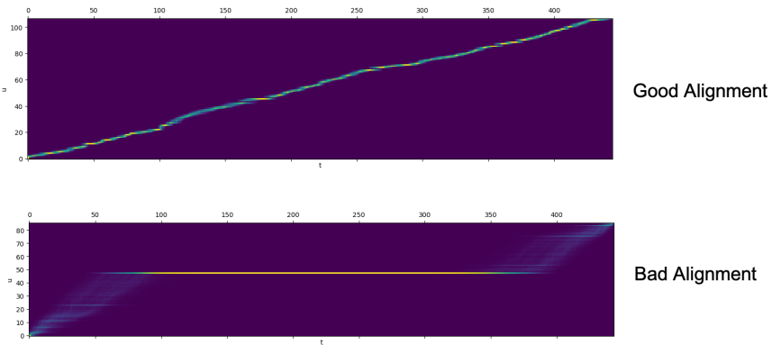

-   Finally, the phoneme duration sequence $D$ is the number of
    mel-spectrograms attended to each phoneme according to the attention
    matrix selected in the above step. Now, the phoneme duration
    sequence is defined as:

$$d_{i} = \sum_{s = 1}^{S}\left\lbrack \underset{t}{\arg\max}a_{s,t} = i \right\rbrack$$

## Experiments

Regarding dataset, in this paper they used LJSpeech dataset, which
contains $13,100$ English audio clips and the corresponding text
transcripts, with the total audio length of approximate 24 hours.
Dataset was randomly split into 3 sets: $12500$ samples for training,
$300$ samples for validation and $300$ samples for testing.

Regarding text pre-processing, they converted the text sequence into the
phoneme sequence using [grapheme-to-phoneme
(g2p)](https://github.com/Kyubyong/g2p) tool. Regarding audio
pre-processing, they converted the raw waveform into mel-spectrograms
using frame size of $1024$ and hop size of $256$.

Regarding the architecture, FastSpeech consisted of $6$ FFT blocks on
both the phoneme side and the mel-spectrogram side. The size of the
phoneme vocabulary was $51$, including punctuations. The dimension of
phoneme embeddings, the hidden size of the self-attention and 1D
convolution in the FFT block were all set to $384$. The number of
attention heads was set to $2$. The kernel sizes of the 1D convolution
in the 2-layer convolutional network were both set to $3$, with
input/output size of $384/1536$ for the first layer and $1536/384$ in
the second layer. The output linear layer converts the $384$-dimensional
hidden into $80$-dimensional mel-spectrogram.

Regarding the duration predictor, the kernel sizes of the 1D convolution
were set to $3$, with input/output sizes of $384/384$ for both layers.
The teacher TTS had the same configuration as [Transformer
TTS](https://anwarvic.github.io/speech-synthesis/Transformer_TTS), which
consists of a 6-layer encoder, a 6-layer decoder, except that they used
1D convolution network instead of position-wise FFN. This teach model
was trained with batch size of $16$ sentences with Adam optimizer with
$\beta_{1} = 0.9$, $\beta_{2} = 0.98$, and $\epsilon = 10^{- 9}$. It
takes $80k$ steps for training until convergence.

> **Note:**\
In this paper, the teacher model serves two purposes:
>
> - To extract the phoneme duration as the target to train the duration
    predictor.
>
> - To perform sentence-level knowledge distillation. This is how it
    works: given a source text sequence, they used the teacher model to
    generate the mel-spectrograms creating new paired data that can be
    used for FastSpeech model further training.

The complete list of hyper-parameters used to train FastSpeech and
the teacher model ([Transformer
TTS](https://anwarvic.github.io/speech-synthesis/Transformer_TTS))
is shown below:

    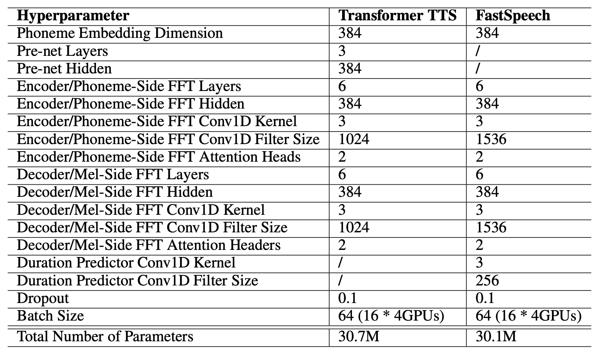

## Results

In this part, we are going to discuss the performance of FastSpeech in
terms of:

-   <u><strong>Audio Quality:</strong></u>\
    They compared FastSpeech to the ground-truth with/without Vocoder,
    [Tacotron
    2](https://anwarvic.github.io/speech-synthesis/Tacotron_2), Merlin
    (popular parametric TTS), and [Transformer
    TTS](https://anwarvic.github.io/speech-synthesis/Transformer_TTS).
    All previous models used
    [WaveGlow](https://anwarvic.github.io/speech-synthesis/WaveGlow) as
    vocoder except Merlin used [WORLD](https://github.com/mmorise/World)
    Vocoder. The results are shown in the following table which shows
    that FastSpeech can nearly match the quality of the [Transformer
    TTS](https://anwarvic.github.io/speech-synthesis/Transformer_TTS)
    and [Tacotron
    2](https://anwarvic.github.io/speech-synthesis/Tacotron_2) models.

    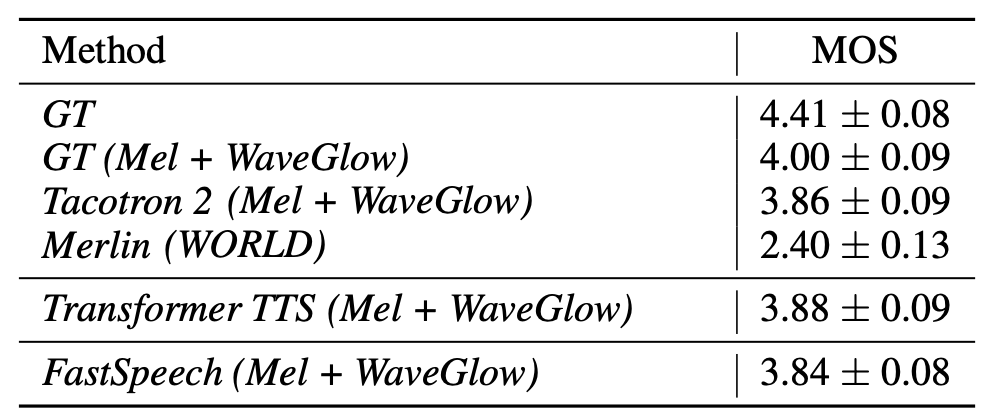

-   <u><strong>Inference Speedup:</strong></u>\
    They compared the inference of FastSpeech compared with [Transformer
    TTS](https://anwarvic.github.io/speech-synthesis/Transformer_TTS)
    model, which has similar number of model parameters and results are
    shown in the following table. Without Vocoder, FastSpeech speeds up
    the mel-spectrogram generation by $269.40$x. With Vocoder,
    FastSpeech still achieves $38.30$x speedup for audio generation.

    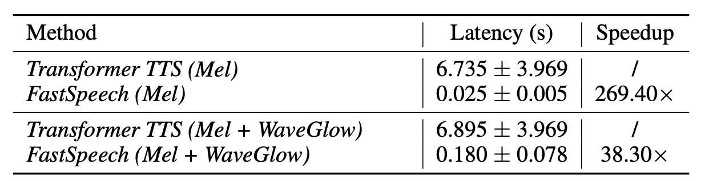

As an ablation study to verify the effectiveness of several
components in FastSpeech, including 1D Convolution and
sequence-level knowledge distillation, they performed some
experiments and reported the results in the following table; which
shows how much important is the sentence-level knowledge
distillation.

    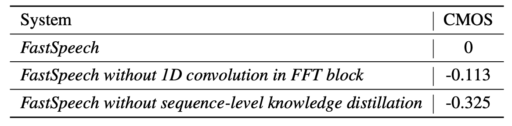

