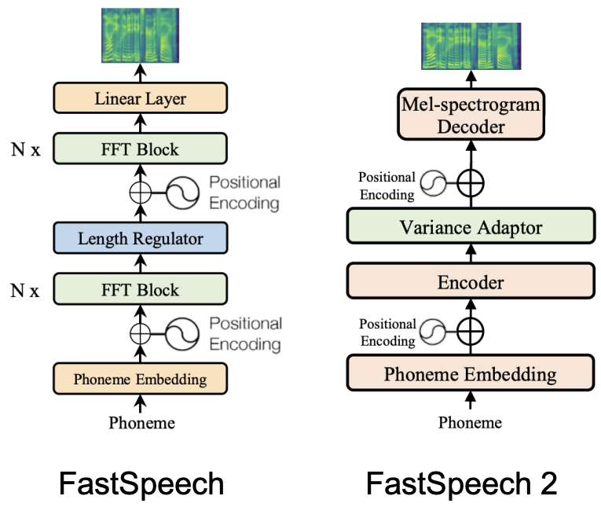
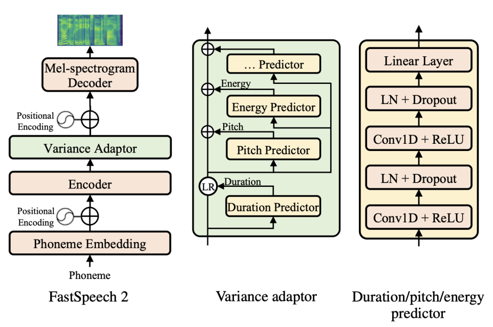
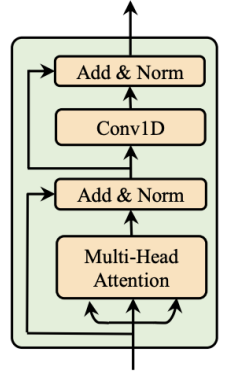
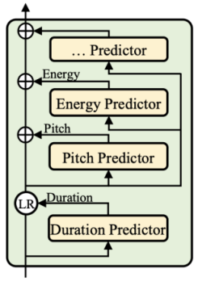
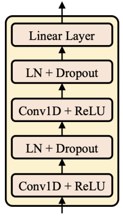
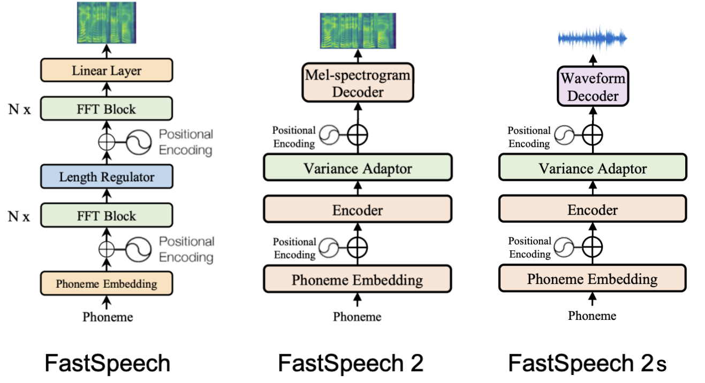
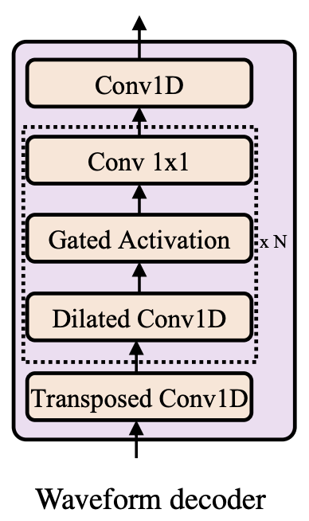
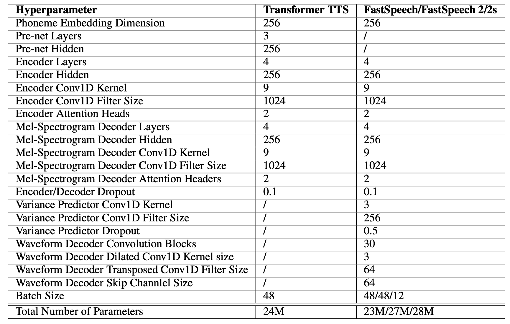
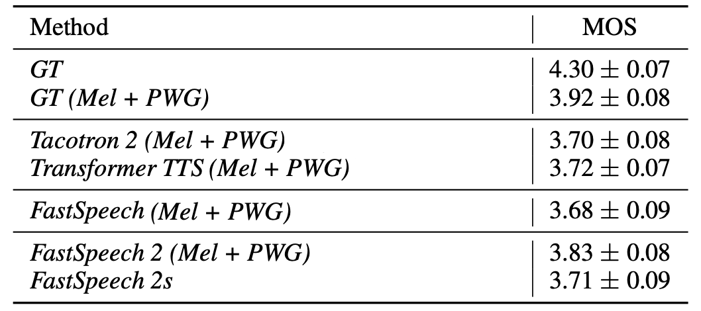
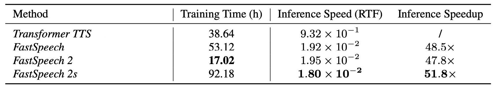

[FastSpeech](https://anwarvic.github.io/speech-synthesis/FastSpeech)
model was a novel non-autoregressive TTS model that achieve on-par
results to auto-regressive counterparts while being 38 times faster.
Despite these advantages,
[FastSpeech](https://anwarvic.github.io/speech-synthesis/FastSpeech)
had three main issues:

-   It was depending on a teacher auto-regressive model making pipeline
    complicated and time-consuming.

-   The duration extracted from the teacher model was not accurate
    enough, which hurt the duration predictor performance.

-   The target mel-spectrograms distilled from teacher model suffered
    from information loss due to data simplification, which limited the
    voice quality.

FastSpeech 2 is a non-autoregressive TTS model by the same authors as
[FastSpeech](https://anwarvic.github.io/speech-synthesis/FastSpeech)
where they solved the issues mentioned above. FastSpeech 2 is trained
directly on the ground-truth target instead of the simplified output
from the teacher TTS. FastSpeech 2 was proposed by Microsoft (same
authors as
[FastSpeech](https://anwarvic.github.io/speech-synthesis/FastSpeech))
in 2020 and published in this paper under the same name: "[FastSpeech 2:
Fast and High-Quality End-to-End Text to
Speech](https://arxiv.org/pdf/2006.04558.pdf)". The official synthesized
speech samples resulted from FastSpeech 2 can be found in this
[website](https://speechresearch.github.io/fastspeech2/). The unofficial
PyTorch implementation of FastSpeech 2 can be found in this GitHub
repository: [FastSpeech2](https://github.com/ming024/FastSpeech2).

    

## Architecture

The overall architecture of FastSpeech 2 is shown in the following
figure. The <u><strong>Encoder</strong></u> converts the phoneme embedding
sequence into the phoneme hidden sequence, and then the <u><strong>Variance
Adaptor</strong></u> adds in different variance information such as
duration, pitch and energy into the hidden sequence, finally the
<u><strong>Mel-spectrogram Decoder</strong></u> converts the adapted hidden
sequence into mel-spectrogram sequence in parallel.

    

From the previous figure, we can see that FastSpeech 2 consists of three
main components: <u><strong>Encoder</strong></u>, <u><strong>Variance Adaptor</strong></u>,
and <u><strong>Mel-spectrogram Decoder</strong></u>. In the next part, we are going
to discuss each component in more details:

### Encoder

The encoder here is the same as the Feed-forward Transformer in
[FastSpeech](https://anwarvic.github.io/speech-synthesis/FastSpeech)
which is a stack of $N$ blocks of FFT blocks. Each FFT block, as shown
below, consists of <u><strong>multi-head self-attention mechanism</strong></u>
to extract the cross-position information and 2-layer
<u><strong>1D convolutional network</strong></u> with ReLU activation. Similar to
[Transformer](https://anwarvic.github.io/machine-translation/Transformer),
residual connections, layer normalization, and dropout are added after
the self-attention network and 1D convolutional network respectively.

    

### Variance Adaptor

The Variance Adaptor (shown in the following figure)
aims to add variance information (e.g., duration, pitch, energy,
emotion, style, speaker, ... etc.) to the phoneme hidden sequence,
which can provide enough information to predict variant speech. As you
can see from the figure, they only care for the phone duration, pitch
and energy information in the paper. However, the model is flexible and
can adapt to more variance information.

    

On the other hand, the following figure shows the architecture of the
duration/pitch/energy predictors. They all share the model structure
(but different model parameters), which consists of a 2-layer
1D-convolutional network with ReLU activation, each followed by the
layer normalization and the dropout layer, and an extra linear layer to
project the hidden states into the output sequence. In the following
paragraphs, we describe the details of the three predictors
respectively.

    

#### Duration Predictor

The Duration Predictor (same as in
[FastSpeech](https://anwarvic.github.io/speech-synthesis/FastSpeech))
takes the phoneme hidden sequence as input and predicts the duration of
each phoneme (how many mel frames correspond to this phoneme), and is
converted into logarithmic domain for ease of prediction.

It is optimized with mean square error (MSE) loss, taking the extracted
duration as training target. Instead of extracting the phoneme duration
using a pre-trained autoregressive TTS model in
[FastSpeech](https://anwarvic.github.io/speech-synthesis/FastSpeech),
it uses [Montreal forced
alignment](https://github.com/MontrealCorpusTools/Montreal-Forced-Aligner)
tool.

#### Pitch Predictor

"Pitch" is a key feature to convey emotions and greatly affects the
speech prosody. To better predict the variations in pitch contour, they
used continuous wavelet transform (CWT) to decompose the continuous
pitch series into pitch spectrogram and take the pitch spectrogram as
the training target for the pitch predictor.

In inference, the pitch Predictor predicts the pitch spectrogram, which
is further converted back into pitch contour using inverse continuous
wavelet transform (iCWT). To take the pitch contour as input in both
training and inference, they quantized pitch $F0$
(ground-truth/predicted value for train/inference respectively) of each
frame to $256$ possible values in log-scale and further convert it into
pitch embedding vector $p$ and add it to the expanded hidden sequence.
Pitch Predictor is optimized with MSE loss.

#### Energy Predictor

"Energy" indicates the frame-level magnitude of mel-spectrograms and
directly affects the volume and prosody of speech. It's computed as the
L2-norm of the amplitude of each short-time Fourier transform (STFT)
frame. Then, they quantized the energy of each frame to $256$ possible
values uniformly, encoded it into energy embedding $e$ and add it to the
expanded hidden sequence similarly to pitch. They used the Energy
Predictor to predict the original values of energy instead of the
quantized values and optimize the energy predictor with MSE loss.

### Mel-spectrogram Decoder

The decoder here is the same as the Feed-forward Transformer in
[FastSpeech](https://anwarvic.github.io/speech-synthesis/FastSpeech)
which is a stack of $N$ blocks of FFT blocks. Each FFT block, as shown
below, consists of <u><strong>multi-head self-attention mechanism</strong></u>
to extract the cross-position information and 2-layer <u><strong>1D
convolutional network</strong></u> with ReLU activation. Similar to
[Transformer](https://anwarvic.github.io/machine-translation/Transformer),
residual connections, layer normalization, and dropout are added after
the self-attention network and 1D convolutional network respectively.
The output linear layer in the decoder converts the hidden states into
80-dimensional mel-spectrograms and our model is optimized with mean
absolute error (MAE).

    

## FastSpeech 2s

In the paper, they introduced a new variant of FastSpeech2 which doesn't
have the need for Vocoder as it directly generates waveform from text.
As shown in the following figure, FastSpeech 2s replaces the
mel-spectrogram decoder in FastSpeech 2 with a waveform decoder.

    

The waveform decoder used in FastSpeech 2,
as shown below, has the same architecture as
[WaveNet](https://anwarvic.github.io/speech-synthesis/WaveNet) including
non-causal convolutions and gated activation. The waveform decoder takes
a sliced hidden sequence corresponding to a short audio clip as input
and up-samples it with transposed 1D-convolution to match the length of
audio clip. The waveform decoder consists of 1-layer transposed
1D-convolution with filter size $64$ and $30$ dilated residual
convolution blocks, whose skip channel size and kernel size of
1D-convolution are set to $64$ and $3$.

    

Pushing TTS pipeline towards fully end-to-end framework has several
challenges. In this part, we are going to discuss the problem as how the
authors tried to overcome it:

-   **Challenge:** Since the waveform contains more variance information
    (e.g., phase) than mel-spectrograms, the information gap between the
    input and output is larger than that in text-to-spectrogram
    generation.

    -   **Solution:** They used adversarial training to force the
        decoder to implicitly recover the phase information by itself.
        The discriminator in the adversarial training adopts the same
        structure in [Parallel
        WaveGAN](https://anwarvic.github.io/speech-synthesis/Parallel_WaveGAN)
        which consists of ten layers of non-causal dilated 1-D
        convolutions with leaky ReLU activation function.

-   **Challenge:** It is difficult to train on the audio clip that
    corresponds to the full text sequence due to the extremely long
    waveform samples and limited GPU memory.

    -   **Solution:** They leveraged the mel-spectrogram decoder of
        FastSpeech 2, which is trained on the full text sequence to
        help on the text feature extraction.

The waveform decoder is optimized by the multi-resolution STFT loss and
the LSGAN discriminator loss following [Parallel
WaveGAN](https://anwarvic.github.io/speech-synthesis/Parallel_WaveGAN).
In inference, they discarded the mel-spectrogram decoder and only use
the waveform decoder to synthesize speech audio.

## Experiments

Similar to
[FastSpeech](https://anwarvic.github.io/speech-synthesis/FastSpeech),
all experiments in this paper was done on LJSpeech dataset which
contains $13,100$ English audio clips (about 24 hours) and corresponding
text transcripts. Unlike
[FastSpeech](https://anwarvic.github.io/speech-synthesis/FastSpeech),
they split the dataset differently: they used $12,228$ samples for
training, $349$ samples (with document title LJ003) for validation and
$523$ samples (with document title LJ001 and LJ002) for testing. For
subjective evaluation, they randomly choose 100 samples in test set.

Similarly to
[FastSpeech](https://anwarvic.github.io/speech-synthesis/FastSpeech),
as a pre-processing step, they converted the text sequence into the
phoneme sequence using [grapheme-to-phoneme
(g2p)](https://github.com/Kyubyong/g2p) tool. And they converted the raw
waveform into mel-spectrograms using frame size of $1024$ and hop size
of $256$ with respect to the sample rate $22050$.

Regarding the model configuration, FastSpeech 2 consists of 4
feed-forward Transformer (FFT) blocks in the encoder and the
mel-spectrogram decoder. The output linear layer in the decoder converts
the hidden states into 80-dimensional mel-spectrograms and the model is
optimized with mean absolute error (MAE).

To train FastSpeech 2, they used the Adam optimizer with
$\beta_{1} = 0.9$, $\beta_{2} = 0.98$, and $\epsilon = 10^{- 9}$.
FastSpeech 2 takes double the number of training steps for training
until convergence than FastSpeech, it takes $160k$ steps. In the
inference process, they used a pre-trained [Parallel
WaveGAN](https://anwarvic.github.io/speech-synthesis/Parallel_WaveGAN)
as a Vocoder. The total list of hyper-parameters used in this model can
be seen below:

    

For FastSpeech 2s, they used the same optimizer and learning rate
schedule as FastSpeech 2, and it took the model $600k$ steps for
training until convergence. The details of the adversarial training
follow [Parallel
WaveGAN](https://anwarvic.github.io/speech-synthesis/Parallel_WaveGAN).

## Results

In this part, we are going to discuss the performance of FastSpeech 2 in
terms of:

-   <u><strong>Audio Quality:</strong></u>\
    They compared FastSpeech 2 to the ground-truth with/without Vocoder,
    [Tacotron
    2](https://anwarvic.github.io/speech-synthesis/Tacotron_2),
    [Transformer
    TTS](https://anwarvic.github.io/speech-synthesis/Transformer_TTS),
    and
    [FastSpeech](https://anwarvic.github.io/speech-synthesis/FastSpeech).
    All previous models used [Parallel
    WaveGAN](https://anwarvic.github.io/speech-synthesis/Parallel_WaveGAN)
    (PWG) as vocoder. The results are shown in the following table which
    shows that FastSpeech 2 outperforms
    [FastSpeech](https://anwarvic.github.io/speech-synthesis/FastSpeech)
    and other auto-regressive models. can nearly match the quality of
    the [Transformer
    TTS](https://anwarvic.github.io/speech-synthesis/Transformer_TTS)
    and [Tacotron
    2](https://anwarvic.github.io/speech-synthesis/Tacotron_2) models.

    

-   <u><strong>Inference Speedup:</strong></u>\
    They compared the inference of FastSpeech 2 compared to [Transformer
    TTS](https://anwarvic.github.io/speech-synthesis/Transformer_TTS)
    model and
    [FastSpeech](https://anwarvic.github.io/speech-synthesis/FastSpeech)
    and results are shown in the following table. FastSpeech 2
    simplifies the training pipeline of
    [FastSpeech](https://anwarvic.github.io/speech-synthesis/FastSpeech)
    by removing the teacher-student distillation process, and thus
    reduces the training time by $3.12$x compared with
    [FastSpeech](https://anwarvic.github.io/speech-synthesis/FastSpeech).

    

