Glow-TTS, a flow-based generative non-autoregressive model for
two-staged Text-to-Speech systems. Given an input text, Glow-TTS is able
to generate mel-spectrogram that does not require any external aligner,
unlike other models such as
[FastSpeech](https://anwarvic.github.io/speech-synthesis/FastSpeech) or
[ParaNet](https://anwarvic.github.io/speech-synthesis/ParaNet). Glow-TTS
model was proposed by Kakao Enterprise and published in this paper under
the same name: "[Glow-TTS: A Generative Flow for Text-to-Speech via
Monotonic Alignment Search](https://arxiv.org/pdf/2005.11129.pdf)". The
official implementation of this model can be found in this GitHub
repository: [glow-tts](https://github.com/jaywalnut310/glow-tts). The
official synthetic audio samples resulting from Glow-TTS can be found in
this [website](https://jaywalnut310.github.io/glow-tts-demo/index.html).

> **Note:**\
Glow-TTS is inspired by [Glow](https://openai.com/blog/glow/) (a
flow-based generative model created by OpenAI in 2018), hence the name.

> **Note to Reader:**\
Before going on with this post, I really urge you to check the
"Generative Models Recap" part in the
[WaveGlow](https://anwarvic.github.io/speech-synthesis/WaveGlow) post.
In this part, you will know more about flow-based generative models such
as Glow.

Glow-TTS combines the properties of flow-based models and dynamic
programming to efficiently search for the most probable monotonic
alignment between text and the latent representation of speech.
Enforcing hard monotonic alignments enables the model to generalize to
long utterances, and employing flows enables fast, and controllable
speech synthesis. By altering the latent representation of speech, they
were able to synthesize speech with various intonation patterns and
regulate the pitch of speech. Also, Glow-TTS can be extended to a
multi-speaker setting with only a few modifications.

## Architecture

The overall architecture of Glow-TTS is shown in the following figure.
The <u><strong>Encoder</strong></u> gets a text sequence and processes it
resulting in hidden representation $h$, which is passed to two modules:
a linear projection layer to estimate the (mean, covariance) of the
prior distribution and a <u><strong>Duration Predictor</strong></u> network to
predict the duration. During training, the <u><strong>Decoder</strong></u>
efficiently transforms a mel-spectrogram into the latent representation.
Then, the <u><strong>Monotonic Alignment Search (MAS)</strong></u> algorithm
tries to align the encoder's prior distribution to the decoder's latent
representation. During inference, the <u><strong>Decoder</strong></u> (being a
flow-based model) reverses its role and transforms the aligned
representation to mel-spectrogram.

    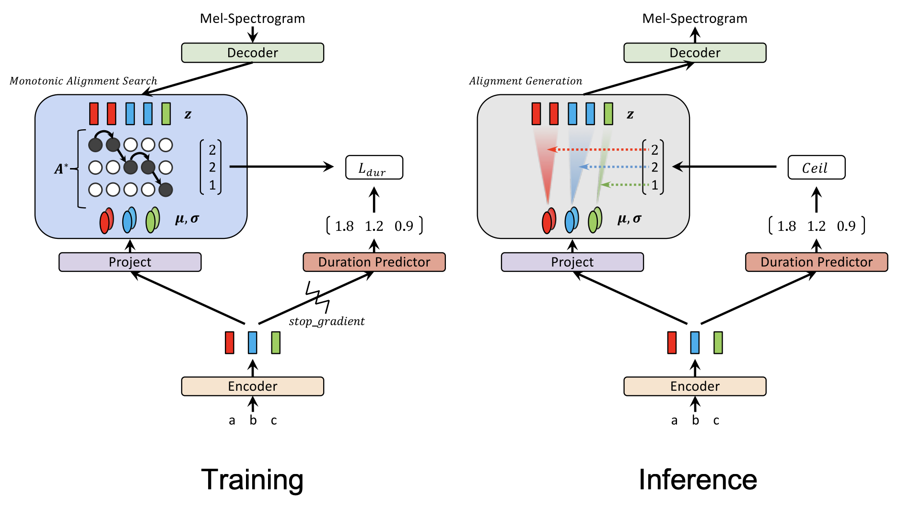

Given a text $c$ and mel-spectrogram $x$, Glow-TTS tries to model the
conditional distribution of mel-spectrograms
$P\left( x \middle| c \right)$. Glow-TTS does that by transforming the
past conditional distribution to another conditional prior distribution
$P\left( z \middle| c \right)$ using transformation function $f$ as
shown in the following equation:

$$log\ P\left( x \middle| c \right) = log\ P\left( z \middle| c \right) + log\ \left| det\ \frac{\partial f^{- 1}(x)}{\partial x} \right|$$

Where $P\left( x \middle| c \right)$ is a distribution of
mel-spectrogram $x$ conditioned on text $c$,
$P\left( z \middle| c \right)$ is a prior distribution of latent
representation $z$ conditioned on text $c$ which is the task of the
Encoder. The
$\left| det\ \frac{\partial f^{- 1}(x)}{\partial x} \right|$ term is
basically a scaling number, which is the determinant of the Jacobian
matrix of the transformation function $f$. This transformation function
should be able to transform latent representation $z$ to mel-spectrogram
$x$, which is the job of the decoder.

### Encoder

Glow-TTS encoder, shown in the following figure, follows the encoder
structure of [Transformer
TTS](https://anwarvic.github.io/speech-synthesis/Transformer_TTS) with
two main difference:

-   They removed the positional encoding and add relative position
    representations into the self-attention modules instead

-   They also added residual connections to the encoder pre-net.

    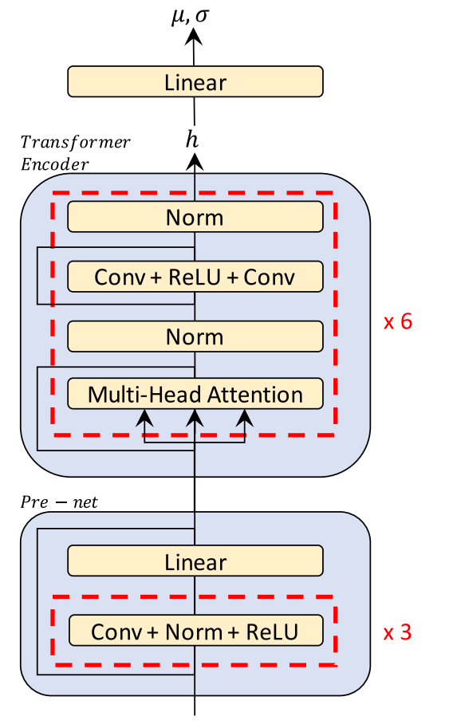

The encoder maps input text $c = c_{1:T}$ where $T$ is the text length
into latent representation $h$ which is consecutively passed to a
one-linear projection layer in order to estimate the mean
$\mu = \mu_{1:T}$ and covariance $\sigma = \sigma_{1:T}$ of the prior
distribution, which is multivariate Gaussian distribution. And the same
latent representation $h$ is passed to another module called
"<u><strong>Duration Predictor</strong></u>".

### Duration Predictor

The duration predictor architecture and configuration is the same as
those of
[FastSpeech](https://anwarvic.github.io/speech-synthesis/FastSpeech),
which is composed of two convolutional layers with ReLU activation,
layer normalization, and dropout followed by a projection layer.

    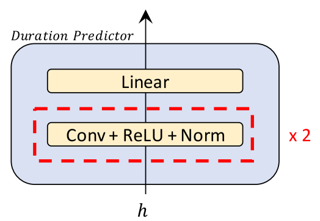

The duration predictor is trained with the mean squared error loss (MSE)
in the logarithmic domain as shown in the following equation:

$$d_{i} = \sum_{j = 1}^{T_{mel}}1_{A^{\ast}(j) = i},\ \ i = 1,\ ...T_{text}$$

$$\mathcal{L}_{dur} = MSE\left( f_{dur}\left( sg\lbrack h\rbrack \right),\ d \right)$$

Where:

-   $T_{text}$ and $T_{mel}$ are the length of the input text and
    mel-spectrogram respectively.

-   $d_{i}$ is the duration for the $i^{th}$ character/phoneme in the
    input text.

-   $A^{\ast}$ is the most probable alignment, resulting from MAS.

-   $f_{dur}$ is the duration predictor.

-   $h$ is the encoder latent representation.

-   $sg\lbrack.\rbrack$ is the stop-gradient operator, which removes the
    gradient of input in the backward pass.

### Monotonic Alignment Search (MAS)

MAS searches for the most probable monotonic alignment between the
latent representation $z_{1:T_{mel}}$ resulting from the decoder during
training; and the statistics of the prior distribution
$\left( \mu_{1:T_{text}},\sigma_{1:T_{text}} \right)$ resulting from the
encoder + projection layer. The Monotonic Alignment Search (MSA)
algorithm can be see down below:

    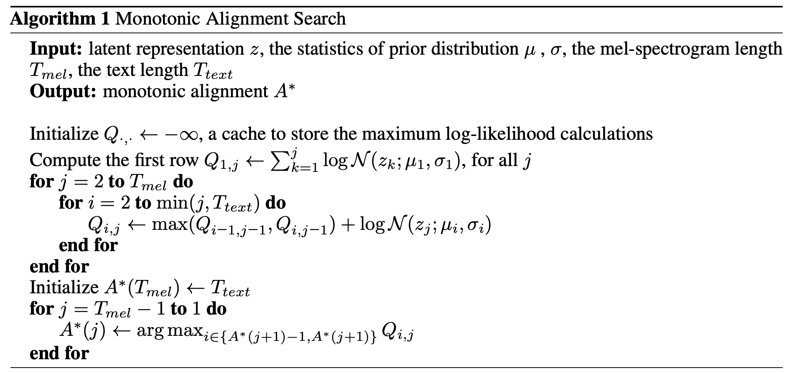

Inspired by the fact that a human reads out text in order, this
algorithm enforces hard monotonic alignments. Monotonic alignment means
that the alignment between the two variables are not decreasing at any
point. For example, the following figure shows an example of possible
monotonic alignments. As you can see, the alignment (denoted by dark
circles) are either going to the right or down side, never up or to the
left side.

    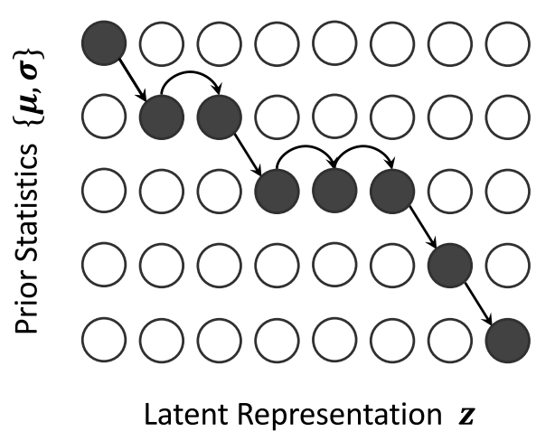

### Decoder

The core part of Glow-TTS is the
flow-based decoder that has similar structure as
[Glow](https://openai.com/blog/glow/). It consists of a stack of 12
blocks, each of which consists of an activation normalization layer
(ActNorm), invertible $1 \times 1$ convolution layer, and affine
coupling layer. The affine coupling layer architecture used here is
inspired by
[WaveGlow](https://anwarvic.github.io/speech-synthesis/WaveGlow) except
for that they didn't use the local conditioning.

    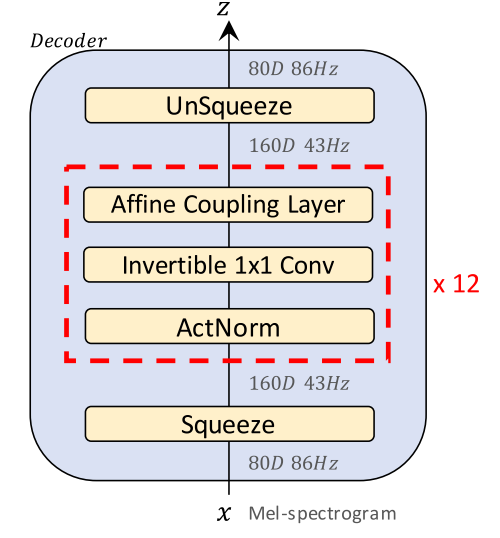

The decoder gets a mel-spectrogram as input and squeezes it. When
squeezing, the channel size doubles up and the number of time steps
becomes a half. If the number of time steps is odd, they simply ignore
the last element. After the data runs over all the 12 blocks, the model
un-squeezes it back to the original shape.

    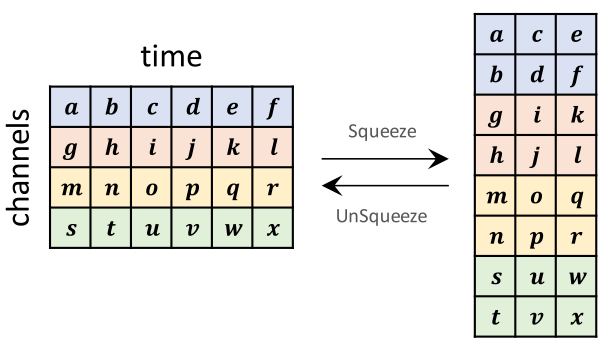

## Experiments & Results

To evaluate the proposed methods, they conducted experiments on
LJSpeech, which consists of $13,100$ short audio clips with a total
duration of approximately $24$ hours. They randomly split the dataset
into the training set ($12,500$ samples), validation set ($100$
samples), and test set ($500$ samples).

For all the experiments, phonemes were chosen as input text tokens and
[WaveGlow](https://anwarvic.github.io/speech-synthesis/WaveGlow) was
used a vocoder. Glow-TTS was trained for $240K$ iterations using the
Adam optimizer with the Noam learning rate schedule. The full list of
hyper-parameters used to train Glow-TTS can be found in the following
table:

    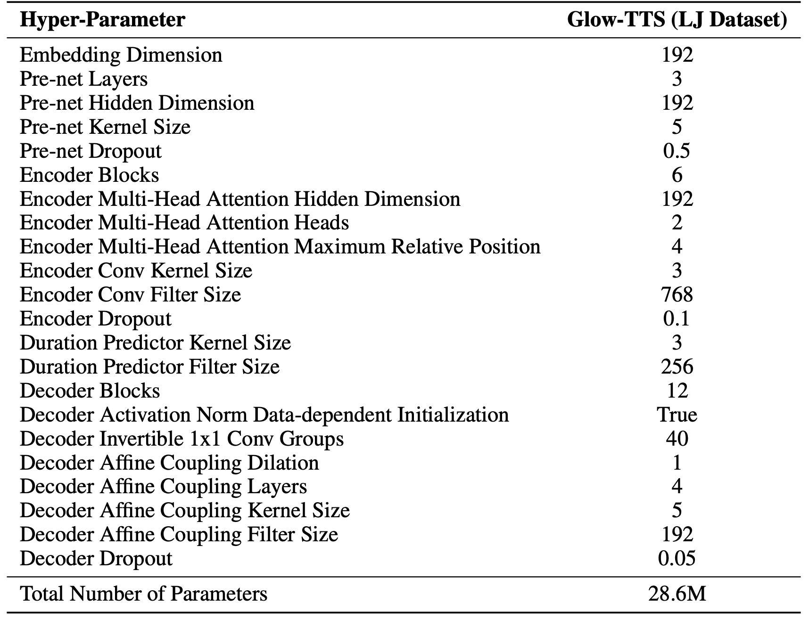

To measure the quality of Glow-TTS, they measured the mean opinion score
(MOS) via Amazon Mechanical Turk, including ground truth (GT), and the
synthesized samples; 50 sentences are randomly chosen from the test set
for the evaluation. The results are shown in the following table:

    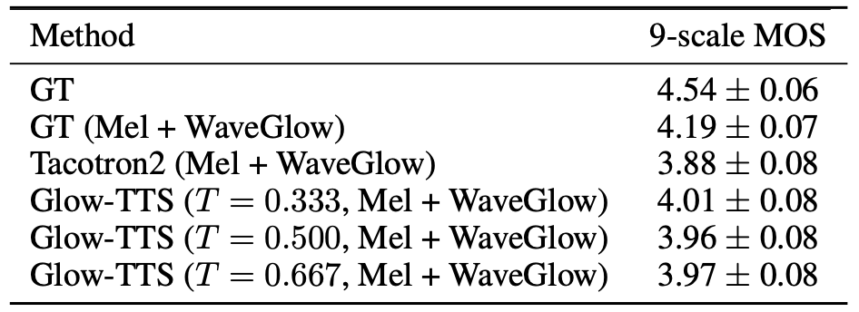

As you can see from the table, the quality of speech converted from the
GT mel-spectrograms by the vocoder ($4.19 \pm 0.07$) is the upper limit
of the TTS models. They varied the standard deviation (i.e., temperature
$T$) of the prior distribution at inference; Glow-TTS shows the best
performance at the temperature of $T = 0.333$.

Additionally, they conducted 7-point CMOS evaluation between [Tacotron
2](https://anwarvic.github.io/speech-synthesis/Tacotron_2) and Glow-TTS
with the sampling temperature $\sigma = 0.333$. Through 500 ratings on
50 items, Glow-TTS wins [Tacotron
2](https://anwarvic.github.io/speech-synthesis/Tacotron_2) by a gap of
$0.934$ as shown in the following table:

    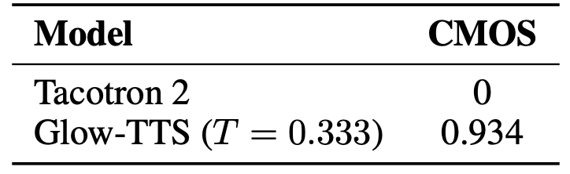

### Controllability

Because Glow-TTS is a flow-based generative model, it can synthesize
diverse samples; each latent representation
$z\sim\mathcal{N}(\mu,\sigma)$ sampled from an input text is converted
to a different mel-spectrogram $f_{dec}(z)$ according to the following
expression where $\epsilon$ is a random Gaussian noise:

$$z = \mu + \epsilon \ast \sigma$$

To decompose the effect of $\epsilon$ and $\sigma$, they experimented
with changing them on at a time. They found out that $\epsilon$ controls
the intonation patterns of speech while $\sigma$ controls the pitch of
speech. The following two figures show the pitch tracks of the same
sentence. The one on the right has same temperature $\sigma = 0.667$
with different Gaussian noise $\epsilon$, while the one on the left has
the same Gaussian noise $\epsilon$ and different temperature.

    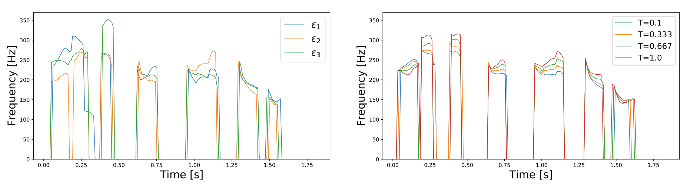

Additionally, they will able to control the speech speed by multiplying
a positive scalar value across the predicted duration of the duration
predictor. The following figure shows resulting spectrogram with
different speech speed obtained by multiplying predicted duration by
$1.25$, $1.0$, $0.75$, and $0.5$ respectively:

    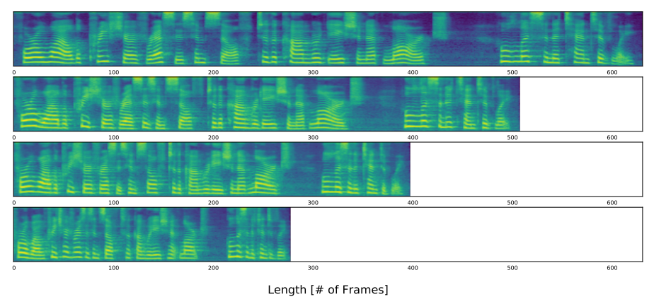

## Multi-speaker Experiments

For the multi-speaker setting, they experimented Glow-TTS with the
train-clean-100 subset of the [LibriTTS](https://openslr.org/60/) corpus,
which consists of audio recordings of 247 speakers with a total duration
of about 54 hours.
First, they trimmed the beginning and ending silence of all the audio
clips and filtered out the data with text lengths over $190$. Then, they
split it into the training ($29,181$ samples), validation ($88$
samples), and test sets ($442$ samples).

To train multi-speaker Glow-TTS, they added the speaker embedding and
increased the hidden dimension. The speaker embedding is applied in all
affine coupling layers of the decoder as a global conditioning. The rest
of the settings are the same as for the single speaker setting. For
comparison, they also trained [Tacotron
2](https://anwarvic.github.io/speech-synthesis/Tacotron_2) as a
baseline, which concatenates the speaker embedding with the encoder
output at each time step. All multi-speaker models were trained for
$960K$ iterations.

They measures the MOS as done in single-speaker experiments. However,
they used one utterance per speaker, and they chose 50 different
speakers randomly. The results are presented in the following table
which shows that Glow-TTS achieves comparable quality to [Tacotron
2](https://anwarvic.github.io/speech-synthesis/Tacotron_2):

    

