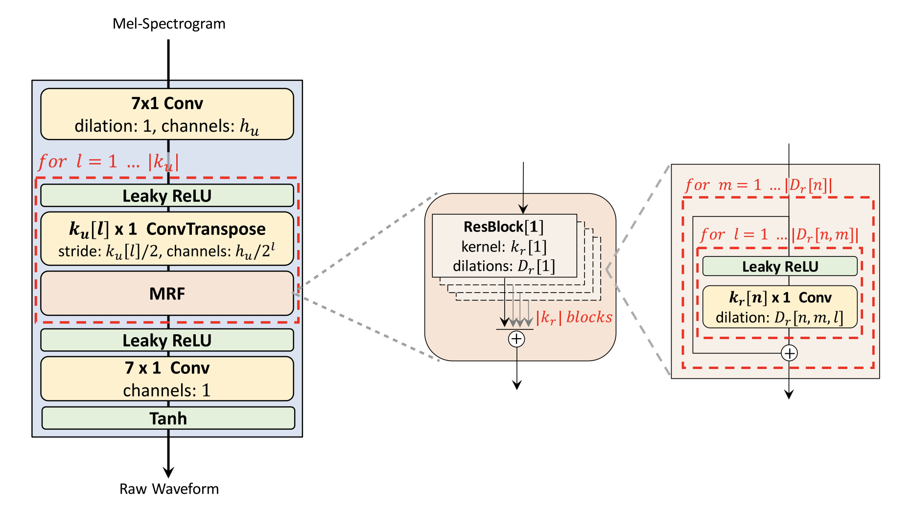
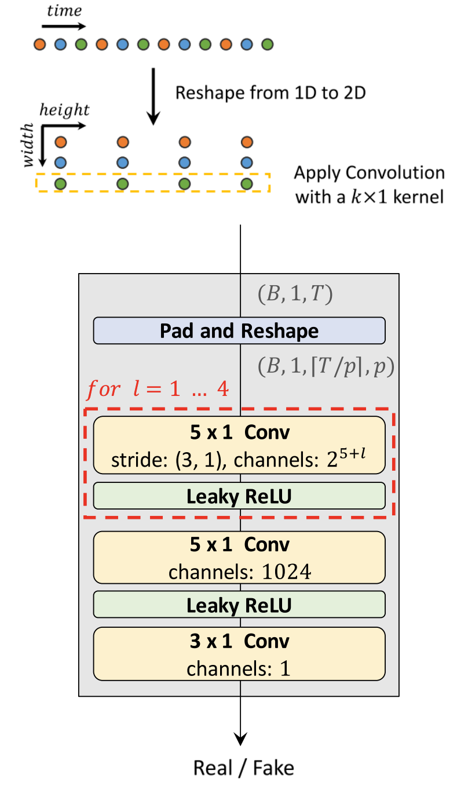
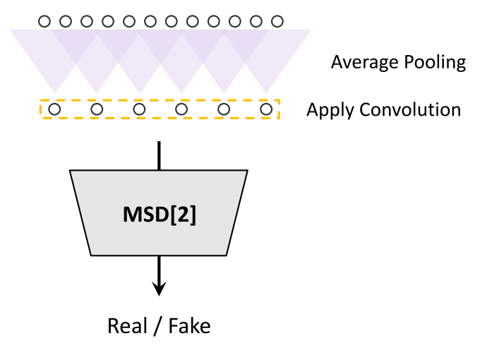
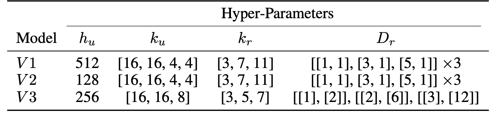
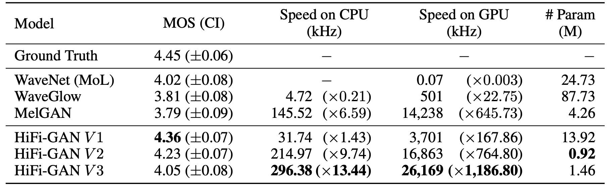
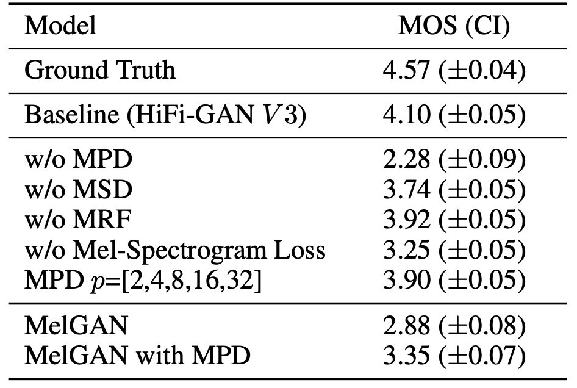
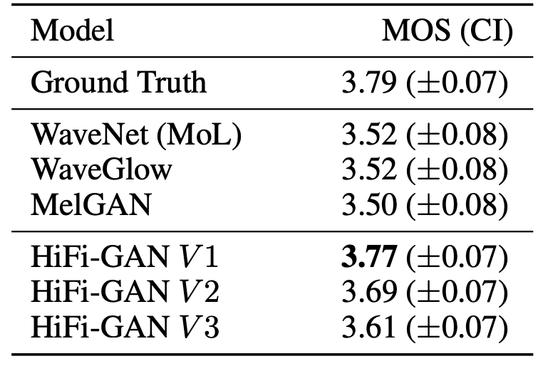
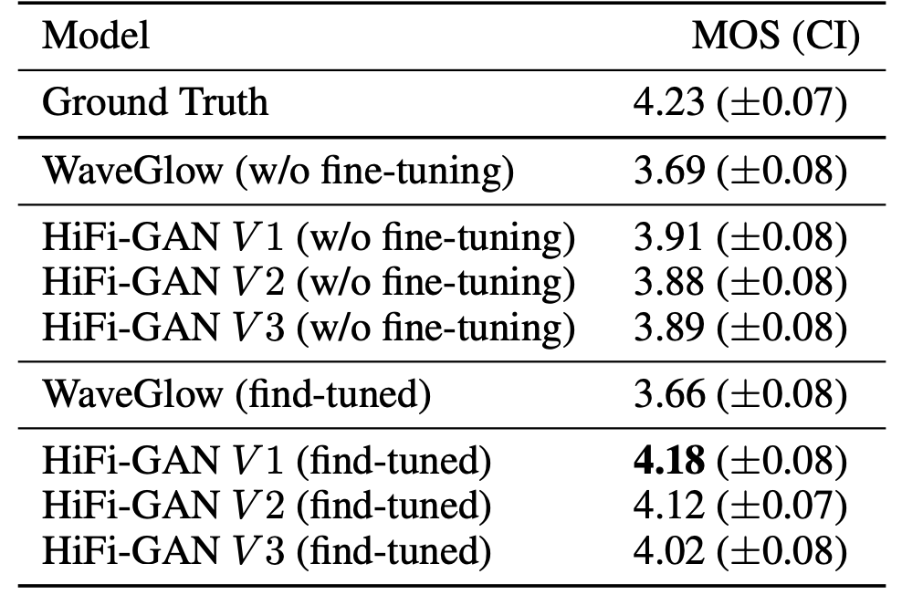

HiFi-GAN stands for "High Fidelity General Adversarial Network" which is
a neural vocoder that is able to generate high fidelity speech synthesis
from mel-spectrograms efficiently more than any other auto-regressive
vocoder such (e.g.
[WaveNet](https://anwarvic.github.io/speech-synthesis/WaveNet),
[ClariNet](https://anwarvic.github.io/speech-synthesis/ClariNet)) or
GAN-based vocoder (e.g.
[GAN-TTS](https://anwarvic.github.io/speech-synthesis/GAN-TTS),
[MelGAN](https://anwarvic.github.io/speech-synthesis/MelGAN)). HiFi-GAN
was proposed by Kakao Enterprise in 2020 and published in this paper
under the same name: "[HiFi-GAN: Generative Adversarial Networks for
Efficient and High Fidelity Speech
Synthesis](https://arxiv.org/pdf/2010.05646.pdf)". The official
implementation for this paper can be found in this GitHub repository:
[hifi-gan](https://github.com/jik876/hifi-gan). Also, the official audio
samples can be found in this
[website](https://jik876.github.io/hifi-gan-demo/).

## Architecture

HiFi-GAN consists of one <u><strong>generator</strong></u> and two
discriminators: <u><strong>multi-period discriminator (MPD)</strong></u> and
<u><strong>multi-Scale discriminator (MSD)</strong></u>. The generator and
discriminators are trained adversarially, along with two additional
losses for improving training stability and model performance. In the
next part, we are going to talk about every module in more details:

### Generator

The generator is a fully convolutional neural network. It uses a
mel-spectrogram as input and upsamples it through transposed
convolutions until the length of the output sequence matches the input.
Every transposed convolution is followed by a Multi-receptive field
Fusion (MRF) module. The MRF observes patterns of various lengths in
parallel and returns the sum of outputs from multiple residual blocks.
The following figure shows the whole architecture of the generator:

    

The generator architecture have a few hyper-parameters that can be
fine-tuned in a trade-off between synthesis efficiency and sample
quality, such as the (hidden dimension $h_{u}$ and kernel sizes $k_{u}$)
of the transposed convolutions; and the (kernel sizes $k_{r}$ and
dilation rates $D_{r}$) of MRF modules.

### Multi-Period Discriminator (MPD)

MPD is a mixture of sub-discriminators,
each sub-discriminator is a stack of strided convolutional layers with
leaky rectified linear unit (ReLU) activation. Sub-discriminator only
accepts equally spaced samples of an input audio; the space is given as
period $p$. The sub-discriminators are designed to capture different
implicit structures from each other by looking at different parts of an
input audio. The way MPD works is shown in the following figure:

    

-   Given a certain period $p$; in the paper, they set the periods to
    $\lbrack 2,\ 3,\ 5,\ 7,\ 11\rbrack$ to avoid overlaps as much as
    possible.

-   Then, they reshape the 1D raw audio of length $T$ into 2D data of
    $\left( \frac{T}{p},\ p \right)$

-   Then, they apply 2D convolutions to the reshaped data, where the
    kernel size of every convolutional layer is $(k \times 1)$ to
    process the periodic samples independently on the width axis.

-   Lastly, weight normalization is applied to MPD.

### Multi-Scale Discriminator (MSD)

Because each sub-discriminator in MPD only accepts disjoint samples,
they added MSD to consecutively evaluate the audio sequence. The
architecture of MSD is drawn from
[MelGAN](https://anwarvic.github.io/speech-synthesis/MelGAN), which is a
mixture of three sub-discriminators operating on different input scales:
raw audio, ×2 average-pooled audio, and ×4 average-pooled audio, as
shown in the following figure:

    

Each of the sub-discriminators in MSD is a stack of strided and grouped
convolutional layers with leaky ReLU activation. The discriminator size
is increased by reducing stride and adding more layers. Weight
normalization is applied except for the first sub-discriminator, which
operates on raw audio. Instead, spectral normalization is applied and
stabilizes training as it reported.

> **Note:**\
MPD operates on disjoint samples of raw waveforms, whereas MSD operates
on smoothed waveforms.

## GAN Loss

In GAN setup, the discriminator $D$ is trained to classify ground truth
samples to 1, and the samples synthesized from the generator $G$ to 0.
The generator is trained to fake the discriminator by updating the
sample quality to undistinguished from the ground-truth. In the paper,
they used a combination of three different losses, which are
<u><strong>Adversarial Loss</strong></u> $\mathcal{L}_{Adv}$,
<u><strong>Feature Matching Loss</strong></u> $\mathcal{L}\_{fm}$,
and <u><strong>Mel-spectrogram Loss</strong></u> $\mathcal{L}\_{mel}$.
The final loss $\mathcal{L}\_{G}$ is defined as:

$$\mathcal{L}_{G} = \sum_{k = 1}^{K}{\left\lbrack \mathcal{L}_{Adv}\left( G;D_{k} \right) + \lambda_{fm}\ \mathcal{L}_{fm}\left( G;D_{k} \right) \right\rbrack +}\lambda_{mel}\ \mathcal{L}_{mel}(G)$$

$$\mathcal{L}_{D} = \sum_{k = 1}^{K}{\mathcal{L}_{Adv}\left( D_{k};G \right)}$$

Where:

-   $D_{k}$ denotes the $k$-th sub-discriminator in MPD and MSD.

-   $\lambda_{fm}$ and $\lambda_{mel}$ are scaling hyper-parameters. In
    the paper, they set $\lambda_{fm} = 2$ and $\lambda_{mel} = 45$.

-   The adversarial loss $\mathcal{L}_{Adv}$ is defined as the
    following; where $x$ denotes the ground truth audio and $s$ denotes
    the synthesized audio.

$$\mathcal{L}_{Adv}(D;G) = \mathbb{E}_{(x,s)}\left\lbrack \left( D(x) - 1 \right)^{2} + \left( D\left( G(s) \right) \right)^{2} \right\rbrack$$

$$\mathcal{L}_{Adv}(G;D) = \mathbb{E}_{s}\left\lbrack \left( D\left( G(s) \right) - 1 \right)^{2} \right\rbrack$$

-   The Mel-spectrogram Loss $\mathcal{L}_{mel}$ is added to improve the
    training efficiency of the generator and the fidelity of the
    generated audio. It is the L1 distance between the mel-spectrogram
    of a waveform synthesized by the generator and that of a ground
    truth waveform where is the the function that transforms a waveform
    into the corresponding mel-spectrogram:

$$\mathcal{L}_{mel}(G) = \mathbb{E}_{(x,s)}\left\lbrack \left\| \phi(x) - \phi\left( G(s) \right) \right\|_{1} \right\rbrack$$

-   The feature matching $\mathcal{L}_{fm}$ loss is measured by the
    difference in features of the discriminator between a ground truth
    sample and a generated sample. Every intermediate feature of the
    discriminator is extracted, and the L1 distance between a ground
    truth sample and a conditionally generated sample in each feature
    space is calculated:

$$\mathcal{L}_{mel}(G;D) = \mathbb{E}_{(x,s)}\left\lbrack {\sum_{i = 1}^{T}{\frac{1}{N_{i}}\left\| D^{i}(x) - D^{i}\left( G(s) \right) \right\|}}_{1} \right\rbrack$$

Such as $T$ denotes the number of layers in the discriminator; $D^{i}$
and $N_{i}$ denote the features and the number of features in the $i$-th
layer of the discriminator, respectively.

## Experiments

For experiments, they used the LJSpeech dataset which consists of
$13,100$ short audio clips of a single speaker with a total length of
approximately $24$ hours. The audio format is 16-bit PCM with a sample
rate of 22 kHz; it was used without any manipulation. To confirm the
trade-off between synthesis efficiency and sample quality, they
conducted experiments based on the three variations of the generator,
V1, V2, and V 3 while maintaining the same discriminator configuration.
The hyper-parameters for these three generators are defined below:

    

They used 80 bands mel-spectrograms as input conditions. The FFT,
window, and hop size were set to $1024$, $1024$, and $256$,
respectively. The networks were trained using the AdamW optimizer with
$\beta_{1} = 0.9$, $\beta_{2} = 0.99$, and weight decay
$\lambda = 0.01$. The learning rate decay was scheduled by a $0.999$
factor in every epoch with an initial learning rate of
$2 \times 10^{- 4}$.

## Results

To evaluate the audio quality, the authors crowd-sourced 5-scale MOS
tests via Amazon Mechanical Turk. Raters listened to the test samples
randomly, where they were allowed to evaluate each audio sample once.
All audio clips were normalized to prevent the influence of audio volume
differences on the raters. Then, they randomly selected 50 utterances
from the LJSpeech dataset and used the ground truth spectrograms of the
utterances which were excluded from training as input conditions.
Results are reported in the following table:

    

Remarkably, all variations of HiFi-GAN scored higher than the other
models. V1 has $13.92M$ parameters and achieves the highest MOS with a
gap of $0.09$ compared to the ground truth audio. V2 demonstrates
similarity to human quality while significantly reducing the memory
requirement and inference time, compared to V1. It only requires $0.92M$
parameters. Despite having the lowest MOS among our models, V3 can
synthesize speech $13.44$ times faster than real-time on CPU and $1,186$
times faster than real-time on single V100.

In the paper, they performed an ablation study to verify the effect of
each HiFi-GAN component on the quality of the synthesized audio with V3
generator. The results of the MOS evaluation are shown in the following
table. Removing MPD causes a significant decrease in audio quality,
whereas the absence of MSD shows a relatively small but noticeable
degradation. Adding mel-spectrogram loss helps improve the quality.
Also, adding MPD to
[MelGAN](https://anwarvic.github.io/speech-synthesis/MelGAN) shows
statistically significant improvement.

    

To evaluate the generality of HiFi-GAN to the mel-spectrogram inversion
of unseen speakers, they used the [VCTK
](https://datashare.ed.ac.uk/handle/10283/2950) multi-speaker dataset,
which consists of approximately $44,200$ short audio clips uttered by
$109$native English speakers with various accents. The total length of
the audio clips is approximately $44$ hours. The audio format is 16-bit
PCM with a sample rate of 44 kHz which they reduced to 22 kHz. For
evaluation set, they randomly selected nine speakers and excluded all
their audio clips from the training set.

The following table shows the results for the mel-spectrogram inversion
of the unseen speakers. The three generator were all better than other
models, indicating that the proposed models generalize well to unseen
speakers.

    

In the paper, they conducted one last experiment to examine the
effectiveness of the proposed models when applied to an end-to-end TTS
pipeline. They used this model with [Tacotron
2](https://anwarvic.github.io/speech-synthesis/Tacotron_2). The results
without fine-tuning show that all the proposed models outperform
[WaveGlow](https://anwarvic.github.io/speech-synthesis/WaveGlow) in the
end-to-end setting, while the audio quality of all models are below
ground-trut. When fine-tuning, V1 achieves better scores. Which means
that <u><strong>HiFi-GAN adapts well on the end-to-end setting with fine-tuning</strong></u>.

    

