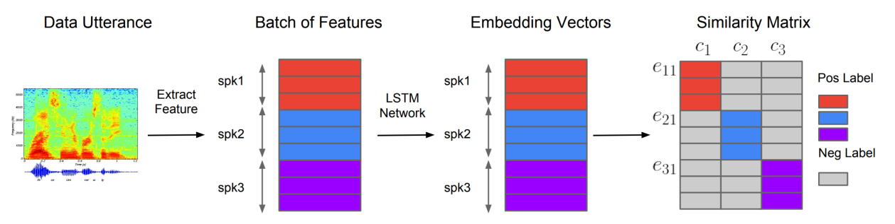

SV2TTS stands for "Speaker Verification to Text-to-Speech" which is a
neural network-based system for text-to-speech (TTS) synthesis that is
able to generate speech audio in the voice of different speakers,
including those unseen during training. SV2TTS was proposed by Google in
2018 and published in this paper: "[Transfer Learning from Speaker
Verification to Multispeaker Text-To-Speech
Synthesis](https://arxiv.org/pdf/1806.04558)". The official audio
samples outputted from this model can be found on this
[website](https://google.github.io/tacotron/publications/speaker_adaptation/).
The unofficial implementation for this paper can be found in this GitHub
repository:
[Real-Time-Voice-Cloning](https://github.com/CorentinJ/Real-Time-Voice-Cloning).

SV2TTS model can work in zero-shot learning setting, where a few seconds
of untranscribed reference audio from a target speaker can be used to
synthesize new speech in that speaker's voice, without updating any
model parameters. This is a big improvement over [Deep Voice
2](https://anwarvic.github.io/speech-synthesis/Deep_Voice_2) and [Deep
Voice 3](https://anwarvic.github.io/speech-synthesis/Deep_Voice_3) which
can support only speakers seen in the training data. Also, this is a big
improvement over
[VoiceLoop](https://anwarvic.github.io/speech-synthesis/VliceLoop) which
can support unseen speakers, but required tens of minutes of enrollment
speech and transcripts for any new speaker.

Architecture
------------

SV2TTS architecture can be seen in the following figure:

    

As we can see, SV2TTS consists of three independently trained
components:

-   **Speaker Encoder:** A network trained on a speaker verification
    task using an independent dataset of noisy speech without
    transcripts from thousands of speakers, to generate a
    fixed-dimensional embedding vector from only seconds of reference
    speech from a target speaker.

-   **Synthesizer:** A network based on [Tacotron
    2](https://anwarvic.github.io/speech-synthesis/Tacotron_2) that
    generates a mel-spectrogram from text, conditioned on the speaker
    embedding.

-   **Vocoder:** An auto-regressive
    [WaveNet](https://anwarvic.github.io/speech-synthesis/WaveNet)-based
    vocoder network that converts the mel-spectrogram into time domain
    waveform samples.

    Let's talk about each component separately in more details:

### Speaker Encoder

The foal of the speaker encoder network is to condition the synthesis
network on a reference speech signal from the desired target speaker. A
critical criteria for this network is to be able to capture the
characteristics of different speakers using only a short recording
independent of its phonetic content (text-independent) and background
noise. These requirements were found in the speaker encoder model
proposed earlier by this paper: "[Generalized End-to-End Loss for
Speaker Verification](https://arxiv.org/pdf/1710.10467)".

As shown in the following figure, this network maps a sequence of
log-mel spectrogram frames computed from a speech utterance of arbitrary
length, to a fixed-dimensional embedding vector, known as d-vector
(since a DNN was used to create it). This network is trained to optimize
a generalized end-to-end (GE2E) speaker verification loss, so that
embeddings of utterances from the same speaker have high cosine
similarity, while others are far apart in the embedding space.

    

The following steps are the steps used to train this model and how to
calculate the GE2E loss function:

-   First, the network extracts features forming a batch of utterances
    from $N$ different speakers where each speaker has $M$ utterances.

-   Then, the features extracted from each utterance $x_{\text{ij}}$
    (for utterance $i$ of speaker $j$) and is fed to an (LSTM + linear
    layer) network denoted $f()$ with $w$ learnable parameters;
    resulting into vector $h_{\text{ij}}$:

$$h_{\text{ij}} = f\left( x_{\text{ij}};\ w \right)$$

-   The embedding vector $e_{\text{ij}}$ is defined as the L2
    normalization of the previous network:

$$e_{\text{ij}} = \frac{h_{\text{ij}}}{\left\| h_{\text{ij}} \right\|_{2}}$$

-   The embedding for speaker $j$, is denoted as $c_{j}$ which is the
    centroid/average of all other utterances of the same speaker in the
    training data (left formula). However, in the paper, they found out
    that when calculating positive speakers, it's better to remove
    $e_{\text{ij}}$ embedding as shown below (right formula):

$$c_{j} = \frac{1}{M}\sum_{i = 1}^{M}e_{\text{ij}},\ \ \ \ \ c_{j}^{\left( - m \right)} = \frac{1}{M - 1}\sum_{\begin{matrix}
i = 1 \\
i \neq m \\
\end{matrix}}^{M}e_{\text{ij}}$$

-   Then, a similarity matrix between different speakers is calculated.
    The similarity matrix $S_{ij,\ k}$ is defined as the scaled cosine
    similarities between each embedding vector $e_{\text{ij}}$ to all
    centroids $c_{k}$; where $w$ and $b$ are learnable parameters and
    $w > 0$ has to be positive weight:

$$S_{ij,k} = \left\{ \begin{matrix}
\text{w.}\cos\left( e_{\text{ij}},\ c_{j}^{\left( - 1 \right)} \right) + b\ \ \ \ \ \text{if }j = k \\
\text{w.}\cos\left( e_{\text{ij}},\ c_{k} \right) + b\ \ \ \ \text{otherwise} \\
\end{matrix} \right.$$

-   During training, we want the embedding of each utterance to be
    similar to the centroid of all that speaker's embeddings, while at
    the same time, far from other speakers' centroids. This was done by
    using the GE2E loss function defined below:

$$L_{G} = \sum_{i,j}^{}e_{\text{ij}}$$

In this paper, the network consists of a stack of $3$ LSTM layers of
$768$ cells, each followed by a projection to $256$ dimensions. The
final embedding is created by L2-normalizing the output of the top layer
at the final frame. During training, they used audio examples segmented
into $1.6$ seconds and associated speaker identity labels; no
transcripts were used. Input 40-channel log-mel spectrograms are passed
to the network.

During inference, an arbitrary length utterance is broken into
$\mathbf{800ms}$ windows, overlapped
by $\mathbf{50\%}$. The network is run independently
on each window, and the outputs are averaged and normalized to create
the final utterance embedding.

> **Note:**\
Although the network is not optimized directly to learn a representation
which captures speaker characteristics relevant to synthesis, we find
that training on a speaker discrimination task leads to an embedding
which is directly suitable for conditioning the synthesis network on
speaker identity.

### Synthesizer

The goal of the synthesizer is to convert input features extracted from
text into mel-spectrogram. In this paper, they extended the [Tacotron
2](https://anwarvic.github.io/speech-synthesis/Tacotron_2) model to
support multiple speakers. They did that by concatenating the target
speaker embedding vector (resulting from the Speaker Encoder network)
with the synthesizer encoder output at each time step as shown below:

    

The synthesizer is trained on pairs of text transcript and target audio.
However, in this paper they map the text to a sequence of phonemes,
which leads to faster convergence and improved pronunciation of rare
words and proper nouns.

Target spectrogram features are computed from $50ms$ windows computed
with a $12.5ms$ step, passed through an 80-channel mel-scale filter bank
followed by log dynamic range compression. The loss function used was a
combination between L2 loss and L1 loss. In practice, they found this
combined loss to be more robust on noisy training data.

### Vocoder

The goal of the vocoder is to generate audio waveforms from
mel-spectrogram generated from the synthesizer. In this paper, they used
[WaveNet](https://anwarvic.github.io/speech-synthesis/WaveNet) model to
do so, which is composed of $30$ dilated convolution layers. The network
is not directly conditioned on the output of the speaker encoder, the
synthesizer network did that already.

> **Note to Reader:**\
Get back to the
[WaveNet](https://anwarvic.github.io/speech-synthesis/WaveNet) post and
[Tacotron 2](https://anwarvic.github.io/speech-synthesis/Tacotron_2)
(vocoder part) for more details.

Experiments & Results
---------------------

In the paper, they used a pre-trained Speaker Encoder which was trained
on an internal voice search corpus containing 36M utterances with median
duration of $3.9$ seconds from 18K American speakers. During training
SV2TTS, the Speaker Encoder was frozen and the the synthesizer and
vocoder networks were trained separately. Experiments in the paper were
performed on the following two public datasets:

-   **VCTK:** which contains $44$ hours of clean speech from $109$
    speakers, the majority of which have British accents. As a
    pre-processing step, they down-sampled the audio to $24\ kHz$,
    trimmed leading and trailing silence (reducing the median duration
    from 3.3 seconds to 1.8 seconds), and split into three subsets:
    train, validation (containing the same speakers as the train set)
    and test (containing 11 speakers held out from the train and
    validation sets).

-   **LibriSpeech:** consists of the union of the two "clean" training
    sets, comprising 436 hours of speech from 1$,172$ speakers, sampled
    at $16\ kHz$. The majority of speech is US English. As a
    pre-processing step, they resegmented the data into shorter
    utterances by force aligning the audio to the transcript using an
    ASR model and breaking segments on silence, reducing the median
    duration from 14 to 5 seconds. Also, they removed the background
    noise.

> **Note:**\
For the VCTK dataset, whose audio is quite clean, they found that the
vocoder trained on ground truth mel-spectrograms worked well. However
for LibriSpeech, which is noisier, they found it necessary to train the
vocoder on mel-spectrograms predicted by the synthesizer.

To evaluate the model's performance, they constructed an evaluation set
of $100$ phrases which do not appear in any training sets. To generate
the speaker embedding, they randomly chose one utterance with duration
of about 5 seconds. They divided the evaluation process of each datasets
into two sets:

-   **Seen:** speakers that were included in the train set, 11 for VCTK
    and 10 for LibriSpeech

-   **Unseen:** speakers that were held out. 10 for both VCTK and
    LibriSpeech

For the evaluation metric, they used Mean Opinion Score (MOS) of a
single rater with rating scores from 1 to 5 in 0.5 point increments, and
the outputs of different models were not compared directly. The
following table shows the results:

    

As seen from the table, SV2TTS achieved about 4.0 MOS in all datasets,
with the VCTK model obtaining a MOS about 0.2 points higher than the
LibriSpeech model when evaluated on seen speakers. This is the
consequence of two drawbacks of the LibriSpeech dataset such as:

-   The lack of punctuation in transcripts, which makes it difficult for
    the model to learn to pause naturally.

-   The higher level of background noise compared to VCTK, some of which
    the synthesizer has learned to reproduce, despite denoising the
    training targets as described above.

-   Most importantly, the audio generated by our model for unseen
    speakers is deemed to be at least as natural as that generated for
    seen speakers. Surprisingly, the MOS on unseen speakers is higher
    than that of seen speakers, by as much as 0.2 points on LibriSpeech.

