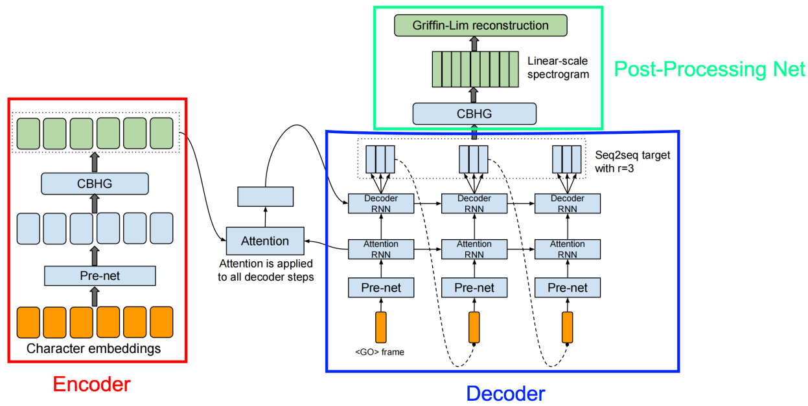

Tacotron is a two-staged generative text-to-speech (TTS) model that
synthesizes speech directly from characters. Given (text, audio) pairs,
Tacotron can be trained completely from scratch with random
initialization to output spectrogram without any phoneme-level
alignment. After that, a Vocoder model is used to convert the audio
spectrogram to waveforms. Tacotron was proposed by Google in 2017 and
published in this paper under the same name: [Tacotron: Towards End-to-End
Speech Synthesis](https://arxiv.org/pdf/1703.10135.pdf). The official audio
samples outputted from the trained Tacotron by Google is provided in
this [website](https://google.github.io/tacotron/). The unofficial
TensorFlow implementation for Tacotron can be found in this GitHub
repository: [tacotron](https://github.com/keithito/tacotron).

As we can see from the Tacotron architecture illustrated below, Tacotron
consists of four main components: <u><strong>an Encoder</strong></u>,
<u><strong>a Decoder</strong></u>,
<u><strong>an Attention Mechanism</strong></u>, and
<u><strong>a Post-processing Network</strong></u>.

    

Encoder
-------

The goal of the encoder is to extract robust sequential representations
of text. As you can see from the encoder's architecture:

-   The input to the encoder is a character sequence, where each
    character is represented as a one-hot vector and embedded into a
    continuous vector.

-   Each of these character emeddings is passed to the "pre-net" block
    which is basically a non-linear bottleneck layer with dropout. This
    network helps with convergence and improves generalization.

-   Finally, the output from the pre-net is passed to the CBHG module
    (we are going to talk about it in more details later). The CBHG
    module transforms the pre-net outputs into the final encoder
    representation used by the attention module. In the paper, they
    found that using this module not only reduces overfitting, but also
    makes fewer mispronunciations.

    

Decoder + Attention Mechanism
-----------------------------

The goal of the decoder and the [attention
mechanism](https://anwarvic.github.io/machine-translation/Attention) is
to align the audio frames with the textual features outputted from the
encoder and result in audio spectrogram. As shown in the following
figure, the decoder works like the following:

-   The first decoder step is conditioned on an all-zeros frame (the
    \<GO\> frame).

-   The input frame is passed to a pre-net block as done in the encoder.
    The pre-net block, as stated earlier, is a non-linear bottleneck
    layer combined with a dropout mechanism.

-   The output of the pre-net block is passed to a tanh attention RNN
    layer. The output from this layer is concatenated with the context
    vector from the attention mechanism to form the input to the decoder
    RNNs.

-   The output from the decoder RNNs is passed to a simple
    fully-connected output layer to predict the decoder targets, each
    decoder target is a combination of $r$ 80-band mel-scale spectrogram
    frames at once. Doing so reduces the model size, training time, and
    inference time. Also, they found that this also helps with
    convergence.

-   During inference, at decoder step $t$, the last frame of the $r$
    predictions is fed as input to the decoder at step $t + 1$. Note
    that feeding the last prediction is just a decision they made in the
    paper, they could have used all $r$ predictions.

> **Note:**\
They used 256
[GRU](https://anwarvic.github.io/language-modeling/RNN) cells in all
RNN layers, they tried LSTM and obtained similar results. Also,
residual connections were used between layers, which sped up
convergence.

    

Post-processing Network
-----------------------

The goal of the post-processing net is to convert the
decoder's target into waveforms. The need for a whole network to do this
task is the need to see the full decoded sequence instead of doing it
auto-regressively. The backbone of this network is the CBHG (Convolution
Bank + Highway Network) module which consists of a bank of 1-D
convolutional filters, followed by highway networks and a bidirectional
[GRU](https://anwarvic.github.io/language-modeling/RNN) layer. It works
like so:

    

-   The input sequence is first convolved with $K$ sets of 1-D
    convolutional filters, where the $k^{\text{th}}$ set contains
    $C_{k}$ filters of width $k$. These filters explicitly model local
    and contextual information (akin to modeling unigrams, bigrams, up
    to K-grams).

-   The convolution outputs are stacked together and further max pooled
    along time-axis to increase local invariances. Note that they used a
    stride of $1$ to preserve the original time resolution.

-   Then, the processed sequence is passed to a few fixed-width 1-D
    convolutions, whose outputs are added with the original input
    sequence via residual connections. Batch normalization was used for
    all convolutional layers.

-   The convolution outputs are fed into a multi-layer highway network
    to extract high-level features.

-   Finally, a bidirectional GRU RNN is added on top to extract
    sequential features from both forward and backward context.

After the CBHG network, two more steps were applied as shown in the
following figure of the post-processing network:

    

-   The output from the CBHG network is raised by a power of $1.2$.
    Doing so reduces artifacts, likely due to its harmonic enhancement
    effect.

-   Then, these scaled spectrogram frames are fed to the Griffin-Lim
    algorithm to synthesize waveform. They didn't use any loss function
    for this part of the model since this algorithm doesn't have any
    trainable weights.

> **Note:**\
In the paper, the authors said that their choice of Griffin-Lim
algorithm is just for simplicity; while it already yields strong
results, developing a fast and high-quality trainable spectrogram to
waveform inverter is ongoing work.

Experiments
-----------

In the paper, they trained Tacotron on an internal North American
English dataset, which contains about 24.6 hours of speech data spoken
by a professional female speaker. The phrases are text normalized, e.g.
"16" is converted to "sixteen". The audio data were sampled to $24kHz$.
Also, they used log magnitude spectrogram with Hann windowing, $50\ ms$
frame length, $12.5\ ms$ frame shift, and 2048-point Fourier transform
and 0.97 pre-emphasis.

For training Tacotron, they used $r = 2$ (output layer reduction
factor), though larger $r$ values (e.g. $r = 5$) also work well. They
used a batch size of 32. Training was done usingAdam optimizer with
learning rate decay, which starts from $0.001$ and is reduced to
$0.0005$, $0.0003$, and $0.0001$ after $500K$, $1M$ and $2M$ global
steps, respectively. They used a simple L1 loss for both seq2seq decoder
(mel-scale spectrogram) and post-processing net (linear-scale
spectrogram). The two losses have equal weights. The full list of the
hypter-parameters used can be found in the following table:

    

To evaluate the model, they conducted mean opinion score (MOS) tests,
where the subjects were asked to rate the naturalness of the stimuli in
a 5-point Likert scale score. The MOS tests were crowd-sourced from
native speakers. 100 unseen phrases were used for the tests, and each
phrase received 8 ratings.

In the paper, they compared Tacotron with a parametric (based on LSTM)
model from this paper: [Fast, Compact, and High Quality LSTM-RNN Based
Statistical Parametric Speech Synthesizers for Mobile
Devices](https://arxiv.org/pdf/1606.06061.pdf); and a concatenative
system from this paper: [Recent advances in Google real-time HMM-driven
unit selection
synthesizer](https://static.googleusercontent.com/media/research.google.com/en/pubs/archive/45564.pdf).
As shown in the following table, Tacotron achieves an MOS of 3.82 which
is a very promising result:

    

