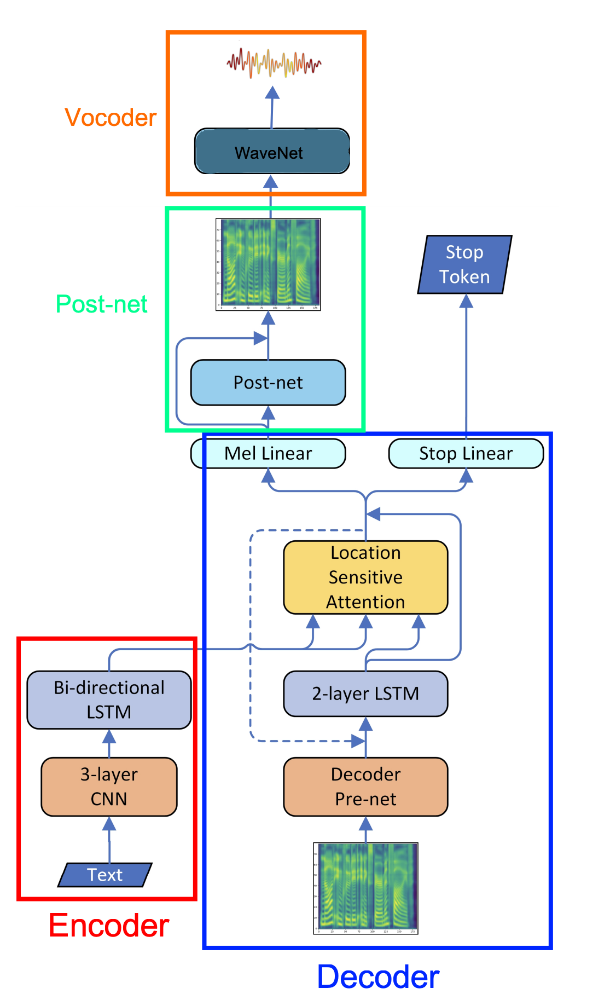
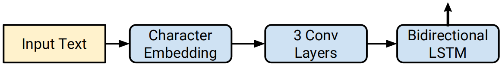
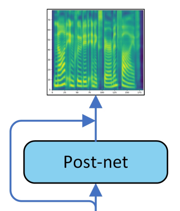
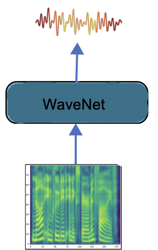
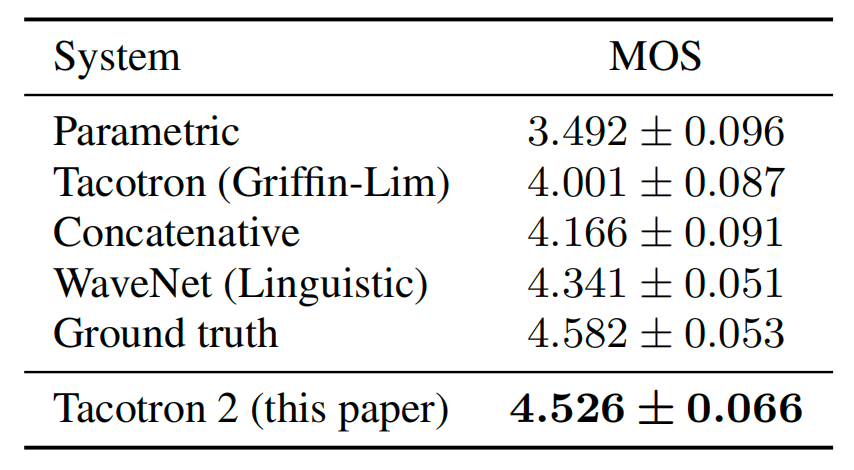
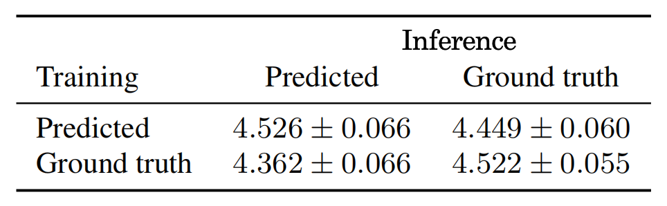
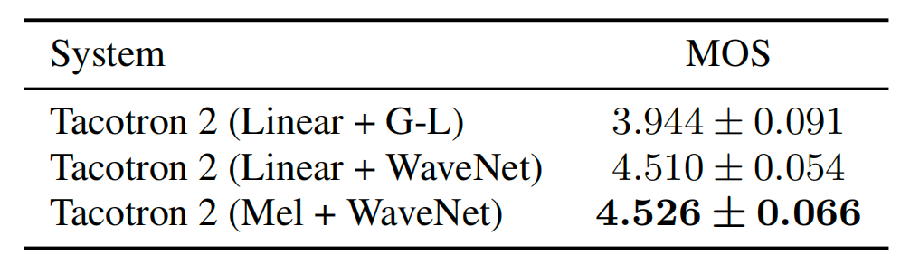
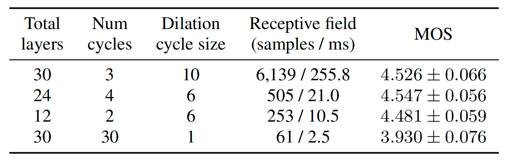

Tacotron 2 is a two-staged text-to-speech (TTS) model that
synthesizes speech directly from characters. Given (text, audio) pairs,
Tacotron 2 can be trained completely from scratch with random
initialization to output spectrogram without any phoneme-level
alignment. After that, a Vocoder model is used to convert the audio
spectrogram to waveforms. Tacotron 2 was proposed by the same main
authors that proposed [Tacotron
](https://anwarvic.github.io/speech-synthesis/Tacotron) earlier
in the same year (2017). Tacotron 2 was published in this paper:
[Natural TTS Synthesis by Conditioning WaveNet on Mel Spectrogram
Predictions](https://arxiv.org/pdf/1712.05884.pdf). The official audio
samples outputted from the trained Tacotron 2 by Google is provided in
this [website](https://google.github.io/tacotron/publications/tacotron2/).
The unofficial PyTorch implementation for Tacotron 2 can be found in
Nvidia's official GitHub repository:
[NVIDIA/tacotron2](https://github.com/NVIDIA/tacotron2).

Architecture
------------

As we can see from the Tacotron 2 architecture illustrated below,
Tacotron 2 consists of five main components: <u><strong>an Encoder</strong></u>,
<u><strong>a Decoder</strong></u>, <u><strong>an AttentionMechanism</strong></u>,
<u><strong>a Post-processing Network</strong></u>,
and <u><strong>a Vocoder network</strong></u>. One clear difference between
this architecture and [Tacotron
1](https://anwarvic.github.io/speech-synthesis/Tacotron) is that they
used a modified
[WaveNet](https://anwarvic.github.io/speech-synthesis/WaveNet) network
to convert spectrogram to Audio waveforms instead of the simple
Griffin-Lim algorithm.

    

> **Note:**\
The convolutional layers in the whole network are regularized using
dropout with probability $0.5$, and LSTM layers are regularized using
zoneout with probability $0.1$.

### Encoder

The goal of the encoder is to extract robust sequential representations
of text. It does that by the following step:

    

-   Input characters are represented using a learned $512$-d character
    embedding.

-   These embeddings are passed through a stack of 3 convolutional
    layers each containing $512\ $filters with shape $5 \times 1$, i.e.,
    where each filter spans 5 characters. After every convolutional
    layer, batch normalization and ReLU activations are applied. As in
    Tacotron, these convolutional layers model longer-term context
    (e.g., N-grams) in the input character sequence.

-   The output of the final convolutional layer is passed into a single
    bi-directional LSTM layer containing $512$ units ($256$ in each
    direction) to generate the encoded features.

### Decoder + Attention Mechanism

    

Same as
[Tacotron](https://anwarvic.github.io/speech-synthesis/Tacotron), the
goal of the decoder and the [attention
mechanism](https://anwarvic.github.io/machine-translation/Attention) is
to align the audio frames with the textual features outputted from the
encoder and result in audio spectrogram. As shown in the following
figure, the decoder works like the following:

-   The first decoder step is conditioned on an all-zeros frame (the
    \<GO\> frame).

-   Similar to
    [Tacotron](https://anwarvic.github.io/speech-synthesis/Tacotron),
    the input frame is passed to a pre-net block. The pre-net block is
    two fully connected layers of $256$ hidden ReLU units. In order to
    introduce output variation at inference time, a dropout with
    probability $0.5$ is applied.

-   The encoder output is consumed by an Local Sensitive Attention
    network which summarizes the full encoded sequence into a
    fixed-length context vector for each decoder output step.

-   The pre-net output and attention context vector are concatenated and
    passed through a stack of 2 uni-directional LSTM layers with
    $1024\ $units. Attention probabilities are computed after projecting
    inputs and location features to $128$-dimensional hidden
    representations. Location features are computed using $32$ 1-D
    convolution filters of length $31$.

-   The concatenation of the LSTM output and the attention context
    vector is passed into two directions in parallel:

    -   The concatenation is projected through a linear transform to
        predict the target spectrogram frame. Unlike
        [Tacotron](https://anwarvic.github.io/speech-synthesis/Tacotron),
        Tacotron 2 doesn't use a "reduction factor", i.e., each
        decoder step corresponds to a single spectrogram frame.

    -   The concatenation is projected down to a scalar and passed
        through a sigmoid activation to predict the probability that
        the output sequence has completed. This "stop token"
        prediction is used during inference to allow the model to
        dynamically determine when to terminate generation instead of
        always generating for a fixed duration. It's worth mentioning
        that during training there is only one "stop" signal at the
        end of the sequence, while other frames doesn't have that
        signal.

-   During inference, the frame at step $t$ is fed as input to the
    decoder at step $t + 1$.

### Post-Network

The goal of the post-network is to improve
the overall reconstruction of the resulting mel-spectrogram. The
post-processing network is illustrated below. It takes the decoder
predicted mel-spectrogram frame as an input, then passes it through 5
convolution layers with residual connections. Each layer is comprised of
$512$ filters with shape $5 \times 1$ with batch normalization, followed
by $\tanh$ activations on all but the final layer.

    

### Vocoder

Vocoder is a model that is responsible for generating
audio waveforms from input features. In Tacotron 2, they used a modified
version of the [WaveNet](https://anwarvic.github.io/speech-synthesis/WaveNet)
architecture to invert the mel-spectrogram feature representation into
time-domain waveform samples.

    

As in the original architecture, there are $30$ dilated convolution
layers, grouped into 3 dilation cycles, i.e., the dilation rate of layer
$k$ is $2k(mod\ 10)$. To work with the $12.5\ ms\ $frame hop of the
spectrogram frames, only 2 up-sampling layers are used in the
conditioning stack instead of 3 layers.

Instead of predicting discretized buckets with a softmax layer, they
followed PixelCNN++ and Parallel WaveNet and use a 10-component mixture
of logistic distributions (MoL) to generate 16-bit samples at $24\ kHz$.
To compute the logistic mixture distribution, the WaveNet stack output
is passed through a $\text{ReLU}$ activation followed by a linear
projection to predict parameters (mean, log scale, mixture weight) for
each mixture component. The loss is computed as the negative
log-likelihood of the ground truth sample.

Tacotron 1 vs Tacotron 2
------------------------

In the following list, I tried to summarize the subtle differences
between [Tacotron
1](https://anwarvic.github.io/speech-synthesis/Tacotron) and this model
(Tacotron 2):

-   This model used LSTM cells instead of GRU cells.

-   This uses convolutional layers in the encoder and decoder instead of
    "CBHG" stacks.

-   This model doesn't use reduction factor ($r$). Each decoder step
    corresponds to a single spectrogram frame.

-   This model uses a modified
    [WaveNet](https://anwarvic.github.io/speech-synthesis/WaveNet)
    network to convert spectrogram to Audio waveforms instead of the
    simple Griffin-Lim algorithm.

-   This model predicts mel-spectrogram instead of linear spectrogram.

Experiments & Results
---------------------

In the paper, they trained the model on an internal US English dataset,
the same dataset that
[Tacotron](https://anwarvic.github.io/speech-synthesis/Tacotron) was
trained on, which contains 24.6 hours of speech from a single
professional female speaker. All text in our datasets is spelled out.
e.g., "16" is written as "sixteen", i.e., our models are all trained on
normalized text. Unlike , training Tacotron 2 was done on two steps:

1.  First, they trained the feature prediction network (whole
    architecture without the Vocoder part). To train this part, they
    used a batch size of $64$ on a single GPU with Adam optimizer with
    $\beta_{1} = 0.9$, $\beta_{2} = 0.999$, and $\epsilon = 10^{- 6}$
    and a learning rate of $10^{- 3}$ exponentially decaying to
    $10^{- 5}$ starting after $50,000$ iterations. For regularization,
    they use L2 regularization with weight $10^{- 6}$.

2.  Second, they train the Vocoder part on the ground truth-aligned
    predictions of the feature prediction network, where each predicted
    frame exactly aligns with the target waveform samples. To train this
    part, they used a batch size of $128$ distributed across 32 GPUs
    with synchronous updates, using the Adam optimizer with
    $\beta_{1} = 0.9$, $\beta_{2} = 0.999$, and $\epsilon = 10^{- 8}$
    and a fixed learning rate of $10^{- 4}$. It helps quality to average
    model weights over recent updates. Therefore they maintained an
    exponentially-weighted moving average of the network parameters over
    update steps with a decay of $0.9999$. To speed up convergence, they
    scaled the waveform targets by a factor of $127.5$ which brings the
    initial outputs of the mixture of logistics layer closer to the
    eventual distributions.

To evaluate Tacotron 2, they randomly selected 100 fixed examples
from the test set of the internal dataset. Audio generated on this
set are sent to a human rating service similar to Amazon's
Mechanical Turk where each sample is rated by at least 8 raters on a
scale from 1 to 5 with 0.5 point increments, from which a subjective
mean opinion score (MOS) is calculated. Each evaluation is conducted
independently from each other, so the outputs of two different
models are not directly compared when raters assign a score to them.

Similar to
[Tacotron](https://anwarvic.github.io/speech-synthesis/Tacotron), they
compared Tacotron 2 with Tacotron and
[WaveNet](https://anwarvic.github.io/speech-synthesis/WaveNet) alongside
other models such as a parametric (based on LSTM) model from this paper:
[Fast, Compact, and High Quality LSTM-RNN Based Statistical Parametric
Speech Synthesizers for Mobile
Devices](https://arxiv.org/pdf/1606.06061.pdf); and a concatenative
system from this paper: [Recent advances in Google real-time HMM-driven
unit selection
synthesizer](https://static.googleusercontent.com/media/research.google.com/en/pubs/archive/45564.pdf).
As shown in the following table, Tacotron 2 significantly outpeforms all
other TTS systems and results in an MOS comparable to that of the ground
truth audio:

    

Ablation Study
--------------

In this part, we are going to discuss the ablation experiments they
performed in the paper:

-   The [WaveNet](https://anwarvic.github.io/speech-synthesis/WaveNet)
    component depends on the predicted features for training. In this
    experiment, they trained
    [WaveNet](https://anwarvic.github.io/speech-synthesis/WaveNet)
    independently on mel spectrograms extracted from ground truth audio.
    The following table shows that when trained on ground truth features
    and made to synthesize from predicted features, the result is worse
    than the opposite. This is due to the tendency of the predicted
    spectrograms to be over-smoothed and less detailed than the ground
    truth

    

-   Instead of predicting mel spectrograms, thet experimented with
    predicting linear spectrograms instead, like
    [Tacotron](https://anwarvic.github.io/speech-synthesis/Tacotron). As
    shown in the following table, WaveNet produces much higher quality
    audio compared to Griffin-Lim. However, there is not much difference
    between the use of linear-scale or mel-scale spectrograms.

    

-   Also, they tried different hyper-parameters for
    [WaveNet](https://anwarvic.github.io/speech-synthesis/WaveNet) and
    the following table shows that WaveNet can generate highquality
    audio using as few as $12$ layers with a receptive field of
    $10.5\ ms$, compared to $30$ layers and $256\ ms$ in the baseline
    model.

    

