Transformer TTS is a non-autoregressive TTS system that combines the
advantages of [Tacotron
2](https://anwarvic.github.io/speech-synthesis/Tacotron_2) and
[Transformer](https://anwarvic.github.io/machine-translation/Transformer)
in one model, in which the multi-head attention mechanism is introduced
to replace the RNN structures in the encoder and decoder, as well as the
vanilla attention network. Transformer TTS was proposed by Microsoft in
2018 and published in this paper: "[Neural Speech Synthesis with
Transformer Network](https://arxiv.org/pdf/1809.08895.pdf)". The
official audio samples resulted from this model can be found in
[website](https://neuraltts.github.io/transformertts/). The unofficial
PyTorch implementation of this paper can be found in this GitHub
repository:
[Transformer-TTS](https://github.com/soobinseo/Transformer-TTS).

    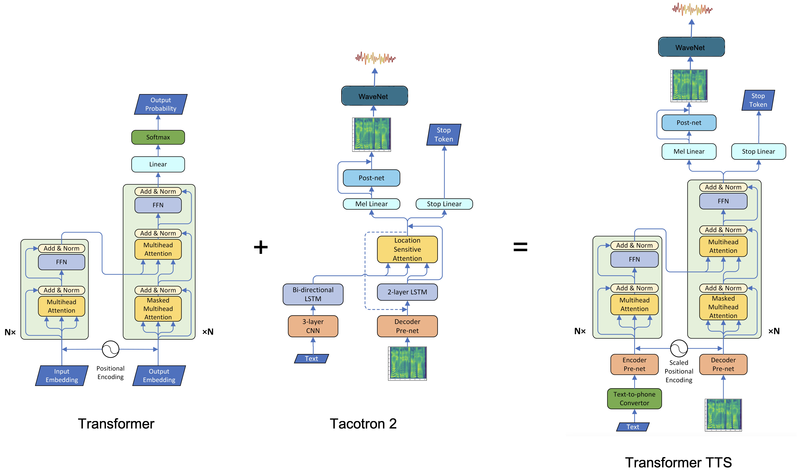

Recent end-to-end neural text-to-speech (TTS) models such as
[Tacotron](https://anwarvic.github.io/speech-synthesis/Tacotron_2) and
[Tacotron 2](https://anwarvic.github.io/speech-synthesis/Tacotron_2)
depend intensively on recurrent neural networks
([RNNs](https://anwarvic.github.io/language-modeling/RNN)) which are
very slow to train and can't capture long dependencies. That's why
Transformer TTS model was proposed. In this model, they adapted the
multi-head attention mechanism to replace the RNN structures and also
the original attention mechanism in [Tacotron
2](https://anwarvic.github.io/speech-synthesis/Tacotron_2).

Architecture
------------

The architecture for Transformer TTS can be seen in the following
figure. From this figure, we can see that Transformer TTS consists of
five different components now: <u><strong>Text-to-phone Converter</strong></u>,
<u><strong>Encoder</strong></u>, <u><strong>Decoder</strong></u>,
<u><strong>Post-network</strong></u>, <u><strong>Vocoder</strong></u>.
The encoder and decoder networks have additional components added to them
called "encoder per-net" and "decoder pre-net" respectively. In the next part,
we are going to discuss these parts in more details.

    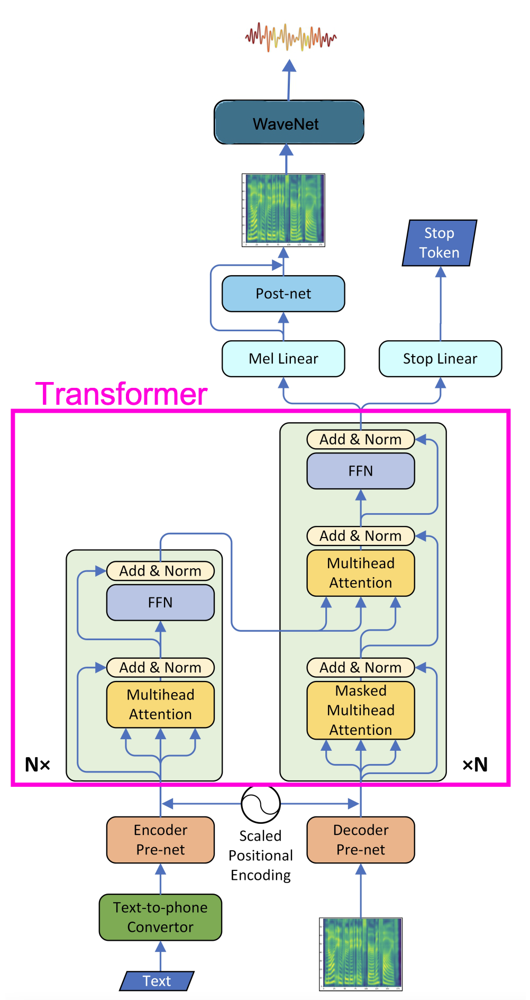

### Text-to-phone Converter

In Transformer TTS model, they decided to convert input text to
phonemes. If you don't know, a phoneme is a distinct unit of sound in a
specified language. For example, the letter "a" in English has multiple
different phonemes ("eı", "æ", "a:"), each sounds different even though
it originates from the same letter. In this model, they used trainable
embedding of $512$ dims. Also, note that word boundaries and
punctuations are included in this module as special markers.

### Scaled Positional Encoding

In the [Transformer](https://anwarvic.github.io/machine-translation/Transformer)
paper, they implemented positional encoding to take the order of the
input sequence into consideration. This was done by injecting
information about the relative or absolute position of frames by
positional embeddings, shown in the following equation:

$$\text{PE}_{\left( \text{pos},\ 2i \right)} = \sin\left( \frac{\text{pos}}{10000^{\frac{2i}{d}}} \right)\ \ \ \ \ \ \ \ \ \ \ \ \ \text{PE}_{\left( \text{pos},\ 2i + i \right)} = \cos\left( \frac{\text{pos}}{10000^{\frac{2i}{d}}} \right)$$

Where $\text{pos}$ is the word position/index (starting from
zero). $i$ is the $i^{\text{th}}$ value of the word embedding and $d$ is
the size of the word embedding. So, if $i$ is even, then we are going to
apply the first equation; and if $i$ is odd, then we are going to apply
the second equation. After getting the positional vectors, we add them
to the original embedding vector to get context vector:

    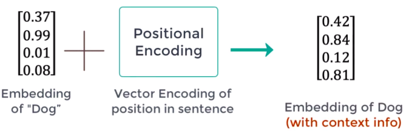

Since the source domain is of texts while the target domain is of
mel-spectrograms, hence using fixed positional embeddings may impose
heavy constraints on both the encoder and decoder pre-nets. That's why
they decided to use a trainable weight $\alpha$, so that these embedding
can adaptively fit the scales of both encoder and decoder prenets'
output, as shown in the following equation:

$$x_{i} = \text{prenet}\left( \text{ph}_{i} \right) + \alpha\text{PE}\left( i \right)$$

Where $\text{prenet}$ is either the encoder or the decoder prenet,
$\text{ph}_{i}$ is the phoneme at position $i$, $\text{PE}$ is the
positional embedding, and $\alpha$ is the trainable weight.

### Encoder

The encoder part of the Transformer TTS model is the
same as the encoder in the
[Transformer](https://anwarvic.github.io/machine-translation/Transformer)
model consisting of 6 layers. The only difference here is the
"pre-network". The goal of the pre-network here is to extract contextual
features from the input phoneme embeddings, which can be used in further
steps to train the encoder architecture.

    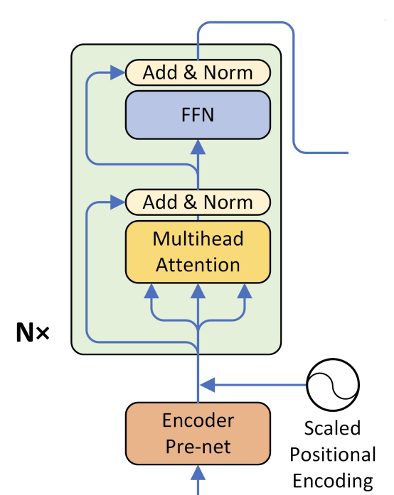

The pre-network they used here is the same pre-network in the [Tacotron
2](https://anwarvic.github.io/speech-synthesis/Tacotron_2), which is a
3-layer CNN applied to the input phoneme embeddings. Each convolution
layer has 512 channels, followed by a batch normalization and ReLU
activation, and a dropout layer as well. In addition, they added a
linear projection after the final ReLU activation, to reduce the effect
of ReLU on the embeddings.

Remember, the output range of ReLU is $\lbrack 0,\  + \infty)$, while
each dimension of these embeddings is in
$\left\lbrack - 1,1 \right\rbrack$. Adding 0-centered positional
information onto non-negative embeddings will result in a fluctuation
not centered on the origin and harm model performance. Hence they added
a linear projection for center consistency.

### Decoder

The decoder part of the Transformer TTS model is the same as the decoder in
the [Transformer](https://anwarvic.github.io/machine-translation/Transformer)
model, cosisting of 6 layers. The only difference here is the
"pre-network". The goal of the pre-network here is to project the
mel-spectrograms into the same subspace as phoneme embeddings, so that
the similarity of a encoder embeddings and decoder embeddings can be
measured, thus the attention mechanism can work.

    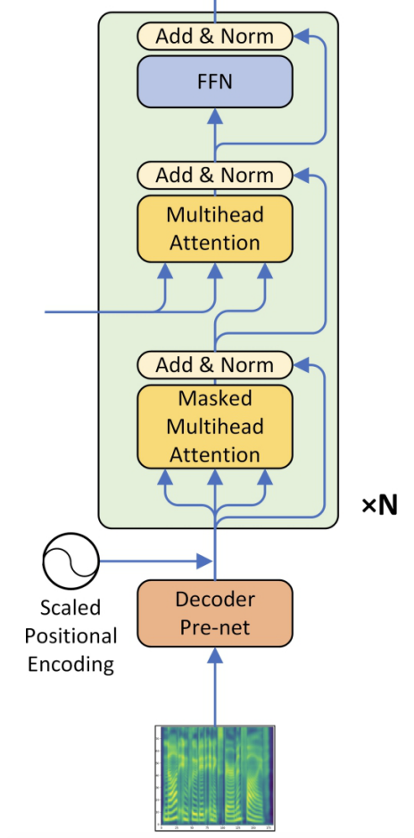

The pre-network they used here is basically two fully connected layers,
each has $256$ hidden units with ReLU activation. However, in the paper
they tried also $512$ but didn't improve the performance. An additional
linear projection is also added after the ReLU not only for center
consistency (like encoder pre-network) but also obtain the same
dimension as the positional embeddings whose dimension is $512$.

### Post-network

Same as [Tacotron
2](https://anwarvic.github.io/speech-synthesis/Tacotron_2), they used
two different linear projections to predict the mel-spectrogram and the
stop token respectively, and used a 5-layer CNN to produce a residual to
refine the reconstruction of mel spectrogram.

It's worth mentioning that, for the stop linear, there is only one
positive sample in the end of each sequence which means "stop", while
hundreds of negative samples for other frames. This imbalance may result
in unstoppable inference. We impose a positive weight
$\left( 5.0 \sim 8.0 \right)$ on the tail positive stop token when
calculating binary cross entropy loss, and this problem was efficiently
solved.

    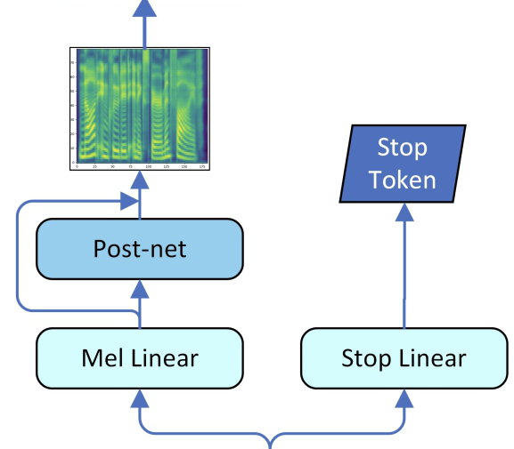

### Vocoder

They used [WaveNet](https://anwarvic.github.io/speech-synthesis/WaveNet)
to convert mel-spectrogram into audio waveforms. Instead of using 30
layers of dilated convolution, they used 2 layers of Quasi-RNN layers +
20 dilated convolution layers; and the sizes of all residual channels
and dilation channels are all 256. Each frame of QRNN's final output is
copied 200 times to have the same spatial resolution as audio samples
and be conditions of 20 dilated layers.

This model was trained on mel-spectrogram from the internal US English
female dataset, the same dataset used for the TTS training. The sample
rate of ground truth audios is $16000$ and frame rate of ground truth
mel-spectrogram is $80$.

Experiments
-----------

To train the Transformer TTS model, they used an internal US English
female dataset, which contains 25-hour professional speech (17584
text-audio pairs), with a few too long waves removed). $50\ \text{ms}$
silence at head and $100\ \text{ms}$ silence at tail are kept for each
wave.

Regarding evaluation, they randomly select 38 fixed examples outside the
training set with various lengths as the evaluation set. They used Mean
Option Score (MOS) where each audio is listened to by at least 20
testers, who are all native English speakers. To better compare the
audio naturalness between Transformer TTS and [Tacotron
2](https://anwarvic.github.io/speech-synthesis/Tacotron_2), they used
Comparison MOS (CMOS) where testers listen to two audios (generated by
the two models with the same text) each time and evaluates how the
latter feels comparing to the former using a score in
$\left\lbrack - 3,3 \right\rbrack$ with intervals of $1$. The order of
the two audios changes randomly. Results are shown in the following
table

    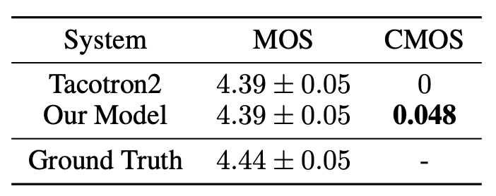

Ablation Study
--------------

In this section, we will discuss the different modifications they tried
to experiment on the Transformer TTS model and show the performance:

-   As discussed in the encoder/decoder pre-network part, they used a
    linear layer to for consistent center. They experimented with
    keeping and removing this part and the results show that keeping
    this linear layer performs slightly better:

    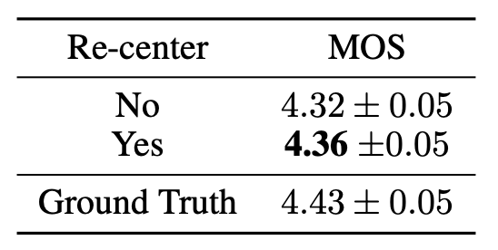

-   As discussed in the scaled positional embedding part, they added a
    trainable weight $\alpha$. The results show that keeping this
    trainable weight performs better.

    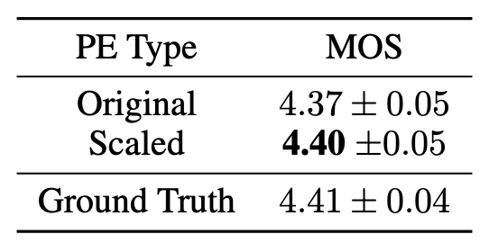

-   The Transformer TTS uses 6 layers on both the encoder and decoder
    side. They experimented reducing it to 3 and the results show that 6
    is better:

    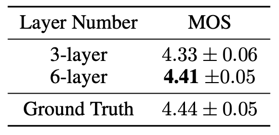

-   The Transformer TTS uses 8 attention heads. They experimented
    reducing it to 4 and the results show that 8 is better:

    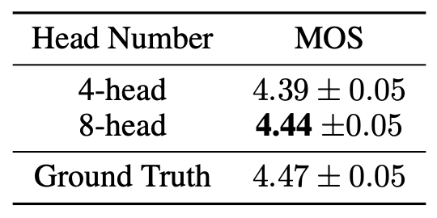

