VITS stands for "**V**ariational **I**nference with adversarial learning
for **T**ext-to-**S**peech", which is a single-stage non-autoregressive
Text-to-Speech model that is able to generate more natural sounding
audio than the current two-stage models such as [Tacotron
2](https://anwarvic.github.io/speech-synthesis/Tacotron_2), [Transformer
TTS](https://anwarvic.github.io/speech-synthesis/Transformer_TTS), or
even [Glow-TTS](https://anwarvic.github.io/speech-synthesis/Glow-TTS).
VITS was proposed by Kakao Enterprise in 2021 and published in this
paper: "[Conditional Variational Autoencoder with Adversarial Learning
for End-to-End Text-to-Speech](https://arxiv.org/pdf/2106.06103.pdf)".
The official implementation for this paper can be found in this GitHub
repository: [vits](https://github.com/jaywalnut310/vits). The official
synthetic audio samples resulting from VITS can be found in this
[website](https://jaywalnut310.github.io/vits-demo/index.html).

> **Note to Reader:**\
VITS is just a combination of a lot of ideas from other models. In order
to make the best use out of this post, I think you should go through the
following posts in order: the "Generative Models Recap" part in the
[WaveGlow](https://anwarvic.github.io/speech-synthesis/WaveGlow) post,
the [WaveNet](https://anwarvic.github.io/speech-synthesis/WaveNet) post,
and the [HiFi-GAN](https://anwarvic.github.io/speech-synthesis/HiFi-GAN)
post.

## Architecture

The overall architecture of the VITS is shown in the following figure. As we,
can see VITS consists of a <u><strong>Posterior Encoder</strong></u>,
<u><strong>Prior Encoder</strong></u>, <u><strong>Decoder</strong></u>,
and <u><strong>Stochastic Duration Predictor</strong></u>. The Posterior
Encoder and Decoder's Discriminator modules are only used during training, not
for inference. In the next part, we are going to tackle every component in more
details:

    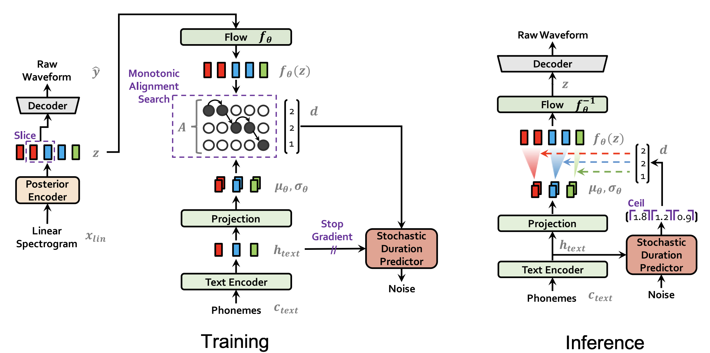

### Posterior Encoder

For the posterior encoder, they used 16
[WaveNet](https://anwarvic.github.io/speech-synthesis/WaveNet) residual
blocks which consists of layers of dilated convolutions with a gated
activation unit and skip connection. The posterior encoder takes
linear-scale log magnitude spectrograms $x_{lin}$ as input and produces
latent variables $z$ with $192$ channels.

    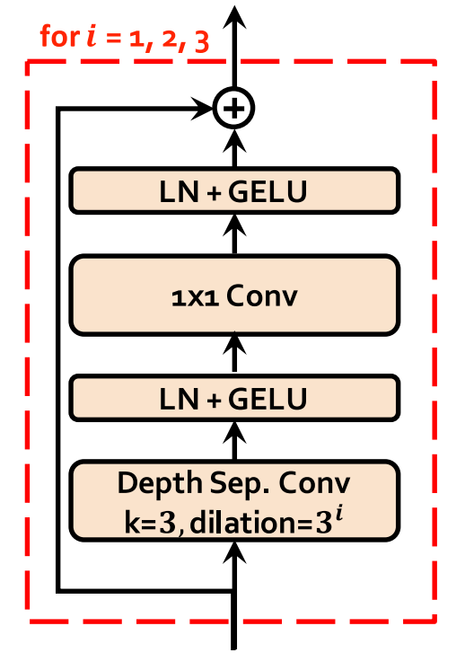

The idea behind the Posterior Encoder is to map the audio data from the
mel-spectrogram space to a normal-distribution space. That's why in the paper,
they used a linear layer on top of the Posterior Encoder to produce the mean
and variance of the normal posterior distribution.

### Prior Encoder

The prior encoder consists of different components as you can see from
the following figure. It consists of a <u><strong>Text Encoder</strong></u> ,
a <u><strong>Projection Layer</strong></u>, a <u><strong>Normalizing
Flow</strong></u>, and it uses <u><strong>Monotonic Alignment Search
(MSA)</strong></u> algorithm. Similar to the Posterior Encoder, the Prior
Encoder is aiming at mapping the textual data from the phoneme space to
a normal distribution space. 

    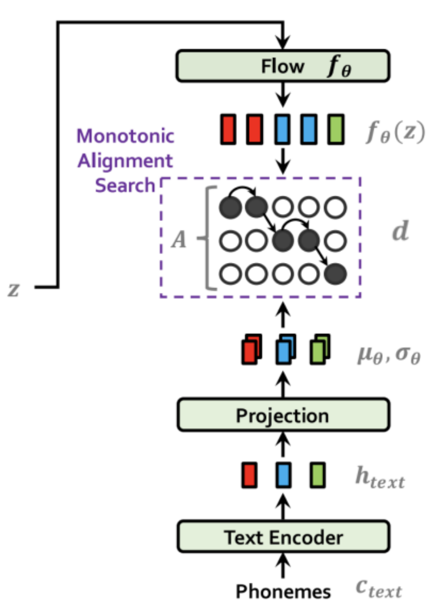

The text encoder is a
[Transformer](https://anwarvic.github.io/machine-translation/Transformer)-
encoder that uses relative positional representation instead of absolute
positional encoding (as used in the original paper) which processes the
input phonemes $c_{text}$ and results in hidden representations
$h_{text}$. Then, a linear projection layer is used to produce the mean
$\mu_{\theta}$ and variance $\sigma_{\theta}$ used for constructing
the prior distribution.

On the other end, a normalizing flow $f_{\theta}$ is used to improve the
flexibility of the prior distribution, which is a stack of four affine
coupling layers, each coupling layer consisting of four
[WaveNet](https://anwarvic.github.io/speech-synthesis/WaveNet) residual
blocks as shown in the following figure.

    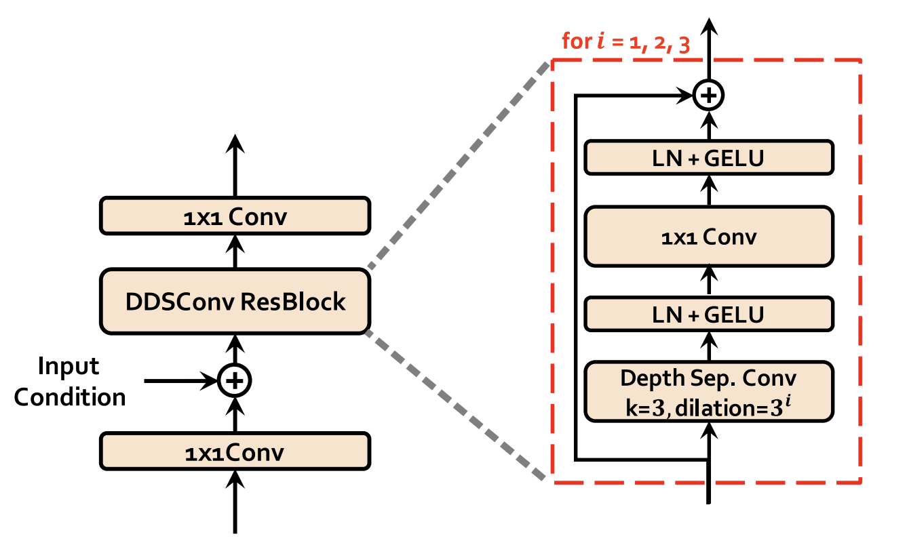

The normalizing flow takes the latent variables $z$ resulting from the
<u><strong>Posterior Encoder</strong></u> and outputs latent representation
$f_{\theta}(z)$. The MSA algorithm (same as the one used with
[Glow-TTS](https://anwarvic.github.io/speech-synthesis/Glow-TTS)) uses
the representations from the flow module $f_{\theta}(z)$ and the
projection layer $\left( \mu_{\theta},\ \sigma_{\theta} \right)$ to find
the optimal alignment $d$.

> **Note:**\
The dimension of <u><strong>Flow-based Module</strong></u> output
$f_{\theta}(z)$ has the same dimensions as the <u><strong>Posterior
Encoder</strong></u> output $z$ with $192$ channels, since either of
them can be used as an input to the <u><strong>Decoder</strong></u> depending
on the process whether it's training or inference.

### Decoder

The decoder is essentially the
[HiFi-GAN](https://anwarvic.github.io/speech-synthesis/HiFi-GAN) V1
generator. It is composed of a stack of transposed convolutions, each of
which contains multi-receptive field fusion module (MRF) as shown in the
following figure.

    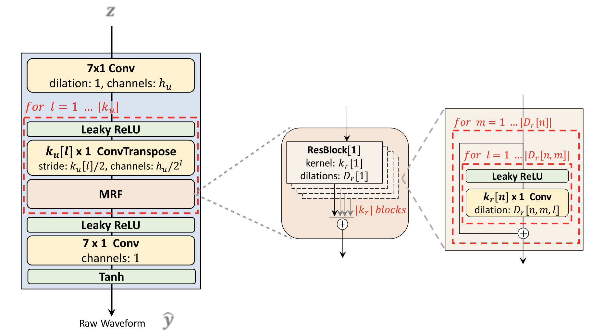

During training, the input of the decoder is latent variables generated
from the posterior encoder $z$; while it is the latent variables
generated from the prior encoder $f_{\theta}(z)$ during inference. For
the last convolutional layer of the decoder, they removed the bias
parameter, as it caused unstable gradient scales during mixed precision
training.

Regarding the discriminator, they followed the discriminator architecture
of the Multi-Period Discriminator (MPD) proposed in
[HiFi-GAN](https://anwarvic.github.io/speech-synthesis/HiFi-GAN) as
shown in the following figure.

    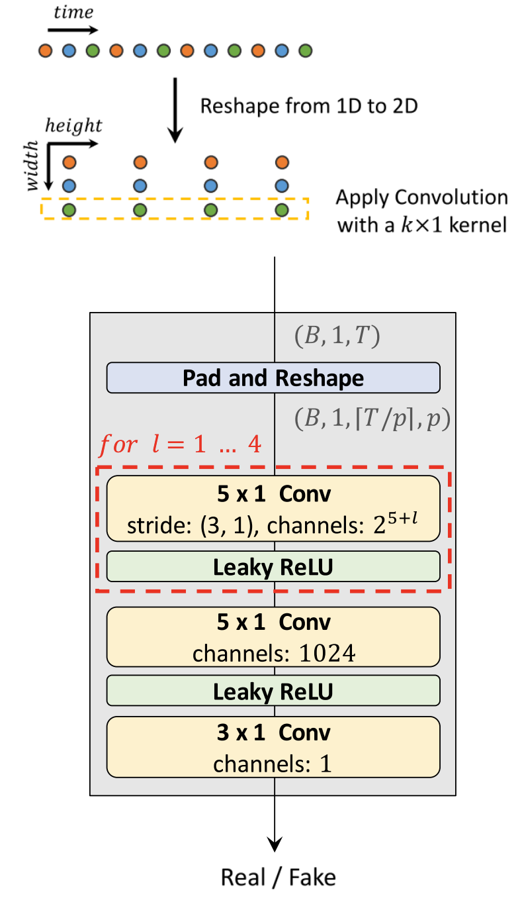

For the discriminator,
[HiFi-GAN](https://anwarvic.github.io/speech-synthesis/HiFi-GAN) uses
the multi-period discriminator containing five sub-discriminators with
periods $\lbrack 2,\ 3,\ 5,\ 7,\ 11\rbrack$ and the multi-scale
discriminator containing three sub-discriminators. To improve training
efficiency, they left only the first sub-discriminator of the
multi-scale discriminator that operates on raw waveforms and discarded
two sub-discriminators operating on average-pooled waveforms. The
resultant discriminator can be seen as the multi-period discriminator
with periods $\lbrack 1,\ 2,\ 3,\ 5,\ 7,\ 11\rbrack$.

### Stochastic Duration Predictor

The stochastic duration predictor estimates the distribution of phoneme
duration $d$ from a conditional input $h_{text}$ resulting from the
<u><strong>Text Encoder + Projection Layer</strong></u>. The following figure
shows the training and inference procedures of the stochastic duration
predictor.

    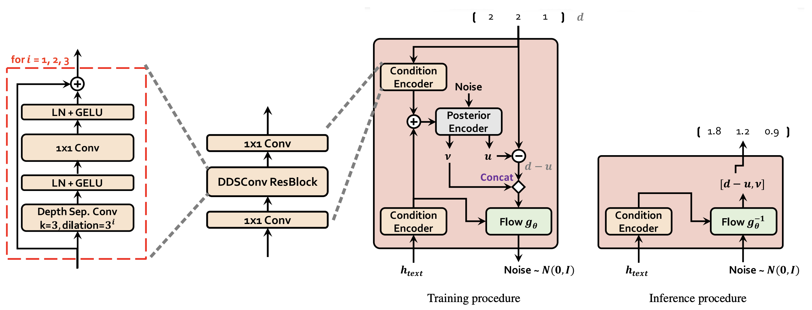

As you can see, the main building block of the stochastic duration
predictor is the dilated and depth-wise separable convolutional (DDSConv
ResBlock). Each convolutional layer in DDSConv blocks is followed by a
layer normalization layer and $GeLU$ activation function. We choose to
use dilated and depth-wise separable convolutional layers for improving
parameter efficiency while maintaining large receptive field size.

For the efficient parameterization of the stochastic duration predictor,
they stacked residual blocks with dilated and depth-separable
convolutional layers. They also applied neural spline flows, which take
the form of invertible nonlinear transformations by using monotonic
rational-quadratic splines, to coupling layers. Neural spline flows
improve transformation expressiveness with a similar number of
parameters compared to commonly used affine coupling layers.

> **Note:**\
As you might have guessed, VITS architecture is very similar to Glow-TTS
considering they both came from the same authors. VITS uses the same
transformer encoder and
[WaveNet](https://anwarvic.github.io/speech-synthesis/WaveNet) residual
blocks as those of
[Glow-TTS](https://anwarvic.github.io/speech-synthesis/Glow-TTS);
decoder and the multi-period discriminator as those of
[HiFi-GAN](https://anwarvic.github.io/speech-synthesis/HiFi-GAN), except
that they used different input dimension for the decoder and appended a
discriminator

## Loss Function

During training, VITS total loss function $\mathcal{L}_{vits}$ can be
expressed as a combination of five different loss functions as shown in
the following formula:

$$\mathcal{L}_{vits} = \mathcal{L}_{recon} + \mathcal{L}_{kl} + \mathcal{L}_{dur} + \mathcal{L}_{adv}(G) + \mathcal{L}_{fm}(G)$$

Where:

-   <u><strong>Reconstruction Loss</strong></u> $\mathcal{L}\_{recon}$:\
    The reconstruction loss is the L1 loss between the predicted
    mel-spectrogram $\widehat{x}\_{mel}$ and target mel-spectrogram
    $x_{mel}$:

$$\mathcal{L}_{recon} = \left\| x_{mel} - {\widehat{x}}_{mel} \right\|_{1}$$

-   <u><strong>KL-Divergence Loss</strong></u> $\mathcal{L}\_{kl}$:\
    In general, KL-Divergence measures how two different distribution
    are matching. In this context, we are measuring the divergence loss
    between the posterior distribution
    $q_{\phi}\left( z \middle| x_{lin} \right)$ resulting from the
    posterior encoder, and the prior distribution
    $p_{\theta}\left( z \middle| c_{text},\ A \right)$ resulting from
    the prior encoder.

$$\mathcal{L}_{kl} = \log\ q_{\phi}\left( z \middle| x_{lin} \right) - \log\ p_{\theta}\left( z \middle| \left\lbrack c_{text},\ A \right\rbrack \right)$$

$$q_{\phi}\left( z \middle| x_{lin} \right) = \mathcal{N}\left( z;\ \mu_{\phi}\left( x_{lin} \right),\ \sigma_{\phi}\left( x_{lin} \right) \right)$$

$$p_{\theta}\left( z \middle| \left\lbrack c_{text},\ A \right\rbrack \right) = \mathcal{N}\left( f_{\theta}(z);\ \mu_{\theta}\left( \left\lbrack c_{text},\ A \right\rbrack \right),\ \sigma_{\theta}\left( \left\lbrack c_{text},\ A \right\rbrack \right) \right)\left| \det\ \frac{\partial f_{\theta}(z)}{\partial z} \right|$$

-   <u><strong>Duration Loss</strong></u> $\mathcal{L}_{dur}$:\
    The duration loss is the negative variational lower bound where the
    duration predictor vector $d$ is varitionally-quantized into two
    same-dimension vectors $u$ and $v$:

$$\mathcal{L}_{dur} = - \mathbb{E}_{q_{\phi}\left( u,v \middle| d,\ c_{text} \right)}\left\lbrack \log\ \frac{p_{\theta}\left( d - u,\ v \middle| c_{text} \right)}{q_{\phi}\left( u,v \middle| d,\ c_{text} \right)} \right\rbrack$$

-   <u><strong>Adversarial Loss</strong></u> $\mathcal{L}_{adv}(G)$:\
    The adversarial loss is the least-squares loss between the output
    waveform generated by the decoder $G(z)$ and the ground truth
    waveform $y$:

$$\mathcal{L}_{adv}(G) = \mathbb{E}_{z}\left\lbrack \left( D\left( G(z) \right) - 1 \right)^{2} \right\rbrack$$

-   <u><strong>Feature Matching Loss</strong></u> $\mathcal{L}\_{fm}(G)$:\
    The feature matching loss is the average reconstruction loss of the
    discriminator $D$ hidden features of the ground truth waveform $y$
    and the generated one from the decoder $D(z)$ for every layer $l$
    out of $T$ total layers knowing that $N_{l}$ is the total number of
    features at layer $l$.

$$\mathcal{L}_{fm}(G) = \mathbb{E}_{(y,z)}\left\lbrack \sum_{l = 1}^{T}{\frac{1}{N_{l}}\left\| D^{l}(y) - D^{l}\left( G(z) \right) \right\|_{1}} \right\rbrack$$

> **Note:**\
The last two loss functions heavily depend on the discriminator, which
is trained interchangeably to distinguish between the generated waveform
$G(z)$ and the ground truth waveform $y$ using the following loss
function:
>
> $$\mathcal{L}_{adv}(D) = \mathbb{E}_{(y,z)}\left\lbrack \left( D(y) - 1 \right)^{2} + \left( D\left( G(z) \right) \right)^{2} \right\rbrack$$

## Experiments & Results

For the single-speaker experiments, they used the LJ Speech dataset
which consists of $13,100$ short audio clips of a single speaker with a
total length of approximately 24 hours. The audio format is 16-bit PCM
with a sample rate of $22\ kHz$, and they used it without any changes.
They randomly divided the dataset into a training set ($12,500$
samples), validation set ($100$ samples), and test set ($500$ samples).

Regarding audio preprocessing, they used linear spectrograms which can
be obtained from raw waveforms through the Short-time Fourier transform
(STFT), as input of the posterior encoder. The FFT size, window size and
hop size of the transform are set to $1024$, $1024$ and $256$,
respectively. They used $80$ bands mel-scale spectrograms for
reconstruction loss, which is obtained by applying a mel-filterbank to
linear spectrograms.

Regarding textual preprocessing, they used International Phonetic
Alphabet (IPA) sequences as input to the prior encoder. They used the
open-source [phonemizer](https://github.com/bootphon/phonemizer) package
to convert text sequences to IPA phoneme sequences, and the converted
sequences are interspersed with a blank token following the
implementation of
[Glow-TTS](https://anwarvic.github.io/speech-synthesis/Glow-TTS).

VITS was trained using the AdamW optimizer with
$\beta_{1} = 0.8,\ \beta_{2} = 0.99$, and weight decay $\lambda = 0.01$.
The learning rate decay is scheduled by a $0.9991/8$ factor in every
epoch with an initial learning rate of $2 \times 10^{- 4}$. To reduce
the training time, they used windowed generator training which means
that they extracted segments from ground-truth waveform and latent
representations with a window size of $32$ to feed to the decoder
instead of feeding entire audio. VITS was trained for up to $800k$
steps.

To measure the speech quality, they used crowd-sourced MOS tests where
raters listened to randomly selected audio samples, and rated their
naturalness on a 5 point scale from 1 to 5. Raters were allowed to
evaluate each audio sample once, and audio was normalized to avoid the
amplitude effect. The following table shows the MOS of VITS compared to
the ground truth, [Tacotron
2](https://anwarvic.github.io/speech-synthesis/Tacotron_2), and
[Glow-TTS](https://anwarvic.github.io/speech-synthesis/Glow-TTS) where
HiFi-GAN was used as a vocoder.

    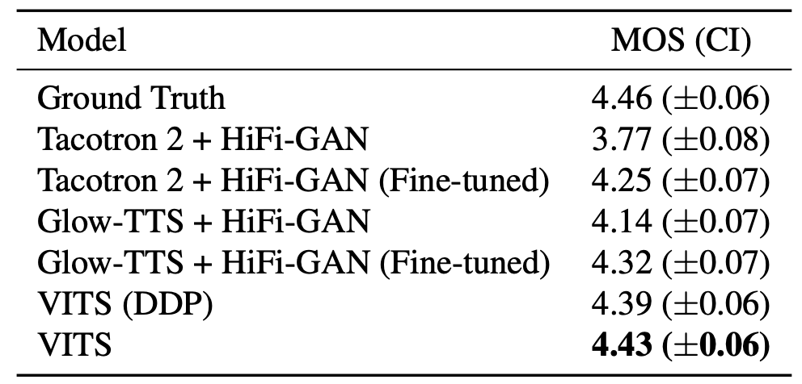

As you can see from the previous table, VITS outperforms other TTS
systems and achieves a similar MOS to that of ground truth. The VITS
(DDP), which employs the same deterministic duration predictor
architecture used in
[Glow-TTS](https://anwarvic.github.io/speech-synthesis/Glow-TTS), scores
the second-highest among TTS systems in the MOS evaluation.

Also, they compared the synthesis speed of VITS with
[Glow-TTS](https://anwarvic.github.io/speech-synthesis/Glow-TTS)+[HiFi-GAN](https://anwarvic.github.io/speech-synthesis/HiFi-GAN).
The elapsed time was measured over the entire process to generate raw
waveforms from phoneme sequences with $100$ sentences randomly selected
from the test set. The results are shown in the following table which
shows that VITS can generate up to $1480.15 \times 1000$ audio samples
per second which is $\sim 3 \times$ faster than
[Glow-TTS](https://anwarvic.github.io/speech-synthesis/Glow-TTS)+[HiFi-GAN](https://anwarvic.github.io/speech-synthesis/HiFi-GAN).
and it takes around

    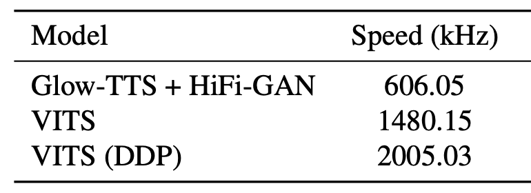

Additionally, they conducted an ablation study to demonstrate the
effectiveness of different components of VITS. All models in the
ablation study were trained up to $300k$ steps. The results are shown in
following table:

    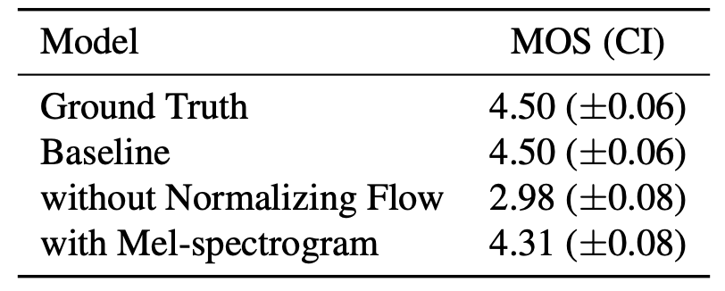

As shown, removing the normalizing flow in the prior encoder results in
a 1.52 MOS decrease from the baseline. Replacing the linear-scale
spectrogram for posterior input with the mel-spectrogram results in 0.19
MOS decrease.

## Multi-speaker Experiments

To verify that VITS can learn multi-speaker characteristics, they
trained in on VCTK dataset which consists of approximately $44,000$
short audio clips uttered by $109$ native English speakers with various
accents. The total length of the audio clips is approximately $44$
hours. The audio format is 16-bit PCM with a sample rate of $44\ kHz$,
and they reduced it to $22\ kHz$. They randomly split the dataset into a
training set ($43,470$ samples), validation set ($100$ samples), and
test set ($500$ samples).

They compared it with [Tacotron
2](https://anwarvic.github.io/speech-synthesis/Tacotron_2) and
[Glow-TTS](https://anwarvic.github.io/speech-synthesis/Glow-TTS). For
[Tacotron 2](https://anwarvic.github.io/speech-synthesis/Tacotron_2),
they broad-casted speaker embedding and concatenated it with the encoder
output, and for
[Glow-TTS](https://anwarvic.github.io/speech-synthesis/Glow-TTS), they
applied the global conditioning, which was originally proposed in
[WaveNet](https://anwarvic.github.io/speech-synthesis/WaveNet). For
VITS, they did the following changes:

-   They used global conditioning (proposed in
    [WaveNet](https://anwarvic.github.io/speech-synthesis/WaveNet)) in
    the residual blocks of the <u><strong>Posterior Encoder</strong></u>.

-   They used global conditioning in the residual blocks of the
    normalizing flow of the BU.

-   They added a linear layer that transforms speaker embedding and add
    it to the input latent variables $z$ before inserting it to the
    <u><strong>Decoder</strong></u>.

-   They add a linear layer that transforms the speaker embedding and
    add it to the input $h_{text}$ before inserting it to the
    <u><strong>Stochastic Duration Predictor</strong></u>.

The evaluation method is the same as that described in the
single-speaker setup. As shown in the following table, VITS achieves a
higher MOS than [Tacotron
2](https://anwarvic.github.io/speech-synthesis/Tacotron_2) and
[Glow-TTS](https://anwarvic.github.io/speech-synthesis/Glow-TTS) which
demonstrates that VITS learns and expresses various speech
characteristics in an end-to-end manner.

    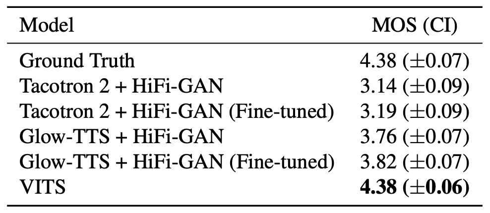

