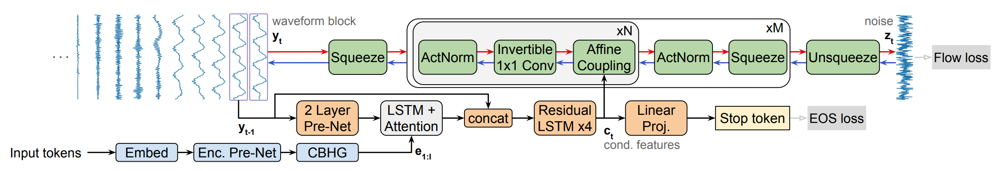

Wave-Tacotron is a single-stage end-to-end Text-to-Speech (TTS) system
that directly generates speech waveforms from text inputs. Wave-Tacotron
was proposed by Google Research in 2020 and published in this paper
under the same name: "[Wave-Tacotron: Spectrogram-free end-to-end
text-to-speech synthesis](https://arxiv.org/pdf/2011.03568.pdf)". The
official audio samples from Wave-Tacotron can be found in this
[website](https://google.github.io/tacotron/publications/wave-tacotron/).
Sadly, I couldn't find any public implementation for this paper.

Wave-Tacotron got its name from extending the
[Tacotron](https://anwarvic.github.io/speech-synthesis/Tacotron) model
by integrating a normalizing flow-based vocoder into the auto-regressive
decoder. As you can see from the following figure, Wave-Tacotron uses
almost the same Encoder & Decoder as
[Tacotron](https://anwarvic.github.io/speech-synthesis/Tacotron) with
minor modifications to the decoder that we will talk about later; and it
uses a Normalizing Flow module instead of the Vocoder for the waveform
generation part.

    

Recent work, such as [FastSpeech
2](https://anwarvic.github.io/speech-synthesis/FastSpeech_2) and
[EATS](https://anwarvic.github.io/speech-synthesis/EATS), has integrated
normalizing flows with sequence-to-sequence TTS models, to directly
generate waveforms, but they rely on spectral losses and mel
spectrograms for alignment. In contrast, Wave-Tacotron avoids
spectrogram generation altogether and use a normalizing flow to directly
model time-domain waveforms, in a fully end-to-end approach, simply
maximizing likelihood.

## Architecture

Wave-Tacotron architecture consists of three main components as shown in
the following figure: <u><strong>Text Encoder</strong></u> (blue, bottom),
<u><strong>Decoder</strong></u> (orange, center) and <u><strong>Normalizing
Flow</strong></u> (green, top). The text encoder encodes the $I$-long
(character or phoneme) embeddings $x_{1:I}$ to latent representations
$e_{1:I}$, which is passed to the decoder to produce conditioning
features $c_{t}$ for each output step $t$.

During training (red arrows), the normalizing flow converts these
features to noise $z_{t}\sim\mathcal{N}(0,1)$ sampled from a normal
distribution. During generation (blue arrows), the flow-inverse is used
to generate waveforms $y_{t} \in \mathbb{R}^{K}$ from a random noise
sample where $K = 960$ at a $24\ kHz$ sample rate. The model is trained
by maximizing the likelihood using the flow and EOS (end-of-sentence)
losses (gray).

    

> **Note:**\
Flow-based networks are reversible, which means that you can train a
flow-based network on a certain task and be able to perform the reverse
of that task without the need of additional training.

In the following sections, we are going to talk about the three main
components of Wave-Tacotron in more details:

### Text Encoder

Similar to the
[Tacotron](https://anwarvic.github.io/speech-synthesis/Tacotron) model,
the text encoder in Wave-Tacotron tries to extract robust sequential
representations from phoneme or character sequence. The encoder consists
of three main modules:

-   The embedding layer which converts the one-hot embedding for the
    phoneme or character sequence to embeddings.

-   Each of these character emeddings is passed to the "pre-net" block
    which is basically a non-linear bottleneck layer with dropout.

-   Finally, the output from the pre-net is passed to the CBHG
    (Convolution Bank + Highway GRU) network which transforms the
    pre-net outputs into the final encoder representation. The CBHG
    network consists of a bank of 1-D convolutional filters, followed by
    highway networks and a
    bidirectional [GRU](https://anwarvic.github.io/language-modeling/RNN) layer.

The following figure shows the architecture for the encoder and the CBHG
network:

    

### Decoder

The decoder is very similar to the one used in
[Tacotron](https://anwarvic.github.io/speech-synthesis/Tacotron) with
the following minor modifications:

-   They used location-sensitive attention, which was more stable than
    the one in the original paper.

-   They replaced $ReLU$ activations with $\tanh$ in the pre-net. Also,
    they didn't use dropout in the pre-network.

-   Finally, they added a skip connection over the decoder pre-net and
    attention layers, to give the flow direct access to the samples
    directly preceding the current block. This wass essential to avoid
    discontinuities at block boundaries.

### Normalizing Flow

As shown in the following figure, the normalizing flow network $g$ is a
composition of invertible transformations which maps a noise sample
$z_{t}$ drawn from a spherical Gaussian distribution to a waveform
segment $y_{t}$.

    

During training (red arrows), the input to the inverse-flow $g^{- 1}$,
$y_{t} \in \mathbb{R}^{K}$ is first squeezed into a sequence of
$J \in \mathbb{R}^{L}$ frames, each with dimension $L = 10$. Then, the
flow is divided into $M$ stages, each operating at a different temporal
resolution. This is implemented by interleaving squeeze operations which
reshape the sequence between each stage, halving the number of
time-steps and doubling the dimension, as illustrated in the following
figure. After the final stage, an unsqueeze operation flattens the
output $z_{t}$ to a vector in $\mathbb{R}^{K}$. During generation (blue
arrows), each operation is inverted and their order is reversed.

    

Each stage is further composed of $N$ flow steps. The affine coupling
layers emit transformation parameters using a 3-layer 1D convnet with
kernel sizes $\lbrack 3,\ 1,\ 3\rbrack$, with $256$ channels. Through
the use of squeeze layers, coupling layers in different stages use the
same kernel widths yet have different effective receptive fields
relative to $y_{t}$. The default configuration uses $M = 5$ and
$N = 12$, for a total of 60 steps.

> **Note:**\
To understand more about the actNorm, 1x1 convnet, and affine layer used
in the normalizing flow network, please review the
[WaveGlow](https://anwarvic.github.io/speech-synthesis/WaveGlow) post
where we talked about these components in details.

## Loss Function

The overall loss for Wave-Tacotron model is the mean loss of the
flow-loss and eos (end-of-sentence) loss all decoder steps
$t \in \lbrack 1,T\rbrack$ as shown in the following formula:

$$\mathcal{L} = \frac{1}{T}\sum_{t = 1}^{T}{\mathcal{L}_{flow}\left( y_{t} \right) + \mathcal{L}_{eos}}\left( s_{t} \right)$$

The flow loss $\mathcal{L}_{flow}$ is the negative likelihood of the
flow step to maps the target waveform $y_{t}$ to the corresponding
$z_{t}$ conditioning on the decoder features $c_{t}$: as shown in the
following equation:

$$\mathcal{L}_{flow}\left( y_{t} \right) = - log\ p\left( y_{t} \middle| c_{t} \right) = - log\ \mathcal{N}\left( z_{t};\ 0,\ I \right) - log\ \left| \det\left( \frac{\partial z_{t}}{\partial y_{t}} \right) \right|$$

$$z_{t} = g^{- 1}\left( y_{t};\ c_{t} \right)$$

The EOS loss $\mathcal{L}_{eos}$,is basically a binary cross entropy
loss of predicting that the current step $t$ is the final output step.
To obtain the EOS loss, a linear classifier is built on top of $c_t$
to compute the probability ${\widehat{s}}_t$ indicating that $t$ is
the final output step knowing the ground truth stop token $s_t$; as
shown in the following equation:

$$\mathcal{L}_{eos}\left( s_{t} \right) = - log\ p\left( s_{t} \middle| c_{t} \right) = - s_{t}\ log\ {\widehat{s}}_{t} - \left( 1 - s_{t} \right)\log\left( 1 - {\widehat{s}}_{t} \right)$$

$${\widehat{s}}_{t} = \sigma\left( Wc_{t} + b \right)$$

## Experiments & Results

Experiments in this paper were conducted on LJ Speech dataset which
consists of audio book recordings: $22$ hours for training and a
held-out $130$ utterance subset for evaluation. They upsampled the
recordings to to $24\ kHz$. Also, they used an internal dataset
containing about $39$ hours of speech, sampled at $24\ kHz$, from a
professional female voice actress. Regarding pre-processing, they used a
text normalization pipeline and pronunciation lexicon to map input text
into a sequence of phonemes. Wave-Tacotron models were trained using the
Adam optimizer for$\ 500k$ steps on 32, with batch size $256$ for the
internal dataset and $128$ for LJ, whose average speech duration is
longer.

Performance is measured using subjective listening tests, crowd-sourced
via a pool of native speakers listening with headphones. Results are
measuring using the mean opinion score (MOS) rating naturalness of
generated speech on a ten-point scale from 1 to 5. In addition to that,
they used several objective metrics such as:

-   **Mel-Cepstral Distortion (MCD):** the root mean squared error
    against the ground truth signal, computed on $13$ dimensional MFCCs
    using dynamic time warping to align features computed on the
    synthesized audio to those computed from the ground truth. MFCC
    features were computed from an $80$-channel log-mel spectrogram
    using a $50ms$ Hann window and hop of $12.5ms$. <u><strong>The lower MCD is,
    the better the performance is</strong></u>.

-   **Mel-Spectral Distortion (MSD):** which is the same as MCD but
    applied to the log-mel spectrogram magnitude instead of cepstral
    coefficients. This captures harmonic content which is explicitly
    removed in MCD due to liftering. <u><strong>The lower MSD is, the better the
    performance is</strong></u>.

-   **Character Error Rate (CER):** which is computed after transcribing
    the generated speech with the Google speech API. This is a rough
    measure of intelligibility, invariant to some types of acoustic
    distortion. <u><strong>The lower CER is, the better the performance
    is.</strong></u>

The following table compares between Wave-Tacotron and three other
models on LJ speech (first table) and the internal dataset (second
table). The first is a
[Tacotron](https://anwarvic.github.io/speech-synthesis/Tacotron) +
[WaveRNN](https://anwarvic.github.io/speech-synthesis/WaveRNN) model,
the second is a
[Tacotron](https://anwarvic.github.io/speech-synthesis/Tacotron) +
[Flowcoder](https://anwarvic.github.io/speech-synthesis/Flowcoder)
model, and the last one is a
[Tacotron](https://anwarvic.github.io/speech-synthesis/Tacotron) +
Post-net (Tacotron-PN), consisting of a 20-layer non-causal
[WaveNet](https://anwarvic.github.io/speech-synthesis/WaveNet) stack
split into two dilation cycles.

    

    

As you can see from the past tables, WaveTacotron is not as well as
Tacotron + WaveRNN. Using the flow as a vocoder results in MCD and MSD
on par with Tacotron + WaveRNN, but increased CER and low MOS, where
raters noted robotic and gravelly sound quality. Wave-Tacotron has
higher MCD and MSD than the Tacotron + WaveRNN baseline, but similar CER
and only slightly lower MOS. Wave-Tacotron and Flowcoder MSD are lower
in LJ speech which is much smaller, leading to the conclusion that
<u><strong>fully end-to-end TTS training likely requires more data than the
two-step approach.</strong></u>

The following table compares the generation speed of audio from input
text on TPU and CPU. The baseline Tacotron+WaveRNN has the slowest
generation speed, Tacotron-PN is substantially faster, as is Tacotron +
Flowcoder. Wave-Tacotron is about $17\%$ slower than Tacotron +
Flowcoder on TPU, and about twice as fast as Tacotron-PN using 1000
Griffin-Lim iterations:

    

Finally, the following table compares several Wave-Tacotron variations.
As shown in the top, the optimal sampling temperature (standard
deviation) is $T = 0.7$. Removing pre-emphasis, position embeddings in
the conditioning stack, or the decoder skip connection, all hurt
performance. Decreasing the size of the flow network by halving the
number of coupling layer channels to $128$, or decreasing the number of
stages $M$ or steps per stage $N$, all significantly reduce quality in
terms of MOS. Finally, reducing $R$ does not hurt MOS, although it slows
down generation.

    

