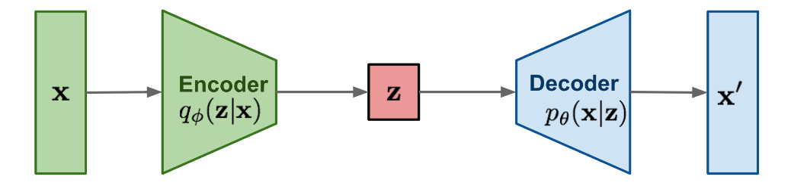

WaveGlow is a generative Vocoder capable of generating high quality
speech from mel-spectrograms. WaveGlow combines insights from
[Glow](https://openai.com/blog/glow/) and
[WaveNet](https://anwarvic.github.io/speech-synthesis/WaveNet) in order
to provide fast, efficient and high quality audio synthesis, hence the
name "WaveGlow". WaveGlow was proposed by NVIDIA in 2018 and published
in this paper under the same name: "[WaveGlow: A Flow-based Generative
Network for Speech Synthesis](https://arxiv.org/pdf/1811.00002.pdf)".
The official PyTorch implementation of this paper can be found on
NVIDIA's official GitHub repository:
[NVIDIA/waveglow](https://github.com/NVIDIA/waveglow). The official
audio samples resulted from WaveGlow can be found in this
[website](https://nv-adlr.github.io/WaveGlow).

> **Note:**\
If you are not familiar with Glow, it is a generative model proposed by
OpenAI in 018 and published in this paper "[Glow: Generative Flow with
Invertible 1x1 Convolutions](https://arxiv.org/pdf/1807.03039.pdf)". The
most interesting fact about this model is its reversibility. This model
can transform the data space into latent space "training", and be able
to restore it from the latent space without losing much information
during "generation" as shown below:
> 
> 

>    
> 

## Architecture

WaveGlow is implemented using only a single network, trained using only
a single cost function: maximizing the likelihood of the training data,
which makes the training procedure simple and stable. The whole
architecture of WaveGlow can be seen in the following figure:

    

-   For the forward pass, this model takes groups of 8 audio samples as
    vectors, and then perform a "squeeze" operation. So, given an input
    tensor of size $s \times s \times c$, the squeezing operator takes
    blocks of size $2 \times 2 \times c$ and flatten them to
    size $1 \times 1 \times 4c$, which can easily be inverted by
    reshaping.

-   Then, the model processes this input through several "steps of
    flow". A step of flow here consists of an invertible 1×1 convolution
    followed by an affine coupling layer, both are discussed in more
    details later.

-   Finally, the model is trained to directly minimize the following
    negative log-likelihood objective:

$$log\ p_{\theta}(x) = - \frac{z(x)^{\intercal}z(x)}{2\sigma^{2}} + \sum_{k = 0}^{\# conv}{log\ det\left( \left| W_{k} \right| \right)} + \sum_{j = 0}^{\# coupling}{\log s_{j}(x,\ melspectrogram)}$$

Where $x$ is the input audio, $z$ is the latent variable, the first term
comes from the log-likelihood of a zero-mean spherical Gaussian (read
the Glow paper for more details), The $\sigma^{2}$ is the assumed
variance of the Gaussian distribution, and the remaining terms account
for the change of variables in both "affine coupling" and "invertible
convolution" respectively.

### 1×1 Invertible Convolution

A 1×1 convolution with equal number of input and output channels is a
generalization of a permutation operation. So, they are using these 1x1
invertible convolution layers to mix information across channels before
each affine coupling layer. The weights $W$ of these convolutions are
initialized to be orthonormal and hence invertible.

### Affine Coupling Layer

A powerful reversible transformation where the forward function, the
reverse function and the log-determinant are computationally efficient,
is the affine coupling layer introduced in this paper: "[Density
estimation using Real NVP](https://arxiv.org/pdf/1605.08803.pdf)". The
affine coupling layer, shown in the following figure, works like so:

    

-   We initialize the last convolution of each NN() with zeros, such
    that each affine coupling layer initially performs an identity
    function; we found that this helps training very deep networks.

-   We split the upsampled mel-spectrogram into two halves along the
    channel dimension:

$$x_{a},\ x_{b} = split(x)$$

-   Then, we pass the first half $x_{a}$ to a transformation $W\ N()$.
    Here, $W\ N()$ does not need to be invertible. That's why in the
    paper, they used
    [WaveNet](https://anwarvic.github.io/speech-synthesis/WaveNet) as
    $W\ N()$ with the only change that convolutions have 3 taps and are
    not causal. Then, the upsampled mel-spectrograms $x$ are added
    before the gated-tanh of each layer as in
    [WaveNet](https://anwarvic.github.io/speech-synthesis/WaveNet).

$$\left( \log(s),\ t \right) = W\ N\left( x_{a},\ x \right)$$

-   Then, the other half is affine-transformed:

$${x'}_{b} = s\bigodot x_{b} + t$$

-   Finally, the two resulting outputs are concatenated together:

$$f_{coupling}^{- 1}(x) = concat\left( x_{a},\ {x'}_{b} \right)$$

## Experiments & Results

For all the experiments, they used the LJ speech data which consists of
$13,100$ short audio clips of a single speaker reading passages from 7
non-fiction books. The data consists of roughly $24$ hours of speech
data recorded on a MacBook Pro using its built-in microphone in a home
environment, with a sampling rate of $22,050Hz$. For mel-spectrogram,
they use mel-spectrograms with $80$ bins where FFT size is $1024$, hop
size $25$, and window size $1024$.

They used WaveGlow model having $12$ coupling layers and $12$ invertible
1x1 convolutions. The coupling layer networks ($W\ N$) each have $8$
layers of dilated convolutions, with $512$ channels used as residual
connections and $256$ channels in the skip connections. The WaveGlow
network was trained using randomly chosen clips of $16,000$ samples for
$580,000$ iterations using weight normalization \[and the Adam
optimizer, with a batch size of $24$ and a step size of
$1 \times 10^{- 4}$. When training appeared to plateau, the learning
rate was further reduced to $5 \times 10^{- 5}$.

For Mean Opinion Scores (MOS), they used Amazon Mechanical Turk where
raters first had to pass a hearing test to be eligible. Then they
listened to an utterance, after which they rated pleasantness on a
five-point scale. They used $40$ volume normalized utterances disjoint
from the training set for evaluation, and randomly chose the utterances
for each subject. After completing the rating, each rater was excluded
from further tests to avoid anchoring effects.

The following table shows the MOS results of WaveGlow in comparison to
Griffin-Lim algorithm,
[WaveNet](https://anwarvic.github.io/speech-synthesis/WaveNet), and
Ground Truth. From the table, you can see that none of the methods reach
the score of ground truth. However, WaveGlow has the highest score.

    

