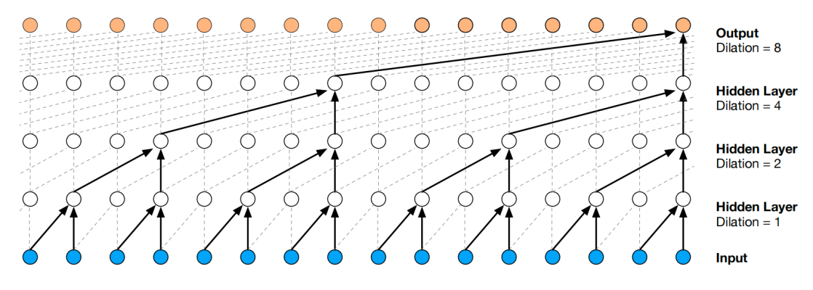

WaveNet is a generative deep neural network for generating raw audio
waveforms based on PixelCNN architecture. WaveNet was proposed by Deep
Mind in 2016 and published in this paper: [WaveNet: A Generative Model
for Raw Audio](https://arxiv.org/pdf/1609.03499.pdf). The official audio
samples outputted from the trained Tacotron by Google is provided in
this
[website](https://www.deepmind.com/blog/wavenet-a-generative-model-for-raw-audio).
The unofficial TensorFlow implementation for Tacotron can be found in
this GitHub repository:
[tensorflow-wavenet](https://github.com/ibab/tensorflow-wavenet).

The authors introduce WaveNet as a generic and flexible framework for
tackling many applications that rely on audio generation, like TTS,
music generation, speech enhancement, voice conversion, source
separation, ..etc. When applying WaveNet to TTS task, it yields
near-human level performance. When applied to model music, it generates
novel and often highly realistic musical fragments.

WaveNet is generative model operating directly on the raw audio
waveform. The joint probability of generating a waveform
$X = \left\\{ x_{1},\ x_{2},\ ...\ x_{T} \right\\}$ is factorized as a
product of conditional probabilities where each audio sample $x_{t}$ is
therefore conditioned on the samples at all previous timesteps as shown
below:

$$p\left( X \right) = \prod_{t = 1}^{T}{p\left( x_{t} \middle| x_{1},\ x_{2},\ ...\ x_{t - 1} \right)}$$

The following figure is the WaveNet architecture. As we can see from the
figure, WaveNet consists of three main components: **Causal Convolution layers**,
**Gated Activation**, **Residual and Skip connections**.
In the following part, we are going to talk about each component in
more details:

    

Dilated Causal Convolution
--------------------------

By using causal convolutions, we make sure the model cannot violate the
ordering in which we model the data: the prediction
$p\left( x_{t + 1} \middle| x_{1},\ x_{2},\ ...\ x_{t} \right)$ emitted
by the model at timestep $t$ cannot depend on any of the future
timesteps $x_{> t + 1}$ as shown in the following figure:

    

One of the problems of causal convolutions is that they require many
layers, or large filters to increase the receptive field. For example,
in the previous figure, the receptive field is equal to
$\text{# layers + filter length} - 1 = 5$. In WaveNet, authors use dilated
convolutions instead to increase the receptive field by orders of
magnitude, without greatly increasing computational cost.

A dilated convolution (also called "à trous", or convolution with holes)
is a convolution where the filter is applied over an area larger than
its length by skipping input values with a certain step. This is similar
to pooling or strided convolutions, but here the output has the same
size as the input. Stacking layers enable networks to have very large
receptive fields, while preserving the input resolution throughout the
network as well as computational efficiency. In this paper, the dilation
starts at 1, then doubled for every layer up to 512, , and then repeated
three times forming 30 dilated layers:

    

> **Note:**\
Dilated convolution with $dilation = 1$ yields the standard convolution.

Gated Activation Units
----------------------

After the dilated causal convolution layers, the input features $X$ are
passed to the Gated Activation Units resulting into output features $Z$
according to the following equation:

$$Z = \tanh\left( W_{f,k} \ast X \right)\bigodot\ \sigma\left( W_{g,k} \ast X \right)$$

Where $\ast$ denotes a convolution operator, $\bigodot$ denotes an
element-wise multiplication operator, $\sigma()$ is a sigmoid function,
$k$ is the layer index, $f$ and $g$ denote filter and gate,
respectively, and $W$ is a learnable convolution filter.

Residual & Skip Connections
---------------------------

Both residual and parameterized skip connections are used throughout the
network, to speed up convergence and enable training of much deeper
models. To be continued\...

Experiments & Results
---------------------

To measure WaveNet's audio modelling performance, they evaluated it on
three different tasks: multi-speaker speech generation (not conditioned
on text), TTS, and music audio modelling.

### Mutli-speaker Speech Generation

This task is all about generating human-like speech. Since the
generation is not conditioned on text, it generates non-existent but
human language-like words in a smooth way with realistic sounding
intonations. In this task, WaveNet was trained on the English
multi-speaker corpus from CSTR voice cloning toolkit
([VCTK](https://datashare.ed.ac.uk/handle/10283/2950)). The dataset
consisted of 44 hours of data from 109 different speakers.

Since this task is conditioned on the speaker, they decided to use a
slight different version of WaveNet called "Conditional WaveNet" where
the joint probability is also condition on the speaker embedding $h$
which is a one-hot vector representing the speaker. Everything in the
architecture remains the same, but the Gated Activation Unit become:

$$Z = \tanh\left( W_{f,k} \ast X + V_{f,k}^{\intercal}h \right)\bigodot\ \sigma\left( W_{g,k} \ast X + V_{g,k}^{\intercal}h \right)$$

A single WaveNet was able to model speech from any of the speakers by
conditioning it on a onehot encoding of a speaker. This confirms that it
is powerful enough to capture the characteristics of all 109 speakers
from the dataset in a single model. They also observed that adding
speakers resulted in better validation set performance compared to
training solely on a single speaker. This suggests that WaveNet's
internal representation was shared among multiple speakers.

Finally, they observed that the model also picked up on other
characteristics in the audio apart from the voice itself. For instance,
it also mimicked the acoustics and recording quality, as well as the
breathing and mouth movements of the speakers.

### TTS

For this task, they trained WaveNet on an internal dataset for both
English and Mandarin. The English dataset contains $24.6$ hours of
speech data, and the Mandarin dataset contains 34.8 hours; both were
spoken by professional female speakers.

For this task, WaveNet was locally conditioned on linguistic features.
So, they used the "conditional WaveNet" network the same as they did
with the "multi-speaker speech generation task".

The following table shows the Mean Opinion Scores (MOS) test results. It
can be seen from the table that WaveNets achieved 5-scale MOSs in
naturalness above 4.0, which were significantly better than those from
the baseline systems.

    

