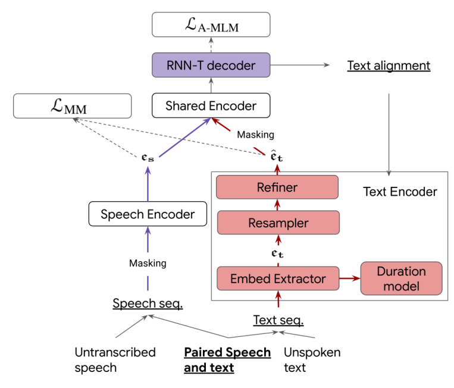
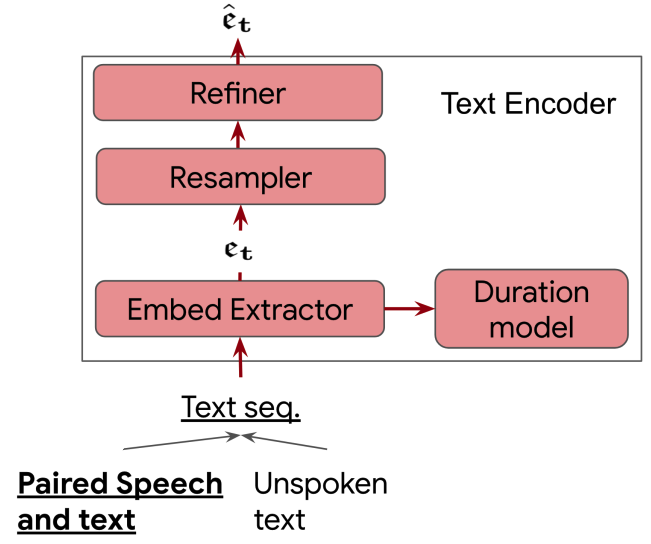
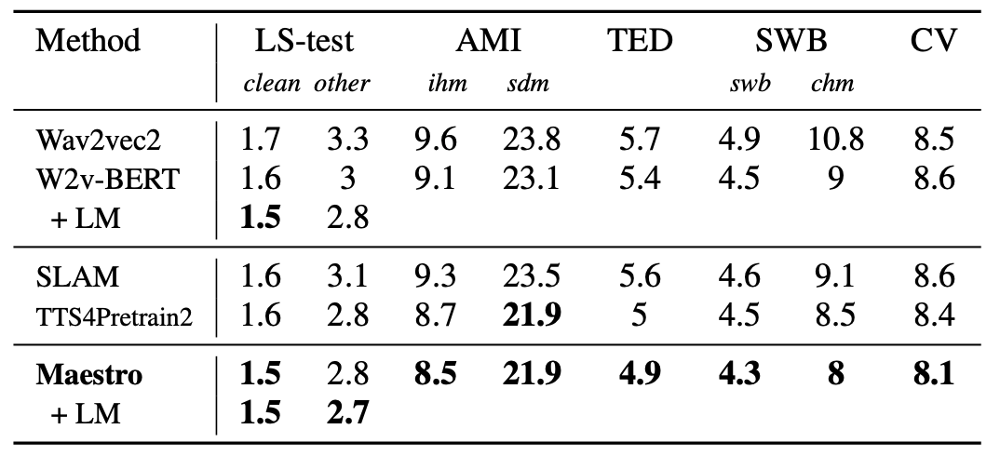
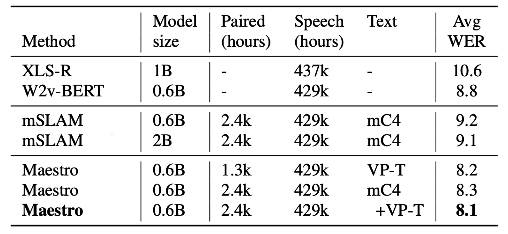
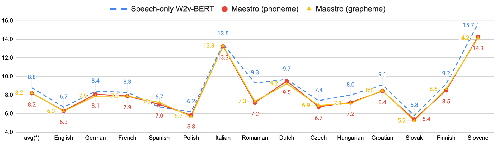
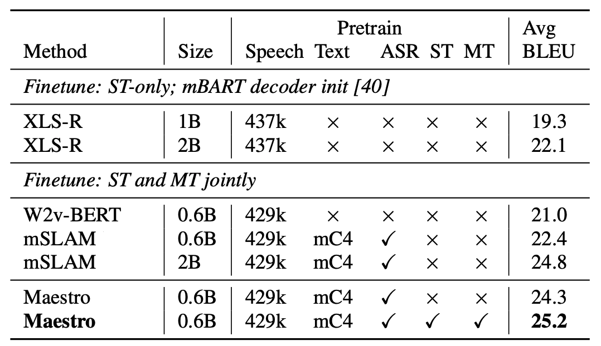

Maestro is a a self-supervised training method to unify representations
learned from speech and text modalities that can transfer to downstream
tasks such as Automated Speech Recognition (ASR) and Speech Translation
(ST). Maestro was proposed by Google in 2022 and published in this
paper: "[MAESTRO: Matched Speech Text Representations through Modality
Matching](https://arxiv.org/pdf/2204.03409.pdf)". Sadly, Google hasn't
open-sourced the code for this paper :(

## Architecture

Similar to [SLAM](https://anwarvic.github.io/speech-translation/SLAM)
and [mSLAM](https://anwarvic.github.io/speech-translation/mSLAM),
Maestro framework can be pre-trained on text-only data (unspoken text),
speech-only data (untranscribed speech), and any available speech-text
pairs. The following figure shows the architecture of Maestro where the
purple and red boxes denote differences from
[mSLAM](https://anwarvic.github.io/speech-translation/mSLAM):

    

As shown in the previous figure, Maestro framework comprises of thee
different encoders and an RNN-T decoder:

-   <u><strong>Speech Encoder $\mathbf{\theta}_{\mathbf{s}}$:</strong></u>\
    The Speech Encoder is responsible for encoding the speech input
    signal and it consists of a stack of $6$ layers of
    [Conformer](https://anwarvic.github.io/speech-recognition/Conformer)-XL
    blocks.

-   <u><strong>Text Encoder:</strong></u>\
    The Text Encoder is responsible for encoding the text input signal
    and it consists of three different components as shown in the
    following figure:

    

        
    

    -   **Text Embedding Extractor $\mathbf{\theta}_{\mathbf{t}}$**:\
        It includes $3$ convolutional layers of $512$ filters with kernel size
        $(5,1)$, followed by a $6$-layer
        [Transformer](https://anwarvic.github.io/machine-translation/Transformer)
        with positional embedding.

    -   **Resampler:** The up-sampling is done by copying the original
        text embedding to the target length of specified duration with
        positional embeddings to capture frame positions within text
        units as described in [Parallel
        Tacotron](https://anwarvic.github.io/speech-synthesis/Parallel_Tacotron).

    -   **Refiner** $\mathbf{\theta}_{\mathbf{R}}$: It includes $2$
        layers of $8$-headed self-attention blocks with $17 \times 1$
        lightweight convolutions.

    -   **Duration Model $\mathbf{\theta}_{\mathbf{D}}$:** It
        includes four blocks of $3 \times 1$ lightweight convolutions
        taking the original text embedding to predict the duration if
        this text was spoken.

-   <u><strong>Shared Encoder:</strong></u>\
    The Shared Encoder is responsible for combining representations from
    both modalities (text & speech) into a unified representation. It
    consists of a stack of $18$ layers of
    [Conformer](https://anwarvic.github.io/speech-recognition/Conformer)-XL
    blocks.

-   <u><strong>RNN-T Decoder:</strong></u>\
    The decoder used in Maestro follows the
    [Transducer](https://anwarvic.github.io/speech-recognition/RNN-T)
    architecture. It consists of a $2$-layer, $1280$-dim
    [LSTM](https://anwarvic.github.io/language-modeling/RNN) with a
    joint feed-forward network of $640$ dims.

> **Note:**\
In the paper, they used
[RNN-T](https://anwarvic.github.io/speech-recognition/RNN-T)
decoder. However, Maestro's framework supports any other decoder
architecture.

## Pre-training Objectives

In Maestro framework, pre-training is used to explicitly unify the
representation space learned from text and speech by learning a mapping
between character/phone/subword units and speech representations
independent of speaker, prosody and other acoustic characteristics. This
is done on multiple levels:

1.  <u><strong>Learning initial embedding:</strong></u>\
    The speech encoder $\theta_s$ is pre-trained on speech-only data
    using the Masked Speech Modeling (MSM) task adapted from
    [w2v-BERT](https://anwarvic.github.io/speech-recognition/w2v-BERT).
    And the text embedding extractor $\theta_t$ is pre-trained on
    text-only data.

2.  <u><strong>Modality Matching (MM):</strong></u>\
    Using speech-text data pairs,
    [RNN-T](https://anwarvic.github.io/speech-recognition/RNN-T) model
    is trained to align between the text encoder ${\widehat{e}}_t$ and
    the speech encoder output $e_s$ . So, given a speech-text pair
    $(t,s)$, Maestro during pretraining optimizes the $\mathcal{L}\_{MM}$
    loss function which is the summation of two losses: the
    Mean-Square-Error between speech representation and text
    representation and RNN-T loss:

$$e_{s} = \theta_{s}(s),\ \ \ e_{t} = \theta_{t}(t)$$

$${\widehat{e}}_{t} = \theta_{Refiner}\left( Resample\left( e_{t},\ {Align}_{RNNT}\left( e_{s},\ t \right) \right) \right)$$

$$\mathcal{L}_{MM} = MSE\left( e_{s},\ {\widehat{e}}_{t} \right) + \mathcal{L}_{RNNT}\left( t \middle| e_{s} \right)$$

3.  <u><strong>Aligned Masked Language Modeling (A-MLM):</strong></u>\
    Now, since we have a trained
    [RNN-T](https://anwarvic.github.io/speech-recognition/RNN-T) model
    that is able to align between speech representation and text
    representation, then this model loss can be used on both (text-only
    data and aligned speech representation $e_s$) and (speech-only and
    aligned text representation ${\widehat{e}}_t$). And to make the
    task more difficult, they masked both the text representation
    ${\widehat{e}}_t$ using
    [MLM](https://anwarvic.github.io/language-modeling/BERT) and speech
    representation $e_s$ using
    [SpecAugment](https://anwarvic.github.io/speech-recognition/SpecAugment)
    on the frequency and time domain:

$${\widehat{e}}_{t} = \theta_{Refiner}\left( Resample\left( e_{t},\ \theta_{Duration}\left( e_{t} \right) \right) \right)$$

$$\mathcal{L}_{A - MLM} = \mathcal{L}_{RNNT}\left( t \middle| MLM\left( {\widehat{e}}_{t} \right) \right)$$

While pre-training, they included speech-only, text-only, and
speech-text pairs in each batch with a fixed ratio. To stabilize
pre-training, they used the following:

-   Exponential-moving-averaged (EMA) with decay rate $0.9999$ to all
    prediction steps during alignment of speech-only data, duration
    prediction and resampling of text-only data.

-   A curriculum learning schedule to start from speech-only training,
    include transcribed speech after $500k$ steps and text-only after
    another $15k$ steps. The joint training of three types of data lasts
    for another $300K$ steps with a learning rate schedule and
    optimizer.

-   For data batching, they used different batches based on the dataset
    involved. So, they used a batch size of $(256,\ 512,\ 256)$ for
    (speech-only, text-only, and speech-text paired data) in SpeechStew.
    It increases to $(1024,\ 1024,\ 256)$ in VoxPopuli and
    $(1024,\ 8192,\ 512)$ when including mC4 to increase text
    throughput.

## Experiments & Results

They explored Maestro on three tasks: English ASR, Multilingual ASR, and
Speech Translation.

### English ASR

For pre-training, they used speech-only data from the LibriLight corpus,
text-only data from TEDLIUM + Librispeech, and speech-text data from
SpeechStew. Also, they used both phoneme and grapheme decoders. For
evaluation, they used multi-domain ASR from SpeechStew.

The following table shows the results of Maestro compared to
[Wav2vec2.0](https://anwarvic.github.io/speech-recognition/wav2vec_2),
[w2v-BERT](https://anwarvic.github.io/speech-recognition/w2v-BERT),
TTS4Pretrain2 and
[SLAM](https://anwarvic.github.io/speech-translation/SLAM). As you can
see, Maestro clearly outperforms all other models trained on speech-only
data. Adding a language model yeillds additional wins.

    

### Multilingual ASR

For pre-training, they used $429k$ hours of public unlabeled speech
corpora from [VoxPopuli](https://github.com/facebookresearch/voxpopuli),
CommonVoice, MLS, and
[BABEL](https://www.iarpa.gov/research-programs/babel). Additionally,
they checked the effect of adding text-only data on the model's
performance. The text-only data were divided into three setups:

-   **VP-T:** VoxPopuli text dataset (3GB).

-   **mC4:** 101 languages (15TB).

-   Both **VP-T** and **mC4**.

For evaluation, they used VoxPopuli benchmark for that. The
following table shows Maestro's performance in comparison to
[mSLAM](https://anwarvic.github.io/speech-translation/mSLAM),
[XLS-R](https://anwarvic.github.io/speech-recognition/XLS-R) and
multilingual
[w2v-BERT](https://anwarvic.github.io/speech-recognition/w2v-BERT).
As shown in the table, Maestro performs better than other models
especially after adding text-only data.

    

To understand the improvement with respect to data sizes, the
following figure illustrates the language-wise breakdown
corresponding to Maestro (with only VP-T). As you can see, most of
the languages show improvements including low-resource languages
like Slovene with only 10 hours. This shows that the proposed method
can learn meaningful speech-text representations even from small
amounts of supervised data.

    

### Speech Translation

For pre-training, they used the source speech and text data from CoVoST
21 languages to English corpus as speech-text pairs. Additionally, they
explored the use of MT & ST data. So, they concatenated MT and ST
sequences from CoVoST, WMT and TED datasets and used them for
pretraining.

For speech translation fine-tuning, they used the same pretrained
multilingual ASR Maestro encoder and fine-tuned it on the speech
translation task. The following table demonstrates that Maestro also
achieves state-of-the-art results on the speech translation CoVoST 2
benchmark with fewer parameters (0.6B) than
[mSLAM](https://anwarvic.github.io/speech-translation/mSLAM) (2B).
Including MT & ST data into pretraining yields the best performance:

    

