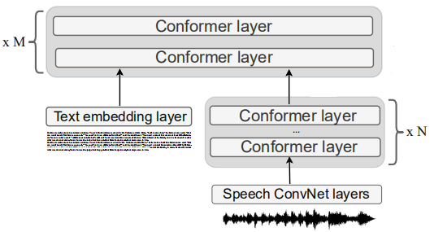
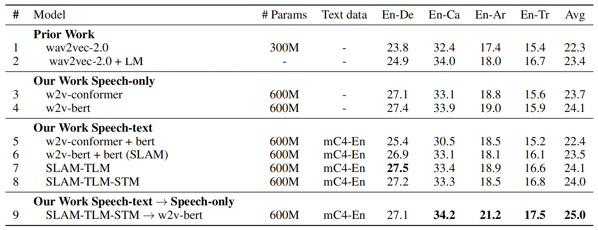
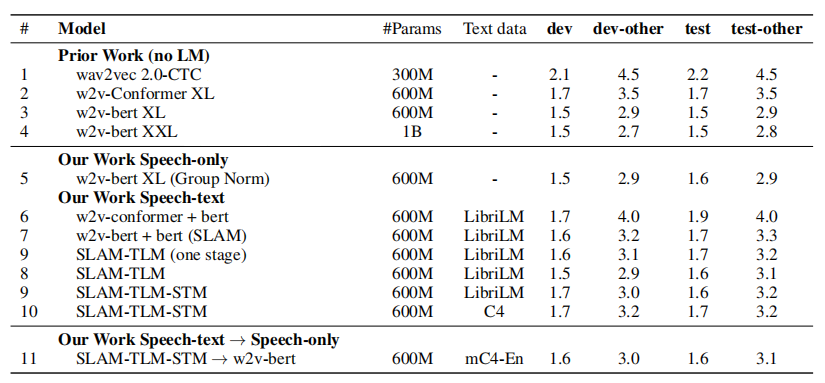
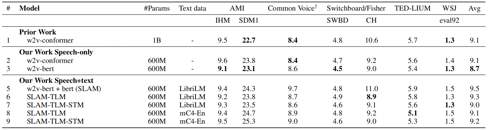

SLAM stands for "**S**peech and **La**nguage **M**odel" which is a
pre-trained model on speech and text data that can be later fine-tuned
on either language-related tasks such as "Machine Translation" or
speech-related tasks such as "Speech Recognition". SLAM was proposed by
Google Research in 2021 and published in their paper under the same name
"[SLAM: A Unified Encoder For Speech and Language Modeling via
Speech-Text Joint Pre-Training](https://arxiv.org/pdf/2110.10329.pdf)".
This paper takes the universality of unsupervised language pre-training
one step further, by unifying speech and text pre-training within a
single model.

SLAM consists of a single
[Conformer](https://anwarvic.github.io/speech-recognition/Conformer)
trained with the
[SpanBERT](https://anwarvic.github.io/langauge-modeling/SpanBERT)
objective for text and the
[w2v-BERT](https://anwarvic.github.io/speech-recognition/w2v-BERT)
objective for speech. To reduce the gap between SLAM's performance and
other mono-modal models (models that are pre-trained on either speech or
text), they used translation language modeling (TLM) ---from
[XLM](https://anwarvic.github.io/cross-lingual-lm/XLM)--- and
speech-text matching (STM) ---from "[Align before
Fuse](https://arxiv.org/pdf/2107.07651.pdf)" paper--- tasks.

    

## Architecture

As shown in the previous figure, SLAM consists of three parts:

-   <u><strong>Text Encoder:</strong></u>\
    The text encoder is a simple token embedding layer that transforms
    combined with sinusoidal positional encodings and layer normalized
    before being fed to the multimodal encoder.

-   <u><strong>Speech Encoder:</strong></u>\
    The speech encoder is composed of three blocks: a convolutional
    feature encoder ---which consists of two 2D-convolutional layers
    both with strides $(2,2)$ that act as a sub-sampling block with a 4x
    reduction--- followed by a stack of
    [Conformer](https://anwarvic.github.io/speech-recognition/Conformer)
    layers which is followed by one linear projection layer.

-   <u><strong>Multimodal Encoder:</strong></u>\
    The multimodal encoder is a deep stack of
    [Conformer](https://anwarvic.github.io/speech-recognition/Conformer)
    layers that can take either just speech, or just text, or
    concatenated speech-text pairs as input. Depending on the type of
    input ---just speech, text or a speech-text pair --- the model is
    tasked to solve different self-supervised pre-training objectives as
    we are going to see next.

> **Note:**\
Different from the original
[Conformer](https://anwarvic.github.io/speech-recognition/Conformer)
architecture, they used group normalization instead of batch norm in
convolution layers as it performed better on multimodal training.

## Multistage Pre-training

In the paper, they pre-trained SLAM on four different objectives as
mentioned below:

-   <u><strong>Span Masking:</strong></u>\
    Adapted from
    [SpanBERT](https://anwarvic.github.io/language-modeling/SpanBERT),
    SLAM was pre-trained on unlabeled textual data where it predicts
    masked span of input text. In the paper, they masked $15\%$ of text
    tokens with spans of length $5$ tokens.

-   <u><strong>Masked Speech Modeling (MSM):</strong></u>\
    Adapted from
    [w2v-BERT](https://anwarvic.github.io/speech-recognition/w2v-BERT),
    SLAM was pre-trained on unlabeled speech data where it predicts
    masked span of input speech. In the paper, they masked approximately
    $50\%$ of the speech frames with spans of length $10ms$.

-   <u><strong>Translation Language Modeling (TLM):</strong></u>\
    Adapted from [XLM](https://anwarvic.github.io/cross-lingual-lm/XLM),
    SLAM was pre-trained on speech-text pairs where it predicts masked
    spans from concatenated speech utterances with their transcriptions
    encouraging the use of cross-modal context. In the paper, they used
    more aggressive masking. They masked around $50\%$ of text tokens,
    and $75\%$ of the speech features.

-   <u><strong>Speech-Text Matching (SLM):</strong></u>\
    Adapted from "[Align before Fuse](https://arxiv.org/pdf/2107.07651.pdf)"
    paper, SLAM was pre-trained on speech-text pairs where it predicts
    whether a pair of speech and text is positive (matched) or negative
    (not matched). The STM objective explicitly trains the model to
    align speech-text pairs.

When the input only contains speech, the speech encoder along with the
multimodal encoder is trained to optimize the <u><strong>Masked Speech
Modeling</strong></u> objective. Analogously, when the input only
contains text, the text encoder along with the multimodal encoder is
trained to optimize the <u><strong>Span Masking</strong></u> objective.

When the input is a speech-text pair, the text encoder representation
are concatenated with the speech encoder representation and fed to the
multimodal encoder as input. Then, the multimodal encoder is trained to
simultaneously predict the masked speech features and masked text
features.

> **Note:**\
When pre-training SLAM, they used multistage pre-training where they
first pre-train SLAM on Span Masking and Masked Speech Modeling for
$500k$, then pre-train it on TLM and SLM for $250k\ :\ 500k$ additional
steps. Then, the gradients of all objectives are aggregated and used to
update the model parameters. This approach achieves better downstream
performance.

The data used for pre-training can be divided into three categories:

-   **Speech only:** They used $60k$ hours of unlabeled speech data from
    Libri-light dataset to pre-train SLAM on Masked Speech Modeling
    (MSM) objective.

-   **Text only:** They used the Librispeech text corpus comprises of
    nearly $803$ million tokens from $40M$ utterances of filtered text
    derived from $14.5K$ Project Gutenberg books. Also, they used mC4-En
    dataset which consists of multiple terabytes of English text data,
    mined from CommonCrawl. This data was used to pre-train SLAM on Span
    Masking objective.

-   **Speech-text pairs:** They used 900 hours of LibriSpeech as paired
    data for Translation Language Modeling (TLM) and Speech-Text
    Matching (STM).

## Experiments

For all experiments, they used SLAM model with $N = 8$ Conformer layer
at the Speech Encoder and $M = 16$ Conformer layers at the multimodal
encoder. The Conformer layers were of dimension of $1024$, feed-forward
hidden dimension of $4096$, convolution kernel size $5$, and $8$
attention heads. Also, they used SentencePiece model with $32k$ token
vocabulary and $80$-dimensional log Mel spectrogram as speech features.

In this part, we are going to go through the results of fine-tuning our
models on speech and text downstream tasks:

### Speech Translation

To use SLAM for speech translation, they combined the pre-trained
encoder with a $4$-layer
[Transformer](https://anwarvic.github.io/machine-translation/Transformer)
decoder which uses a $384$ embedding dimension, $1536$ feed-forward
hidden dimension, $4$ attention heads and a $8192$ token multilingual
sub-word vocabulary.

Then, SLAM was fine-tuned on Speech Translation task using the CoVoST2
dataset. The following table shows that SLAM with TLM and SMT objectives
achieves state-of-the-art results on this dataset:

    

### Speech Recognition

Also, SLAM was fine-tuned on different speech recognition benchmarks.
The following table shows SLAM performance on the 960-hour Librispeech
benchmark. It shows that SLAM achieves on-par results with
state-of-the-art results.

    

The following table shows the results of SLAM fine-tuned on five ASR
benchmarks using SpeechStew supervised data:

    

