SpeechT5, stands for "Speech Text-to-Text Transfer Transformer", is a
unified framework for speech and text that leverages the large-scale
unlabeled speech and text data hoping to improve the modeling capability
for both speech and text. The name is inspired by
[T5](https://anwarvic.github.io/language-modeling/T5) framework by
Google which did the same on the textual modality. SpeechT5 was proposed
by Microsoft in 2021 and published in this paper: [SpeechT5:
Unified-Modal Encoder-Decoder Pre-Training for Spoken Language
Processing](https://arxiv.org/pdf/2110.07205.pdf). The official code for
this framework can be found on Microsoft's official GitHub repository:
[Microsoft/SpeechT5](https://github.com/microsoft/SpeechT5).

As shown in the following figure, SpeechT5 which treats spoken language
processing tasks as a speech/text to speech/text format, including
automatic speech recognition (ASR), speech translation (ST), speech
identification (SID), text to speech (TTS), voice conversion (VC), and
speech enhancement (SE).Also, SpeechT5 tries to fix the problems that
previous speech pre-training work suffers from; such as: <u><strong>ignoring the
the importance of textual data to spoken language tasks</strong></u>,
and <u><strong>relying on only a pre-trained speech encoder without the
decoder</strong></u>.

    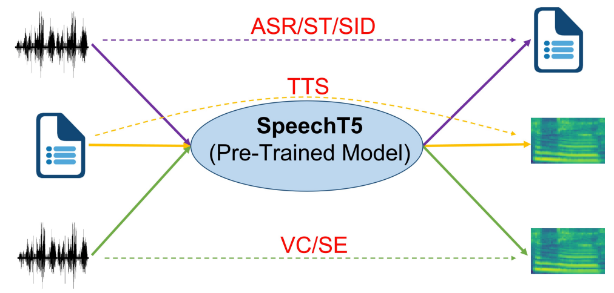

## Model

SpeechT5 consists of an encoder-decoder
[Transformer](https://anwarvic.github.io/machine-translation/Transformer)
backbone module connected to 4 modal-specific pre-nets and 2 post-nets.
The backbone module consists of 12
[Transformer](https://anwarvic.github.io/machine-translation/Transformer)
encoder layers, and 6
[Transformer](https://anwarvic.github.io/machine-translation/Transformer)
decoder layers, where $d_{m} = 768$, $d_{ff} = 3072$ and $h = 12$. The
pre-nets convert the input speech $X^{s}$ or text $X^{t}$ to a unified
space of hidden representations and then feed them into the shared
encoder-decoder backbone to perform the sequence-to-sequence conversion.
Finally, the post-nets generate the output in the speech or text
modality, based on the decoder output. SpeechT5 architecture is shown in
the following figure:

    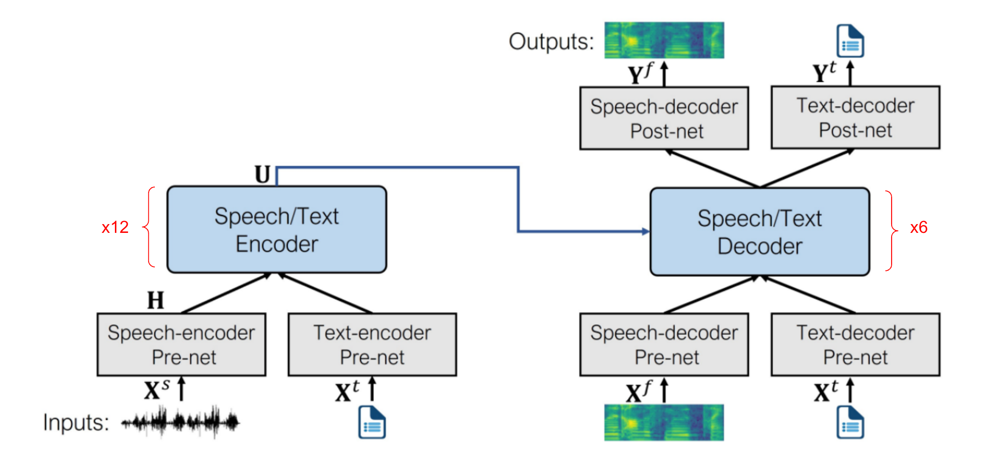

Text data is split into a sequence of characters
$X^{t} = \left\lbrack x_{1}^{t},\ ...x_{N}^{t} \right\rbrack$ as the
input and output. Speech data is a little bit different, raw waveform
$X^{s} = \left\lbrack x_{1}^{s},\ ...x_{M}^{s} \right\rbrack$ is used an
input wihle log Mel-filterbank features
$X^{f} = \left\lbrack x_{1}^{f},\ ...x_{M}^{f} \right\rbrack$ is used as
output; which will be used later by a
[HiFi-GAN](https://anwarvic.github.io/speech-synthesis/HiFi-GAN) Vocoder
to generate the final waveform.

### Pre-Nets

Pre-nets are neural network modules that are used before either the
encoder or the decoder of SpeechT5 to convert the input speech $X^{s}$
or text $X^{t}$ to a unified space of hidden representations. SpeechT5
uses four different types of pre-nets based on the input modality and
the type of the architecture after it:

-   <u><strong>Speech-encoder Pre-net:</strong></u>\
    SpeechT5 uses the convolutional feature extractor module of Wav2Vec
    [2.0](https://anwarvic.github.io/speech-recognition/wav2vec_2) model
    which consists of $7$ temporal convolutions with $512$ channels,
    strides $\lbrack 5,2,2,2,2,2,2\rbrack$ and kernel widths
    $\lbrack 10,3,3,3,3,2,2\rbrack$.

-   <u><strong>Speech-decoder Pre-net:</strong></u>\
    SpeechT5 uses a $3$-layer fully-connected neural network of $256$
    hidden units with the $ReLU$ activation. For multi-speaker tasks
    such as TTS and VC, the speaker embedding extracted with the
    x-vector is concatenated with the output of the speech-decoder
    pre-net followed by a linear layer.

-   <u><strong>Text-encoder Pre-net / Text-decoder Pre-net:</strong></u>\
    The two pre-nets are used to transform token index into an embedding
    vector.

### Post-Nets

Post-nets are neural network modules that are used after the decoder of
SpeechT5 to convert the output latent representation to either Mel
filter-bank features from speech $X^{s}$ or text $X^{t}$. SpeechT5 uses
two different types of post-nets, one for each modality:

-   <u><strong>Speech-decoder Post-net:</strong></u>\
    SpeechT5 uses two modules. The first module uses a linear layer of
    $256$ hidden units to predict the log Mel-filterbank $Y^{f}$,
    followed by five 1-dimensional convolutional layers to produce a
    residual to refine the predicted $Y^{f}$, where each layer is
    compromised of $512$ filters with shape $5 \times 1$. Another linear
    module is added to project the decoder output to a scalar for
    predicting the stop token.

-   <u><strong>Text-decoder Post-net:</strong></u>\
    The post-net transforms the hidden state into the probability
    distribution of tokens, normalized by the softmax function where the
    index of the highest value refer to the token index.

> **Note:**\
SpeechT5 uses shared embeddings, with $768$ dimension, between the
text-encoder pre-net and text-decoder pre/post-nets.

## Joint Pre-training

SpeechT5 model can be pre-trained with large-scale collections of
unlabeled speech and text corpus. The joint pre-training method can
align the textual and acoustic information into a unified semantic
space. The pre-training loss can be formulated as a summation of
different loss functions where $\gamma = 0.1$:

$$\mathcal{L} = \mathcal{L}_{MLM}^{s} + \mathcal{L}_{1}^{s} + \mathcal{L}_{BCE}^{s} + \mathcal{L}_{MLE}^{t} + \gamma\mathcal{L}_{d}$$

 

### Masked Language Modeling (MLM) Loss

Following
[HuBERT](https://anwarvic.github.io/speech-recognition/HuBERT), SpeechT5
leverages unlabeled speech data with bidirectional Masked Language
Modeling predictions similar to
[BERT](https://anwarvic.github.io/language-modeling/BERT). Specifically,
they apply span masking to the output $H$ from speech-encoder pre-net,
where $8\%$ of timesteps are randomly selected as start indices, and
spans of $10$ time-steps are masked.

The [Transformer](https://anwarvic.github.io/machine-translation/Transformer)
encoder takes masked $H$ as the input and produces hidden
representations $U = \left\lbrack u_{1},\ ...u_{N} \right\rbrack$. Based
on these hidden representations, the cross-entropy loss is computed over
masked time-steps as:

$$\mathcal{L}_{MLM}^{s} = \sum_{i \in \mathcal{M}}^{}{\log{p\left( z_{i} \middle| \widehat{H} \right)}}$$

Where $\widehat{H}$ denotes the masked version of $H$, $\mathcal{M}$
denotes the set of masked time-steps, and $z_{i}$ denotes the
frame-level target at time-step $i$ that were provided by the clustering
acoustic model.

### L1 Loss

Following [Transformer
TTS](https://anwarvic.github.io/speech-synthesis/Transformer_TTS),
SpeechT5 leverages unlabeled speech data by proposing to reconstruct the
original speech. More concretely, given the randomly masked input
$\widehat{H}$ (same as last objective), they enforce the predicted
output from the speech-decoder post-net $Y^{f}$, to be close to the
original Mel-filterbank $X^{f}$ of the original waveform by minimizing
their L1-distance as:

$$\mathcal{L}_{1}^{s} = \sum_{i = 1}^{80}\left\| y_{i}^{f} - x_{i}^{f} \right\|_{1}$$

Where $y_{i}^{f}$ and $x_{i}^{f}$ denote the predicted and true $i$-th
80-dimensional log Mel-filterbank respectively.

### Binary Cross Entory (BCE) Loss

A binary cross entropy loss is used for the stop-token. Given the output
of the speech-decoder post-net $Y^{f}$, a linear module is added to
project that output to a scalar $s$ for predicting the stop token.

$$\mathcal{L}_{BCE}^{s} = - \left( y.\log s + (1 - y).\log(1 - s) \right)$$

Where $y$ is $1$ when the sentence comes to an end, while being $0$
otherwise.

### Maximum Likelihood Estimation (MLE) Loss

With unlabeled text data, SpeechT5 is trained to reconstruct the model
output (from the text-decoder post-net) $Y^{t}$ to the original text
$X^{t}$, using the corrupted text ${\widehat{X}}^{t}$ as the input
generated with a mask-based noising function. Following the text
infilling approach in
[BART](https://anwarvic.github.io/language-modeling/BART), they randomly
sample $30\%$ of text spans to mask, where the span length of text spans
draws from a Poisson distribution ($\lambda = 3.5$), and each span is
replaced with a single mask token. The loss formula is defined below:

$$\mathcal{L}_{MLE}^{t} = \sum_{i = 1}^{N}{\log{p\left( y_{i}^{t} \middle| y_{< i}^{t},{\widehat{X}}^{t} \right)}}$$

Where $N$ is the length of the original text $X^{t}$,
${\widehat{X}}^{t}$ is the masked version of the input and $y_{i}^{t}$
is the text-decoder post-net's output at $i$-th time-step.

### Diversity Loss

SpeechT5 uses vector quantized embeddings as a bridge to align the
speech representation and text representation through a shared codebook
as shown in the following figure:

    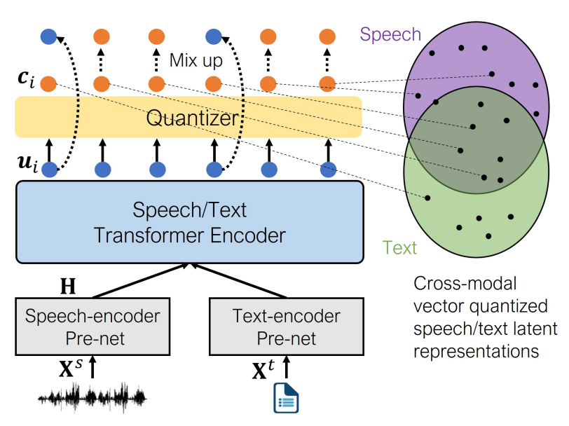

This is achieved by using the quantizer to convert continuous
speech/text representations $u_{i}$ from the output of the encoder into
discrete representations $c_{i}$ from a fixed-size codebook $C_{K}$,
which contains $K$ learnable embeddings. Then, the nearest neighbor
search is performed between the encoder output $u_{i}$ and the embedding
of each latent code $c_{j}$ via the L2 distance as:

$$c_{i} = \underset{j \in \lbrack K\rbrack}{arg\ \min}\left\| u_{i} - c_{j} \right\|_{2}$$

Then, a $10\%$ of the contextual representations is randomly replaced
with quantized latent representations in the corresponding time steps.
The diversity loss is used to encourage sharing more codes by maximizing
the entropy of the averaged Softmax distribution as:

$$\mathcal{L}_{d} = \frac{1}{K}\sum_{k = 1}^{K}{p_{k}.\log p_{k}}$$

Where $p_{k}$ is the average probability of choosing the $k$-th code in
the codebook.

> **Note:**\
In the paper, they used two code-books with $100$ entries for the shared
code-book module, resulting in a theoretical maximum of $K = 10^{4}$
code entries.

## Experiments

For speech pre-training, SpeechT5 uses the full $960$ hours of
[LibriSpeech](https://www.openslr.org/11) audio. For text pre-training,
it uses the training text of [LibriSpeech](https://www.openslr.org/11)
as unlabeled data, which contains 400M sentences. During pre-training,
Adam optimizer was used with warming up the learning rate for the first
$8\%$ of updates to a peak of $2 \times 10^{- 4}$, which is linear
decayed for the following updates. A batch size of around $90$ seconds
was used for speech and $12k$ tokens for text.

> **Note:**\
The "baseline" model used in this paper has the same architecture as
SpeechT5, but the weights of the baseline encoder are initialized by the
HuBERT-BASE model.

### Speech Recognition (ASR)

They fine-tuned SpeechT5 on $100h$ & $960h$ sets of LibriSpeech data and
trained the language model (LM) with the LibriSpeech LM text data, which
is used for [shallow
fusion](https://anwarvic.github.io/machine-translation/Fusion) during
the ASR inference. Besides the cross-entropy loss for the decoder, they
added an extra linear layer to calculate the
[CTC](https://anwarvic.github.io/speech-recognition/CTC) loss on the top
of the encoder. Fine-tuning hyper-parameters can be summarized in the
following table:

    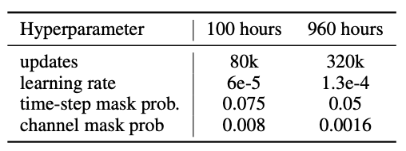

The following table shows the results on the 100h set of LibriSpeech in
comparison to other self-supervised approaches such as [wav2vec
2.0](https://anwarvic.github.io/speech-recognition/wav2vec_2),
[HuBERT](https://anwarvic.github.io/speech-recognition/HuBERT), and
[DiscreteBERT](https://anwarvic.github.io/speech-recognition/Acoustic_BERT).
Without LM fusion, SpeechT5+CTC beats all other baselines. However,
without LM SpeechT5 achieves the best performance even without the CTC
loss.

    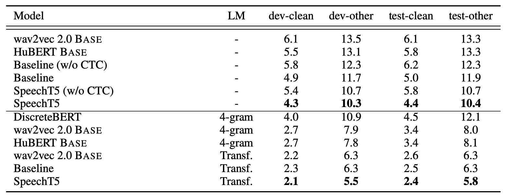

Same observations are found on the $960h$ set:

    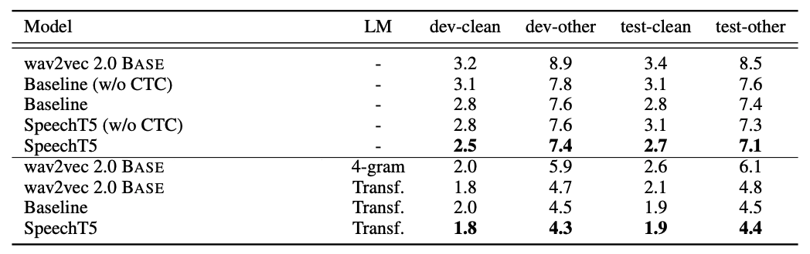

### Speech Synthesis (TTS)

They fine-tuned SpeechT5 model on the $460h$ clean set of
[LibriTTS](http://www.openslr.org/60) with the help of
[HiFi-GAN](https://anwarvic.github.io/speech-synthesis/HiFi-GAN) Vocoder
to convert the log Mel-filterbank to the raw waveform. The model is
updated for $120k$ steps with a learning rate of $0.0004$, while each
GPU processes up to $45,000$ tokens for a batch. The learning rate is
warmed up for the first $10k$ steps and decayed in an inverse square
root manner for the rest steps.

For evaluation, they used the mean option score (MOS), and the
comparison mean option score (CMOS) by native speakers on the randomly
selected $200$ sentences with various lengths generated by different
models. The naturalness was computed using
[NISQA](https://github.com/gabrielmittag/NISQA) tool. The following
table shows that SpeechT5 achieves better performance than the baseline.

    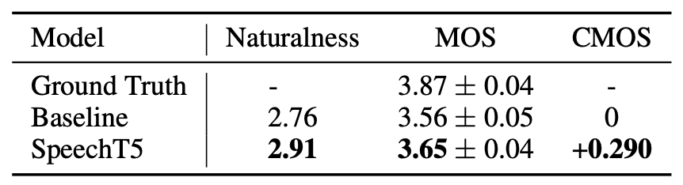

### Speech Translation (S2T)

They fine-tuned SpeechT5 on the
[MUST-C](https://live.european-language-grid.eu/catalogue/corpus/4945)
dataset using English-German and English-French translation tasks which
consists of $408$ & $492$ hours of speech data aligned with $234K$ &
$280K$ translated sentences respectively. They fine-tuned for $80K$
steps and warm-up steps to $10K$ using Adam optimizer and a vocabulary
of $8K$ tokens.

For evaluation, they averaged the last $10$ checkpoints and used a beam
size of $5$ for decoding on EN-DE and EN-FR tst-COMMON set (2641 and
2632 utterances) and teh results were evaluated with case-sensitive
BLEU. The following table shows taht SpeechT5 achieves the best
performance across the two directions.

    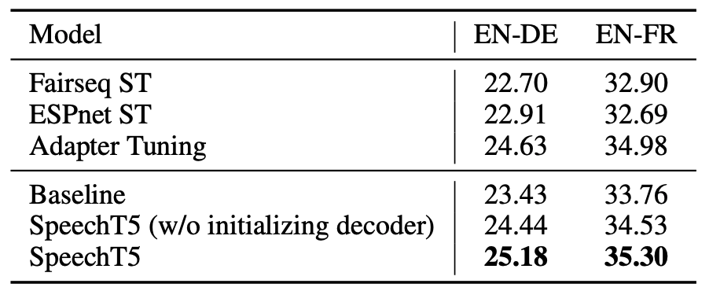

### Voice Conversion (VC)

VC aims to convert a speaker-dependent source speech waveform into a
different one while preserving linguistic information of the source
speech waveform. For this task, they used the speech recordings of four
speakers in the [CMU Arctic](http://festvox.org/cmu_arctic/), including
clb (female), bdl (male), slt (female), and rms (male) who read the same
$1,132$ phonetically balanced English utterances. For each speaker, the
first $932$, the last $100$, and the rest $100$ sentences were used for
training, test, and validation respectively.

SpeechT5 was fine-tuned using Adam optimizer with a batch size of
$20000$ tokens with a learning rate based on the inverse square root
with the maximum learning rate of $10^{- 4}$ within $60k$ steps and
apply $6k$ warm-up steps. For waveform synthesis, they used the
[Parallel
WaveGAN](https://anwarvic.github.io/speech-synthesis/Parallel_WaveGAN)
which is a non-autoregressive variant of the
[WaveNet](https://anwarvic.github.io/speech-synthesis/WaveNet) vocoder.
they used the average of MCD (MelCepstral Distortion) and WER as the
metrics for this task.

The following table shows the results which demonstrate that SpeechT5
model outperforms the state-of-the-art VTN variants in terms of MCD,
including VTN fine-tuned from ASR or TTS and many-to-many VTN.

    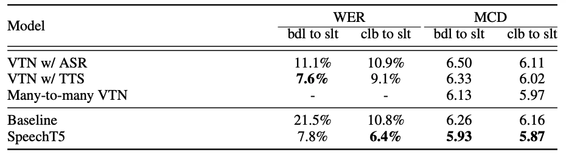

**Note:**\
The WER was evaluated by using the public ASR mode:
<https://huggingface.co/facebook/hubert-xlarge-ls960-ft>.

### Speech Enhancement (SE)

SE is the task of removing background noise from a degraded speech
signal and improving the intelligibility and the perceived quality of
the signal. For this task, they used the
[WHAM!](https://wham.whisper.ai/) dataset for fine-tuning which contains
$20,000$ training utterances, $5,000$ validation utterances, and $3,000$
test utterances, where the input waveform is a mixture of only the
[first WSJ0 speaker](https://catalog.ldc.upenn.edu/LDC93S6A) and noise.
For vocoder, they used
[HiFi-GAN](https://anwarvic.github.io/speech-synthesis/HiFi-GAN).

For evaluation, they used the negative impact on the ASR performance by
WER which was evaluated using this [ASR
model](https://doi.org/10.5281/zenodo.4243201). The following table
shows that SpeechT5 recovers contents from the noisy speech, achieving
$9\%$ WER reduction compared to the strong baseline model.

    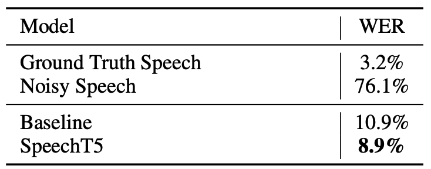

### Speaker Identification (SID)

SID is task of identifying the speaker, which is a multi-class
classification task. However, they converted it to a speech to text task
by sequence to sequence model. Compared to the ASR task, the text
embedding table is replaced by a speaker embedding table, and the
decoder predicts speaker identifies at the first step.

For fine-tuning, they used
[VoxCeleb1](https://www.robots.ox.ac.uk/~vgg/data/voxceleb/vox1.html)
dataset which contains over $100,000$ speech records uttered by $1,251$
celebrities extracted from videos uploaded to YouTube. They used Adam
optimizer with a batch size of $64$ segments and the inputs of $3$
seconds. The learning rate is set based on one cycle of a triangular
cyclical schedule between $10^{- 8}$ and $5 \times 10^{- 4}$ in $60k$
steps. They initialized the weights of the text embeddings layer because
there are no overlapping text tokens between the vocabularies during the
pre-training and the SID fine-tuning.

For evaluation, the top-1 speaker classification accuracy (ACC) is used
as the evaluation metric of SID. The results are shown in the following
table which show that SpeechT5 outperforms other models achieving 96.49%
accuracy.

    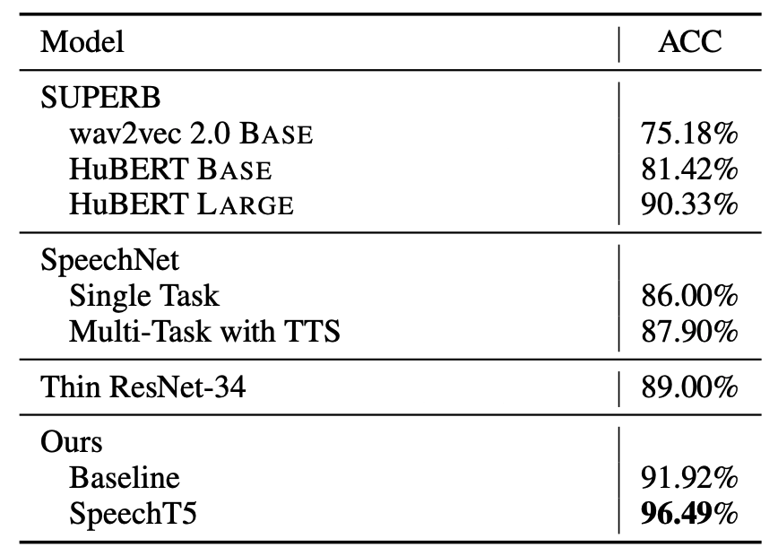

## Ablation

To better understand the efficiency of SpeechT5, they performed an
ablation study by removing each component of the model independently and
fine-tuned the model across three tasks: (ASR, VC, and SID). The results
are reported in the following table:

    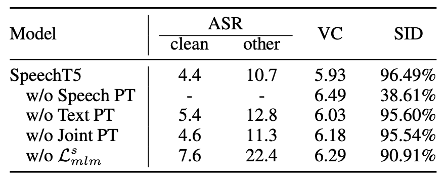

From the past table, we can see the following:

-   The pre-training methods, including speech pre-training, text
    pre-training, and joint pre-training method, are important to
    SpeechT5 since without each of them, the performance of all tasks
    will degrade significantly.

-   Speech pre-training is more critical than text pre-training.

-   The masked language model learning $\mathcal{L}_{MLM}^{s}$ is mainly
    responsible for extracting acoustic features and learning better
    speech representation, which is beneficial to ASR and SID tasks.
