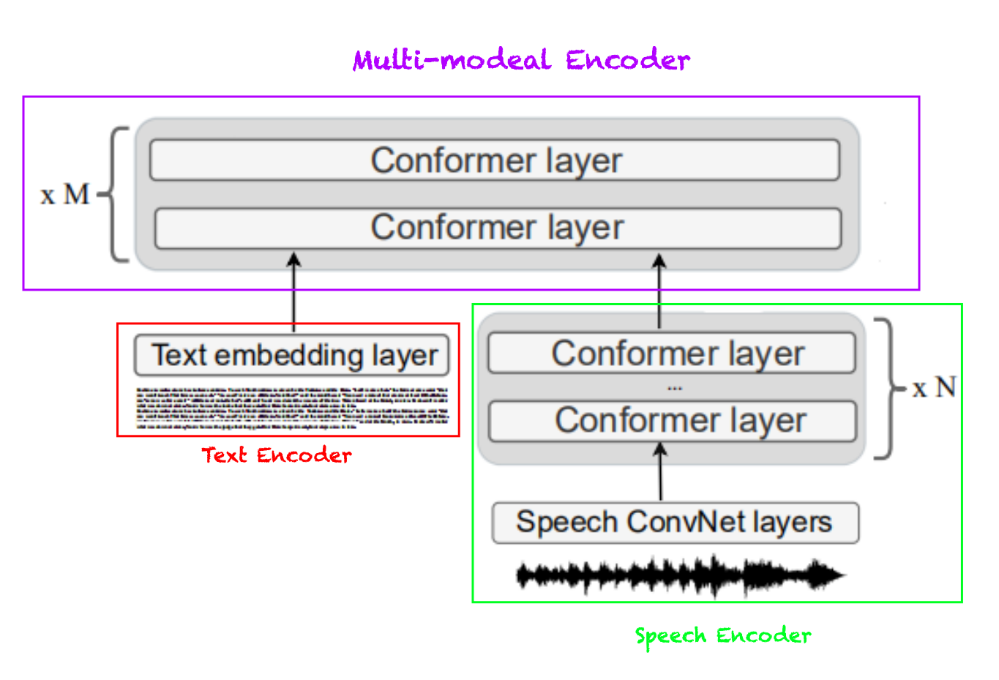
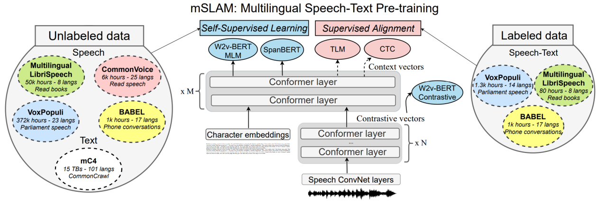
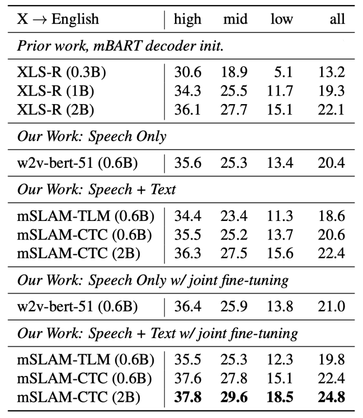
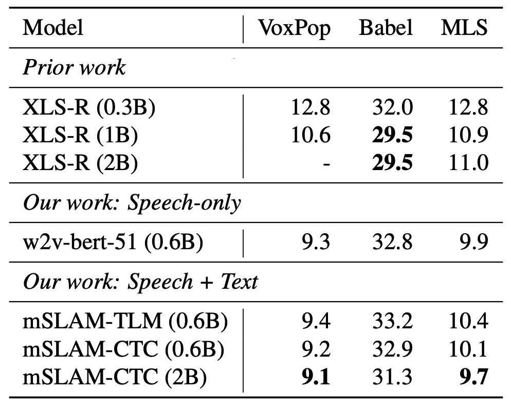

mSLAM stands for "**M**ultilingual **S**peech and **La**nguage **M**odel"
which is a multilingual speech and language model that learns
cross-lingual cross-modal representations of speech and text by
pre-training jointly on large amounts of unlabeled speech and text in
multiple languages. mSLAM is the multilingual version of
[SLAM](https://anwarvic.github.io/speech-translation/SLAM) which has
been pre-trained on speech data from $51$ languages and text data from
$101$ languages. mSLAM was proposed by Google in 2022 and published in
their paper: "[mSLAM: Massively multilingual joint pre-training for
speech and text](https://arxiv.org/pdf/2202.01374.pdf)".

On several downstream speech understanding tasks, mSLAM demonstrates
significant quality improvements over equivalent models trained only on
speech. When fine-tuned with only speech translation data, mSLAM is
capable of zero-shot text translation in several languages, suggesting
that the model is capable of learning from data in one modality to
improve quality in the other.

## SLAM Recap

Since mSLAM is the multilingual version of
[SLAM](https://anwarvic.github.io/speech-translation/SLAM), then it
makes total sense to have a quick review of
[SLAM](https://anwarvic.github.io/speech-translation/SLAM). As shown in
the following figure,
[SLAM](https://anwarvic.github.io/speech-translation/SLAM) consists of
three parts: **Text Encoder** responsible for encoding text data,
**Speech Encoder** responsible for encoding speech data, and
**Multimodal Encoder** responsible for combining representations from
both modalities (text & speech) into a unified representation. The main
building block for these encoders is the
[Conformer](https://anwarvic.github.io/speech-recognition/Conformer)
network.

    

[SLAM](https://anwarvic.github.io/speech-translation/SLAM) was
pre-trained using multistage pre-training where it's first pre-trained
on Span Masking and Masked Speech Modeling for a few epochs ($500k\ $as
mentioned in the paper), then pre-trained on TLM and SLM tasks for
$250k\ :\ 500k$ additional steps. Then, the gradients of all objectives
are aggregated and used to update the model parameters.

## mSLAM vs SLAM

Even though mSLAM is the multilingual version of
[SLAM](https://anwarvic.github.io/speech-translation/SLAM). researchers
made some changes to
[SLAM](https://anwarvic.github.io/speech-translation/SLAM) to further
improve the performance. These changes can be summarized as the
following:

-   They skipped the Speech-Text-Matching (STM) task since preliminary
    experiments didn't reveal any advantages Translation Language
    Modeling (TLM).

-   In pre-training, they used a character vocabulary, containing $4096$
    tokens spanning $101$ languages, instead of using $32k$ token
    sentence-piece tokenization. This results in longer sequence
    lengths, which they capped to $512$ characters.

-   They increased the length of masked spans from $5$ to $20$ tokens
    for the
    [SpanBERT](https://anwarvic.github.io/langauge-modeling/SpanBERT)
    objective.

-   They applied a
    [CTC](https://anwarvic.github.io/speech-recognition/CTC) loss on the
    speech portion of the paired input, using the character-level
    transcript as the target. This CTC loss ensures stronger alignment
    between the speech and text representations learned by the model.

-   In the 2-Billion version of the model, they increased the model
    dimension from $1024$ to $1408$, and the number of of conformer
    layers in the Multimodal Encoder to $32$ layers instead of $16$
    while keeping the conformer layers in the Speech Encoder at $8$
    layers making the total conformer layers of mSLAM $40$ instead of
    the $24$ of SLAM. Also, the peak learning rate is reduced from
    $6e^{- 4}$ to $3.6e^{- 4}$ for better training stability. Other
    hyper-parameters remained the same.

-   During pre-training, they didn't used multistage pre-training.
    Instead, they combined all modalities in the same batch as we are
    going to see in the "pre-training" section.

So in summary as you can see in the following figure, mSLAM is
pre-trained on three different types of input data:

1.  **Text-only:** mSLAM uses Masked Spanning task, adapted from
    [SpanBERT](https://anwarvic.github.io/langauge-modeling/SpanBERT),
    with longer span ($20$ tokens) than SLAM ($5$ tokens).

2.  **Audio-only:** mSLAM uses Masked Speech Modeling (MSM) task,
    adapted from
    [w2v-BERT](https://anwarvic.github.io/speech-recognition/w2v-BERT).

3.  **Speech-text pair:** mSLAM uses Translation Language Modeling
    (TLM), adapted from
    [XLM](https://anwarvic.github.io/cross-lingual-lm/XLM), with the
    addition of the
    [CTC](https://anwarvic.github.io/speech-recognition/CTC) which
    improved the speech-text alignment and disregarded the STM task.

    

## Pre-training

At each training step, they trained mSLAM on all three types of data;
each batch is composed of $2048$ sequences of unlabeled speech, $8192$
sequences of text and $256$ sequences of paired data. They used the Adam
optimizer with a Transformer learning rate schedule with $40k$ warmup
steps, linearly increasing the learning rate to $6 \times 10^{- 4}$,
followed by inverse square root decay. They trained mSLAM-base (600M
parameters) for $1.3M$ steps and the mSLAM-large (2B parameters) for
$350k$ steps.

The three types of data was divided into the following stats:

-   **Unlabeled speech:** They used approximately $429k$ hours of
    unlabeled speech data in 51 languages. This data is divided as:

    -   $372k$ hours spanning $23$ languages from
        [VoxPopuli](https://github.com/facebookresearch/voxpopuli).

    -   $6k$ in $25$ languages drawn from
        [CommonVoicev6.1](https://commonvoice.mozilla.org/en/datasets).

    -   $50k$ hours of $8$ languages from [MLS](https://www.openslr.org/94/)
        (Multilingual LibriSpeech).

    -   $1k$ hours of telephonic conversation data spanning $17$ African
        and Asian languages from
        [BABEL](https://www.iarpa.gov/research-programs/babel).

-   **Unlabeled text:** drawn from
    [mC4](https://anwarvic.github.io/cross-lingual-lm/mT5) dataset which
    consists of natural text in 101 languages drawn from the public
    Common Crawl web scraper. During pre-training, they up-sampled lower
    resource languages using temperature-based sampling, with $T = 3.0$.

-   **Speech-text Pairs:** They used approximately $2.4k$ hours of
    paired speech and transcript data spanning $32$ languages. This data
    is divided as:

    -   $1.3k$ hours of speech and transcript data spanning $14$
        languages from
        [VoxPopuli](https://github.com/facebookresearch/voxpopuli).
        They excluded languages with less than 1 hour of data.

    -   $80$ hours from [MLS (Multilingual
        LibriSpeech)](https://www.openslr.org/94/). They uses the 10
        hour training splits of the paired data for each of the 8 MLS
        languages.

    -   $1k$ hours from
        [BABEL](https://www.iarpa.gov/research-programs/babel) dataset
        spanning 17 languages from the Babel ASR task.

## Experiments & Results

In this part, we are going to talk about the different downstream tasks
that mSLAM was fine-tuned for; and discuss the different fine-tuning
configurations for each of these tasks.

### Multilingual Speech-to-text Translation

For multilingual speech-to-text translation task, they attached a
$6$-layer, $512$-dimension
[Transformer](https://anwarvic.github.io/machine-translation/Transformer)
decoder to the pre-trained mSLAM model with a dropout probability $0.3$
on the input embedding and all residual connections in the Transformer
decoder to mitigate overfitting. In this task, they tried two different
fine-tuning setups:

-   <u><strong>Speech-only Finetuning:</strong></u>\
    They used the speech translation data in CoVoST2 dataset. They
    evaluated on a multilingual X-to-English task that covers
    translation from $21$ source languages into English.

-   <u><strong>Speech + Text Finetuning:</strong></u>\
    In addition to the speech-only data from CoVoST2 dataset, they used
    text data from either WMT or TED Talks, as available per language.
    For example, they used WMT20 for "ja", "ta"; WMT19 for "de", "ru",
    "zh"; WMT18 for "et", "tr"; WMT17 for "lv"; WMT15 for "fr"; WMT13
    and TED59 for "ar", "fa", "id", "it", "nl", "pt", "sl", "sv". While
    finetuning, each training batch contains equal numbers of ST and MT
    examples, with a higher loss weight, $5.0$, on the MT objective. A
    lower dropout probability $0.1$ is used as more training data is
    available.

    

A comparison between mSLAM and other multilingual models such
[XLS-R](https://anwarvic.github.io/speech-recognition/XLS-R) and
[w2v-bert](https://anwarvic.github.io/speech-recognition/w2v-BERT)
(trained on the speech-only data of mSLAM) is shown in the following
table. As we can see, the 2B version of mSLAM with speech+text
finetuning has the highest scores across all resources.

> **Note:**\
mSLAM-CTC is the version of mSLAM that was pre-trained on span
masking + TLM + CTC loss function; while mSLAM-TLM is the one that
was pre-trained on just span masking + TLM.

### Multilingual Speech Recognition

For multilingual speech recognition task, they attached the pre-trained
mSLAM with a 2-layer
[LSTM](https://anwarvic.github.io/language-modeling/RNN) as a
conformer-transducer model. For this task, they used a merged grapheme
vocabulary based on the task-specific training set for all ASR
fine-tuning experiments without the use of any language model. They
fine-tuned a model in a multilingual setup of VoxPopuli + MLS. And they
fine-tuned separate models per language for Babel. in finetuning, they
used a peak learning rate of $3e^{- 4}$ with $5k$ warm-up steps and
$1e^{- 3}$ and $1.5k$ warm-up steps for encoder and decoder
respectively. All finetuning experiments on speech recognition used a
constant batch size of $256$.

The results can be shown in the following table where you can find that
mSLAM achieves competitive ASR results without losing speech capacity
across a variety of ASR tasks and languages. Increasing mSLAM-CTC
capacity to $2B$ parameters results in improvements over both, the
$600M$ model and our speech-only baseline.

    

